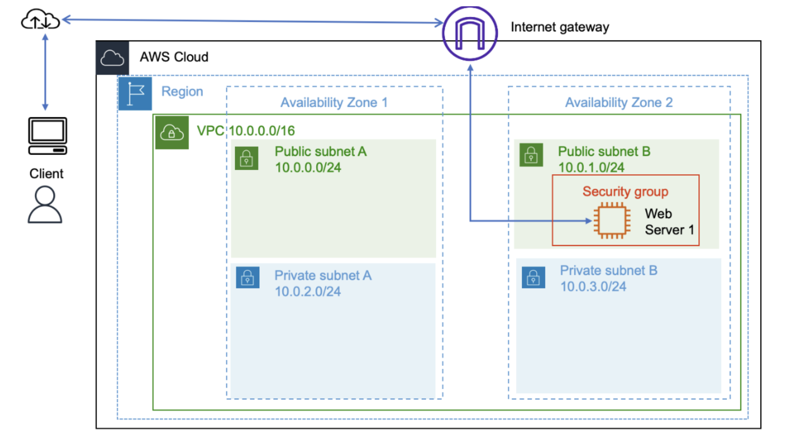
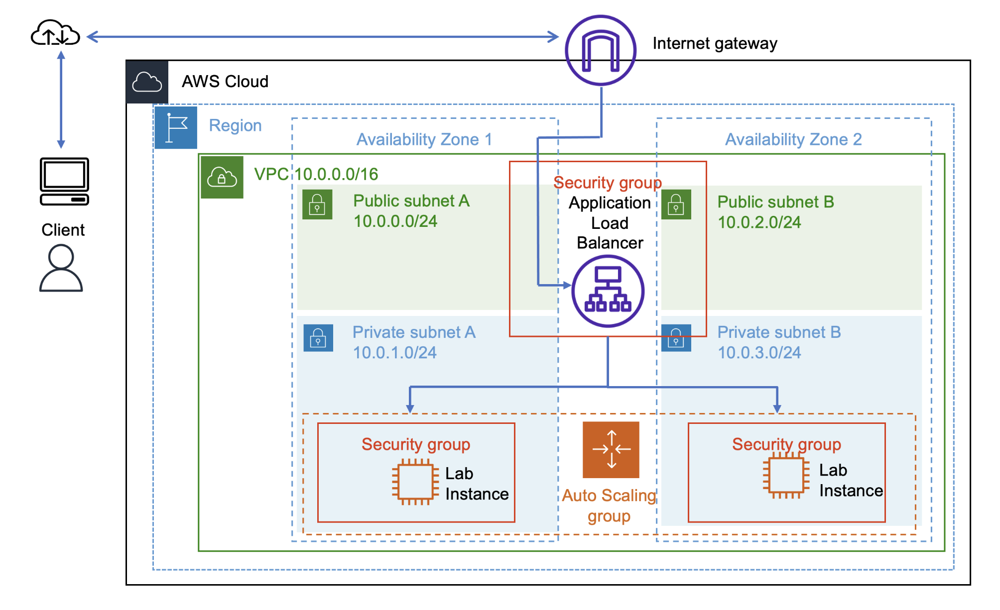
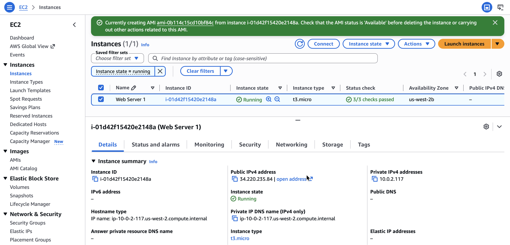
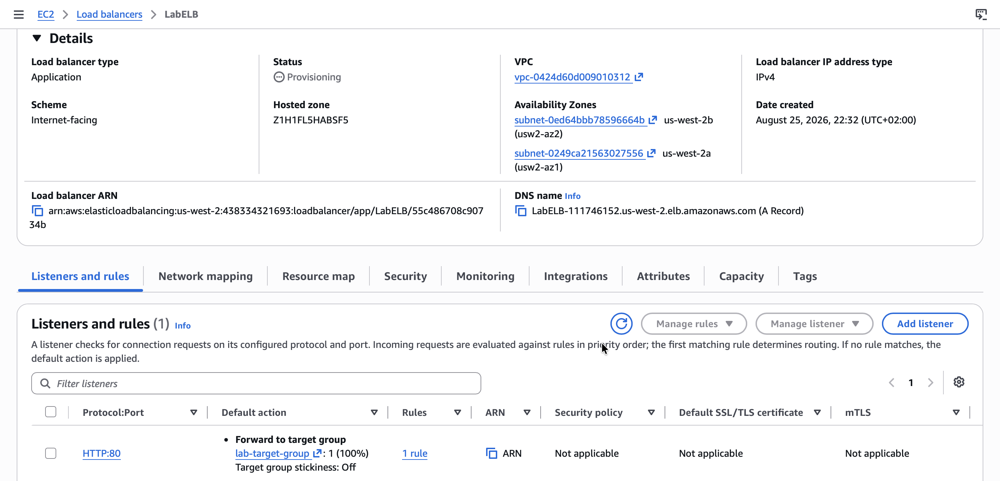
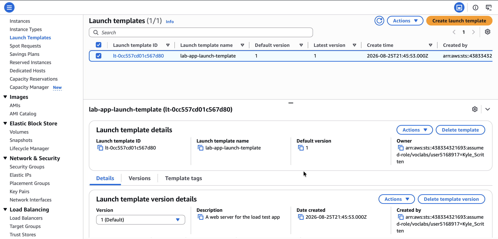
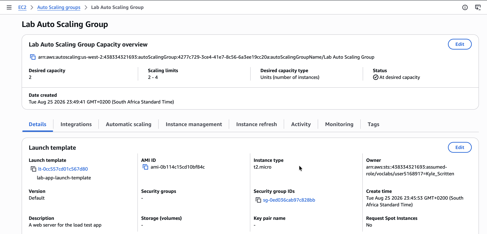

# Scaling and Load Balancing Your Architecture

## Lab overview
In this lab, I use Elastic Load Balancing (ELB) and Amazon EC2 Auto Scaling to load balance and automatically scale my infrastructure.

> [!NOTE]
> **ELB** automatically distributes incoming application traffic across multiple Amazon Elastic Compute Cloud (Amazon EC2) instances, providing the amount of load balancing capacity needed to route application traffic and help achieve fault tolerance in applications.
>
> **Auto Scaling** helps maintain application availability and provides the ability to scale Amazon EC2 capacity out or in automatically according to defined conditions. Auto Scaling helps ensure I am running my desired number of EC2 instances, automatically increasing capacity during spikes in demand to maintain performance and decreasing capacity during lulls to reduce costs. Auto Scaling is well suited to applications that have stable demand patterns or that experience hourly, daily, or weekly variability in usage.

*The following is the starting architecture:*

<p align="center">
  
</p>

*The following is the final architecture:*

<p align="center">
  
</p>

## Task 1: Creating an AMI for auto scaling
In this task, I create an AMI from the existing **Web Server 1**. This saves the contents of the boot disk so that new instances can be launched with identical content.

1. On the AWS Management Console, in the search bar, I enter and choose `EC2` to open the Amazon EC2 Management Console.
2. In the left navigation pane, I locate the **Instances** section and choose **Instances**. The **Web Server 1** instance is listed. I now create an AMI based on this instance.
3. I choose the **Web Server 1** instance, which appears in a **Running** state.
4. From the **Actions** dropdown list, I choose **Image and templates > Create image**, and configure the following options:
   * **Image name:** `Web Server AMI`
   * **Image description - optional:** `Lab AMI for Web Server`
5. I choose **Create image**.

<p align="center">
  
</p>

*The confirmation screen displays the AMI ID `PLACHOLDER_AMI_ID` for my new AMI. I use this AMI when launching the Auto Scaling group later in the lab.*

## Task 2: Creating a load balancer
In this task, I create a load balancer that can balance traffic across multiple EC2 instances and Availability Zones.

1. I locate the **Load Balancing** section and choose **Load Balancers**.
2. I choose **Create load balancer**.
3. In the **Load balancer types** section, for **Application Load Balancer**, I choose **Create**.
4. In the **Basic configuration** section, I configure the following option:
   * **Load balancer name:** `LabELB`
5. In the **Network mapping** section, I configure the following options:
   * **VPC:** Choose **Lab VPC**
   * **Mappings:** Choose both Availability Zones listed
   * For the first Availability Zone, choose **Public Subnet 1**
   * For the second Availability Zone, choose **Public Subnet 2**
6. In the **Security groups** section, I choose the `X` for the default security group to remove it.
7. From the **Security groups** dropdown list, I choose `Web Security Group`.
8. In the **Listeners and routing** section, I choose the **Create target group** link.

> [!NOTE]
> This link opens a new browser tab with the Create target group configuration options.

9. On the new **Target groups** browser tab, in the **Basic configuration** section, I configure the following and choose **Next**:
   * **Choose a target type:** `Instances`
   * **Target group name:** `lab-target-group`
10. On the **Register targets** page, I choose **Create target group**. Once the target group is created successfully, I close the Target groups browser tab.
11. I return to the Load balancers browser tab. In the **Listeners and routing** section, I choose **Refresh** to the right of the **Forward to** dropdown list for **Default action**.
12. From the **Forward to** dropdown list, I choose `lab-target-group`.
13. At the bottom of the page, I choose **Create load balancer**.

<p align="center">
  
</p>

*I receive a message similar to the following: "**Successfully created load balancer: LabELB**"*

14. To view the **LabELB** load balancer I created, I choose **View load balancer**.
15. I copy the DNS name of the load balancer, for later use in the lab:

```
PLACEHOLDER_DNS_NAME
```

## Task 3: Creating a launch template

In this task, I create a launch template for my Auto Scaling group. A launch template is a template that an Auto Scaling group uses to launch EC2 instances. When creating a launch template, I specify information for the instances, such as the AMI, instance type, key pair, security group, and disks.

1. In the EC2 Management Console, I locate the **Instances** section and choose **Launch Templates**.
2. I choose **Create launch template**.
3. On the **Create launch template** page, in the **Launch template name and description** section, I configure the following options:
   * **Launch template name - required:** `lab-app-launch-template`
   * **Template version description:** `A web server for the load test app`
   * **Auto Scaling guidance:** Choose **Provide guidance to help me set up a template that I can use with EC2 Auto Scaling**
4. In the **Application and OS Images (Amazon Machine Image) - required** section, I choose the **My AMIs** tab.
5. In the **Instance type** section, I choose `t3.micro`.
6. In the **Key pair (login)** section, I confirm that the **Key pair name** dropdown list is set to **Don't include in launch template**.

> [!NOTE]
> Amazon EC2 uses public key cryptography to encrypt and decrypt login information. To log in to an instance, I must create a key pair, specify the name of the key pair when launching the instance, and provide the private key when connecting to the instance.

7. In the **Network settings** section, I choose the **Security groups** dropdown list and choose **Web Security Group**.
8. I choose **Create launch template**.

I receive a message similar to the following: "Successfully created lab-app-launch-template."

9. I choose **View launch templates**.

<p align="center">
  
</p>

*I have successfully created a launch template, for the Auto Scaling group, named `lab-app-launch-template`.*

## Task 4: Creating an Auto Scaling group
In this task, I use my launch template to create an Auto Scaling group.

1. I choose **lab-app-launch-template**, then from the **Actions** dropdown list, choose **Create Auto Scaling group**.
2. On the **Choose launch template or configuration** page, in the **Name** section, for **Auto Scaling group name**, I enter `Lab Auto Scaling Group`.
3. On the **Choose instance launch options** page, in the **Network** section, I configure the following options:
   * **VPC:** Choose **Lab VPC**
   * **Availability Zones and subnets:** Choose **Private Subnet 1 (10.0.1.0/24)** and **Private Subnet 2 (10.0.3.0/24)**
4. I choose **Next**.
5. On the **Configure advanced options – optional** page, I configure the following options:
   * In the **Load balancing – optional** section, I choose **Attach to an existing load balancer**.
   * In the **Attach to an existing load balancer** section, I configure the following options:
     * Choose **Choose from your load balancer target groups**
     * From the **Existing load balancer target groups** dropdown list, choose **lab-target-group | HTTP**
   * In the **Health checks – optional** section, for **Health check type**, I choose **ELB**.
6. I choose **Next**, and on the **Configure group size and scaling policies – optional** page, I configure the following options:
   * In the **Group size – optional** section, I enter the following values:
     * **Desired capacity:** `2`
     * **Minimum capacity:** `2`
     * **Maximum capacity:** `4`
   * In the **Scaling policies – optional** section, I configure the following options:
     * Choose **Target tracking scaling policy**
     * **Metric type:** Choose **Average CPU utilization**
     * I change the **Target value** to `50`

> [!NOTE]
> This tells Auto Scaling to maintain an average CPU utilization across all instances of 50 percent. Auto Scaling automatically adds or removes capacity as required to keep the metric at or close to the specified target value, adjusting to fluctuations in the metric due to a fluctuating load pattern.

7. On the **Add notifications – optional** page, I choose **Next**.
8. On the **Add tags – optional** page, I choose **Add tag** and configure the following options, then choose **Next**:
   * **Key:** `Name`
   * **Value - optional:** `Lab Instance`
9. I choose **Create Auto Scaling group**. These options launch EC2 instances in private subnets across both Availability Zones.

<p align="center">
  
</p>

*My Auto Scaling group initially shows an **Instances** count of zero, but new instances will be launched to reach the desired count of two instances.*

> [!NOTE]
> If I experience an error related to the `t3.micro` instance type not being available, I rerun this task by choosing the `t2.micro` instance type instead.


## Conclusion

After completing this lab, I am able to:

* Create an AMI from an EC2 instance
* Create a load balancer
* Create a launch template and an Auto Scaling group
* Configure an Auto Scaling group to scale new instances within private subnets
* Use CloudWatch alarms to monitor the performance of my infrastructure
