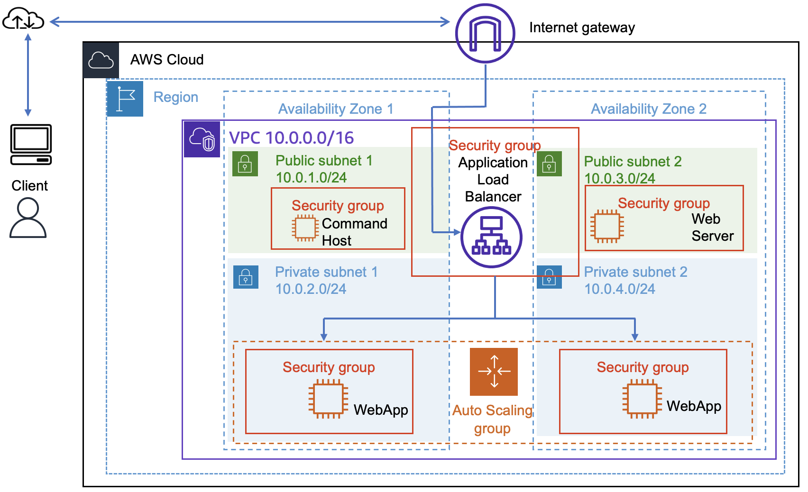
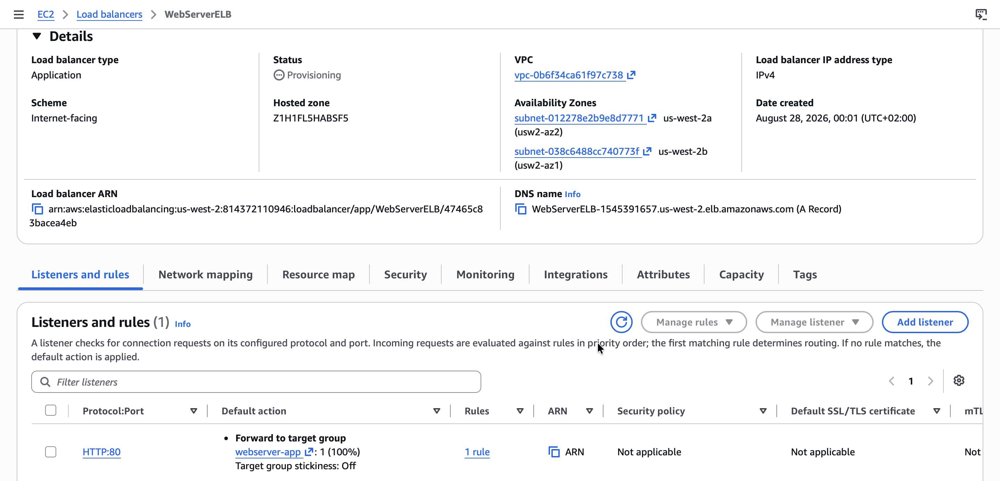
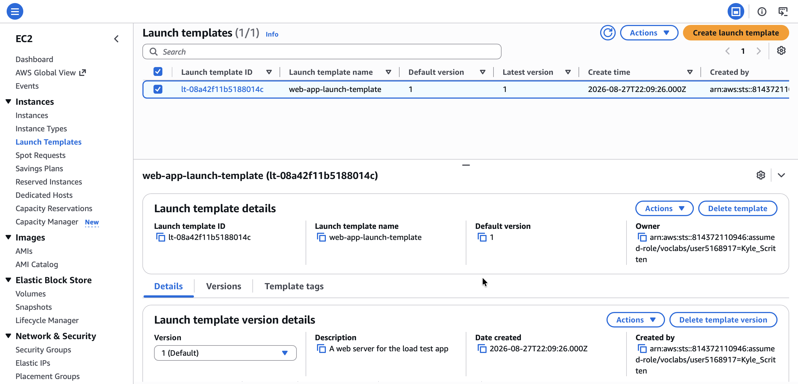
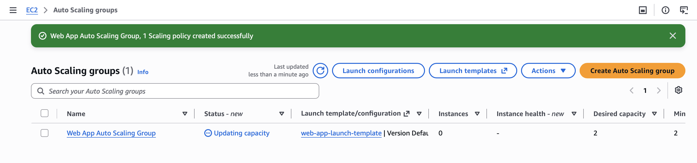
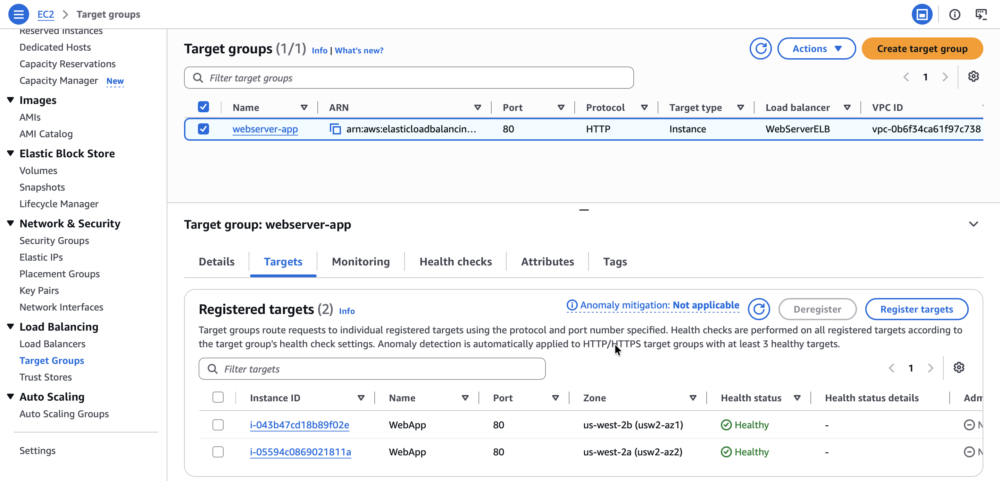
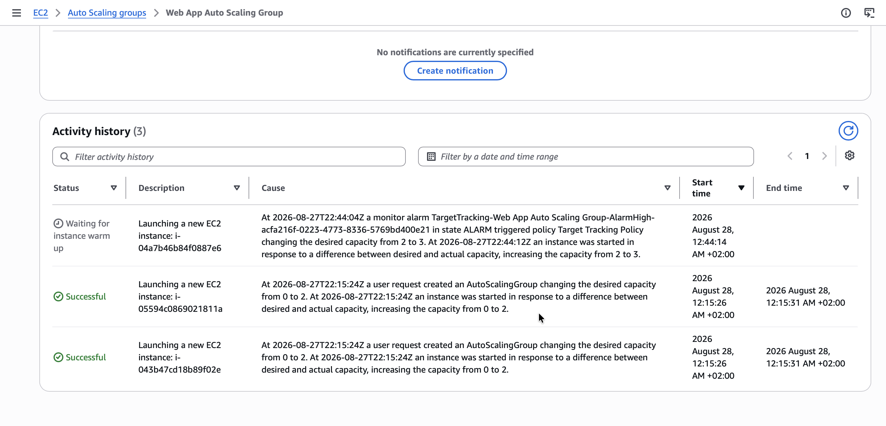

# Using Auto Scaling in AWS (Linux)

## Lab overview
In this lab, I use the AWS Command Line Interface (AWS CLI) to create an Amazon Elastic Compute Cloud (EC2) instance to host a web server and create an Amazon Machine Image (AMI) from that instance. I then use that AMI as the basis for launching a system that scales automatically under variable load using Amazon EC2 Auto Scaling. I also create an Elastic Load Balancer to distribute the load across EC2 instances created in multiple Availability Zones by the Auto Scaling configuration.

*Starting architecture:*

<p align="center">
  
</p>

*Final architecture:*

<p align="center">
  
</p>

## Task 1

## Task 2: Creating an auto scaling environment
In this section, I create a load balancer that pools a group of EC2 instances under a single Domain Name System (DNS) address. I use Auto Scaling to create a dynamically scalable pool of EC2 instances based on the image I created in the previous task. Finally, I create a set of alarms that scale out or scale in the number of instances in my load balancer group whenever the CPU performance of any machine within the group exceeds or falls below a set of specified thresholds.

### Task 2.1: Creating an Application Load Balancer
In this task, I create a load balancer that can balance traffic across multiple EC2 instances and Availability Zones.

1. I locate the **Load Balancing** section and choose **Load Balancers**.
2. I choose **Create load balancer**.
3. In the **Load balancer types** section, for **Application Load Balancer**, I choose **Create**.
4. In the **Basic configuration** section, I configure the following option:
   * **Load balancer name:** `WebServerELB`
5. In the **Network mapping** section, I configure the following options:
   * **VPC:** Choose `Lab VPC`
   * **Mappings:** Choose both Availability Zones listed
   * For the first Availability Zone, choose **Public Subnet 1**
   * For the second Availability Zone, choose **Public Subnet 2**
6. In the **Security groups** section, I choose the `X` for the default security group to remove it.
7. From the **Security groups** dropdown list, I choose `HTTPAccess`.
8. In the **Listeners and routing** section, I choose the **Create target group** link.

> [!NOTE]
> This link opens a new browser tab with the Create target group configuration options.

9. On the new **Specify group details** page, in the **Basic configuration** section, I configure the following and choose **Next**:
   * **Choose a target type:** `Instances`
   * **Target group name:** `webserver-app`
10. In the **Health checks** section, for **Health check path**, I enter `/index.php` and choose **Next**.
11. On the **Register targets** page, I choose **Create target group**. Once the target group is created successfully, I close the Target groups browser tab.
12. I return to the **Load balancers** browser tab. In the **Listeners and routing** section, I choose **Refresh** to the right of the **Forward to** dropdown list for **Default action**.
13. From the **Forward to** dropdown list, I choose `webserver-app`.
14. At the bottom of the page, I choose **Create load balancer**.

<p align="center">
  
</p>

*I receive a message similar to the following: "**Successfully created load balancer: WebServerELB**"*

15. To view the **WebServerELB** load balancer I created, I choose **View load balancer**.
16. I copy the DNS name of the load balancer, for later use in the lab:

```
PLACEHOLDER_DNS
```

### Task 2.2: Creating a launch template
In this task, I create a launch template for my Auto Scaling group. A launch template is a template that an Auto Scaling group uses to launch EC2 instances. When creating a launch template, I specify information for the instances, such as the AMI, instance type, key pair, security group, and disks.

1. In the EC2 Management Console, I locate the **Instances** section and choose **Launch Templates**.
2. I choose **Create launch template**.
3. On the **Create launch template** page, in the **Launch template name and description** section, I configure the following options:
   * **Launch template name - required:** `web-app-launch-template`
   * **Template version description:** `A web server for the load test app`
   * **Auto Scaling guidance:** Choose **Provide guidance to help me set up a template that I can use with EC2 Auto Scaling**
4. In the **Application and OS Images (Amazon Machine Image) - required** section, I choose the **My AMIs** tab.
5. In the **Instance type** section, I choose `t3.micro`.
6. In the **Key pair (login)** section, I confirm that the **Key pair name** dropdown list is set to **Don't include in launch template**.

> [!NOTE]
> Amazon EC2 uses public key cryptography to encrypt and decrypt login information. To log in to an instance, I must create a key pair, specify the name of the key pair when launching the instance, and provide the private key when connecting to the instance.

7. In the **Network settings** section, I choose the **Security groups** dropdown list and choose `HTTPAccess`.
8. I choose **Create launch template**.

I receive a message similar to the following: "**Successfully created web-app-launch-template.**"

9. I choose **View launch templates**.

<p align="center">
  
</p>

*I have successfully created a launch template, for the Auto Scaling group, named `web-app-launch-template`.*

### Task 2.3: Creating an Auto Scaling group
In this task, I use my launch template to create an Auto Scaling group.

1. I choose **web-app-launch-template**, then from the **Actions** dropdown list, choose **Create Auto Scaling group**.
2. On the **Choose launch template or configuration** page, in the **Name** section, for **Auto Scaling group name**, I enter `Web App Auto Scaling Group`.
3. On the **Choose instance launch options** page, in the **Network** section, I configure the following options:
   * **VPC:** Choose `Lab VPC`
   * **Availability Zones and subnets:** Choose `Private Subnet 1 (10.0.2.0/24)` and `Private Subnet 2 (10.0.4.0/24)`
4. I choose **Next**.
5. On the **Integrate with other services options – optional** page, I configure the following options:
   * In the **Load balancing** section, I choose `Attach to an existing load balancer`.
   * In the **Attach to an existing load balancer** section, I configure the following options:
     * Choose **Choose from your load balancer target groups**
     * From the **Existing load balancer target groups** dropdown list, choose `webserver-app | HTTP`
   * In the **Health checks** section, for **Additional health check type - optional**, I choose `Turn on Elastic Load Balancing health checks`.
6. I choose **Next**, and on the **Configure group size and scaling – optional** page, I configure the following options:
   * In the **Group size** and **Scaling** sections, I enter the following values:
     * **Desired capacity:** `2`
     * **Minimum desired capacity:** `2`
     * **Maximum desired capacity:** `4`
   * In the **Automatic scaling policies – optional** section, I configure the following options:
     * Choose `Target tracking scaling policy`
     * **Metric type:** Choose **Average CPU utilization**
     * I change the **Target value** to `50`

> [!NOTE]
> This change tells Auto Scaling to maintain an average CPU utilization across all instances of 50 percent. Auto Scaling automatically adds or removes capacity as required to keep the metric at or close to the specified target value. It adjusts to fluctuations in the metric due to a fluctuating load pattern.

7. On the **Add notifications – optional** page, I choose **Next**.
8. On the **Add tags – optional** page, I choose **Add tag** and configure the following options, then choose **Next**:
   * **Key:** `Name`
   * **Value - optional:** `WebApp`
9. I choose **Create Auto Scaling group**. These options launch EC2 instances in private subnets across both Availability Zones.

<p align="center">
  
</p>

*My Auto Scaling group initially shows an **Instances** count of zero, but new instances will be launched to reach the desired count of two instances.*

> [!CAUTION]
> If I experience an error related to the `t3.micro` instance type not being available, I rerun this task by choosing the `t2.micro` instance type instead.

## Task 3: Verifying the auto scaling configuration
In this task, I verify that both the Auto Scaling configuration and the load balancer are working by accessing a pre-installed script on one of my servers that consumes CPU cycles, invoking the scale-out alarm.

1. I choose **Instances**. Two new instances named `WebApp` are being created as part of my Auto Scaling group.

> [!NOTE]
> While these instances are being created, the **Status check** for them is **Initializing**.
>
> I observe the **Status check** field for the instances until the status shows **2/2 checks passed**.

2. Once the instances have completed *initialization*, in the **Load Balancing** section, I choose **Target Groups**, then select my target group, `webserver-app`.
3. On the **Targets** tab, I verify that two instances are being created, refreshing this list until the **Health status** of these instances changes to ***healthy***.

<p align="center">
  
</p>

*A healthy status indicates that an instance has passed the load balancer's health check, meaning the load balancer will send traffic to the instance.*

## Task 4: Testing auto scaling configuration

1. I open a new web browser tab, paste the `DNS name` of the load balancer I copied earlier into the address bar, and press `Enter`.
2. On the web page, I choose **Start Stress**. This calls the application **stress** in the background, causing the CPU utilization on the instance that serviced this request to spike to 100 percent.
3. On the EC2 Management Console, in the **Auto Scaling** section, I choose **Auto Scaling Groups**.
4. I select **Web App Auto Scaling Group**.
5. I choose the **Activity** tab.

<p align="center">
  
</p>

*After a few minutes, I see my Auto Scaling group add a new instance. This occurs because Amazon CloudWatch detects that the average CPU utilization of my Auto Scaling group exceeded 50 percent, and my scale-up policy has been invoked in response.*

## Conclusion
After completing this lab, I am able to:

* Create an EC2 instance using an AWS CLI command
* Create a new AMI using the AWS CLI
* Create an Amazon EC2 launch template
* Create an Amazon EC2 Auto Scaling launch configuration
* Configure scaling policies and create an Auto Scaling group to scale in and scale out the number of servers based on variable load

## Additional resources
* [Amazon EC2 Auto Scaling Getting Started](https://aws.amazon.com/ec2/autoscaling/getting-started/)
* [Getting Started with Elastic Load Balancing](https://aws.amazon.com/elasticloadbalancing/getting-started)
