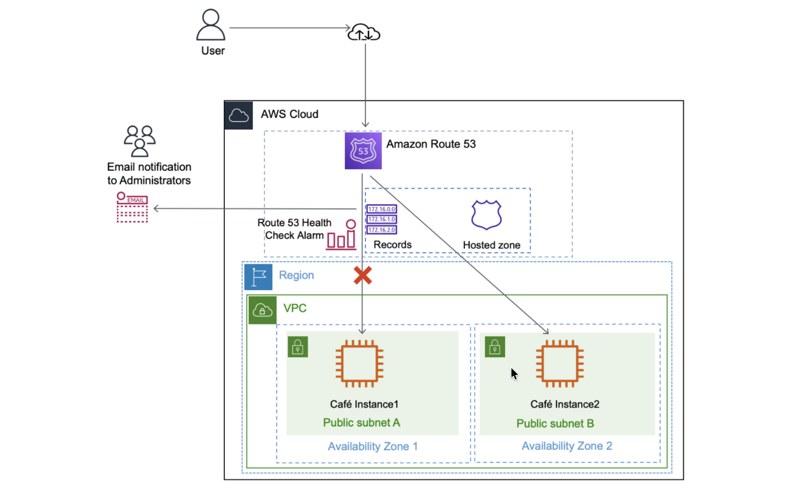
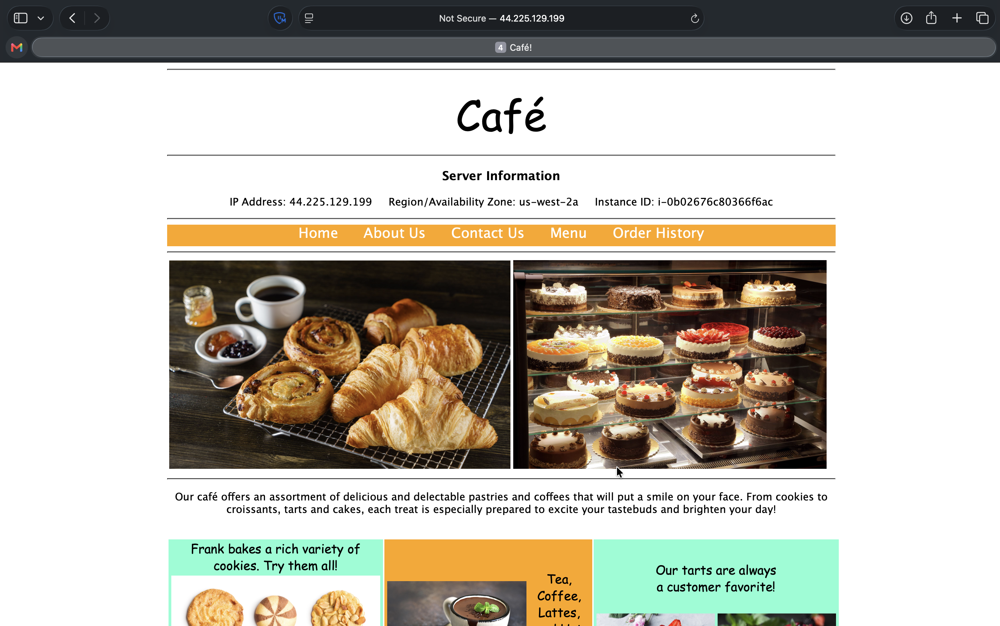
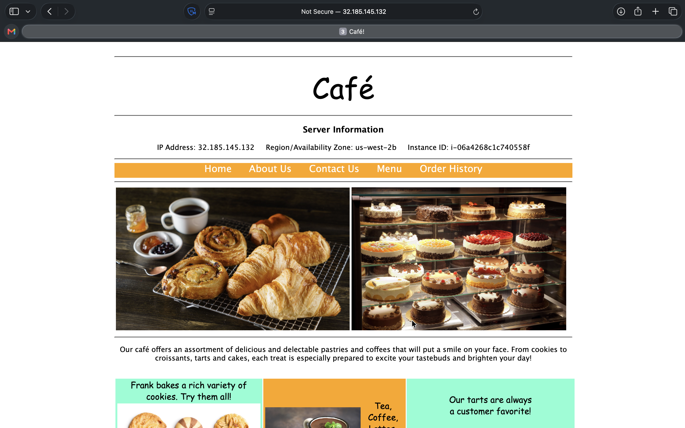
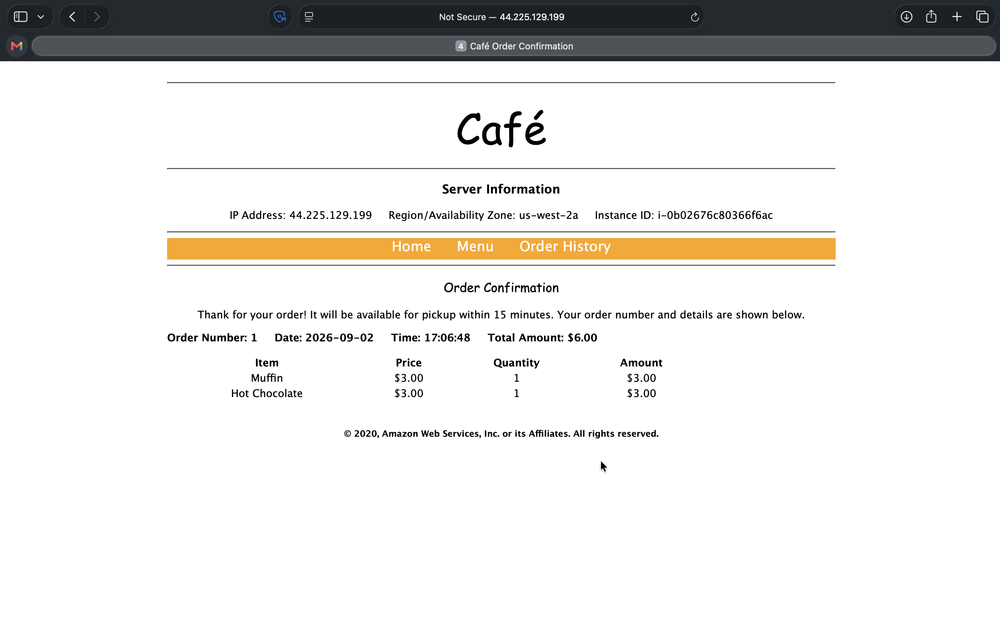
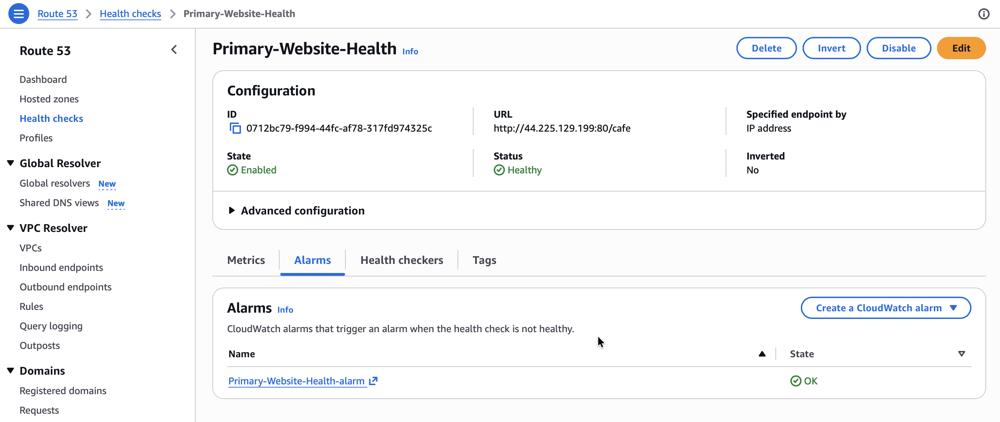
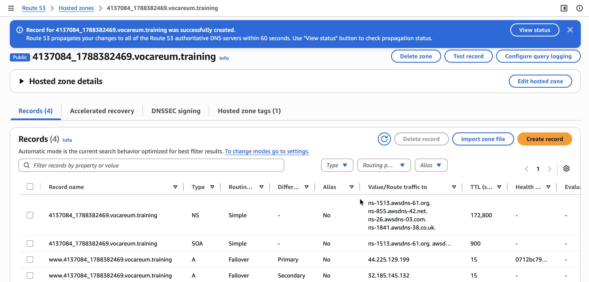
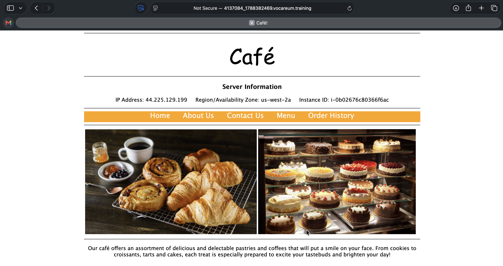
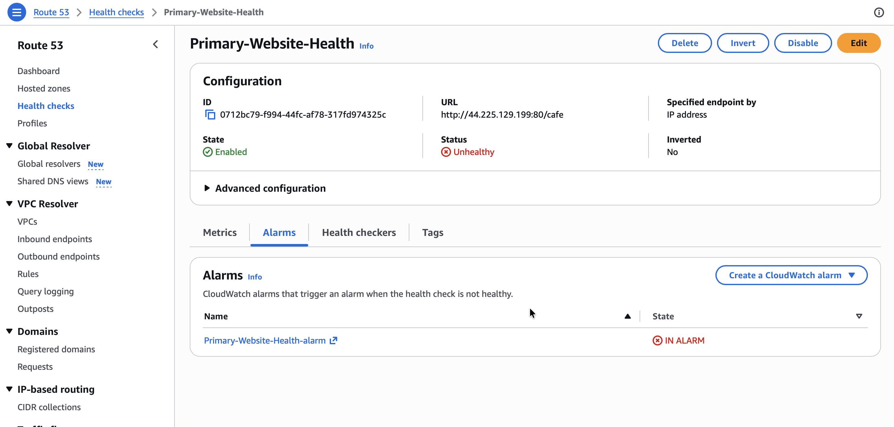
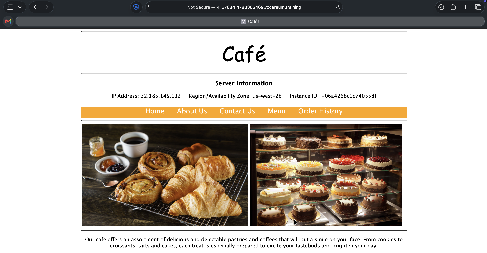
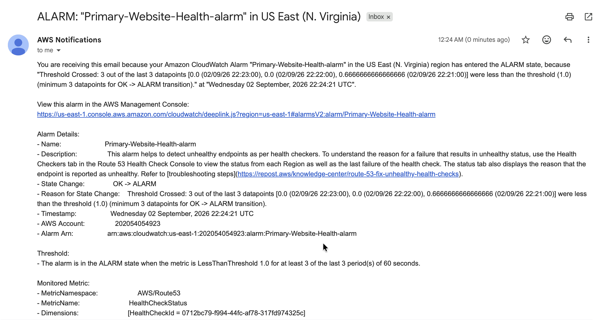

# Amazon Route 53 Failover Routing

## Lab overview
In this activity, I configure failover routing for a simple web application.

The activity environment starts with two Amazon Elastic Compute Cloud (Amazon EC2) instances that have already been created. Each instance has the full LAMP stack installed and the café website deployed and running. The EC2 instances are deployed in different Availability Zones. For example, if the web servers are running in the us-west-2 Region, one web server runs in the us-west-2a Availability Zone and the other runs in the us-west-2b Availability Zone.

I configure my domain such that, if the website in the primary Availability Zone becomes unavailable, Amazon Route 53 automatically fails over application traffic to the instance in the secondary Availability Zone.

*When finished, my environment looks like the following architecture:*

  

*Route 53 records store the IP address of the EC2 instance in each Availability Zone. User requests are normally sent to the IP address corresponding to Café Instance1 in Availability Zone 1. If Café Instance1 is unavailable, requests are routed to Café Instance2 in Availability Zone 2, based on the configuration in the Route 53 records. When Café Instance1 becomes unavailable, a Route 53 health check alarm is invoked, and an email alert is sent to the email address provided.*

## Task 1: Confirming the café websites
In this task, I analyze the resources that AWS CloudFormation has automatically created for me.

1. I copy the values for the following parameters from the predefined lab credentials:
   * **CafeInstance1IPAddress:** `44.225.129.199`
   * **PrimaryWebSiteURL:** `44.225.129.199/cafe`
   * **SecondaryWebsiteURL:** `32.185.145.132/cafe`
   * **CafeInstance2IPAddress:** `32.185.145.132`
2. I navigate to the EC2 Management Console, and in the **Instances** section, choose **Instances**.

> [!NOTE]
> Two EC2 instances have already been created for me. `CafeInstance1` is running in **Cafe Public Subnet 1** (us-west-2a), and `CafeInstance2` is running in **Cafe Public Subnet 2** (us-west-2b).
>
> The URLs from the lab credentials section correspond to the café application running on each instance.

3. I open a new browser tab and navigate to the Primary Website URL: `http://44.225.129.199/cafe/`.

  

*The café application webpage opens.*

4. I open the Secondary Website URL `http://32.185.145.132/cafe/` in another browser tab.

  

*These configurations confirm that the café application is running on both instances.*

5. On the first website, I choose **Menu**, choose any item on the menu, then select **Submit Order**.

  

*The **Order Confirmation** page reflects the time the order was placed in the time zone where the web server is running.*

I have now confirmed that two instances are running the café application, each in a different Availability Zone to provide high availability.

## Task 2: Configuring a Route 53 health check
The first step to configure failover is to create a health check for my primary website.

1. In the AWS Management Console, I open the Route 53 Management Console.
2. I choose **Health checks**, then choose **Create health check**, and configure the following options:
   * **Name:** `Primary-Website-Health`
   * **What to monitor:** Choose `Endpoint`
   * **Specify endpoint by:** Choose `IP address`
   * **IP address:** Paste in the Public IPv4 address of `CafeInstance1`. I find this value in the EC2 console, or copy the IP address from the `CafeInstance1IPAddress` value I copied earlier.
   * **Path:** Enter `cafe`
3. I expand **Advanced configuration** and configure the following options:
   * **Request interval:** Choose `Fast (10 seconds)`
   * **Failure threshold:** Enter `2`
4. For **Get notified when health check fails**, I configure the following options:
   * **Create alarm:** Choose `Yes`
   * **Send notification to:** Choose `New SNS topic`
   * **Topic name:** Enter `Primary-Website-Health`
   * **Recipient email address:** `<My Email address>`
5. I choose **Create health check**.

> [!NOTE]
> Route 53 now checks the health of my site by periodically requesting the domain name I provided and verifying that it returns a successful response. The health check might take up to a minute to show a **Healthy** status.

6. I select `Primary-Website-Health`, then choose the **Monitoring** tab.
7. I check my email have an email from AWS Notifications.
8. In the email, I choose the **Confirm subscription** link to finish setting up the email alerting I configured when creating the health check.

  

*This tab provides a view of the status of the `Primary-Website-Health` health check over time. It might take a few seconds before the chart becomes available.*

## Task 3: Configuring Route 53 records
In the following tasks, I create Route 53 records for the hosted zone.

### Task 3.1: Creating an A record for the primary website
I now configure failover routing based on the health check I just created.

1. In the Route 53 console, in the left navigation pane, I choose **Hosted zones**.

> [!NOTE]
> The SOA, or start of authority record, identifies the base Domain Name System (DNS) information about the domain in the **Value/Route traffic to** column. It was also created when the domain was registered with Route 53.

2. I choose **Create record** and configure the following options:
   * **Record name:** `www`
   * **Record type:** Choose `A - Routes traffic to an IPv4 address and some AWS resources`
   * **Value:** In the text box, enter the IP address for `CafeInstance1IPAddress`
   * **TTL (seconds):** Enter `15`
   * **Routing policy:** Choose `Failover`
   * **Failover record type:** Choose `Primary`
   * **Health check ID:** Choose `Primary-Website-Health`
   * **Record ID:** Enter `FailoverPrimary`

### Task 3.2: Creating an A record for the secondary website
I now create another record for the stand-by/secondary web server.

3. I choose **Create record** and configure the following options:
   * **Record name:** `www`
   * **Record type:** Choose `A - Routes traffic to an IPv4 address and some AWS resources`
   * **Value:** In the text box, enter the IP address for `CafeInstance2IPAddress`. I copy the IP address from the `CafeInstance2IPAddress` value captured earlier in the lab.
   * **TTL (seconds):** Enter `15`
   * **Routing policy:** Choose `Failover`
   * **Failover record type:** Choose `Secondary`
   * **Health check ID:** Leave this field empty
   * **Record ID:** Enter `FailoverSecondary`

  

*I have now configured my web application to fail over to another Availability Zone. Two new A-type records are now listed on the **Hosted zones** page.*

## Task 4: Verifying the DNS resolution
In this task, I visit the DNS records in a browser to verify that Route 53 is pointing correctly to my primary website.

The URL for my lab is `www.4137084_1788382469.vocareum.training/cafe`.

  

*I confirm that the request was routed to the **primary instance** by checking the server information displayed on the webpage, which indicates the correct Availability Zone.*

## Task 5: Verifying the failover functionality
In this task, I verify that Route 53 correctly fails over to my secondary server if my primary server fails. For the purposes of this activity, I simulate a failure by manually stopping `CafeInstance1`.

1. On the EC2 Management Console, I choose **Instances** and select `CafeInstance1`.
2. From the **Instance state** menu, I choose **Stop instance**.

> [!NOTE]
> The primary website now stops functioning. The Route 53 health check I configured notices that the application is not responding, and the record entries I configured cause DNS traffic to fail over to the secondary EC2 instance.

3. On the **Services** menu, I choose **Route 53**, then choose **Health checks**.
4. I select **Primary-Website-Health**, then choose the **Monitoring** tab, and see failed health checks within minutes of stopping the EC2 instance.

  

*I wait until the status of `Primary-Website-Health` is **Unhealthy**.*

5. I return to the browser tab where I have the `www.4137084_1788382469.vocareum.training/cafe` website open, and refresh the page.

  

*I notice that the Region/Availability Zone value now displays a different Availability Zone (for example, `us-west-2b` instead of `us-west-2a`). I am now seeing the website served from my `CafeInstance2` instance.*

6. I check my email and receive an email from AWS Notifications titled "ALARM: Primary-Website-Health-awsroute53-..." with details about what triggered the alarm.

  

*I have now successfully confirmed that my application environment can fail over from its primary Availability Zone to its secondary Availability Zone if the server in the primary Availability Zone fails.*

## Conclusion
After completing this activity, I am able to:
* Configure a Route 53 health check that sends emails when the health of an HTTP endpoint becomes unhealthy
* Configure failover routing in Route 53

## Additional resources
* [Amazon Route 53 health checks](https://docs.aws.amazon.com/Route53/latest/DeveloperGuide/welcome-health-checks.html)
* [Amazon Route 53 Failover routing](https://docs.aws.amazon.com/Route53/latest/DeveloperGuide/routing-policy-failover.html)
