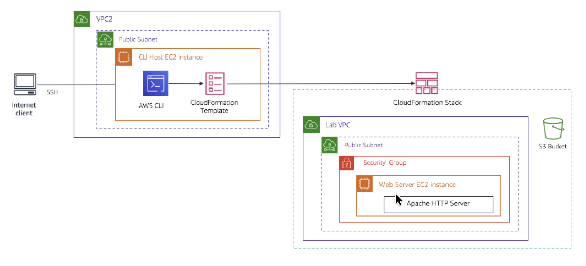

# Troubleshoot CloudFormation

In this lab, I practice troubleshooting AWS CloudFormation deployments. I begin by querying JavaScript Object Notation (JSON)-formatted data using JMESPath, then move into my AWS account, where the environment provides an Amazon Elastic Compute Cloud (Amazon EC2) instance named CLI Host, running in a virtual private cloud (VPC) named VPC2. I establish a Secure Shell (SSH) connection to the CLI Host, and from there use the AWS Command Line Interface (AWS CLI) to run AWS CloudFormation commands that create a stack with resources in the AWS account — my first attempt to create the stack fails and requires troubleshooting.

I then manually modify a resource created by the AWS CloudFormation stack, outside of the context of CloudFormation, and use CloudFormation to detect the resulting drift. Finally, I attempt to delete the stack and encounter issues along the way. In the Challenge section, I must figure out how to successfully delete the stack while keeping the Amazon Simple Storage Service (Amazon S3) bucket that was originally created by the stack and now contains objects.

<p align="center">
  
</p>

*The architectural diagram below illustrates the setup that is used in tasks this activity.*

## Business case relevance
*A new request from the Café leadership team:*

<p align="center">
  
</p>

Sofîa is discussing the AWS deployment used by the Café with Olivia. Sofîa mentions that Martha and Frank would like both her and Nikhil to have the skills to build infrastructure as code (IaC). Olivia suggests that as a first attempt, Sofîa should try working on a proof of concept (POC).

In this activity, I take on the role of Sofîa. I create a deployment of a web server inside a custom VPC that I define, performing this deployment using an AWS CloudFormation template. I also learn how to troubleshoot deployments to gain an understanding of how effective this technology can be.

## Task 1: Practice querying JSON-formatted data using JMESPath
In this first task, I practice using the JMESPath JSON query language to return results from a JSON document.

1. I open a new browser window and go to [jmespath.org/](http://jmespath.org/).
2. On the JMESPath website, in the document window that currently displays the locations JSON document, I copy the following JSON document, replacing the locations document:

```json
PASTE_FROM_LAB
```

3. In the **Expression** search box above the document, I delete all the text and enter `desserts`. The expression is immediately evaluated.

> [!CAUTION]
> I do not press Enter after entering an expression in the search box. If I press Enter, the entire page reloads with its original data.

#### Result panel
```json
PLACEHOLDER
```

In the **Result** panel below the document, I notice that all the content in the desserts part of the document is returned.

4. I add `[1]` to the expression:

```bash
desserts[1]
```

Only the second dessert element is displayed. The `[]` notation is used with an index, enabling me to refer to a specific element of an array. Because JMESPath considers the first position in an array to be 0, `1` returns the second element.

5. To retrieve only the value of the `name` attribute for the chocolate cake element, I enter:

```bash
desserts[0].name
```

   The name of the first dessert element, "Chocolate cake", is returned.

> [!NOTE]
> The `.` notation allows me to specify the name of an attribute in the document.

6. To retrieve the values of both the `name` and `price` attributes of the chocolate cake element, I enter:

```bash
desserts[0].[name,price]
```

   The name and price of the chocolate cake dessert are displayed. The `[]` notation can also be used to define a list of attributes to return.

7. To return the values of the `name` attribute for all three dessert elements, without the prices, I enter:

```bash
desserts[].name
```

   An empty array index `[]`, or one with an asterisk `[*]`, refers to all of the elements in an array.

8. Now, instead of referring to elements by their position, I use a filter to return the attributes of the carrot cake element:

```bash
desserts[?name=='Carrot cake']
```

   I did not need to know the index of the element I was searching for. The filter expression `[? <expression>]` returns the elements in the document that match the specified expression condition.

9. Lastly, I replace the JSON document with the following document, which describes resources in an AWS CloudFormation stack:

```json
PASTE_FROM_LAB
```

10. To determine the correct JMESPath expression to retrieve the `LogicalResourceId` of the EC2 instance resource, I run the following query:

```bash
StackResources[?ResourceType == 'AWS::EC2::Instance'].LogicalResourceId
```

When I complete the other tasks in this activity, I notice that the instructions often include AWS CLI commands with `--query` or `--filter` parameters. These parameters use JMESPath expressions to filter the output returned by an AWS CLI command.


## Task 2: Troubleshooting and working with AWS CloudFormation stacks

## Task 3: Make manual modifications and detect drift

## Task 4: Attempt to delete the stack


## Business case solution
*Update from Café:*

<p align="center">
  
</p>

When Sofîa went into work the next morning at the Café, she was excited to tell Nikhil and the others about the proof of concept work she had done the night before using CloudFormation.

She explained how this "Infrastructure as Code" approach to creating cloud deployments was causing her to completely rethink the café's current approach to managing the AWS resources that support the café website and other business applications.

Nikhil was very interested in what she was describing. They began discussing how they could use this technology to reliably create matching but separate development and production environments, and how useful that would be for new feature development. They also saw the value provided by powerful features such as drift detection and the ability to tear down and rebuild complex cloud infrastructures consisting of resources from multiple AWS services.

## Conclusion
After completing this activity, I am able to:
* **Practice** using JMESPath to query JSON-formatted documents
* **Troubleshoot** the deployment of an AWS CloudFormation stack using the AWS CLI
* **Analyze** log files on a Linux EC2 instance to determine the cause of a `create-stack` failure
* **Troubleshoot** a failed `delete-stack` action

## Additional resources
- [AWS CLI Command Reference](https://docs.aws.amazon.com/cli/latest/reference/cloudformation/delete-stack.html)
