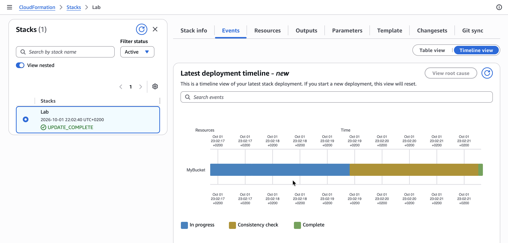
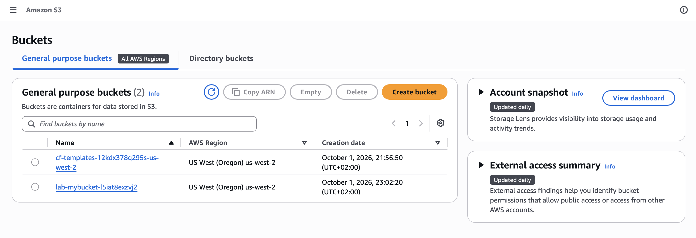
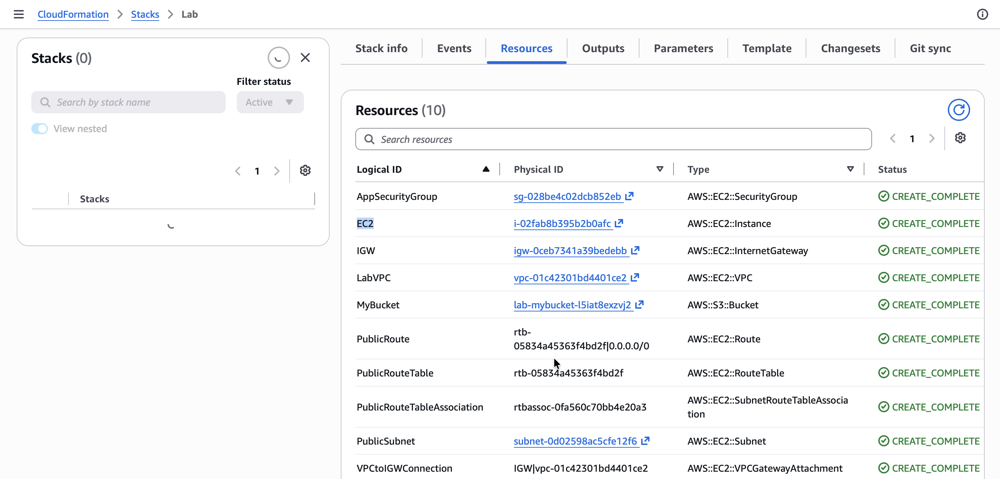
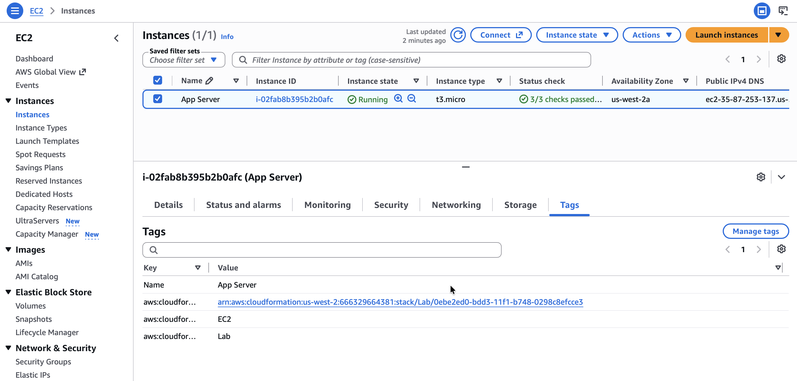

# Automating Deployments with AWS CloudFormation

Amazon Web Services (AWS) provides infrastructure automation capabilities through services such as CloudFormation, enabling consistent and repeatable deployments. In this lab, I explore how infrastructure can be defined as code using YAML templates and deployed automatically. The lab focuses on creating, modifying, and deleting a CloudFormation stack while integrating core AWS resources such as a Virtual Private Cloud (VPC), Security Groups, Amazon S3 buckets, and Amazon EC2 instances. This approach reduces manual configuration errors and improves deployment efficiency.

## Task 1: Deploy a CloudFormation Stack

*I begin by deploying a CloudFormation stack that creates a VPC as shown in this diagram:*

<p align="center">
  
</p>

I started by downloading the provided [task1.yaml](./files/task1.yaml) template and examining its structure. The file contained three main sections: 
* The [Parameters section](https://docs.aws.amazon.com/AWSCloudFormation/latest/UserGuide/parameters-section-structure.html) is used to prompt for inputs that can be used elsewhere in the template. The template asks for two IP address (CIDR) ranges for defining the VPC.
* The [Resources section](https://docs.aws.amazon.com/AWSCloudFormation/latest/UserGuide/resources-section-structure.html) is used to define the infrastructure to be deployed. The template defines the VPC and a Security Group.
* The [Outputs section](https://docs.aws.amazon.com/AWSCloudFormation/latest/UserGuide/outputs-section-structure.html) is used to provide selective information about resources in the stack. The template provides the Default Security Group for the VPC that is created.

>[!Note]
> The template is written in a format called YAML, which is commonly used for configuration files. The format of the file is important, including the indents and hyphens. CloudFormation templates can also be written in JSON.

1. I navigated to the **AWS CloudFormation Management Console**.
2. I click **Create stack**, then:
   * Click **Upload a template file**
   * Click **Browse** or **Choose file** and upload the template file I downloaded earlier
   * Click **Next**
3. On the **Specify Details** page, I configure:
   * **Stack name:** `Lab`

In the **Parameters** section, I see that CloudFormation is prompting for the IP address (CIDR) range for the VPC and Subnet. A default value has been specified by the template, so there is no need to modify these values. I click **Next**.

4. On the **Options** page, which can be used to specify additional parameters, I browse the page but leave settings at their default values, then click **Next**.
5. On the **Review** page, a summary of all settings is displayed. Some of the resources are defined with custom names, which can lead to naming conflicts — CloudFormation therefore prompts for an acknowledgement that custom names are being used.
6. I click **Submit** on the **Create stack** page. The stack now enters the `CREATE_IN_PROGRESS` status.
7. I click the **Events** tab and scroll through the listing. This listing shows, in reverse order, the activities performed by CloudFormation, such as starting to create a resource and then completing the resource creation. Any errors encountered during the creation of the stack are listed in this tab.
8. I click the **Resources** tab. This listing shows the resources being created.

<p align="center">
  
</p>

*CloudFormation determines the optimal order for resources to be created, such as creating the VPC before the subnet.*

9. I wait until the status changes to `CREATE_COMPLETE`.

<p align="center">
  
</p>

*I click **Refresh** occasionally to update the display.*

## Task 2: Add an Amazon S3 Bucket to the Stack

Next, I modified the existing YAML template to include an Amazon S3 bucket. Based on the [Amazon S3 Template Snippets documentation](https://docs.aws.amazon.com/AWSCloudFormation/latest/UserGuide/quickref-s3.html), 
I added a minimal resource definition under the Resources section using only the required type declaration:

#### Update task1.yaml template
```yaml
Resources:

###########
# S3 Bucket
###########

  MyBucket:
    Type: AWS::S3::Bucket
```

After saving the changes, I updated the existing CloudFormation stack by uploading the modified template. During the update process, I reviewed the change set preview, which indicated that a new S3 bucket would be added without affecting existing resources.

<p align="center">
  
</p>

*The update completed successfully, and I confirmed that the new S3 bucket appeared in the **Resources** tab with an automatically generated name.*

<p align="center">
  
</p>

*Here is the updated YAML file with the S3 bucket resources included:* [task1.yaml](./files/task2.yaml) 

## Task 3: Add an Amazon EC2 Instance to the Stack

In this task, I extend the template further by **adding an EC2 instance to the template**, then update the stack with the revised template. First, I introduce a new parameter to dynamically retrieve the latest Amazon Linux 2 AMI using **AWS Systems Manager Parameter Store**.

#### Update task1.yaml template
```yaml
  AmazonLinuxAMIID:
    Type: AWS::SSM::Parameter::Value<AWS::EC2::Image::Id>
    Default: /aws/service/ami-amazon-linux-latest/amzn2-ami-hvm-x86_64-gp2
```

>[!Note]
> This parameter uses the ***AWS Systems Manager Parameter Store*** to retrieve the latest AMI *(specified in the Default parameter, which in this case is Amazon Linux 2)* for the stack's region. This makes it easy to deploy stacks in different regions without having to manually specify an AMI ID for every region.

Then, I define the EC2 instance resource under the **Resources** section. This requires specifying several properties, including:
* **ImageId:** Refer to `AmazonLinuxAMIID`, the parameter added in the previous step
* **InstanceType:** `t3.micro`
* **SecurityGroupIds:** Refer to `AppSecurityGroup`, defined in the template
* **SubnetId:** Refer to `PublicSubnet`, defined in the template
* **Tags**

I use the `!Ref` function to reference existing resources such as the security group and subnet.

#### Update task1.yaml template
```yaml
###########
# EC2 Instance
###########

  EC2:
    Type: AWS::EC2::Instance
    Properties:
      ImageId: !Ref AmazonLinuxAMIID
      InstanceType: t3.micro
      SecurityGroupIds: 
        - !Ref AppSecurityGroup
      SubnetId: !Ref PublicSubnet
      Tags:
        - Key: Name
          Value: App Server
```

After updating the template [task1.yaml](./files/task3.yaml) to its final version, I perform another stack update. The preview confirms that only the EC2 instance will be added.

<p align="center">
  
</p>

*Once the update completes, I verify that the EC2 instance was successfully created and listed among the stack resources.*

<p align="center">
  
</p>

*I navigate to the **EC2 Management Console**, select the **Instance** tab. Under the **Tags** tab I confirm that the EC2 Instance had the resources added.* 

## Task 4: Delete the Stack


## Conclusion

In this lab, I learned how to use AWS CloudFormation to automate infrastructure deployment. I created a stack from a YAML template, 
then incrementally updated it by adding an S3 bucket and an EC2 instance. This demonstrated how CloudFormation allows controlled and 
efficient modifications without redeploying existing resources. I also observed how dependencies between resources are managed automatically.

Overall, the lab highlighted the advantages of infrastructure as code, including consistency, scalability, and easier maintenance. 
Deleting the stack reinforced how CloudFormation simplifies cleanup by removing all associated resources in a single operation.

In summary, I learnt how to:
- Deploy an AWS CloudFormation stack with a defined Virtual Private Cloud (VPC), and Security Group.
- Configure an AWS CloudFormation stack with resources, such as an Amazon Simple Storage Solution (S3) bucket and Amazon Elastic Compute Cloud (EC2).
- Terminate an AWS CloudFormation and its respective resources.

## Additional resources
- [Amazon S3 Template Snippets](https://docs.aws.amazon.com/AWSCloudFormation/latest/UserGuide/quickref-s3.html)
- [AWS Compute Blog: Query for the latest Amazon Linux AMI IDs using AWS Systems Manager Parameter Store](https://aws.amazon.com/blogs/compute/query-for-the-latest-amazon-linux-ami-ids-using-aws-systems-manager-parameter-store/)
- [AWS::EC2::Instance](https://docs.aws.amazon.com/AWSCloudFormation/latest/TemplateReference/aws-resource-ec2-instance.html)
