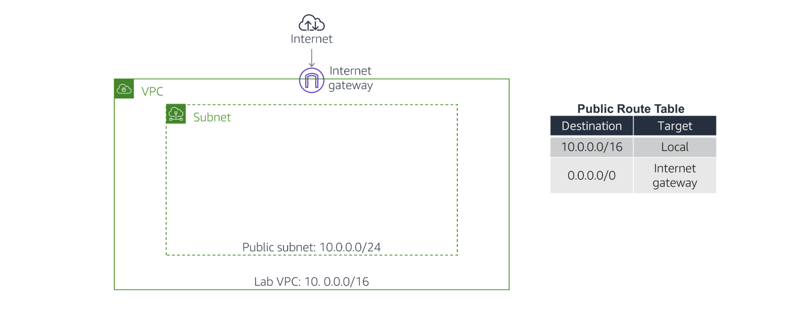
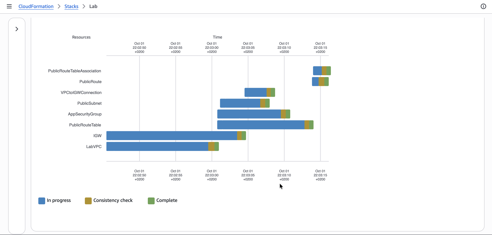
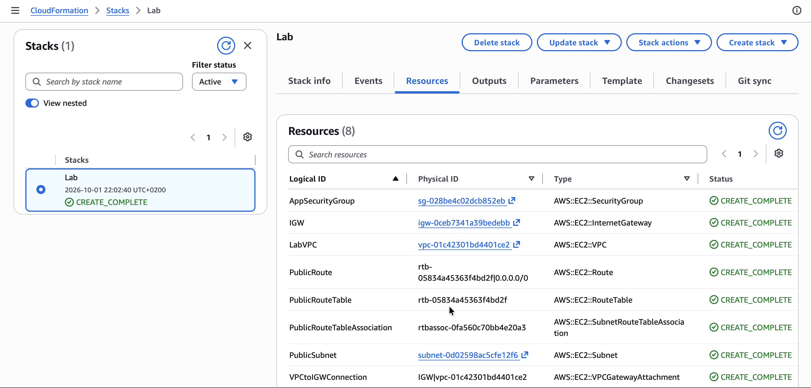

# Automating Deployments with AWS CloudFormation

Amazon Web Services (AWS) provides infrastructure automation capabilities through services such as CloudFormation, enabling consistent and repeatable deployments. In this lab, I explore how infrastructure can be defined as code using YAML templates and deployed automatically. The lab focuses on creating, modifying, and deleting a CloudFormation stack while integrating core AWS resources such as a Virtual Private Cloud (VPC), Security Groups, Amazon S3 buckets, and Amazon EC2 instances. This approach reduces manual configuration errors and improves deployment efficiency.

## Task 1: Deploy a CloudFormation Stack

*I begin by deploying a CloudFormation stack that creates a VPC as shown in this diagram:*

  

I started by downloading the provided [task1.yaml](./files/task1.yaml) template and examining its structure. The file contained three main sections: 
* The [Parameters section](https://docs.aws.amazon.com/AWSCloudFormation/latest/UserGuide/parameters-section-structure.html) is used to prompt for inputs that can be used elsewhere in the template. The template asks for two IP address (CIDR) ranges for defining the VPC.
* The [Resources section](https://docs.aws.amazon.com/AWSCloudFormation/latest/UserGuide/resources-section-structure.html) is used to define the infrastructure to be deployed. The template defines the VPC and a Security Group.
* The [Outputs section](https://docs.aws.amazon.com/AWSCloudFormation/latest/UserGuide/outputs-section-structure.html) is used to provide selective information about resources in the stack. The template provides the Default Security Group for the VPC that is created.

>[!Note]
> The template is written in a format called YAML, which is commonly used for configuration files. The format of the file is important, including the indents and hyphens. CloudFormation templates can also be written in JSON.

1. I navigated to the **AWS CloudFormation Management Console**.
2. I click **Create stack**, then:
   * Click **Upload a template file**
   * Click **Browse** or **Choose file** and upload the template file I downloaded earlier
   * Click **Next**
3. On the **Specify Details** page, I configure:
   * **Stack name:** `Lab`

In the **Parameters** section, I see that CloudFormation is prompting for the IP address (CIDR) range for the VPC and Subnet. A default value has been specified by the template, so there is no need to modify these values. I click **Next**.

4. On the **Options** page, which can be used to specify additional parameters, I browse the page but leave settings at their default values, then click **Next**.
5. On the **Review** page, a summary of all settings is displayed. Some of the resources are defined with custom names, which can lead to naming conflicts — CloudFormation therefore prompts for an acknowledgement that custom names are being used.
6. I click **Submit** on the **Create stack** page. The stack now enters the `CREATE_IN_PROGRESS` status.
7. I click the **Events** tab and scroll through the listing. This listing shows, in reverse order, the activities performed by CloudFormation, such as starting to create a resource and then completing the resource creation. Any errors encountered during the creation of the stack are listed in this tab.
8. I click the **Resources** tab. This listing shows the resources being created.

  

*CloudFormation determines the optimal order for resources to be created, such as creating the VPC before the subnet.*

9. I wait until the status changes to `CREATE_COMPLETE`.

  

*I click **Refresh** occasionally to update the display.*

## Task 2: Add an Amazon S3 Bucket to the Stack

## Task 3: Add an Amazon EC2 Instance to the Stack

## Task 4: Delete the Stack

## Conclusion

In this lab, I learned how to use AWS CloudFormation to automate infrastructure deployment. I created a stack from a YAML template, 
then incrementally updated it by adding an S3 bucket and an EC2 instance. This demonstrated how CloudFormation allows controlled and 
efficient modifications without redeploying existing resources. I also observed how dependencies between resources are managed automatically.

Overall, the lab highlighted the advantages of infrastructure as code, including consistency, scalability, and easier maintenance. 
Deleting the stack reinforced how CloudFormation simplifies cleanup by removing all associated resources in a single operation.

In summary, I learnt how to:
- Deploy an AWS CloudFormation stack with a defined Virtual Private Cloud (VPC), and Security Group.
- Configure an AWS CloudFormation stack with resources, such as an Amazon Simple Storage Solution (S3) bucket and Amazon Elastic Compute Cloud (EC2).
- Terminate an AWS CloudFormation and its respective resources.

## Additional resources
- [Amazon S3 Template Snippets](https://docs.aws.amazon.com/AWSCloudFormation/latest/UserGuide/quickref-s3.html)
- [AWS Compute Blog: Query for the latest Amazon Linux AMI IDs using AWS Systems Manager Parameter Store](https://aws.amazon.com/blogs/compute/query-for-the-latest-amazon-linux-ami-ids-using-aws-systems-manager-parameter-store/)
- [AWS::EC2::Instance](https://docs.aws.amazon.com/AWSCloudFormation/latest/TemplateReference/aws-resource-ec2-instance.html)
