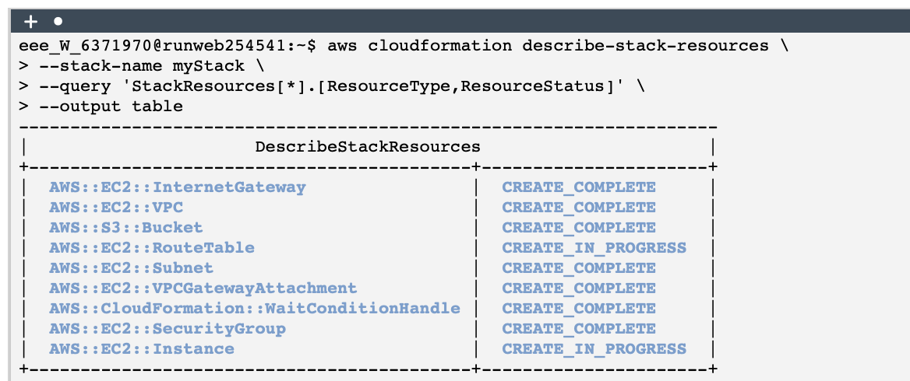
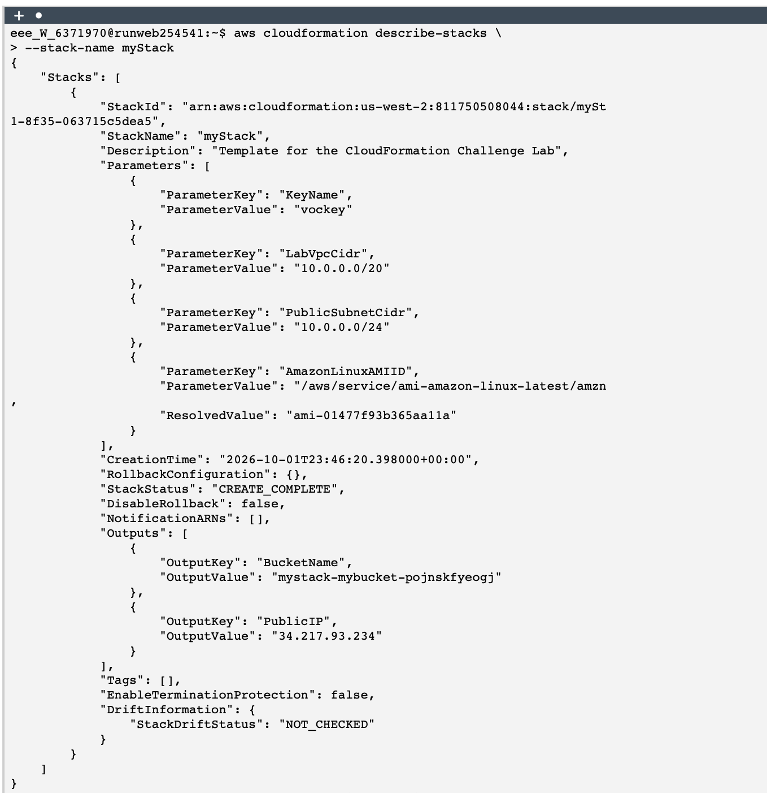
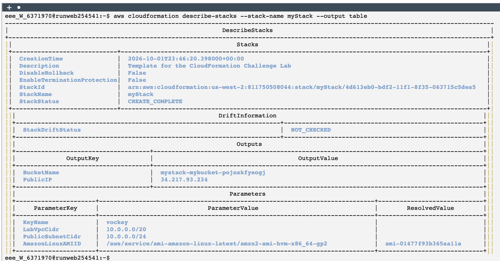

# Using AWS CloudFormation to create an AWS VPC and Amazon EC2 instance

This lab focused on using AWS CloudFormation to deploy infrastructure as code (IaC) in order to create a basic AWS environment. 
The environment consisted of a Virtual Private Cloud (VPC), Internet Gateway, subnet configuration, security group rules, and an EC2 instance deployed inside the network.

The purpose of the lab was to build and troubleshoot a CloudFormation template through iterative testing until all required resources were successfully deployed.

## Solution

I started by accessing the AWS CLI environment and verifying that my credentials were properly configured. I confirmed access using the identity command : 

```bash
aws sts get-caller-identity 
```

#### Terminal output
```bash
eee_W_6371970@runweb254541:~$ aws sts get-caller-identity                                            
{                                                                                                    
    "UserId": "AROA32AAZYYGE3VMS74DQ:user5168917=Kyle_Scritten",                                     
    "Account": "811750508044",                                                                       
    "Arn": "arn:aws:sts::811750508044:assumed-role/voclabs/user5168917=Kyle_Scritten"                
}                   
````

After confirming access, I wrote the CloudFormation template and uploaded it to the lab environment successfully.

*Here is the final version:* [template.yaml](./files/template.yaml).

Then proceeded to create the CloudFormation stack using the AWS CLI:

```bash
aws cloudformation create-stack \
--stack-name myStack \
--template-body file://template.yaml \
--parameters ParameterKey=KeyName,ParameterValue=vockey
```

#### Terminal output
```bash                                                            
{                                                                  
    "StackId": "arn:aws:cloudformation:us-west-2:811750508044:stack/myStack/4d6163715c5dea5"
}
```

During deployment, I monitored the stack progress using **CloudFormation commands** and **JMESPath filtering**:

```bash
aws cloudformation describe-stack-resources \
--stack-name myStack \
--query 'StackResources[*].[ResourceType,ResourceStatus]' \
--output table
```

#### Terminal output

<p align="center">
  
</p>

*This helped me track resource creation in real time.*

Then, I validated the overall stack status:

```bash
aws cloudformation describe-stacks \
--stack-name myStack
```

#### Terminal output

<p align="center">
  
</p>

*I waited until it reached `CREATE_COMPLETE`.*

Finally, I verified that all the following components were successfully deployed with the CloudFormation template created:

* An Amazon Virtual Private Cloud (VPC) created successfully
* An Internet Gateway attached to the VPC
* Security groups for accessing the VPC, has been configured to allow SSH from anywhere
* An Amazon EC2 instance launched (a `t3.micro`) within the private subnet

#### Terminal output

<p align="center">
  
</p>

*I built and tested the lab, iterating on my solution until all components built successfully without error.*

## Conclusion

In this lab, I learned how to design and deploy AWS infrastructure using a CloudFormation template, including a VPC, Internet Gateway, security groups, a private subnet, and an EC2 instance. I gained experience iterating on the template to resolve validation errors and configuration issues, and used the AWS CLI to monitor the stack's deployment status until it built successfully.

I also learned how small syntax mistakes in a CloudFormation template can prevent deployment, and how iterative debugging is essential for successful infrastructure creation. By the end of the lab, I was able to successfully deploy a complete AWS environment using infrastructure as code.

## Additional Resources

* [AWS CLI Command Reference](https://docs.aws.amazon.com/cli/latest/reference/)
* [Boto3 documentation](https://docs.aws.amazon.com/boto3/latest/)
   
