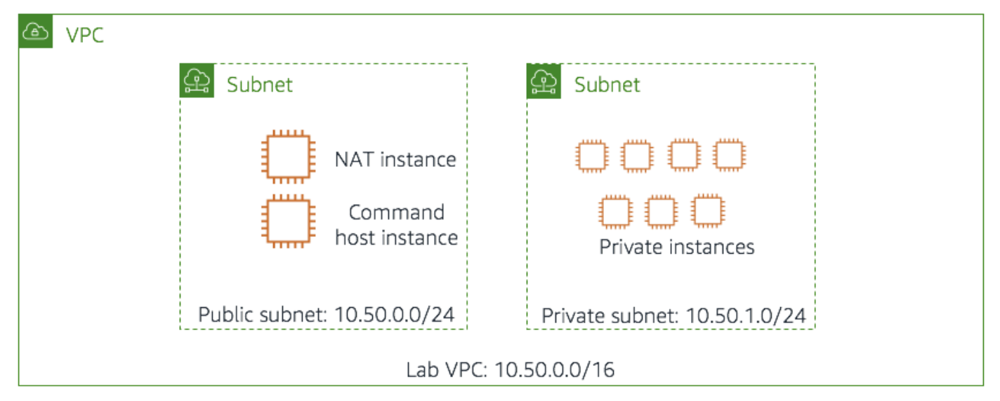
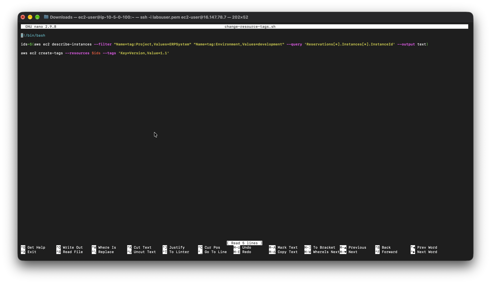
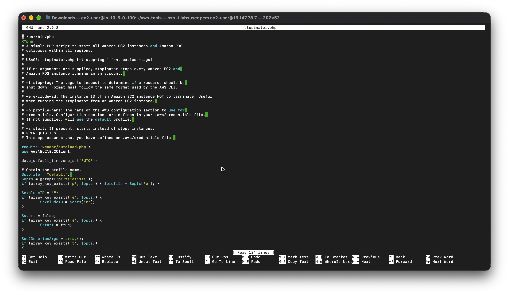
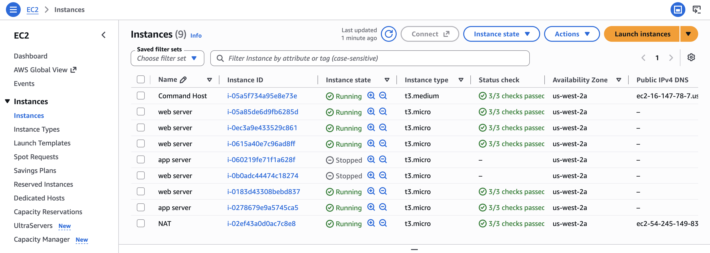
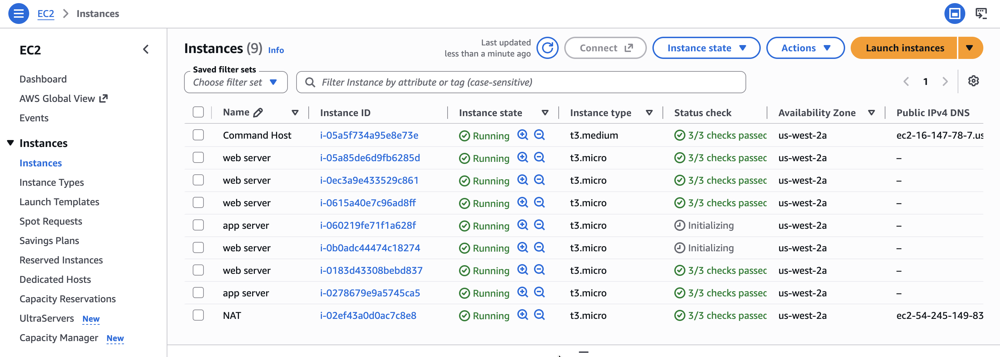
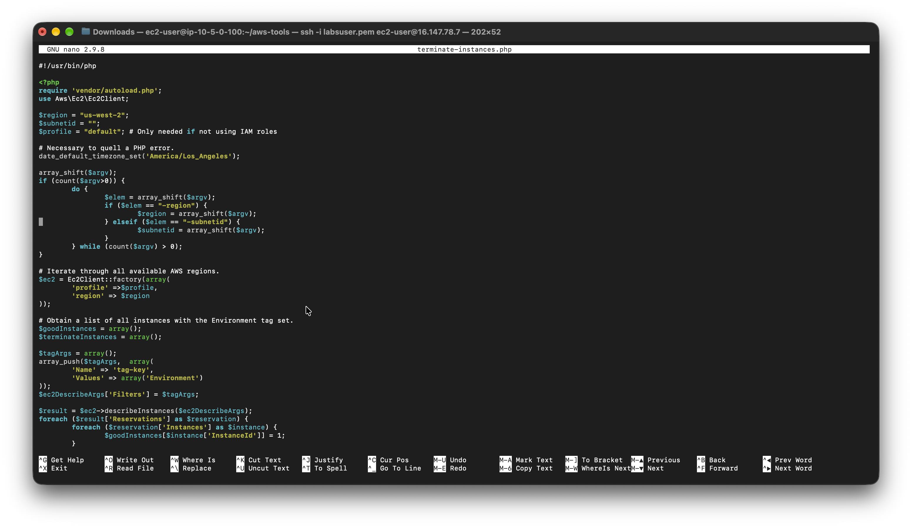

# Managing Resources with Tagging

This lab is divided into two parts. In the **Task** portion, I use the AWS Command Line Interface (CLI) to inspect the tags assigned to a number of Amazon EC2 instances, then use pre-provided scripts to shut down and start up multiple Amazon EC2 instances simultaneously based on their tags. In the **Challenge** portion, I am challenged to think of a way to terminate instances that fail to implement specific tags.

The environment for this lab (pictured below) consists of:

* An Amazon VPC named Lab VPC
* A public subnet
* A private subnet
* An Amazon EC2 Linux instance named CommandHost (AWS Command Line Interface (CLI) tools have been pre-installed and configured on this instance)
* 8 Amazon EC2 Linux instances

The private instances have three custom tags applied to them:

| Tag Name | Content |
|---|---|
| Project | The project that the instance belongs to. The instances in this lab belong to one of two projects: **ERPSystem** and **Experiment1**. |
| Version | The version of the project that this instance belongs to. All Version tags are currently set to 1.0. |
| Environment | One of three values: **development**, **staging**, or **production**. |

In the Task portion of this lab, I log in to the Command Host and run commands to find and change the Version tag on all development instances. I run several examples that show how I can use the JMESPath syntax supported by the AWS CLI `--query` option to return richly formatted output. I then use a set of pre-provided scripts to stop and re-start all instances tagged as belonging to the development environment.

<p align="center">
  
</p>

## Task 1: Using Tags to Manage Resources

In this task, I log in to the Command Host and use the AWS CLI to find a set of resources according to their tags. I then use the AWS CLI to change the value of one of the tags.

### Use SSH to connect to the Command Host instance

I connect to an Amazon Linux EC2 instance. I run macOS and will use an SSH utility to perform all of these operations. The Amazon EC2 `Command Host` instance is configured as part of this lab environment. 

I downloaded the file labsuser.pem from the lab environment and saved the PublicIP address, which for my lab is PublicIP `16.147.78.7`. From my terminal, I changed the permissions on the key to be read-only using my `PublicIP` allowing the first connection to this remote SSH server. 

#### Connect to the EC2 Instance

```bash
kylescritten@MacBookAir ~ % cd ~/Downloads
kylescritten@MacBookAir Downloads % chmod 400 labsuser.pem
kylescritten@MacBookAir Downloads % ssh -i labsuser.pem ec2-user@16.147.78.7
The authenticity of host '16.147.78.7 (16.147.78.7)' can't be established.
ED25519 key fingerprint is: SHA256:bPT2SCMLcALbuswfS1gPvDyN2EOhc41AcNPBQmt8n0Q
This key is not known by any other names.
Are you sure you want to continue connecting (yes/no/[fingerprint])? yes
```
#### Terminal Output
```text
Warning: Permanently added '16.147.78.7' (ED25519) to the list of known hosts.
** WARNING: connection is not using a post-quantum key exchange algorithm.
** This session may be vulnerable to "store now, decrypt later" attacks.
** The server may need to be upgraded. See https://openssh.com/pq.html
   ,     #_
   ~\_  ####_        Amazon Linux 2
  ~~  \_#####\
  ~~     \###|       AL2 End of Life is 2026-06-30.
  ~~       \#/ ___
   ~~       V~' '->
    ~~~         /    A newer version of Amazon Linux is available!
      ~~._.   _/
         _/ _/       Amazon Linux 2023, GA and supported until 2029-06-30.
       _/m/'           https://aws.amazon.com/linux/amazon-linux-2023/

[ec2-user@ip-10-5-0-100 ~]$ 
```

### Finding Development Instances For The Project

To find all instances in my account tagged with `Project=ERPSystem`, I run the following command in the Linux terminal window:
```bash
aws ec2 describe-instances --filter "Name=tag:Project,Values=ERPSystem"
```

I use the `--query` parameter to limit the output of the previous command to only the instance ID of the discovered instances:
```bash
aws ec2 describe-instances --filter "Name=tag:Project,Values=ERPSystem" --query 'Reservations[*].Instances[*].InstanceId'
```

#### Terminal output
```bash
[ec2-user@ip-10-5-0-100 ~]$ aws ec2 describe-instances --filter "Name=tag:Project,Values=ERPSystem" --query 'Reservations[*].Instances[*].InstanceId'
[
    [
        "i-05a85de6d9fb6285d"
    ], 
    [
        "i-0ec3a9e433529c861"
    ], 
    [
        "i-0615a40e7c96ad8ff"
    ], 
    [
        "i-060219fe71f1a628f"
    ], 
    [
        "i-0b0adc44474c18274"
    ], 
    [
        "i-0183d43308bebd837"
    ], 
    [
        "i-0278679e9a5745ca5"
    ]
]
```

I run the following command to include both the instance ID and the Availability Zone of each instance in my return result:
```bash
aws ec2 describe-instances --filter "Name=tag:Project,Values=ERPSystem" --query 'Reservations[*].Instances[*].{ID:InstanceId,AZ:Placement.AvailabilityZone}'
```

To include the value of the Project tag in my output, I run the following command:
```bash
aws ec2 describe-instances --filter "Name=tag:Project,Values=ERPSystem" --query 'Reservations[*].Instances[*].{ID:InstanceId,AZ:Placement.AvailabilityZone,Project:Tags[?Key==`Project`] | [0].Value}'
```

#### Terminal output
```bash
[ec2-user@ip-10-5-0-100 ~]$ aws ec2 describe-instances --filter "Name=tag:Project,Values=ERPSystem" --query 'Reservations[*].Instances[*].{ID:InstanceId,AZ:Placement.AvailabilityZone,Project:Tags[?Key==`Project`] | [0].Value}'
[
    [
        {
            "Project": "ERPSystem", 
            "AZ": "us-west-2a", 
            "ID": "i-05a85de6d9fb6285d"
        }
    ], 
    [
        {
            "Project": "ERPSystem", 
            "AZ": "us-west-2a", 
            "ID": "i-0ec3a9e433529c861"
        }
    ], 
    [
        {
            "Project": "ERPSystem", 
            "AZ": "us-west-2a", 
            "ID": "i-0615a40e7c96ad8ff"
        }
    ], 
    [
        {
            "Project": "ERPSystem", 
            "AZ": "us-west-2a", 
            "ID": "i-060219fe71f1a628f"
        }
    ], 
    [
        {
            "Project": "ERPSystem", 
            "AZ": "us-west-2a", 
            "ID": "i-0b0adc44474c18274"
        }
    ], 
    [
        {
            "Project": "ERPSystem", 
            "AZ": "us-west-2a", 
            "ID": "i-0183d43308bebd837"
        }
    ], 
    [
        {
            "Project": "ERPSystem", 
            "AZ": "us-west-2a", 
            "ID": "i-0278679e9a5745ca5"
        }
    ]
]
```

I run the following command to also include the Environment and Version tags in my output:
```bash
aws ec2 describe-instances --filter "Name=tag:Project,Values=ERPSystem" --query 'Reservations[*].Instances[*].{ID:InstanceId,AZ:Placement.AvailabilityZone,Project:Tags[?Key==`Project`] | [0].Value,Environment:Tags[?Key==`Environment`] | [0].Value,Version:Tags[?Key==`Version`] | [0].Value}'
```

#### Terminal output
```bash
[ec2-user@ip-10-5-0-100 ~]$ aws ec2 describe-instances --filter "Name=tag:Project,Values=ERPSystem" --query 'Reservations[*].Instances[*].{ID:InstanceId,AZ:Placement.AvailabilityZone,Project:Tags[?Key==`Project`] | [0].Value,Environment:Tags[?Key==`Environment`] | [0].Value,Version:Tags[?Key==`Version`] | [0].Value}'
[
    [
        {
            "Project": "ERPSystem", 
            "Environment": "production", 
            "AZ": "us-west-2a", 
            "Version": "1.0", 
            "ID": "i-05a85de6d9fb6285d"
        }
    ], 
    [
        {
            "Project": "ERPSystem", 
            "Environment": "staging", 
            "AZ": "us-west-2a", 
            "Version": "1.0", 
            "ID": "i-0ec3a9e433529c861"
        }
    ], 
    [
        {
            "Project": "ERPSystem", 
            "Environment": "production", 
            "AZ": "us-west-2a", 
            "Version": "1.0", 
            "ID": "i-0615a40e7c96ad8ff"
        }
    ], 
    [
        {
            "Project": "ERPSystem", 
            "Environment": "development", 
            "AZ": "us-west-2a", 
            "Version": "1.0", 
            "ID": "i-060219fe71f1a628f"
        }
    ], 
    [
        {
            "Project": "ERPSystem", 
            "Environment": "development", 
            "AZ": "us-west-2a", 
            "Version": "1.0", 
            "ID": "i-0b0adc44474c18274"
        }
    ], 
    [
        {
            "Project": "ERPSystem", 
            "Environment": "staging", 
            "AZ": "us-west-2a", 
            "Version": "1.0", 
            "ID": "i-0183d43308bebd837"
        }
    ], 
    [
        {
            "Project": "ERPSystem", 
            "Environment": "staging", 
            "AZ": "us-west-2a", 
            "Version": "1.0", 
            "ID": "i-0278679e9a5745ca5"
        }
    ]
]

```

Finally, I add a second tag filter to see only the instances associated with the `ERPSystem` project that also belong to the `development` environment:
```bash
aws ec2 describe-instances --filter "Name=tag:Project,Values=ERPSystem" "Name=tag:Environment,Values=development" --query 'Reservations[*].Instances[*].{ID:InstanceId,AZ:Placement.AvailabilityZone,Project:Tags[?Key==`Project`] | [0].Value,Environment:Tags[?Key==`Environment`] | [0].Value,Version:Tags[?Key==`Version`] | [0].Value}'
```

#### Terminal output
```bash
[ec2-user@ip-10-5-0-100 ~]$ aws ec2 describe-instances --filter "Name=tag:Project,Values=ERPSystem" "Name=tag:Environment,Values=development" --query 'Reservations[*].Instances[*].{ID:InstanceId,AZ:Placement.AvailabilityZone,Project:Tags[?Key==`Project`] | [0].Value,Environment:Tags[?Key==`Environment`] | [0].Value,Version:Tags[?Key==`Version`] | [0].Value}'
[
    [
        {
            "Project": "ERPSystem", 
            "Environment": "development", 
            "AZ": "us-west-2a", 
            "Version": "1.0", 
            "ID": "i-060219fe71f1a628f"
        }
    ], 
    [
        {
            "Project": "ERPSystem", 
            "Environment": "development", 
            "AZ": "us-west-2a", 
            "Version": "1.0", 
            "ID": "i-0b0adc44474c18274"
        }
    ]
]
```

*I should see only two instances returned by this command, both with a Project tag value of `ERPSystem` and an Environment tag value of `development`.*

### Changing Version Tag for Development Process

In this procedure, I change all of the Version tags on the instances marked as development for the ERPSystem project.

I could individually set these properties on each affected instance, but an automated approach is more practical. I use a simple Linux Bash shell script to build on the queries I ran earlier and modify tag entries as a batch operation.

On the CommandHost, I open the file `/home/ec2-user/change-resource-tags.sh`:
```bash
nano change-resource-tags.sh
```

<p align="center">
  
</p>

I close the nano editor and run this command from the Linux command prompt:
```bash
./change-resource-tags.sh
```

To verify that the version number on these instances has been incremented, and that other non-development instances in the ERPSystem project have been unaffected, I run the following command:
```bash
aws ec2 describe-instances --filter "Name=tag:Project,Values=ERPSystem" --query 'Reservations[*].Instances[*].{ID:InstanceId, AZ:Placement.AvailabilityZone, Project:Tags[?Key==`Project`] |[0].Value,Environment:Tags[?Key==`Environment`] | [0].Value,Version:Tags[?Key==`Version`] | [0].Value}'
```

#### Terminal output
```bash
[ec2-user@ip-10-5-0-100 ~]$ aws ec2 describe-instances --filter "Name=tag:Project,Values=ERPSystem" --query 'Reservations[*].Instances[*].{ID:InstanceId, AZ:Placement.AvailabilityZone, Project:Tags[?Key==`Project`] |[0].Value,Environment:Tags[?Key==`Environment`] | [0].Value,Version:Tags[?Key==`Version`] | [0].Value}'
[
    [
        {
            "Project": "ERPSystem", 
            "Environment": "production", 
            "AZ": "us-west-2a", 
            "Version": "1.0", 
            "ID": "i-05a85de6d9fb6285d"
        }
    ], 
    [
        {
            "Project": "ERPSystem", 
            "Environment": "staging", 
            "AZ": "us-west-2a", 
            "Version": "1.0", 
            "ID": "i-0ec3a9e433529c861"
        }
    ], 
    [
        {
            "Project": "ERPSystem", 
            "Environment": "production", 
            "AZ": "us-west-2a", 
            "Version": "1.0", 
            "ID": "i-0615a40e7c96ad8ff"
        }
    ], 
    [
        {
            "Project": "ERPSystem", 
            "Environment": "development", 
            "AZ": "us-west-2a", 
            "Version": "1.1", 
            "ID": "i-060219fe71f1a628f"
        }
    ], 
    [
        {
            "Project": "ERPSystem", 
            "Environment": "development", 
            "AZ": "us-west-2a", 
            "Version": "1.1", 
            "ID": "i-0b0adc44474c18274"
        }
    ], 
    [
        {
            "Project": "ERPSystem", 
            "Environment": "staging", 
            "AZ": "us-west-2a", 
            "Version": "1.0", 
            "ID": "i-0183d43308bebd837"
        }
    ], 
    [
        {
            "Project": "ERPSystem", 
            "Environment": "staging", 
            "AZ": "us-west-2a", 
            "Version": "1.0", 
            "ID": "i-0278679e9a5745ca5"
        }
    ]
]
``` 

## Task 2: Stop and Start Resources by Tag

In this task, I use a pre-provided script to stop and start a set of instances tagged as `development` instances.

### Examining the Stopinator Script

On the Command Host instance, I `cd` into the `aws-tools` directory in the home directory:
```bash
cd aws-tools
```

I open the file `stopinator.php` and examine its contents:
```bash
nano stopinator.php
```

<p align="center">
  
</p>

*The `stopinator.php` script is a simple script that uses the AWS SDK for PHP to stop and restart instances based on a set of tags. This enables scenarios such as shutting off development environment servers at the end of the day and restarting them the next morning.*

I exit the nano editor.

### Stopping and Restarting ERPProject Development Process

In this task, I use the `stopinator.php` script to bring down and bring back up my development environment for the ERPSystem project.

From the Linux shell, I run the `stopinator.php` script; however, the script fails to run:
```bash
./stopinator.php -t"Project=ERPSystem;Environment=development"
```

> [!CAUTION]
> Looking at the `foreach ($regions['Regions'] as $region)` loop, there's no `try/catch` around the `$ec2Current->describeInstances($ec2DescribeArgs)` call. The script calls `describeRegions()`, which returns all AWS Regions globally (including ones like `ap-south-1` that my lab's SCP blocks), and then tries `describeInstances()` in every single one of them with no error handling.
>
> The very first Region that hits the SCP deny (`ap-south-1`) throws an uncaught `Ec2Exception`, which crashes the whole script (`PHP Fatal error: Uncaught...`) before it ever reaches `us-west-2`, where my actual instances are.

#### The Fix
```php
try {
    $result = $ec2Current->describeInstances($ec2DescribeArgs);
} catch (Aws\Ec2\Exception\Ec2Exception $e) {
    echo "\tSkipping region (access denied or unavailable): " . $region['RegionName'] . "\n";
    continue;
}
```

>[!Note]
> I wrap the per-Region `describeInstances` call (and the corresponding `start`/`stop` calls) in a `try/catch` block, so that a denied Region is skipped gracefully instead of halting the script.

I run the `stopinator.php` script again:
```bash
./stopinator.php -t"Project=ERPSystem;Environment=development"
```

#### Terminal output
```bash
[ec2-user@ip-10-5-0-100 ~]$ cd aws-tools
[ec2-user@ip-10-5-0-100 aws-tools]$ 
[ec2-user@ip-10-5-0-100 aws-tools]$ nano stopinator.php
[ec2-user@ip-10-5-0-100 aws-tools]$ 
[ec2-user@ip-10-5-0-100 aws-tools]$ ./stopinator.php -t"Project=ERPSystem;Environment=development"
Region is ap-south-1
Skipping region (access denied or unavailable): ap-south-1
...
Region is us-west-1
Skipping region (access denied or unavailable): us-west-1
Region is us-west-2
Identified instance i-060219fe71f1a628f
Identified instance i-0b0adc44474c18274
PHP Notice:  Array to string conversion in /home/ec2-user/aws-tools/stopinator.php on line 120

Stopping identified instances in Array...
```

In the **EC2 Management Console**, I click **Instances** and verify that two instances are stopping or have already been stopped.

<p align="center">
  
</p>

I return to the SSH session for `Command Host`, and from the Linux prompt, restart my instances with the following command:

```bash
./stopinator.php -t"Project=ERPSystem;Environment=development" -s
```

I return to the **EC2 Management Console** window and verify that the two instances that were previously shut down are now restarting.

<p align="center">
  
</p>

#### Terminal output
```bash
[ec2-user@ip-10-5-0-100 aws-tools]$ ./stopinator.php -t"Project=ERPSystem;Environment=development" -s
Region is ap-south-1
	Skipping region (access denied or unavailable): ap-south-1
...
Region is us-west-1
	Skipping region (access denied or unavailable): us-west-1
Region is us-west-2
	Identified instance i-060219fe71f1a628f
	Identified instance i-0b0adc44474c18274
PHP Notice:  Array to string conversion in /home/ec2-user/aws-tools/stopinator.php on line 110

	Starting identified instances in Array...
```

## Task 3: Challenge: Terminate Non-Compliant Instances

In this challenge, I am asked to find a way to terminate instances that do not conform to certain security guidelines.

### Challenge Description

My company wants me to create automated processes that will automatically terminate instances that might allow a possible security breach. I have identified a list of security risks and am now deciding how to implement them efficiently using either AWS CLI commands or the PHP SDK for AWS.

**My first security task is simple:** find all instances in my private subnet that do not implement the `Environment` tag, and terminate them (a **"tag-or-terminate"** policy).

### Task 3.1: Review the Tag-Or-Terminate Script

I open the file `terminate-instances.php` with the nano editor:
```bash
nano terminate-instances.php
```

<p align="center">
  
</p>

### Configuring Environment to Test Script

Before running the script, I need to alter a couple of instances in my lab so that they no longer have the `Environment` tag defined.

I return to the EC2 Management Console and observe the instances running in my lab environment. I select one of the instances in my private subnet, go to the **Tags** tab, and click **Add/Edit Tags**. I find the `Environment` tag and click the remove icon, then click **Save**. I repeat this process for one other instance in my private subnet.

### Run the Script

In the EC2 Management Console, I select one of the instances in my private subnet. On the **Description** tab, I copy the **Availability zone** field (referred to as `region`) and the **Subnet ID** field (referred to as `subnet-id`).

I return to my SSH session and run the `terminate-instances.php` script, replacing `<region>` with my region and `<subnet-id>` with my subnet ID:

```bash
./terminate-instances.php -region <region> -subnetid <subnet-id>
```

**Terminal output:**
```bash
[ec2-user@ip-10-5-0-100 aws-tools]$ ./terminate-instances.php -region us-west-2 -subnetid subnet-08f56790704ed31ad

Checking i-05a85de6d9fb6285d
Checking i-0ec3a9e433529c861
Checking i-0615a40e7c96ad8ff
Checking i-060219fe71f1a628f
Checking i-0b0adc44474c18274
Checking i-0183d43308bebd837
Checking i-0278679e9a5745ca5
Terminating instances...
Instances terminated.
```

*I see results similar to the output above.*

## Conclusion

After completing this lab, I am able to:

* Apply tags to existing AWS resources
* Find resources based on tags
* Use the AWS CLI or AWS SDK for PHP to stop and terminate Amazon EC2 instances based on certain attributes of the resource

## Bash Commands
```bash
# Describe all EC2 instances with the tag Project=ERPSystem
aws ec2 describe-instances --filter "Name=tag:Project,Values=ERPSystem"

# Retrieve only the Instance IDs of EC2 instances tagged with Project=ERPSystem
aws ec2 describe-instances \
  --filter "Name=tag:Project,Values=ERPSystem" \
  --query 'Reservations[*].Instances[*].InstanceId'

# Retrieve Instance IDs along with their Availability Zones
aws ec2 describe-instances \
  --filter "Name=tag:Project,Values=ERPSystem" \
  --query 'Reservations[*].Instances[*].{ID:InstanceId,AZ:Placement.AvailabilityZone}'

# Retrieve Instance details including custom tags: Project, Environment, and Version
aws ec2 describe-instances \
  --filter "Name=tag:Project,Values=ERPSystem" \
  --query 'Reservations[*].Instances[*].{ID:InstanceId,AZ:Placement.AvailabilityZone,Project:Tags[?Key==`Project`] | [0].Value,Environment:Tags[?Key==`Environment`] | [0].Value,Version:Tags[?Key==`Version`] | [0].Value}'

# Retrieve only development instances within the ERPSystem project
aws ec2 describe-instances \
  --filter "Name=tag:Project,Values=ERPSystem" "Name=tag:Environment,Values=development" \
  --query 'Reservations[*].Instances[*].{ID:InstanceId,AZ:Placement.AvailabilityZone,Project:Tags[?Key==`Project`] | [0].Value,Environment:Tags[?Key==`Environment`] | [0].Value,Version:Tags[?Key==`Version`] | [0].Value}'

# Store Instance IDs of development instances in a variable for reuse
ids=$(aws ec2 describe-instances \
  --filter "Name=tag:Project,Values=ERPSystem" "Name=tag:Environment,Values=development" \
  --query 'Reservations[*].Instances[*].InstanceId' \
  --output text)

# Update (or create) the Version tag to 1.1 for selected instances
aws ec2 create-tags --resources $ids --tags 'Key=Version,Value=1.1'

# Verify that tags have been updated correctly
aws ec2 describe-instances \
  --filter "Name=tag:Project,Values=ERPSystem" \
  --query 'Reservations[*].Instances[*].{ID:InstanceId,AZ:Placement.AvailabilityZone,Project:Tags[?Key==`Project`] | [0].Value,Environment:Tags[?Key==`Environment`] | [0].Value,Version:Tags[?Key==`Version`] | [0].Value}'

# Stop all instances matching specific tags using the provided PHP script
./stopinator.php -t"Project=ERPSystem;Environment=development"

# Start previously stopped instances matching the same tags
./stopinator.php -t"Project=ERPSystem;Environment=development" -s

# Terminate non-compliant instances (missing required tags) in a given region and subnet
./terminate-instances.php -region <region> -subnetid <subnet-id>

# (Optional) Directly terminate instances by specifying their Instance IDs
aws ec2 terminate-instances --instance-ids <instance-id-1> <instance-id-2>
```

## Stopping Instances PHP
```GNU nano 2.9.8 stopping-instances.php
#!/usr/bin/php
<?php
# A simple PHP script to start all Amazon EC2 instances and Amazon RDS
# databases within all regions.
#
# USAGE: stopinator.php [-t stop-tags] [-nt exclude-tags]
#
# If no arguments are supplied, stopinator stops every Amazon EC2 and 
# Amazon RDS instance running in an account. 
#
# -t stop-tag: The tags to inspect to determine if a resource should be 
# shut down. Format must follow the same format used by the AWS CLI.
#
# -e exclude-id: The instance ID of an Amazon EC2 instance NOT to terminate. Useful
# when running the stopinator from an Amazon EC2 instance. 
#
# -p profile-name: The name of the AWS configuration section to use for 
# credentials. Configuration sections are defines in your .aws/credentials file. 
# If not supplied, will use the default profile. 
#
# -s start: If present, starts instead of stops instances.
# PREREQUISITES
# This app assumes that you have defined an .aws/credentials file. 

require 'vendor/autoload.php';
use Aws\Ec2\Ec2Client;

date_default_timezone_set('UTC');

# Obtain the profile name.
$profile = "default"; 
$opts = getopt('p::t::e::s::');
if (array_key_exists('p', $opts)) { $profile = $opts['p']; }

$excludeID = "";
if (array_key_exists('e', $opts)) {
        $excludeID = $opts['e'];
}

$start = false;
if (array_key_exists('s', $opts)) {
        $start = true;
}

$ec2DescribeArgs = array();
if (array_key_exists('t', $opts))
{
        $tagArray = array();
        foreach (explode(";", $opts['t']) as $pair) { 
                $nameVal = explode("=", $pair);
                array_push($tagArray, array(
                        'Name' => "tag:" . $nameVal[0], 
                        'Values' => array($nameVal[1])
                        ));
        }

        $ec2DescribeArgs['Filters'] = $tagArray; 
}

# Iterate through all available AWS regions.
$ec2 = Ec2Client::factory(array(
        'profile' =>$profile,
        'region' => 'us-east-1'
));

$regions = $ec2->describeRegions();
foreach ($regions['Regions'] as $region) {
        $instanceIds = array();

        # Find resources in each region. 
        echo 'Region is ' . $region['RegionName'] . "\n"; 
        $ec2Current = Ec2Client::factory(array( 
                'profile' => $profile, 
                'region' => $region['RegionName']
        ));
	$result = $ec2Current->describeInstances($ec2DescribeArgs);
        foreach ($result['Reservations'] as $reservation) {
                foreach ($reservation['Instances'] as $instance) {
                        # Check that this is not an excluded instance.  
                        if (strlen($excludeID) > 0 && $excludeID == $instance['InstanceId']) {
                                echo "\tExcluding instance " . $instance['InstanceId'] . "\n";
                        } else { 
                                # Is it a running instance?
                                if ($start) {
                                        if ($instance['State']['Code'] == 80) {
                                                array_push($instanceIds, $instance['InstanceId']);
                                                echo "\tIdentified instance " . $instance['InstanceId'] . "\n"; 
                                        } else {
                                                echo "\tInstance " . $instance['InstanceId'] . " - not stopped\n";  
                                        }
                                } else {
                                        if ($instance['State']['Code'] == 16) {
                                                array_push($instanceIds, $instance['InstanceId']); 
                                                echo "\tIdentified instance " . $instance['InstanceId'] . "\n"; 
                                        } else {
                                                echo "\tInstance " . $instance['InstanceId'] . " - already stopped\n"; 
                                        }
                                }
                        }
                }
        } 

	if ($start) {
                if (count($instanceIds) > 0) { 
                        echo "\n\tStarting identified instances in " . $region . "...\n"; 
                        $ec2Current->startInstances(array(
                                "InstanceIds" => $instanceIds
                        ));
                } else {
                        echo "\n\tNo instances to start in " . $region . "\n";  
                } 
        } else { 
                # Stop all identified instances. 
                if (count($instanceIds) > 0) {
                        echo "\n\tStopping identified instances in " . $region . "...\n";
                        $ec2Current->stopInstances(array(
                                "InstanceIds" => $instanceIds
                        ));
                } else {
                        echo "\n\tNo instances to stop in " . $region . ".\n"; 
                }
        } 
}
?>
```

## Terminate Instances PHP
```GNU nano 2.9.8 terminate-instances.php
#!/usr/bin/php

<?php
require 'vendor/autoload.php';
use Aws\Ec2\Ec2Client;

$region = "us-west-2";
$subnetid = "";
$profile = "default"; # Only needed if not using IAM roles

# Necessary to quell a PHP error.
date_default_timezone_set('America/Los_Angeles');

array_shift($argv);
if (count($argv>0)) {
        do {
            	$elem = array_shift($argv);
                if ($elem == "-region") {
                        $region = array_shift($argv);
                } elseif ($elem == "-subnetid") {
                        $subnetid = array_shift($argv);
                }
        } while (count($argv) > 0);
}

# Iterate through all available AWS regions.
$ec2 = Ec2Client::factory(array(
        'profile' =>$profile,
        'region' => $region
));

# Obtain a list of all instances with the Environment tag set.
$goodInstances = array();
$terminateInstances = array();

$tagArgs = array();
array_push($tagArgs,  array(
        'Name' => 'tag-key',
        'Values' => array('Environment')
));
$ec2DescribeArgs['Filters'] = $tagArgs;

$result = $ec2->describeInstances($ec2DescribeArgs);
foreach ($result['Reservations'] as $reservation) {
        foreach ($reservation['Instances'] as $instance) {
                $goodInstances[$instance['InstanceId']] = 1;
        }
}
# Obtain a list of all instances.
$subnetArgs = array();
array_push($subnetArgs, array(
        'Name' => 'subnet-id',
        'Values' => array($subnetid)
));
$ec2DescribeArgs['Filters'] = $subnetArgs;

$result = $ec2->describeInstances($ec2DescribeArgs);
foreach ($result['Reservations'] as $reservation) {
        foreach ($reservation['Instances'] as $instance) {
                echo "Checking " . $instance['InstanceId'] . "\n";
                if (!array_key_exists($instance['InstanceId'], $goodInstances)) {
                        $terminateInstances[$instance['InstanceId']] = 1;
                }
        }
}

# Terminate all identified instances.
if (count($terminateInstances) > 0) {
        echo "Terminating instances...\n";
        $ec2->terminateInstances(array(
                "InstanceIds" => array_keys($terminateInstances),
                "Force" => true
        ));
	echo "Instances terminated.\n";
} else {
        echo "No instances to terminate.\n";
}
?>
```
