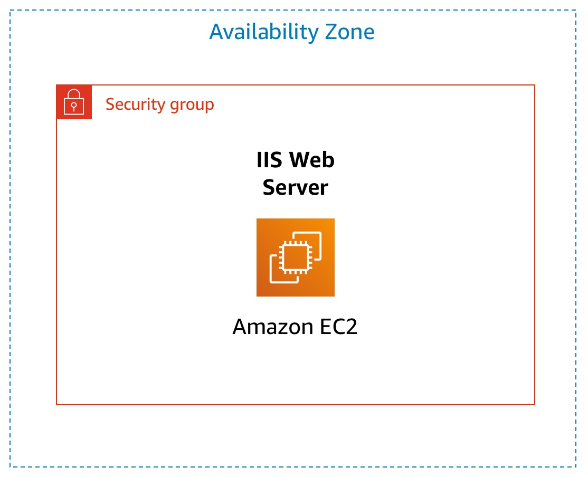
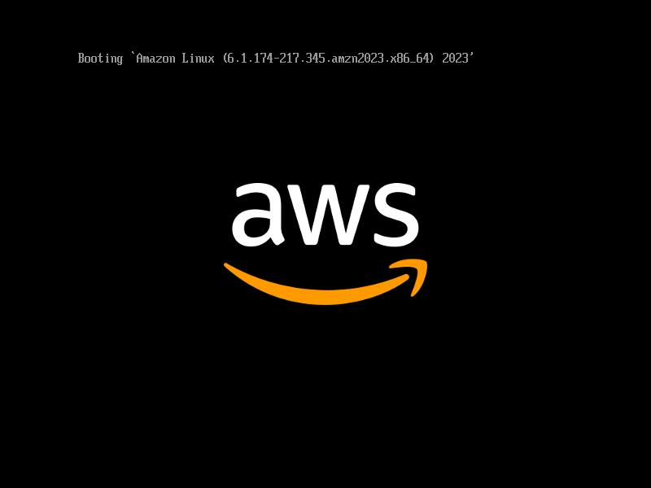

# Cloud Foundations - Introduction to Amazon Elastic Compute Cloud (EC2)
## Overview


In this lab, I explored the fundamentals of Amazon EC2 by learning how to launch, resize, manage, and monitor virtual servers in the AWS Cloud.

Amazon Elastic Compute Cloud (EC2) is a cloud computing service that provides scalable and on-demand compute capacity. It allows developers and organizations to quickly deploy virtual machines without the need to invest in physical hardware.

Through this lab, I gained hands-on experience with the EC2 management process, including instance deployment, configuration, monitoring, and resizing. One of the key advantages of EC2 is its flexibility, enabling resources to be scaled up or down based on changing requirements.

EC2 also follows a pay-as-you-go pricing model, meaning you only pay for the resources you use. This makes it a cost-effective solution for running applications while providing the reliability, performance, and fault-tolerant infrastructure of AWS.

## Lab Objectives

Through this lab I have learnt to:
- Launch a web server with termination protection enabled
- Monitor an EC2 instance
- Modify the security group that a web server is using to allow HTTP access
- Resize an Amazon EC2 instance to scale
- Test termination protection
- Terminate an EC2 instance

## Task 1: Launching an EC2 instance
In this task I launched a new Amazon EC2 instance with termination protection from the AWS Management Console.

### Steps taken to launch instance

1. Opened EC2 Dashboard, selected Launch Instance and named the instance ```Web Server```
2. Kept Amazon Linux 2023 as Amazon Machine Image (AMI) which is selected by default
3. Chose the **t3.micro** instance type
4. In the Key pair (login) pane, select **Proceed without a key pair (Not recommended)**.
5. Configured network settings by selecting the Lab VPC for **VPC - *required***. Created a security group called ```Web Server security group```, with the description ```Security group for my web server```. Removed the inbound security groups SSH rule for better security.
6. In the Configure storage pane, keep the default storage configuration.
7. Expand the **Advanced details** pane and select the dropdown for **Termination protection**, then choose **Enable**. I added a script in the **User Data** text box that automatically installs and starts a web server. This script installs Apache HTTP Server, starts the service, and creates a simple web page.
  ```code
#!/bin/bash
yum -y install httpd
systemctl enable httpd
systemctl start httpd
echo '<html><h1>Hello From Your Web Server!</h1></html>' > /var/www/html/index.html
```
8. Launch the EC2 instance by selecting ```Launch instance```

## Task 2: Monitoring the EC2 Instance
Monitoring is an important part of maintaining the reliability, availability, and performance of the Amazon Elastic Compute Cloud (Amazon EC2) instances.

In the **Status checks** tab, I confirmed **System reachability** and **Instance reachability** checks have passed.
I was able to view the **Monitoring** tab, which shows metrics from **Amazon CloudWatch**, such as CPU utilization. You can **Get an Instance Screenshot** as shown below:


## Task 3: Update The Security Group and Access the Web Server

Initially, I could not access the web server using the public IP address. This happened because the security group does not allow HTTP traffic.

To fix this, I updated the inbound rules by following the steps below:

1. Opened Security Groups
2. Selected Web Server security group
3. Added a new rule:
- Type: HTTP
- Port: 80
- Source: Anywhere (IPv4)

## Task 4 – Resizing the EC2 Instance

I learned that EC2 instances can be resized if more resources are required.

### How to change the EBS volume of an instance type

1. Stopped the instance
2. Changed the **instance type**
3. Increased the **EBS volume size**
   
#### Summary of Changes made

| Resource      |  Before  |   After  |
|:-------------:|:--------:|:--------:|
| Instance Type	| t3.micro | t3.small |
|:-------------:|:--------:|:--------:|
| Storage	      | 8 GiB    | 10 GiB   |

This process helps scale resources depending on application requirements.

## Task 5 – Testing Termination Protection
Termination protection prevents accidental deletion of instances.

I attempted to terminate the instance but AWS displayed an error because termination protection was enabled.

To terminate the instance:
1. Disable **termination protection**
2. Select **Terminate Instance**
   
The instance is successfully deleted.

## Topics Covered
In this lab, I learned how to use Amazon EC2 to deploy and manage a cloud-based server.

Through this lab I have learnt to:
- Launching and configuring EC2 instances
- Monitoring instance health
- Managing security groups
- Scaling instance resources
- Using termination protection
