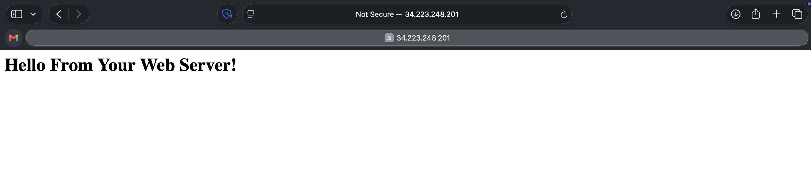

# Troubleshooting the Creation of an EC2 Instance

## Activity overview

In this activity, I use the AWS Command Line Interface (AWS CLI) to launch Amazon Elastic Compute Cloud (Amazon EC2) instances.

When creating the instance, I reference a user data script to configure it with an Apache web server, a MariaDB relational database (a fork of the MySQL relational database), and PHP. Together, these software packages installed on a single machine are often referred to as a ***LAMP*** stack (**L**inux, **A**pache web server, **M**ySQL, and **P**HP) — a common way to create a website with a database backend on a single machine.

The same user data file deploys website files and runs database configuration scripts on the instance, resulting in an instance that hosts the Café Web Application.

<p align="center">
  
</p>

*The following diagram shows the architecture I create in this activity.*

## Task 1: Connecting to the CLI Host instance
In this task, I use EC2 Instance Connect to connect to the CLI Host EC2 instance that was created when the lab was provisioned. I use this instance to run CLI commands.

1. On the Amazon EC2 Management Console, I choose **Instances**.
2. From the list of instances, I select the `CLI Host` instance.
3. Above the list of instances, I choose **Connect**.
4. On the **EC2 Instance Connect** tab, I choose **Connect**.

## Task 2: Configuring the AWS CLI
In this task, I configure the AWS CLI using the configuration parameters made available to me when the lab was provisioned. After configuration, I run CLI commands to interact with AWS services.

> [!NOTE]
> Amazon Linux Amazon Machine Images (AMIs) already have the AWS CLI preinstalled.

1. In the SSH session terminal window, I run the `aws configure` command to set up the AWS CLI profile with credentials.
2. At the prompt, I configure the following:
   * **AWS Access Key ID:** `<AWS Access Key ID>`
   * **AWS Secret Access Key:** `<AWS Secret Access Key>`
   * **Default region name:** Enter `us-west-2`
   * **Default output format:** Enter `json`

#### Terminal output
```bash
   ,     #_
   ~\_  ####_        Amazon Linux 2
  ~~  \_#####\
  ~~     \###|       AL2 End of Life is 2026-06-30.
  ~~       \#/ ___
   ~~       V~' '->
    ~~~         /    A newer version of Amazon Linux is available!
      ~~._.   _/
         _/ _/       Amazon Linux 2023, GA and supported until 2029-06-30.
       _/m/'           https://aws.amazon.com/linux/amazon-linux-2023/

[ec2-user@cli-host ~]$ aws configure
AWS Access Key ID [None]: <AWS Lab AccessKey>
AWS Secret Access Key [None]: <AWS Lab SecretKey>
Default region name [None]: us-west-2
Default output format [None]: json
[ec2-user@cli-host ~]$ 
```

## Task 3: Creating an EC2 instance using the AWS CLI
In this task, I observe and run a shell script provided to me to create an EC2 LAMP instance using AWS CLI commands. The script intentionally contains issues, and my challenge is to find and resolve them. As I resolve each issue, I rerun the script to check that it has been fixed.

### Task 3.1: Observe the script details
First, I create a backup of the script I will edit in a later step.

1. To change to the directory where the script file exists and create a backup of it, I run the following commands:

```bash
cd ~/sysops-activity-files/starters

cp create-lamp-instance-v2.sh create-lamp-instance.backup
```

2. I open the `create-lamp-instance-v2.sh` script file, using the `view` command in read-only mode using the `VI` command line text editor.

3. I analyze the contents of the script, displaying line numbers by typing `:set number` and pressing Enter:
   * **Line 1:** This is a bash file, so the first line contains `#!/bin/bash`.
   * **Lines 7–11:** The instance size is set to `t3.small`, which should be large enough to run the database and web server.
   * **Lines 16–29:** The script invokes the AWS CLI `describe-regions` command to get a list of all AWS Regions. In each Region, it queries for an existing VPC named `Cafe VPC`. After finding the VPC, it captures the VPC ID and Region, and breaks out of the `while` loop — this is the VPC where the LAMP instance for the Café Web Application should be deployed.
   * **Lines 31–55:** The script invokes AWS CLI commands to look up the subnet ID, key pair name, and AMI ID values needed to create the EC2 instance. I notice line 32 ends with a backslash (`\`) character, which wraps a single command onto another line — a technique used throughout the script to improve readability.
   * **Lines 57–122:** The script cleans up the AWS account for situations where it has already run and is being run again. It checks whether an instance named `cafeserver` already exists, and whether a security group including `cafeSG` in its name already exists. If either resource is found, the script prompts me to delete them.
   * **Lines 124–152:** The script creates a new security group with ports 22 and 80 open.
   * **Lines 154–168:** The script creates a new EC2 instance, using values set in lines 8 and 10 along with values collected in lines 16–57. I notice a reference to the user data file, which I review in a later step. The entire call to create the instance is captured in a variable named `instanceDetails`, whose contents are echoed to the terminal on line 177 and formatted for easier viewing using a Python JSON tool.
   * **Lines 179–188:** The `instanceId` value is parsed out of the `instanceDetails` variable. A `while` loop then checks every 10 seconds to see if a public IP address has been assigned to the instance, and once the check succeeds, the public IP address is written to the terminal.

4. I exit the `VI` text editor by entering `:q!`.
5. To display the contents of the user data script, I run the following command:

```bash
cat create-lamp-instance-userdata-v2.txt
```

#### Terminal output
```bash
[ec2-user@cli-host ~]$ cd ~/sysops-activity-files/starters
[ec2-user@cli-host starters]$ cp create-lamp-instance-v2.sh create-lamp-instance.backup
[ec2-user@cli-host starters]$ 
[ec2-user@cli-host starters]$ view create-lamp-instance-v2.sh
[ec2-user@cli-host starters]$ 
[ec2-user@cli-host starters]$ cat create-lamp-instance-userdata-v2.txt
#!/bin/bash
yum -y update
amazon-linux-extras install -y lamp-mariadb10.2-php7.2 php7.2
yum -y install httpd mariadb-server

systemctl enable httpd
systemctl start httpd

systemctl enable mariadb
systemctl start mariadb

echo '<html><h1>Hello From Your Web Server!</h1></html>' > /var/www/html/index.html
find /var/www -type d -exec chmod 2775 {} \;
find /var/www -type f -exec chmod 0664 {} \;
echo "<?php phpinfo(); ?>" > /var/www/html/phpinfo.php

usermod -a -G apache ec2-user
chown -R ec2-user:apache /var/www
chmod 2775 /var/www

#Check /var/log/cloud-init-output.log after this runs to see errors, if any.

#
# Download and unzip the Cafe application files.
#

# Database scripts
wget https://aws-tc-largeobjects.s3.amazonaws.com/CUR-TF-100-RESTRT-1/173-activity-JAWS-troubleshoot-instance/db-v2.tar.gz
tar -zxvf db-v2.tar.gz

# Web application files
wget https://aws-tc-largeobjects.s3.amazonaws.com/CUR-TF-100-RESTRT-1/173-activity-JAWS-troubleshoot-instance/cafe-v2.tar.gz
tar -zxvf cafe-v2.tar.gz -C /var/www/html/

#
# Run the scripts to set the database root password, and create and populate the application database.
# Check the following logs to make sure there are no errors:
#
#       /db/set-root-password.log
#       /db/create-db.log
#
cd db
./set-root-password.sh
./create-db.sh
hostnamectl set-hostname web-server
[ec2-user@cli-host starters]$ 
```

*I notice how the user data script runs a series of commands on the instance after it is launched. These commands install a web server, PHP, and a database server.*

### Task 3.2: Try to run the script

Now that I have an idea of what the shell script is designed to do, I try to run it using `./create-lamp-instance-v2.sh` :

#### Terminal output
```bash
[ec2-user@cli-host starters]$ ./create-lamp-instance-v2.sh

Running create-instance.sh on 2026-09-13 19:42:45

Instance Type: t3.small
Profile: default

Looking up account values...

VPC: vpc-0f7b42287f5f45ac1
Region: us-west-2
VPC: vpc-0f7b42287f5f45ac1
Subnet Id: subnet-0669be92719362cd6
Key: vockey
AMI ID: ami-0ffe11670d32a14ac

Creating a new security group...
Security Group: sg-02b0e3b0c01743f71

Opening port 22 in the new security group
Opening port 80 in the new security group

Creating an EC2 instance in us-west-2

An error occurred (InvalidAMIID.NotFound) when calling the RunInstances operation: The image id '[ami-0ffe11670d32a14ac]' does not exist
[ec2-user@cli-host starters]$ 
```

*The script fails and exits without successfully completing. This behavior is expected.*

### Task 3.3: Troubleshoot issues

#### Issue #1
The terminal output displays the following message: "An error occurred (InvalidAMIID.NotFound) when calling the RunInstances operation: The image id '[ami-xxxxxxxxxx]' does not exist".

>[!CAUTION]
> **The region error:** line 160 hardcodes the Region as `us-east-1`, instead of using the $region variable that was correctly detected earlier (`us-west-2`). Since the AMI ID (`ami-0ffe11670d32a14ac`) was looked up in `us-west-2`, but the run-instances command is trying to launch the instance in `us-east-1`, that AMI ID doesn't exist there — hence the `InvalidAMIID.NotFound` error.

#### The Issue #1 Fix
```bash
# 1. Reopen the script in the VI editor:
vi create-lamp-instance-v2.sh

# 2. Jump to line 160:
:160

# 3. Press `I` to enter insert mode, the locate this line:
--region us-east-1 \

# 4. Change it to:
--region $region \

# 5. Press Esc, then save and force quit:
:wq!

# 6. Then rerun the script:
./create-lamp-instance-v2.sh
```

After I fix the issue, the `run-instances` command succeeds, and a public IPv4 address is assigned to the new instance.

#### Terminal output
```bash
[ec2-user@cli-host starters]$ view create-lamp-instance-v2.sh
[ec2-user@cli-host starters]$ ./create-lamp-instance-v2.sh

Running create-instance.sh on 2026-09-13 20:01:45

Instance Type: t3.small
Profile: default

Looking up account values...

VPC: vpc-0f7b42287f5f45ac1
Region: us-west-2
VPC: vpc-0f7b42287f5f45ac1
Subnet Id: subnet-0669be92719362cd6
Key: vockey
AMI ID: ami-0ffe11670d32a14ac

WARNING: Found existing security group with name sg-02b0e3b0c01743f71.
This script will not succeed if it already exists. 
Would you like to delete it? [Y/N]
>>
Y

Deleting the existing security group...

Creating a new security group...
Security Group: sg-032ad725fd1b297c2

Opening port 22 in the new security group
Opening port 80 in the new security group

Creating an EC2 instance in us-west-2

Instance Details....
{
    "Groups": [],
    "Instances": [
        {
            "AmiLaunchIndex": 0,
            "Architecture": "x86_64",
            "BlockDeviceMappings": [],
            "CapacityReservationSpecification": {
                "CapacityReservationPreference": "open"
            },
            "ClientToken": "b724cd81-35c5-4dd6-9a21-26d55bdac8e6",
            "CpuOptions": {
                "CoreCount": 1,
                "ThreadsPerCore": 2
            },
            "EbsOptimized": false,
            "EnaSupport": true,
            "Hypervisor": "xen",
            "IamInstanceProfile": {
                "Arn": "arn:aws:iam::507851086169:instance-profile/LabInstanceProfile",
                "Id": "AIPAXMPSITFMZKYTJPY27"
            },
            "ImageId": "ami-0ffe11670d32a14ac",
            "InstanceId": "i-0865f523359ced503",
            "InstanceType": "t3.small",
            "KeyName": "vockey",
            "LaunchTime": "2026-09-13T20:04:06.000Z",
            "MetadataOptions": {
                "HttpEndpoint": "enabled",
                "HttpPutResponseHopLimit": 1,
                "HttpTokens": "optional",
                "State": "pending"
            },
            "Monitoring": {
                "State": "disabled"
            },
            "NetworkInterfaces": [
                {
                    "Attachment": {
                        "AttachTime": "2026-09-13T20:04:06.000Z",
                        "AttachmentId": "eni-attach-014d7caace03f9af6",
                        "DeleteOnTermination": true,
                        "DeviceIndex": 0,
                        "Status": "attaching"
                    },
                    "Description": "",
                    "Groups": [
                        {
                            "GroupId": "sg-032ad725fd1b297c2",
                            "GroupName": "cafeSG"
                        }
                    ],
                    "InterfaceType": "interface",
                    "Ipv6Addresses": [],
                    "MacAddress": "02:ff:c6:56:48:6d",
                    "NetworkInterfaceId": "eni-0295aa33b96e954fe",
                    "OwnerId": "507851086169",
                    "PrivateIpAddress": "10.200.0.130",
                    "PrivateIpAddresses": [
                        {
                            "Primary": true,
                            "PrivateIpAddress": "10.200.0.130"
                        }
                    ],
                    "SourceDestCheck": true,
                    "Status": "in-use",
                    "SubnetId": "subnet-0669be92719362cd6",
                    "VpcId": "vpc-0f7b42287f5f45ac1"
                }
            ],
            "Placement": {
                "AvailabilityZone": "us-west-2a",
                "GroupName": "",
                "Tenancy": "default"
            },
            "PrivateDnsName": "ip-10-200-0-130.us-west-2.compute.internal",
            "PrivateIpAddress": "10.200.0.130",
            "ProductCodes": [],
            "PublicDnsName": "",
            "RootDeviceName": "/dev/xvda",
            "RootDeviceType": "ebs",
            "SecurityGroups": [
                {
                    "GroupId": "sg-032ad725fd1b297c2",
                    "GroupName": "cafeSG"
                }
            ],
            "SourceDestCheck": true,
            "State": {
                "Code": 0,
                "Name": "pending"
            },
            "StateReason": {
                "Code": "pending",
                "Message": "pending"
            },
            "StateTransitionReason": "",
            "SubnetId": "subnet-0669be92719362cd6",
            "Tags": [
                {
                    "Key": "Name",
                    "Value": "cafeserver"
                }
            ],
            "VirtualizationType": "hvm",
            "VpcId": "vpc-0f7b42287f5f45ac1"
        }
    ],
    "OwnerId": "507851086169",
    "ReservationId": "r-0134c11b3e35282c4"
}
instanceId=i-0865f523359ced503

Waiting for a public IP for the new instance...

The public IP of your LAMP instance is: 52.89.200.210

Download the Key Pair from the Vocareum page.

Then connect using this command (with .pem or .ppk added to the end of the keypair name):
ssh -i path-to/vockey ec2-user@52.89.200.210

The website should also become available at
http://52.89.200.210/cafe/


Done running create-instance.sh at 2026-09-13 20:04:17

[ec2-user@cli-host starters]$ 
```

*The public IP of my LAMP instance is: `52.89.200.210`*

#### Try to connect to the webpage
In a browser, I navigate to the Public IPv4 address of the new instance I created: `52.89.200.210`

The attempt fails. There must be another issue, so I need to resolve Issue #2.

#### Issue #2
The `run-instances` command succeeded, and a public IP address was assigned to the new instance. However, I cannot load the test webpage.

1. I connect to the new LAMP instance `cafe server` using EC2 Instance Connect, the same method I used to connect to the CLI Host instance.
2. In the terminal window for the CLI Host instance, I run the command to install `nmap`, a port scanning tool.

```bash
sudo yum install -y nmap
```

3. Next, I run the following command with the actual public IPv4 address of my LAMP instance:

```bash
nmap -Pn 52.89.200.210
```

The output from this command shows which ports are accessible.

#### Terminal output
```bash
[ec2-user@web-server ~]$ sudo yum install -y nmap
Loaded plugins: extras_suggestions, langpacks, priorities, update-motd
Resolving Dependencies
--> Running transaction check
---> Package nmap.x86_64 2:6.40-19.amzn2.0.1 will be installed
--> Processing Dependency: nmap-ncat = 2:6.40-19.amzn2.0.1 for package: 2:nmap-6.40-19.amzn2.0.1.x86_64
--> Running transaction check
---> Package nmap-ncat.x86_64 2:6.40-19.amzn2.0.1 will be installed
--> Finished Dependency Resolution

Dependencies Resolved

==============================================================================================================================================================
 Package                            Arch                            Version                                         Repository                           Size
==============================================================================================================================================================
Installing:
 nmap                               x86_64                          2:6.40-19.amzn2.0.1                             amzn2-core                          4.0 M
Installing for dependencies:
 nmap-ncat                          x86_64                          2:6.40-19.amzn2.0.1                             amzn2-core                          204 k

Transaction Summary
==============================================================================================================================================================
Install  1 Package (+1 Dependent package)

Total download size: 4.2 M
Installed size: 16 M
Downloading packages:
(1/2): nmap-ncat-6.40-19.amzn2.0.1.x86_64.rpm                                                                                          | 204 kB  00:00:00     
(2/2): nmap-6.40-19.amzn2.0.1.x86_64.rpm                                                                                               | 4.0 MB  00:00:00     
--------------------------------------------------------------------------------------------------------------------------------------------------------------
Total                                                                                                                          28 MB/s | 4.2 MB  00:00:00     
Running transaction check
Running transaction test
Transaction test succeeded
Running transaction
  Installing : 2:nmap-ncat-6.40-19.amzn2.0.1.x86_64                                                                                                       1/2 
  Installing : 2:nmap-6.40-19.amzn2.0.1.x86_64                                                                                                            2/2 
  Verifying  : 2:nmap-6.40-19.amzn2.0.1.x86_64                                                                                                            1/2 
  Verifying  : 2:nmap-ncat-6.40-19.amzn2.0.1.x86_64                                                                                                       2/2 

Installed:
  nmap.x86_64 2:6.40-19.amzn2.0.1                                                                                                                             

Dependency Installed:
  nmap-ncat.x86_64 2:6.40-19.amzn2.0.1                                                                                                                        

Complete!
[ec2-user@web-server ~]$ nmap -Pn 52.89.200.210

Starting Nmap 6.40 ( http://nmap.org ) at 2026-09-13 20:10 UTC
Nmap scan report for ec2-52-89-200-210.us-west-2.compute.amazonaws.com (52.89.200.210)
Host is up (0.00034s latency).
Not shown: 998 filtered ports
PORT     STATE  SERVICE
22/tcp   open   ssh
8080/tcp closed http-proxy

Nmap done: 1 IP address (1 host up) scanned in 6.34 seconds
[ec2-user@web-server ~]$ 
```

>[!Caution]
> **The port error:** Looking at the `nmap` scan, `port 22` (SSH) is ***open***, but `port 8080` is ***closed***, and `port 80` (HTTP) doesn't even show up (it's filtered/blocked). The web server runs on `port 80`, but my script opened `port 8080` instead of `port 80` in the security group.

#### The Issue #2 Fix
```bash
# 1. Reopen the script in the VI editor:
vi create-lamp-instance-v2.sh

# 2. Jump to line 149:
:149

# 3. Press `I` to enter insert mode,  then locate this line:
--port 8080 \

# 4. Change it to:
--port 80 \

# 5. Press Esc, then save and force quit:
:wq!

# 6. Then rerun the script:
./create-lamp-instance-v2.sh
```

After I fix the issue, the `run-instances` command succeeds, and a public IPv4 address is assigned to the new instance.

#### Terminal output
```bash
ec2-user@cli-host starters]$ view create-lamp-instance-v2.sh
[ec2-user@cli-host starters]$ ./create-lamp-instance-v2.sh

Running create-instance.sh on 2026-09-13 20:20:51

Instance Type: t3.small
Profile: default

Looking up account values...

VPC: vpc-0f7b42287f5f45ac1
Region: us-west-2
VPC: vpc-0f7b42287f5f45ac1
Subnet Id: subnet-0669be92719362cd6
Key: vockey
AMI ID: ami-0ffe11670d32a14ac

WARNING: Found existing running EC2 instance with instance ID i-0865f523359ced503.
This script will not succeed if it already exists. 
Would you like to delete it? [Y/N]
>>
Y

Deleting the existing instance...
{
    "TerminatingInstances": [
        {
            "InstanceId": "i-0865f523359ced503", 
            "CurrentState": {
                "Code": 32, 
                "Name": "shutting-down"
            }, 
            "PreviousState": {
                "Code": 16, 
                "Name": "running"
            }
        }
    ]
}

WARNING: Found existing security group with name sg-032ad725fd1b297c2.
This script will not succeed if it already exists. 
Would you like to delete it? [Y/N]
>>
Y

Deleting the existing security group...

Creating a new security group...
Security Group: sg-000b1bef0289f3ebe

Opening port 22 in the new security group
Opening port 80 in the new security group

Creating an EC2 instance in us-west-2

Instance Details....
{
    "Groups": [],
    "Instances": [
        {
            "AmiLaunchIndex": 0,
            "Architecture": "x86_64",
            "BlockDeviceMappings": [],
            "CapacityReservationSpecification": {
                "CapacityReservationPreference": "open"
            },
            "ClientToken": "22ff491d-e6ae-4eac-ac98-58bf117aaa33",
            "CpuOptions": {
                "CoreCount": 1,
                "ThreadsPerCore": 2
            },
            "EbsOptimized": false,
            "EnaSupport": true,
            "Hypervisor": "xen",
            "IamInstanceProfile": {
                "Arn": "arn:aws:iam::507851086169:instance-profile/LabInstanceProfile",
                "Id": "AIPAXMPSITFMZKYTJPY27"
            },
            "ImageId": "ami-0ffe11670d32a14ac",
            "InstanceId": "i-02235c131ba12872a",
            "InstanceType": "t3.small",
            "KeyName": "vockey",
            "LaunchTime": "2026-09-13T20:22:33.000Z",
            "MetadataOptions": {
                "HttpEndpoint": "enabled",
                "HttpPutResponseHopLimit": 1,
                "HttpTokens": "optional",
                "State": "pending"
            },
            "Monitoring": {
                "State": "disabled"
            },
            "NetworkInterfaces": [
                {
                    "Attachment": {
                        "AttachTime": "2026-09-13T20:22:33.000Z",
                        "AttachmentId": "eni-attach-07811a65c763c25de",
                        "DeleteOnTermination": true,
                        "DeviceIndex": 0,
                        "Status": "attaching"
                    },
                    "Description": "",
                    "Groups": [
                        {
                            "GroupId": "sg-000b1bef0289f3ebe",
                            "GroupName": "cafeSG"
                        }
                    ],
                    "InterfaceType": "interface",
                    "Ipv6Addresses": [],
                    "MacAddress": "02:ff:e6:69:7b:15",
                    "NetworkInterfaceId": "eni-07fd48cc91e014c86",
                    "OwnerId": "507851086169",
                    "PrivateIpAddress": "10.200.0.248",
                    "PrivateIpAddresses": [
                        {
                            "Primary": true,
                            "PrivateIpAddress": "10.200.0.248"
                        }
                    ],
                    "SourceDestCheck": true,
                    "Status": "in-use",
                    "SubnetId": "subnet-0669be92719362cd6",
                    "VpcId": "vpc-0f7b42287f5f45ac1"
                }
            ],
            "Placement": {
                "AvailabilityZone": "us-west-2a",
                "GroupName": "",
                "Tenancy": "default"
            },
            "PrivateDnsName": "ip-10-200-0-248.us-west-2.compute.internal",
            "PrivateIpAddress": "10.200.0.248",
            "ProductCodes": [],
            "PublicDnsName": "",
            "RootDeviceName": "/dev/xvda",
            "RootDeviceType": "ebs",
            "SecurityGroups": [
                {
                    "GroupId": "sg-000b1bef0289f3ebe",
                    "GroupName": "cafeSG"
                }
            ],
            "SourceDestCheck": true,
            "State": {
                "Code": 0,
                "Name": "pending"
            },
            "StateReason": {
                "Code": "pending",
                "Message": "pending"
            },
            "StateTransitionReason": "",
            "SubnetId": "subnet-0669be92719362cd6",
            "Tags": [
                {
                    "Key": "Name",
                    "Value": "cafeserver"
                }
            ],
            "VirtualizationType": "hvm",
            "VpcId": "vpc-0f7b42287f5f45ac1"
        }
    ],
    "OwnerId": "507851086169",
    "ReservationId": "r-0ff136bb6e8acbe4b"
}
instanceId=i-02235c131ba12872a

Waiting for a public IP for the new instance...

The public IP of your LAMP instance is: 34.223.248.201

Download the Key Pair from the Vocareum page.

Then connect using this command (with .pem or .ppk added to the end of the keypair name):
ssh -i path-to/vockey ec2-user@34.223.248.201

The website should also become available at
http://34.223.248.201/cafe/


Done running create-instance.sh at 2026-09-13 20:22:44

[ec2-user@cli-host starters]$
```

*The public IP of my new LAMP instance is: `34.223.248.201`.*

>[!Note]
> The previous instance `cafeserver` and associated security group created needed to be deleted to create a new instance `cafeserver` and associated security group with both the fixes for ***Issue #1*** and ***#2*** implemented.
>
>At the prompts in the terminal, I inserted `Y` to confirmed that the CLI can delete both the instance and security group.

#### Test whether the user data script ran

4. After I identify and resolve the issue, in a browser, I navigate to the following address with the Public IPv4 address of the new instance I created: `34.223.248.201`

<p align="center">
  
</p>

*If I resolved Issue #2 successfully, I see the following message: "**Hello From Your Web Server!"***

5. Lastly, I check the log file to see whether the user data script ran as expected. In the terminal window for the LAMP instance, I run the following command to view the log file entries as they are written:

```bash
sudo tail -f /var/log/cloud-init-output.log
```

#### Terminal output
```bash
[ec2-user@cli-host starters]$ sudo tail -f /var/log/cloud-init-output.log
    "Version": 1
}
{
    "Tier": "Standard", 
    "Version": 1
}

Application Parameter Setup script completed.

Cloud-init v. 19.3-46.amzn2.0.7 finished at Sun, 13 Sep 2026 19:18:35 +0000. Datasource DataSourceEc2.  Up 31.65 seconds
```

On an Amazon Linux instance, the `cloud-init` service runs the commands in the user data file. I observe the log file entries, noting the messages related to the installation of MariaDB and PHP — there are no error messages. I also see messages related to the Café Web Application files that were downloaded and extracted to this instance, such as "Create Database script completed".

## Task 4: Verifying the functionality of the website

1. I verify that the website is deployed. In a browser, I navigate to the following address: `http://<public-ip>/cafe`

<p align="center">
  
</p>

*If successful, I see the home page for the café website.*

2. I now test whether I can order items through the website.
   * I choose the **Menu** link, and a new page loads at `http://<public-ip>/cafe/menu.php`.
   * I choose a few desserts to order, then choose **Submit Order**. The **Order Confirmation** page displays with line-item details.
   * I place another order for different items, then choose the **Order History** page, and confirm that the details of both orders were captured.

<p align="center">
  
</p>

*The order details are being captured and stored in the database running on the LAMP instance I launched.*

## Conclusion

After completing this activity, I am able to:
* Launch an EC2 instance using the AWS CLI
* Troubleshoot AWS CLI commands and Amazon EC2 service settings using basic troubleshooting tips and the open-source `nmap` utility

## Additional resources

* [Launching, Listing, and Terminating Amazon EC2 Instances](https://docs.aws.amazon.com/cli/latest/userguide/cli-services-ec2-instances.html)
* [Connect to Your Linux Instance Using EC2 Instance Connect](https://docs.aws.amazon.com/AWSEC2/latest/UserGuide/Connect-using-EC2-Instance-Connect.html)
* [User Data and Shell Scripts](https://docs.aws.amazon.com/AWSEC2/latest/UserGuide/user-data.html)
