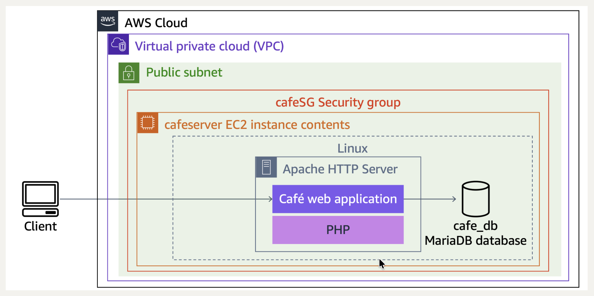
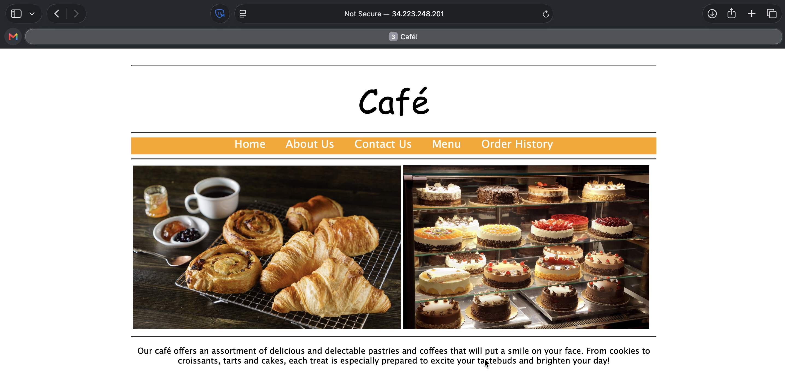
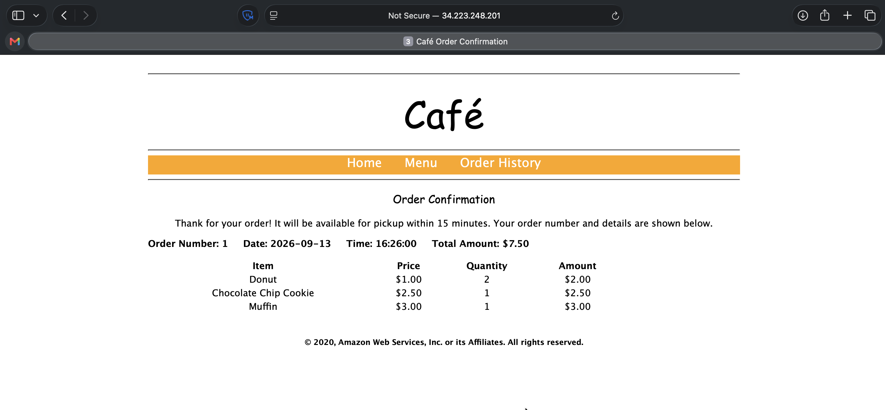

# Troubleshooting the Creation of an EC2 Instance

## Activity overview

In this activity, I use the AWS Command Line Interface (AWS CLI) to launch Amazon Elastic Compute Cloud (Amazon EC2) instances.

When creating the instance, I reference a user data script to configure it with an Apache web server, a MariaDB relational database (a fork of the MySQL relational database), and PHP. Together, these software packages installed on a single machine are often referred to as a ***LAMP*** stack (**L**inux, **A**pache web server, **M**ySQL, and **P**HP) — a common way to create a website with a database backend on a single machine.

The same user data file deploys website files and runs database configuration scripts on the instance, resulting in an instance that hosts the Café Web Application.

<p align="center">
  
</p>

*The following diagram shows the architecture I create in this activity.*

## Task 1: Connecting to the CLI Host instance
In this task, I use EC2 Instance Connect to connect to the CLI Host EC2 instance that was created when the lab was provisioned. I use this instance to run CLI commands.

1. On the Amazon EC2 Management Console, I choose **Instances**.
2. From the list of instances, I select the `CLI Host` instance.
3. Above the list of instances, I choose **Connect**.
4. On the **EC2 Instance Connect** tab, I choose **Connect**.

## Task 2: Configuring the AWS CLI
In this task, I configure the AWS CLI using the configuration parameters made available to me when the lab was provisioned. After configuration, I run CLI commands to interact with AWS services.

> [!NOTE]
> Amazon Linux Amazon Machine Images (AMIs) already have the AWS CLI preinstalled.

1. In the SSH session terminal window, I run the `aws configure` command to set up the AWS CLI profile with credentials.
2. At the prompt, I configure the following:
   * **AWS Access Key ID:** `<AWS Access Key ID>`
   * **AWS Secret Access Key:** `<AWS Secret Access Key>`
   * **Default region name:** Enter `us-west-2`
   * **Default output format:** Enter `json`

#### Terminal output
```bash
PASTE_FROM_LAB
```

## Task 3: Creating an EC2 instance using the AWS CLI
In this task, I observe and run a shell script provided to me to create an EC2 LAMP instance using AWS CLI commands. The script intentionally contains issues, and my challenge is to find and resolve them. As I resolve each issue, I rerun the script to check that it has been fixed.

### Task 3.1: Observe the script details
First, I create a backup of the script I will edit in a later step.

1. To change to the directory where the script file exists and create a backup of it, I run the following commands:

```bash
cd ~/sysops-activity-files/starters

cp create-lamp-instance-v2.sh create-lamp-instance.backup
```

2. I open the `create-lamp-instance-v2.sh` script file, using the `view` command in read-only mode using the VI command line text editor.

3. I analyze the contents of the script, displaying line numbers by typing `:set number` and pressing Enter:
   * **Line 1:** This is a bash file, so the first line contains `#!/bin/bash`.
   * **Lines 7–11:** The instance size is set to `t3.small`, which should be large enough to run the database and web server.
   * **Lines 16–29:** The script invokes the AWS CLI `describe-regions` command to get a list of all AWS Regions. In each Region, it queries for an existing VPC named `Cafe VPC`. After finding the VPC, it captures the VPC ID and Region, and breaks out of the `while` loop — this is the VPC where the LAMP instance for the Café Web Application should be deployed.
   * **Lines 31–55:** The script invokes AWS CLI commands to look up the subnet ID, key pair name, and AMI ID values needed to create the EC2 instance. I notice line 32 ends with a backslash (`\`) character, which wraps a single command onto another line — a technique used throughout the script to improve readability.
   * **Lines 57–122:** The script cleans up the AWS account for situations where it has already run and is being run again. It checks whether an instance named `cafeserver` already exists, and whether a security group including `cafeSG` in its name already exists. If either resource is found, the script prompts me to delete them.
   * **Lines 124–152:** The script creates a new security group with ports 22 and 80 open.
   * **Lines 154–168:** The script creates a new EC2 instance, using values set in lines 8 and 10 along with values collected in lines 16–57. I notice a reference to the user data file, which I review in a later step. The entire call to create the instance is captured in a variable named `instanceDetails`, whose contents are echoed to the terminal on line 177 and formatted for easier viewing using a Python JSON tool.
   * **Lines 179–188:** The `instanceId` value is parsed out of the `instanceDetails` variable. A `while` loop then checks every 10 seconds to see if a public IP address has been assigned to the instance, and once the check succeeds, the public IP address is written to the terminal.

4. I exit the VI text editor by entering `:q!`.
5. To display the contents of the user data script, I run the following command:

```bash
cat create-lamp-instance-userdata-v2.txt
```

#### Terminal output
```bash
PLACEHOLDER
```

*I notice how the user data script runs a series of commands on the instance after it is launched. These commands install a web server, PHP, and a database server.*

### Task 3.2: Try to run the script

Now that I have an idea of what the shell script is designed to do, I try to run it using `./create-lamp-instance-v2.sh` :

#### Terminal output
```bash
PLACEHOLDER
```

*The script fails and exits without successfully completing. This behavior is expected.*

### Task 3.3: Troubleshoot issues

#### Issue #1
The terminal output displays the following message: "An error occurred (InvalidAMIID.NotFound) when calling the RunInstances operation: The image id '[ami-xxxxxxxxxx]' does not exist".

After I fix the issue, the `run-instances` command succeeds, and a public IPv4 address is assigned to the new instance.

#### Terminal output
```bash
PLACEHOLDER
```

#### Try to connect to the webpage
In a browser, I navigate to the Public IPv4 address of the new instance I created: `http://<public-ip>`

The attempt fails. There must be another issue, so I need to resolve Issue #2.

#### Issue #2
The `run-instances` command succeeded, and a public IP address was assigned to the new instance. However, I cannot load the test webpage.

1. I connect to the new LAMP instance using EC2 Instance Connect, the same method I used to connect to the CLI Host instance.
2. In the terminal window for the CLI Host instance, I run the following command to install `nmap`, a port scanning tool:

```bash
sudo yum install -y nmap
```

3. Next, I run the following command with the actual public IPv4 address of my LAMP instance:

```bash
nmap -Pn <public-ip>
```

*The output from this command shows which ports are accessible.*

#### Terminal output
```bash
PLACEHOLDER
```

#### Test whether the user data script ran

4. After I identify and resolve the issue, in a browser, I navigate to the following address with the Public IPv4 address of the new instance I created: `http://<public-ip>`

<p align="center">
  
</p>

*If I resolved Issue #2 successfully, I see the following message: "**Hello From Your Web Server!"***

5. Lastly, I check the log file to see whether the user data script ran as expected. In the terminal window for the LAMP instance, I run the following command to view the log file entries as they are written:

```bash
sudo tail -f /var/log/cloud-init-output.log
```

#### Terminal output
```bash
PLACEHOLDER
```

On an Amazon Linux instance, the `cloud-init` service runs the commands in the user data file. I observe the log file entries, noting the messages related to the installation of MariaDB and PHP — there are no error messages. I also see messages related to the Café Web Application files that were downloaded and extracted to this instance, such as "Create Database script completed".

## Task 4: Verifying the functionality of the website

1. I verify that the website is deployed. In a browser, I navigate to the following address: `http://<public-ip>/cafe`

<p align="center">
  
</p>

*If successful, I see the home page for the café website.*

2. I now test whether I can order items through the website.
   * I choose the **Menu** link, and a new page loads at `http://<public-ip>/cafe/menu.php`.
   * I choose a few desserts to order, then choose **Submit Order**. The **Order Confirmation** page displays with line-item details.
   * I place another order for different items, then choose the **Order History** page, and confirm that the details of both orders were captured.

<p align="center">
  
</p>

*The order details are being captured and stored in the database running on the LAMP instance I launched.*

## Conclusion

After completing this activity, I am able to:
* Launch an EC2 instance using the AWS CLI
* Troubleshoot AWS CLI commands and Amazon EC2 service settings using basic troubleshooting tips and the open-source `nmap` utility

## Additional resources

* [Launching, Listing, and Terminating Amazon EC2 Instances](https://docs.aws.amazon.com/cli/latest/userguide/cli-services-ec2-instances.html)
* [Connect to Your Linux Instance Using EC2 Instance Connect](https://docs.aws.amazon.com/AWSEC2/latest/UserGuide/Connect-using-EC2-Instance-Connect.html)
* [User Data and Shell Scripts](https://docs.aws.amazon.com/AWSEC2/latest/UserGuide/user-data.html)
