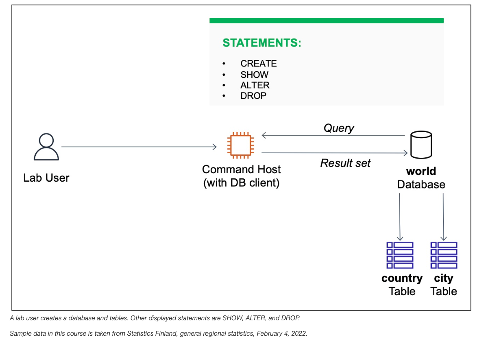

# Database Table Operations
In this lab I will practice creating and dropping (deleting) databases and tables previopusly configured by a database operations team.

<p align="center">
  
</p>

## Task 1: Connect to the Command Host

In this task, I connect to an EC2 instance configured with a database client. The client is used to run structured query language (SQL) queries against a relational database. This instance is referred to as the Command Host.

1. In the AWS Management Console, I choose the **Services** menu, choose **Compute**, and then choose **EC2**.
2. In the left navigation menu, I choose **Instances**, select the check box next to the instance labelled **Command Host**, and choose **Connect**.
>[!Note]
> If I do not see the Command Host, the lab is probably still being provisioned, or I may be using another Region.
3. For **Connect to instance**, I choose the **Session Manager** tab and choose **Connect** to open a terminal window.
4. To configure the terminal to access all required tools and resources, I run the following commands:

```bash
sudo su
cd /home/ec2-user/
```
5. To connect to the relational database instance, I run the following command in the terminal (a password was configured when the database was installed):
```bash
mysql -u root --password='re:St@rt!9'
```
Output:
```bash
sh-4.2$ sudo su
[root@ip-10-1-11-100 bin]# cd /home/ec2-user/
[root@ip-10-1-11-100 ec2-user]# mysql -u root --password='re:St@rt!9'
Welcome to the MariaDB monitor.  Commands end with ; or \g.
Your MariaDB connection id is 4
Server version: 10.5.29-MariaDB MariaDB Server

Copyright (c) 2000, 2018, Oracle, MariaDB Corporation Ab and others.

Type 'help;' or '\h' for help. Type '\c' to clear the current input statement.

MariaDB [(none)]>
```

## Task 2: Create a database and a table
In this task, I create a database named `world` and a table named `country`. I then alter the `country` table.
1. To show the existing databases, I run the following query, to determine the available databases and ensure I am working with the correct database instance:
```bash
MariaDB [(none)]> SHOW DATABASES;
+--------------------+
| Database           |
+--------------------+
| information_schema |
| mysql              |
| performance_schema |
| world              |
+--------------------+
4 rows in set (0.002 sec)
```
2. To create a new database named `world`, I run the following command, then verify it was created by running `SHOW DATABASES;` again:
```bash
MariaDB [(none)]> CREATE DATABASE world;
Query OK, 1 row affected (0.000 sec)

MariaDB [(none)]> SHOW DATABASES;
+--------------------+
| Database           |
+--------------------+
| information_schema |
| mysql              |
| performance_schema |
| world              |
+--------------------+
4 rows in set (0.002 sec)
```
3. To store data in a database, the database needs to contain one or more tables, and in an SQL database, a table needs a well-defined structure known as a table schema. To create a table named `country`, I run the following command:
```bash
MariaDB [(none)]> CREATE TABLE world.country (
    ->   `Code` CHAR(3) NOT NULL DEFAULT '',
    ->   `Name` CHAR(52) NOT NULL DEFAULT '',
    ->   `Conitinent` enum('Asia','Europe','North America','Africa','Oceania','Antarctica','South  America') NOT NULL DEFAULT 'Asia',
    ->   `Region` CHAR(26) NOT NULL DEFAULT '',
    ->   `SurfaceArea` FLOAT(10,2) NOT NULL DEFAULT '0.00',
    ->   `IndepYear` SMALLINT(6) DEFAULT NULL,
    ->   `Population` INT(11) NOT NULL DEFAULT '0',
    ->   `LifeExpectancy` FLOAT(3,1) DEFAULT NULL,
    ->   `GNP` FLOAT(10,2) DEFAULT NULL,
    ->   `GNPOld` FLOAT(10,2) DEFAULT NULL,
    ->   `LocalName` CHAR(45) NOT NULL DEFAULT '',
    ->   `GovernmentForm` CHAR(45) NOT NULL DEFAULT '',
    ->   `HeadOfState` CHAR(60) DEFAULT NULL,
    ->   `Capital` INT(11) DEFAULT NULL,
    ->   `Code2` CHAR(2) NOT NULL DEFAULT '',
    ->   PRIMARY KEY (`Code`)
    -> );
Query OK, 0 rows affected (0.012 sec)
```
4. To verify that the `country` table was created, I use the `USE` command to specify which database to run a query against, then run `SHOW TABLES;` to list the tables in the database:
```bash
MariaDB [(none)]> USE world;
Reading table information for completion of table and column names
You can turn off this feature to get a quicker startup with -A

Database changed
MariaDB [world]> SHOW TABLES;
+-----------------+
| Tables_in_world |
+-----------------+
| country         |
+-----------------+
1 row in set (0.000 sec)
```
5. I use the `SHOW COLUMNS` query to list all the columns and their properties in the `country` table:
```bash
MariaDB [world]> SHOW COLUMNS FROM world.country;
+----------------+----------------------------------------------------------------------------------------+------+-----+---------+-------+
| Field          | Type  | Null | Key | Default | Extra |
+----------------+----------------------------------------------------------------------------------------+------+-----+---------+-------+
| Code           | char(3)  | NO   | PRI |         |       |
| Name           | char(52)  | NO   |     |         |       |
| Conitinent     | enum('Asia','Europe','North America','Africa','Oceania','Antarctica','South  America') | NO   |     | Asia    |       |
| Region         | char(26)  | NO   |     |         |       |
| SurfaceArea    | float(10,2)  | NO   |     | 0.00    |       |
| IndepYear      | smallint(6)  | YES  |     | NULL    |       |
| Population     | int(11)  | NO   |     | 0       |       |
| LifeExpectancy | float(3,1)  | YES  |     | NULL    |       |
| GNP            | float(10,2)  | YES  |     | NULL    |       |
| GNPOld         | float(10,2)  | YES  |     | NULL    |       |
| LocalName      | char(45)  | NO   |     |         |       |
| GovernmentForm | char(45)  | NO   |     |         |       |
| HeadOfState    | char(60)  | YES  |     | NULL    |       |
| Capital        | int(11)  | YES  |     | NULL    |       |
| Code2          | char(2)  | NO   |     |         |       |
+----------------+----------------------------------------------------------------------------------------+------+-----+---------+-------+
15 rows in set (0.001 sec)
```
>[!Note]
>I notice that the Continent column is spelled incorrectly as `Conitinent`.

6. The `ALTER TABLE` command is used to alter the table's schema. To fix the incorrectly spelled `Continent` column, I run the following command, then verify the correction by running `SHOW COLUMNS` again:
```bash
MariaDB [world]> ALTER TABLE world.country RENAME COLUMN Conitinent TO Continent;
Query OK, 0 rows affected (0.005 sec)
Records: 0  Duplicates: 0  Warnings: 0

MariaDB [world]> SHOW COLUMNS FROM world.country;
+----------------+----------------------------------------------------------------------------------------+------+-----+---------+-------+
| Field          | Type  | Null | Key | Default | Extra |
+----------------+----------------------------------------------------------------------------------------+------+-----+---------+-------+
| Code           | char(3)  | NO   | PRI |         |       |
| Name           | char(52)  | NO   |     |         |       |
| Continent      | enum('Asia','Europe','North America','Africa','Oceania','Antarctica','South  America') | NO   |     | Asia    |       |
| Region         | char(26)  | NO   |     |         |       |
| SurfaceArea    | float(10,2)  | NO   |     | 0.00    |       |
| IndepYear      | smallint(6)  | YES  |     | NULL    |       |
| Population     | int(11)  | NO   |     | 0       |       |
| LifeExpectancy | float(3,1)  | YES  |     | NULL    |       |
| GNP            | float(10,2)  | YES  |     | NULL    |       |
| GNPOld         | float(10,2)  | YES  |     | NULL    |       |
| LocalName      | char(45)  | NO   |     |         |       |
| GovernmentForm | char(45)  | NO   |     |         |       |
| HeadOfState    | char(60)  | YES  |     | NULL    |       |
| Capital        | int(11)  | YES  |     | NULL    |       |
| Code2          | char(2)  | NO   |     |         |       |
+----------------+----------------------------------------------------------------------------------------+------+-----+---------+-------+
15 rows in set (0.001 sec)
```

### Challenge 1
I create a table named `city` and add two columns named `Name` and `Region`. Both columns use the `CHAR` data type:
```bash
MariaDB [world]> CREATE TABLE world.city (`Name` CHAR(52), `Region` CHAR(26));
Query OK, 0 rows affected (0.008 sec)
```
## Task 3: Delete a database and tables
In this task, I delete the `world` database and the `country` table.

1. The `DROP TABLE` command is used to delete (drop) a table in a database, and once a table has been dropped, it cannot be recovered unless a backup is available. To drop the `city` table, I run the following command:
```bash
MariaDB [world]> DROP TABLE world.city;
Query OK, 0 rows affected (0.005 sec)
```

### Challenge 2

I write a query to drop the `country` table:
```bash
MariaDB [world]> DROP TABLE world.country;
Query OK, 0 rows affected (0.006 sec)
```
2. To verify that both tables have been dropped, I run the following query:
```bash
MariaDB [world]> SHOW TABLES;
Empty set (0.000 sec)
```
3. To drop the `world` database, I run the following command:
```bash
MariaDB [world]> DROP DATABASE world;
Query OK, 0 rows affected (0.003 sec)
```
4. To verify that the `world` database has been deleted, I run the following query:
```bash
MariaDB [(none)]> SHOW DATABASES;
+--------------------+
| Database           |
+--------------------+
| information_schema |
| mysql              |
| performance_schema |
+--------------------+
3 rows in set (0.000 sec)
```

## Conclusion
This lab demonstrates how to use some common database and table operations.

After completing this lab, I have:
- Used the **CREATE** statement to create databases and tables
- Used the **SHOW** statement to view available databases and tables
- Used the **ALTER** statement to alter the structure of a table
- Used the **DROP** statement to delete databases and tables

## MySQL command-line client
The MySQL command-line client is an SQL shell that you can use to interact with database engines.

| Switch             | Description                                                     |
|--------------------|-----------------------------------------------------------------|
| -u or --user       | The MySQL user name used to connect to a database instance      |
| -p or --password   | The MySQL password used to connect to a database instance       |

Example: Run `mysql -u root --password='<psswd>` to connect to the relational database instance. A password was configured when the database was installed.

## Additional resources
- Country, city, and language data, Statistics Finland: The material was downloaded from Statistics Finland's interface 
service on February 4, 2022, with the [license CC BY 4.0](https://creativecommons.org/licenses/by/4.0/deed.en). 
The original data source is available from [Statistics Finland](https://stat.fi/tup/kvportaali/index_en.html).

- For more information about SQL table operation commands, see the following resources:

  - [CREATE database](https://mariadb.com/kb/en/create-database/)
  - [CREATE table](https://mariadb.com/kb/en/create-table/)
  - [SHOW commands](https://mariadb.com/kb/en/show/)
  - [ALTER table](https://mariadb.com/kb/en/alter-table/)
  - [DROP database](https://mariadb.com/kb/en/drop-database/)
  - [DROP table](https://mariadb.com/kb/en/drop-table/)
