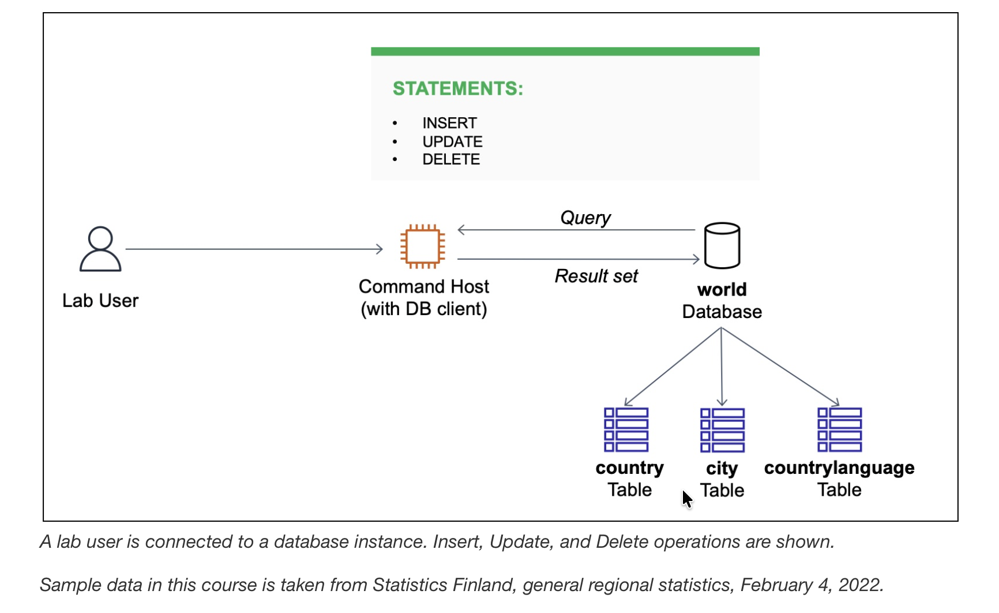

# Insert, Update, and Delete Data in a Database

## Scenario

The database operations team has created a relational database called `world` containing three tables: `city`, `country`, and `countrylanguage`. I have to validate the configuration of the database by running `INSERT`, `UPDATE`, and `DELETE` statements on the `country` table.

At the end, my architecture looks like the following example:
<p align="center">
  
</p>

## Task 1: Connect to a database

In this task, I connect to an instance containing a database client, which is used to connect to a database. This instance is referred to as the Command Host.

1. In the AWS Management Console, I choose the **Services** menu, choose **Compute**, and then choose **EC2**.
2. In the left navigation menu, I choose **Instances**, select the check box next to the instance labelled **Command Host**, and choose **Connect**.
>[!Note]
> If I do not see the Command Host, the lab is probably still being provisioned, or I may be using another Region.
3. For **Connect to instance**, I choose the **Session Manager** tab and choose **Connect** to open a terminal window.
4. To configure the terminal to access all required tools and resources, I run the following commands:
```bash
sudo su
cd /home/ec2-user/
```
5. To connect to the relational database instance, I run the following command in the terminal (a password was configured when the database was installed):
```bash
mysql -u root --password='re:St@rt!9'
```
Output:
```bash
sh-4.2$ sudo su
[root@ip-10-1-11-35 bin]# cd /home/ec2-user/
[root@ip-10-1-11-35 ec2-user]# mysql -u root --password='re:St@rt!9'
Welcome to the MariaDB monitor.  Commands end with ; or \g.
Your MariaDB connection id is 14
Server version: 10.5.29-MariaDB MariaDB Server

Copyright (c) 2000, 2018, Oracle, MariaDB Corporation Ab and others.

Type 'help;' or '\h' for help. Type '\c' to clear the current input statement.
```
6. To show the existing databases, I enter the following command in the terminal and make a note of the currently available databases:
```bash
MariaDB [(none)]> SHOW DATABASES;
+--------------------+
| Database           |
+--------------------+
| information_schema |
| mysql              |
| performance_schema |
| world              |
+--------------------+
4 rows in set (0.002 sec)
```

## Task 2: Insert data into a table
In this task, I insert sample data into the `country` table.

1. To verify that the `country` table exists, I run the following command. The `SELECT` statement is used to identify the columns that should be included in the result set — the `*` denotes all columns — and the `FROM` clause specifies the database and table being queried:
```bash
MariaDB [(none)]> SELECT * FROM world.country;
Empty set (0.001 sec)
```
2. To insert rows into the `country` table, I run the following commands. The values in the `VALUES` clause need to be in the same order as defined by the table schema:
```bash
MariaDB [(none)]> INSERT INTO world.country VALUES ('IRL','Ireland','Europe','British Islands',70273.00,1921,3775100,76.8,75921.00,73132.00,'Ireland/ire','Republic',1447,'IE');
Query OK, 1 row affected (0.003 sec)

MariaDB [(none)]>
MariaDB [(none)]> INSERT INTO world.country VALUES ('AUS','Australia','Oceania','Australia and New Zealand',7741220.00,1901,18886000,79.8,351182.00,392911.00,'Australia','Constitutional Monarchy, Federation',135,'AU');
Query OK, 1 row affected (0.002 sec)
```
3. To verify that two rows were successfully inserted into the `country` table, I run the following query:
```bash
MariaDB [(none)]> SELECT * FROM world.country WHERE Code IN ('IRL', 'AUS');
+------+-----------+-----------+---------------------------+-------------+-----------+------------+----------------+-----------+-----------+-------------+-------------------------------------+---------+-------+
| Code | Name      | Continent | Region                    | SurfaceArea | IndepYear | Population | LifeExpectancy | GNP       | GNPOld    | LocalName   | GovernmentForm                      | Capital | Code2 |
+------+-----------+-----------+---------------------------+-------------+-----------+------------+----------------+-----------+-----------+-------------+-------------------------------------+---------+-------+
| AUS  | Australia | Oceania   | Australia and New Zealand |  7741220.00 |      1901 |   18886000 | 79.8 | 351182.00 | 392911.00 | Australia   | Constitutional Monarchy, Federation |     135 | AU    |
| IRL  | Ireland   | Europe    | British Islands           |    70273.00 |      1921 |    3775100 | 76.8 |  75921.00 |  73132.00 | Ireland/ire | Republic                            |    1447 | IE    |
+------+-----------+-----------+---------------------------+-------------+-----------+------------+----------------+-----------+-----------+-------------+-------------------------------------+---------+-------+
2 rows in set (0.000 sec)
```

## Task 3: Update rows in a table
In this task, I update both rows in the `country` table using an `UPDATE` statement.

1. To set the value in the `Population` column to 0 for both rows in the `country` table, I run the following `UPDATE` statement, then verify the update with a `SELECT` query. All rows are updated because the `UPDATE` statement does not include a `WHERE` condition — a `WHERE` clause uses conditions to filter rows returned by a query, and is introduced in the next lab:
```bash
MariaDB [(none)]> UPDATE world.country SET Population = 0;
Query OK, 2 rows affected (0.001 sec)
Rows matched: 2  Changed: 2  Warnings: 0

MariaDB [(none)]> SELECT * FROM world.country;
+------+-----------+-----------+---------------------------+-------------+-----------+------------+----------------+-----------+-----------+-------------+-------------------------------------+---------+-------+
| Code | Name      | Continent | Region                    | SurfaceArea | IndepYear | Population | LifeExpectancy | GNP       | GNPOld    | LocalName   | GovernmentForm                      | Capital | Code2 |
+------+-----------+-----------+---------------------------+-------------+-----------+------------+----------------+-----------+-----------+-------------+-------------------------------------+---------+-------+
| AUS  | Australia | Oceania   | Australia and New Zealand |  7741220.00 |      1901 |          0 | 79.8 | 351182.00 | 392911.00 | Australia   | Constitutional Monarchy, Federation |     135 | AU    |
| IRL  | Ireland   | Europe    | British Islands           |    70273.00 |      1921 |          0 | 76.8 |  75921.00 |  73132.00 | Ireland/ire | Republic                            |    1447 | IE    |
+------+-----------+-----------+---------------------------+-------------+-----------+------------+----------------+-----------+-----------+-------------+-------------------------------------+---------+-------+
2 rows in set (0.000 sec)
```
2. To update the `Population` and `SurfaceArea` columns for all rows in the `country` table, I run the following `UPDATE` statement, then verify the update with a `SELECT` query:
```bash
MariaDB [(none)]> UPDATE world.country SET Population = 100, SurfaceArea = 100;
Query OK, 2 rows affected (0.001 sec)
Rows matched: 2  Changed: 2  Warnings: 0

MariaDB [(none)]> SELECT * FROM world.country;
+------+-----------+-----------+---------------------------+-------------+-----------+------------+----------------+-----------+-----------+-------------+-------------------------------------+---------+-------+
| Code | Name      | Continent | Region                    | SurfaceArea | IndepYear | Population | LifeExpectancy | GNP       | GNPOld    | LocalName   | GovernmentForm                      | Capital | Code2 |
+------+-----------+-----------+---------------------------+-------------+-----------+------------+----------------+-----------+-----------+-------------+-------------------------------------+---------+-------+
| AUS  | Australia | Oceania   | Australia and New Zealand |      100.00 |      1901 |        100 | 79.8 | 351182.00 | 392911.00 | Australia   | Constitutional Monarchy, Federation |     135 | AU    |
| IRL  | Ireland   | Europe    | British Islands           |      100.00 |      1921 |        100 | 76.8 |  75921.00 |  73132.00 | Ireland/ire | Republic                            |    1447 | IE    |
+------+-----------+-----------+---------------------------+-------------+-----------+------------+----------------+-----------+-----------+-------------+-------------------------------------+---------+-------+
2 rows in set (0.000 sec)
```

## Task 4: Delete rows from a table
In this task, I delete rows in the `country` table using a `DELETE` statement.
>[!Caution]
> I exercise caution when using data manipulation statements such as `UPDATE` and `DELETE` because these changes may not be reversible.

1. To delete ALL rows from the `country` table, I run the following commands. Because the `DELETE` statement does not include a `WHERE` condition, all rows are deleted:
```bash
MariaDB [(none)]> SET FOREIGN_KEY_CHECKS = 0;
Query OK, 0 rows affected (0.000 sec)

MariaDB [(none)]> DELETE FROM world.country;
Query OK, 2 rows affected (0.001 sec)
```
2. To verify that all rows have been deleted from the `country` table, I run the following command:
```bash
MariaDB [(none)]> SELECT * FROM world.country;
Empty set (0.000 sec)
```

## Task 5: Import data using an SQL file
In this task, I import sample data into the `country` table using an SQL file.

1. To exit the MySQL terminal, I run the following command:
```bash
MariaDB [(none)]> QUIT;
Bye
```
2. To verify that the `world.sql` file has been downloaded, I run the following command:
```bash
[root@ip-10-1-11-35 ec2-user]# ls /home/ec2-user/world.sql
/home/ec2-user/world.sql
```
3. Since it is time-consuming to insert individual rows into a table, I can instead use a SQL script file containing a group of SQL statements to quickly load data into a database. To load rows into the `country` table, I run the following command. This database file adds two additional tables and inserts data into all three tables:
```bash
[root@ip-10-1-11-35 ec2-user]# mysql -u root --password='re:St@rt!9' < /home/ec2-user/world.sql
```
4. To reconnect to the database, I run the following command:
```bash
[root@ip-10-1-11-35 ec2-user]# mysql -u root --password='re:St@rt!9'
Welcome to the MariaDB monitor.  Commands end with ; or \g.
Your MariaDB connection id is 16
Server version: 10.5.29-MariaDB MariaDB Server

Copyright (c) 2000, 2018, Oracle, MariaDB Corporation Ab and others.

Type 'help;' or '\h' for help. Type '\c' to clear the current input statement.
```
5. To verify that the script ran successfully, I run the following commands and observe that there are three tables named `city`, `country`, and `countrylanguage`:
```bash
MariaDB [(none)]> USE world;
Reading table information for completion of table and column names
You can turn off this feature to get a quicker startup with -A

Database changed

MariaDB [world]>
MariaDB [world]> SHOW TABLES;
+-----------------+
| Tables_in_world |
+-----------------+
| city            |
| country         |
| countrylanguage |
+-----------------+
3 rows in set (0.000 sec)
```
6. To verify that the rows were loaded successfully, I run the following command and notice that there are more entries in the `country` table:
```bash
MariaDB [world]> SELECT * FROM country;
```
7. Similarly, I use the `SELECT` statement to query the `city` and `countrylanguage` tables that were created when I imported the backup file.
```bash
```

## MySQL command-line client
The MySQL command-line client is an SQL shell that you can use to interact with database engines.

| Switch             | Description                                                     |
|--------------------|-----------------------------------------------------------------|
| -u or --user       | The MySQL user name used to connect to a database instance      |
| -p or --password   | The MySQL password used to connect to a database instance       |

## Conclusion
Through this lab I have now successfully:
* Inserted rows into a table
* Updated rows in a table
* Deleted rows from a table
* Imported rows from a database backup file

## Additional resources
- Country, city, and language data, Statistics Finland: The material was downloaded from Statistics Finland's interface service 
on February 4, 2022, with the [license CC BY 4.0](https://creativecommons.org/licenses/by/4.0/deed.en).
The original data source is available from [Statistics Finland](https://tilastokeskus.fi/tup/kvportaali/index_en.html).

- For more information about database functions and operators, see the following resources:

  - [INSERT statement](https://mariadb.com/kb/en/insert/)
  - [UPDATE statement](https://mariadb.com/kb/en/update/)
  - [DELETE statement](https://mariadb.com/kb/en/delete/)
