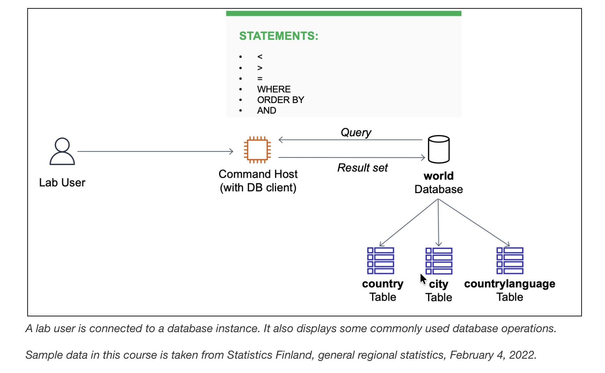

# Selecting Data from a Database

## Scenario
The database operations team has created a relational database named `world` containing three tables: `city`, `country`, and `countrylanguage`. Based on specific use cases defined in the lab exercise, I write a few queries using database operators and the `SELECT` statement.

At the end, my architecture looks like the following example:
<p align="center">
  
</p>

## Task 1: Connect to the Command Host

In this task, I connect to an instance containing a database client, which is used to connect to a database. This instance is referred to as the Command Host.

1. In the AWS Management Console, I choose the **Services** menu, choose **Compute**, and then choose **EC2**.
2. In the left navigation menu, I choose **Instances**, select the check box next to the instance labelled **Command Host**, and choose **Connect**.
>[!Note]
> If I do not see the Command Host, the lab is probably still being provisioned, or I may be using another Region.
3. For **Connect to instance**, I choose the **Session Manager** tab and choose **Connect** to open a terminal window.
4. To configure the terminal to access all required tools and resources, I run the following commands:
```bash
sudo su
cd /home/ec2-user/
```
5. To connect to the relational database instance, I run the following command in the terminal (a password was configured when the database was installed):
```bash
mysql -u root --password='re:St@rt!9'
```
Output:
```bash
sh-4.2$ sudo su
[root@ip-10-1-11-227 bin]# cd /home/ec2-user/
[root@ip-10-1-11-227 ec2-user]# mysql -u root --password='re:St@rt!9'
Welcome to the MariaDB monitor.  Commands end with ; or \g.
Your MariaDB connection id is 5
Server version: 10.5.29-MariaDB MariaDB Server

Copyright (c) 2000, 2018, Oracle, MariaDB Corporation Ab and others.

Type 'help;' or '\h' for help. Type '\c' to clear the current input statement.
```
## Task 2: Query the world database

In this task, I query the `world` database using various `SELECT` statements and database operators.

1. To show the existing databases, I enter the following command in the terminal and verify that a database named `world` is available:
```bash
MariaDB [(none)]> SHOW DATABASES;
+--------------------+
| Database           |
+--------------------+
| information_schema |
| mysql              |
| performance_schema |
| world              |
+--------------------+
4 rows in set (0.011 sec)
```
2. To list all rows and columns in the `country` table, I run the following query:
```bash
MariaDB [(none)]> SELECT * FROM world.country;
```
3. To query the number of rows in a table, I can use the `COUNT()` function in a `SELECT` statement — `COUNT(*)` counts all rows, while including a column name as a parameter (e.g. `COUNT(Population)`) counts the rows that have a value in that specific column. To list the number of rows in the `country` table, I run the following query:
```bash
MariaDB [(none)]> SELECT COUNT(*) FROM world.country;
+----------+
| COUNT(*) |
+----------+
|      239 |
+----------+
1 row in set (0.002 sec)
```
4. To understand the table schema, I list all columns in the `country` table by running the following query:
```bash
MariaDB [(none)]> SHOW COLUMNS FROM world.country;
+----------------+---------------------------------------------------------------------------------------+------+-----+---------+-------+
| Field          | Type    | Null | Key | Default | Extra |
+----------------+---------------------------------------------------------------------------------------+------+-----+---------+-------+
| Code           | char(3)    | NO   | PRI |         |       |
| Name           | char(52)    | NO   |     |         |       |
| Continent      | enum('Asia','Europe','North America','Africa','Oceania','Antarctica','South America') | NO   |     | Asia    |       |
| Region         | char(26)    | NO   |     |         |       |
| SurfaceArea    | decimal(10,2)    | NO   |     | 0.00    |       |
| IndepYear      | smallint(6)    | YES  |     | NULL    |       |
| Population     | int(11)    | NO   |     | 0       |       |
| LifeExpectancy | decimal(3,1)    | YES  |     | NULL    |       |
| GNP            | decimal(10,2)    | YES  |     | NULL    |       |
| GNPOld         | decimal(10,2)    | YES  |     | NULL    |       |
| LocalName      | char(45)    | NO   |     |         |       |
| GovernmentForm | char(45)    | NO   |     |         |       |
| Capital        | int(11)    | YES  |     | NULL    |       |
| Code2          | char(2)    | NO   |     |         |       |
+----------------+---------------------------------------------------------------------------------------+------+-----+---------+-------+
14 rows in set (0.002 sec)
```
5. To query specific columns in the `world` table, I run the following query to return a result set that includes the `Name`, `Capital`, `Region`, `SurfaceArea`, and `Population` columns:
```bash
MariaDB [(none)]> SELECT Name, Capital, Region, SurfaceArea, Population FROM world.country;
```
6. Since database column names are sometimes not user friendly, I can use the `AS` option to add a more descriptive column name to the query output. I run the following query, which displays the `SurfaceArea` column as `Surface Area`:
```bash
MariaDB [(none)]> SELECT Name, Capital, Region, SurfaceArea AS "Surface Area", Population FROM world.country;
```
7. Since ordered result sets are easier to view and work with, I can use the `ORDER BY` option to order the output based on a column. In this example, I order the output based on population, which orders the data in ascending order by default:
```bash
MariaDB [(none)]> SELECT Name, Capital, Region, SurfaceArea AS "Surface Area", Population FROM world.country ORDER BY Population;
+----------------------------------------------+---------+---------------------------+--------------+------------+
| Name                                         | Capital | Region                    | Surface Area | Population |
+----------------------------------------------+---------+---------------------------+--------------+------------+
| French Southern territories                  |    NULL | Antarctica                |      7780.00 |          0 |
| Heard Island and McDonald Islands            |    NULL | Antarctica                |       359.00 |          0 |
| United States Minor Outlying Islands         |    NULL | Micronesia/Caribbean      |        16.00 |          0 |

...
239 rows in set (0.001 sec)
```
8. To order the data in descending order instead, I use the `DESC` option with `ORDER BY`:
```bash
MariaDB [(none)]> SELECT Name, Capital, Region, SurfaceArea AS "Surface Area", Population FROM world.country ORDER BY Population DESC;
+----------------------------------------------+---------+---------------------------+--------------+------------+
| Name                                         | Capital | Region                    | Surface Area | Population |
+----------------------------------------------+---------+---------------------------+--------------+------------+
| China                                        |    1891 | Eastern Asia              |   9572900.00 | 1277558000 |
| India                                        |    1109 | Southern and Central Asia |   3287263.00 | 1013662000 |
| United States                                |    3813 | North America             |   9363520.00 |  278357000 |
```
9. I can add conditions to `SELECT` statements by using the `WHERE` clause. For example, to list all rows with a population greater than 50,000,000, I run the following query, using the `>` comparison operator (similarly, other comparison operators can be used to compare values):
```bash
MariaDB [(none)]> SELECT Name, Capital, Region, SurfaceArea AS "Surface Area", Population FROM world.country WHERE Population >50000000 ORDER BY Population DESC;
+---------------------------------------+---------+---------------------------+--------------+------------+
| Name                                  | Capital | Region                    | Surface Area | Population |
+---------------------------------------+---------+---------------------------+--------------+------------+
| China                                 |    1891 | Eastern Asia              |   9572900.00 | 1277558000 |
| India                                 |    1109 | Southern and Central Asia |   3287263.00 | 1013662000 |
| United States                         |    3813 | North America             |   9363520.00 |  278357000 |
| Indonesia                             |     939 | Southeast Asia            |   1904569.00 |  212107000 |
| Brazil                                |     211 | South America             |   8547403.00 |  170115000 |
| Pakistan                              |    2831 | Southern and Central Asia |    796095.00 |  156483000 |
| Russian Federation                    |    3580 | Eastern Europe            |  17075400.00 |  146934000 |
| Bangladesh                            |     150 | Southern and Central Asia |    143998.00 |  129155000 |
| Japan                                 |    1532 | Eastern Asia              |    377829.00 |  126714000 |
| Nigeria                               |    2754 | Western Africa            |    923768.00 |  111506000 |
| Mexico                                |    2515 | Central America           |   1958201.00 |   98881000 |
| Germany                               |    3068 | Western Europe            |    357022.00 |   82164700 |
| Vietnam                               |    3770 | Southeast Asia            |    331689.00 |   79832000 |
| Philippines                           |     766 | Southeast Asia            |    300000.00 |   75967000 |
| Egypt                                 |     608 | Northern Africa           |   1001449.00 |   68470000 |
| Iran                                  |    1380 | Southern and Central Asia |   1648195.00 |   67702000 |
| Turkey                                |    3358 | Middle East               |    774815.00 |   66591000 |
| Ethiopia                              |     756 | Eastern Africa            |   1104300.00 |   62565000 |
| Thailand                              |    3320 | Southeast Asia            |    513115.00 |   61399000 |
| United Kingdom                        |     456 | British Islands           |    242900.00 |   59623400 |
| France                                |    2974 | Western Europe            |    551500.00 |   59225700 |
| Italy                                 |    1464 | Southern Europe           |    301316.00 |   57680000 |
| Congo, The Democratic Republic of the |    2298 | Central Africa            |   2344858.00 |   51654000 |
| Ukraine                               |    3426 | Eastern Europe            |    603700.00 |   50456000 |
+---------------------------------------+---------+---------------------------+--------------+------------+
24 rows in set (0.003 sec)
```
10. I can also construct a `WHERE` clause using multiple conditions and operators. The following query uses two conditions — population greater than 50,000,000 and population less than 100,000,000 — combined with the `AND` operator to indicate that both conditions must be true:
```bash
MariaDB [(none)]> SELECT Name, Capital, Region, SurfaceArea AS "Surface Area", Population FROM world.country WHERE Population >50000000 AND Population < 100000000 ORDER BY Population DESC;
+---------------------------------------+---------+---------------------------+--------------+------------+
| Name                                  | Capital | Region                    | Surface Area | Population |
+---------------------------------------+---------+---------------------------+--------------+------------+
| Mexico                                |    2515 | Central America           |   1958201.00 |   98881000 |
| Germany                               |    3068 | Western Europe            |    357022.00 |   82164700 |
| Vietnam                               |    3770 | Southeast Asia            |    331689.00 |   79832000 |
| Philippines                           |     766 | Southeast Asia            |    300000.00 |   75967000 |
| Egypt                                 |     608 | Northern Africa           |   1001449.00 |   68470000 |
| Iran                                  |    1380 | Southern and Central Asia |   1648195.00 |   67702000 |
| Turkey                                |    3358 | Middle East               |    774815.00 |   66591000 |
| Ethiopia                              |     756 | Eastern Africa            |   1104300.00 |   62565000 |
| Thailand                              |    3320 | Southeast Asia            |    513115.00 |   61399000 |
| United Kingdom                        |     456 | British Islands           |    242900.00 |   59623400 |
| France                                |    2974 | Western Europe            |    551500.00 |   59225700 |
| Italy                                 |    1464 | Southern Europe           |    301316.00 |   57680000 |
| Congo, The Democratic Republic of the |    2298 | Central Africa            |   2344858.00 |   51654000 |
| Ukraine                               |    3426 | Eastern Europe            |    603700.00 |   50456000 |
+---------------------------------------+---------+---------------------------+--------------+------------+
14 rows in set (0.000 sec)
```

### Challenge
I query the `country` table to return a set of records based on the following question: Which country in Southern Europe has a population greater than 50,000,000?
```bash
MariaDB [(none)]> SELECT Name, Capital, Region, SurfaceArea AS "Surface Area", Population FROM world.country WHERE Population >50000000 AND Region = "Southern Europe";
+-------+---------+-----------------+--------------+------------+
| Name  | Capital | Region          | Surface Area | Population |
+-------+---------+-----------------+--------------+------------+
| Italy |    1464 | Southern Europe |    301316.00 |   57680000 |
+-------+---------+-----------------+--------------+------------+
1 row in set (0.001 sec)
```

## Conclusions
After completing this lab, I am now able to:
- I used the **SELECT** statement to query a database
- I used the **COUNT()** function
- I used the following operators to query a database:
  - **<**
  - **>**
  - **=**
  - **WHERE**
  - **ORDER BY**
  - **AND**

## Additional resources
- Country, city, and language data, Statistics Finland: The material was downloaded from Statistics Finland's interface service 
on February 4, 2022, with the [license CC BY 4.0](https://creativecommons.org/licenses/by/4.0/deed.en). 
The original data source is available from [Statistics Finland](https://tilastokeskus.fi/tup/kvportaali/index_en.html).

- For more information about database functions and operators, see the following resources:
  - [SELECT statements](https://mariadb.com/kb/en/select/)
  - [Count function](https://mariadb.com/kb/en/count/)
  - [Order By](https://mariadb.com/kb/en/order-by/)
  - [Operators](https://mariadb.com/kb/en/operators/)
  - [Comparison Operators](https://mariadb.com/kb/en/comparison-operators/)


