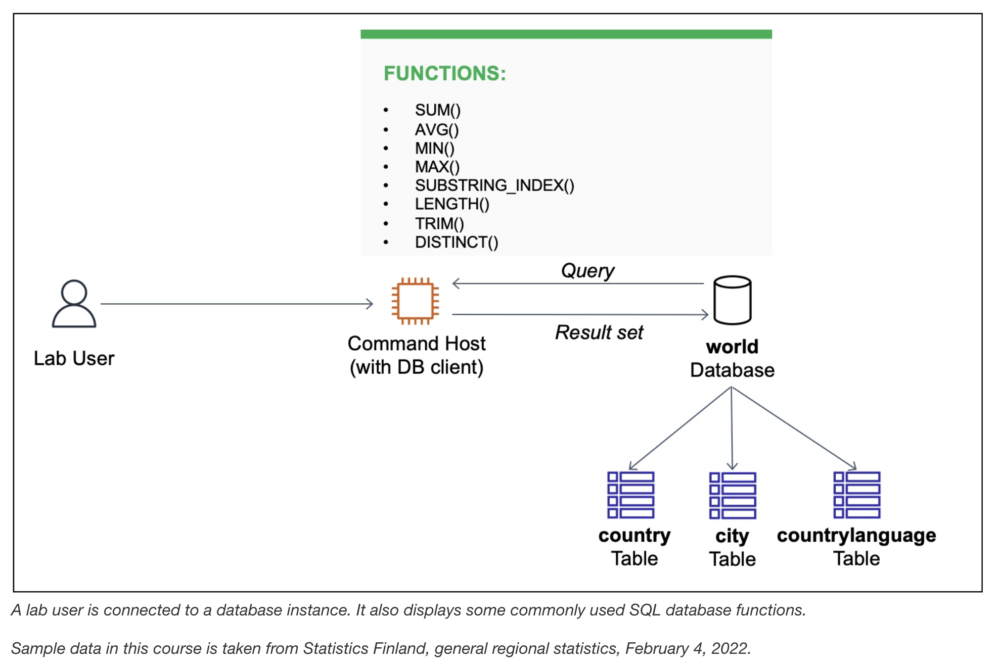

# Working with Functions

## Scenario
The database operations team has created a relational database named `world` containing three tables: `city`, `country`, and `countrylanguage`. Based on specific use cases in the lab exercise, I write a few queries using database functions with the `SELECT` statement and `WHERE` clause.

At the end, my architecture looks like the following example:
<p align="center">
  
</p>

## Task 1: Connect to the Command Host

In this task, I connect to an instance containing a database client, which is used to connect to a database. This instance is referred to as the Command Host.

1. In the AWS Management Console, I choose the **Services** menu, choose **Compute**, and then choose **EC2**.
2. In the left navigation menu, I choose **Instances**, select the check box next to the instance labelled **Command Host**, and choose **Connect**.
>[!Note]
> If I do not see the Command Host, the lab is probably still being provisioned, or I may be using another Region.
3. For **Connect to instance**, I choose the **Session Manager** tab and choose **Connect** to open a terminal window.
4. To configure the terminal to access all required tools and resources, I run the following commands:
```bash
sudo su
cd /home/ec2-user/
```
5. To connect to the relational database instance, I run the following command in the terminal (a password was configured when the database was installed):
```bash
mysql -u root --password='re:St@rt!9'
```
Output:
```bash

```

## Task 2: Query the world database

In this task, I query the `world` database using various `SELECT` statements and database functions. A function is used to process and manipulate data in a query, and while there are a wide range of SQL functions, this lab reviews a subset of commonly used ones.

1. To show the existing databases, I enter the following command in the terminal and verify that a database named `world` is available:
```bash

```
2. To review the table schema, data, and number of rows in the `country` table, I run the following query:
```bash

```
3. I then run the following query to demonstrate how to use aggregate functions `SUM()`, `MIN()`, `MAX()`, and `AVG()` to summarize data. Because the query does not include a `WHERE` condition, the functions aggregate data from all records in the `country` table:
```bash

```
>[!Note]
>  * `SUM()` adds all the population values together.
>  * `AVG()` generates an average across all the population values.
>  * `MAX()` finds the row with the highest population value.
>  * `MIN()` finds the row with the lowest population value.
>  * `COUNT()` finds the number of rows with a population value.

4. In some cases, I might need to split a string. The following query uses `SUBSTRING_INDEX()` to split a string where a space occurs, and I notice that the second column includes the beginning of each region name:
```bash

```
5. Sometimes I may need to search rows using a string fragment. The following query includes `SUBSTRING_INDEX()` as part of a condition in the `WHERE` clause to filter records that include "Southern" in the first part of the region name:
```bash

```
6. I can use the `LENGTH()` and `TRIM()` functions to determine how many characters are in a string — `TRIM()` clears leading and trailing blank spaces, and `LENGTH()` returns a count of the remaining characters. The next example returns only regions that have fewer than 10 characters in their names:
```bash

```
7. Having noticed duplicate records in the previous example, I use the `DISTINCT()` function to filter the duplicates:
```bash

```

### Challenge

I write a query to return rows that have "Micronesian/Caribbean" as the name in the region column. The output splits the region into two separate columns: one named `Region Name 1` and one named `Region Name 2`.

```
SELECT Name, substring_index(Region, "/", 1) as "Region Name 1", substring_index(region, "/", -1) as "Region Name 2" FROM world.country WHERE Region = "Micronesia/Caribbean";
```

## Conclusion
This lab demonstrated how to use some common database functions with the `SELECT` statement and `WHERE` clause.

After completing this lab, I am now able to:
* Use aggregate functions `SUM()`, `MIN()`, `MAX()`, and `AVG()` to summarize data
* Use the `SUBSTRING_INDEX()` function to split strings
* Use the `LENGTH()` and `TRIM()` functions to determine the length of a string
* Use the `DISTINCT()` function to filter duplicate records
* Use functions in the `SELECT` statement and `WHERE` clause

## Additional resources
- Country, city, and language data, Statistics Finland: The material was downloaded from Statistics Finland's interface 
service on February 4, 2022, with the [license CC BY 4.0](https://creativecommons.org/licenses/by/4.0/deed.en). 
The original data source is available from [Statistics Finland](https://tilastokeskus.fi/tup/kvportaali/index_en.html).

- For more information about database functions and operators, see the following resources:
  - [SELECT statements](https://mariadb.com/kb/en/select/)
  - [Count function](https://mariadb.com/kb/en/count/)
  - [SUM function](https://mariadb.com/kb/en/sum/)
  - [AVG function](https://mariadb.com/kb/en/avg/)
  - [MIN function](https://mariadb.com/kb/en/min/)
  - [MAX function](https://mariadb.com/kb/en/max/)
  - [SUBSTRING_INDEX function](https://mariadb.com/kb/en/substring_index/)
  - [LENGTH function](https://mariadb.com/kb/en/length/)
  - [TRIM function](https://mariadb.com/kb/en/trim/)
