# Build Your DB Server and Interact With Your DB Using an App

## Overview

This lab is designed to reinforce the concept of leveraging an AWS-managed database instance for solving relational database needs.

***Amazon Relational Database Service (Amazon RDS)*** makes it easy to set up, operate, and scale a relational database in the cloud. It provides cost-efficient and resizable capacity while managing time-consuming database administration tasks, which allows me to focus on my applications and business. Amazon RDS provides six familiar database engines to choose from: Amazon Aurora, Oracle, Microsoft SQL Server, PostgreSQL, MySQL, and MariaDB.

  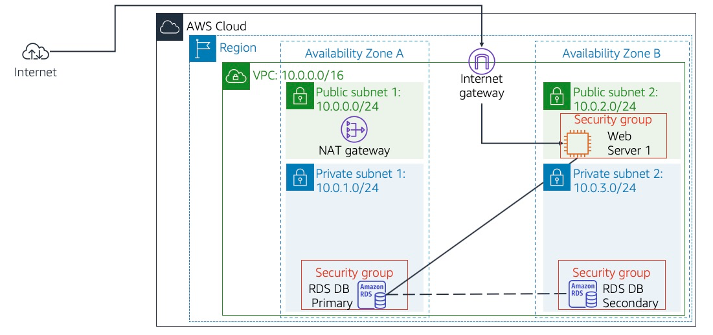

## Task 1: Create a Security Group for the RDS DB Instance
In this task, I create a security group to allow my web server to access my RDS DB instance. This security group will be used when I launch the database instance.

1. In the AWS Management Console, in the search bar, I type `VPC` and select **VPC**.
2. In the left navigation pane, I click **Security groups**.
3. I click **Create security group** and configure:
   * **Security group name:** `DB Security Group`
   * **Description:** `Permit access from Web Security Group`
   * **VPC:** Select **Lab VPC** from the dropdown
4. Since the security group currently has no rules, I add a rule to permit inbound database requests from the Web Security Group. In the **Inbound rules** section, I click **Add rule** and configure:
   * **Type:** MySQL/Aurora (3306)
   * **Source type:** Custom
   * **Source:** Type `sg` in the search field and select **Web Security Group**

   This configures the Database security group to permit inbound traffic on port 3306 from any EC2 instance associated with the Web Security Group.
5. I scroll to the bottom of the screen and click **Create security group**.

  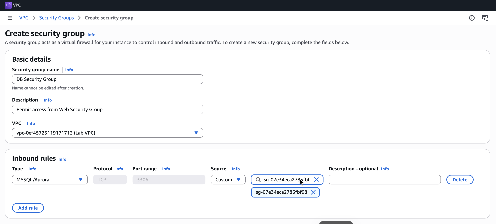

I will use this security group when launching the Amazon RDS database.

## Task 2: Create a DB Subnet Group
In this task, I create a DB subnet group that is used to tell RDS which subnets can be used for the database. Each DB subnet group requires subnets in at least two Availability Zones.

1. In the AWS Management Console, in the search bar, I type `RDS` and select **Aurora and RDS**.
2. In the left navigation pane, I click **Subnet groups**.
   * Note: If the navigation pane is not visible, I click the menu icon in the top-left corner.
3. I click **Create DB Subnet Group** and configure:
   * **Name:** `DB Subnet Group`
   * **Description:** `DB Subnet Group`
   * **VPC:** Lab VPC
4. In the **Add subnets** section, for **Availability Zones**, I choose the first and second Availability Zones from the dropdown.
5. For **Subnets**, I select the following subnets:
   * 10.0.1.0/24 (Private Subnet 1)
   * 10.0.3.0/24 (Private Subnet 2)
6. I click **Create**.

  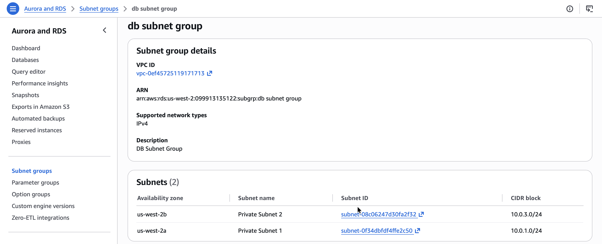

This adds Private Subnet 1 (10.0.1.0/24) and Private Subnet 2 (10.0.3.0/24). I will use this DB subnet group when creating the database in the next task.

## Task 3: Create an Amazon RDS DB Instance
In this task, I configure and launch a Multi-AZ Amazon RDS for MySQL database instance.

Amazon RDS Multi-AZ deployments provide enhanced availability and durability for Database (DB) instances, making them a natural fit for production database workloads. When I provision a Multi-AZ DB instance, Amazon RDS automatically creates a primary DB instance and synchronously replicates the data to a standby instance in a different Availability Zone (AZ).

1. In the left navigation pane, I click **Databases**.
2. I click the dropdown arrow on **Create database** and select **Full configuration**.
3. Under **Engine options**, for **Engine type**, I choose **MySQL**.
4. For **Templates**, I choose **Dev/Test**.
5. For **Availability and durability**, I choose **Multi-AZ DB instance deployment (2 instances)**, and leave **Engine version** at default.
6. Under **Settings**, I configure the following:
   * **DB instance identifier:** `lab-db`
   * **Master username:** `main`
7. Under **Credential Settings**, for **Credentials management**, I select **Self managed**, then configure:
   * I clear the **Auto generate a password** checkbox if selected.
   * **Master password:** `lab-password`
   * **Confirm master password:** `lab-password`
8. For **Additional credential settings**, I ensure **Password authentication** is selected.
9. Under **Instance configuration**, I configure the following:
   * Select **Burstable classes (includes t classes)**.
   * Select **db.t3.medium**.
10. Under **Storage**, I configure:
    * **Storage type:** General Purpose SSD (gp3)
    * **Allocated storage:** `20`
11. Under **Connectivity**, I configure:
    * **Compute resource:** Don't connect to an EC2 compute resource
    * **Virtual Private Cloud (VPC):** Lab VPC
    * **DB subnet group:** DB Subnet Group
    * **Public access:** No
    * **VPC security group (firewall):** Choose existing
    * **Existing VPC security groups:** Use X to remove default, then select **DB Security Group**
12. Under **Monitoring**, I uncheck **Enable Enhanced monitoring**, and under **Performance Insights**, I uncheck **Enable Performance Insights**.
13. I expand the **Additional configuration** section and configure:
    * **Initial database name:** `lab`
    * Under **Backup**, I uncheck **Enable automated backups**.

    This turns off backups, which is not normally recommended, but makes the database deploy faster for this lab.
14. I scroll to the bottom of the screen and click **Create database**. My database now launches.
15. I click **lab-db** (the link itself), and wait approximately 4 minutes for the database to become available, since the deployment process is deploying a database in two different Availability Zones.

>[!Note]
> If prompted with the **Suggested add-ons for lab-db** window, I choose **Close**.

16. I wait until the **Status** changes to **Modifying** or **Available**.

  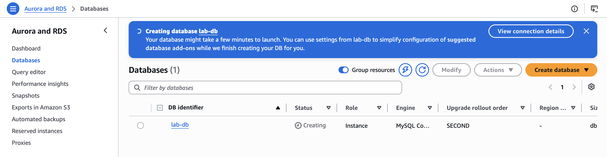

17. I click on **lab-db** to view its details, scroll down to the **Connectivity & security** tab, and copy the **Endpoint** field.

  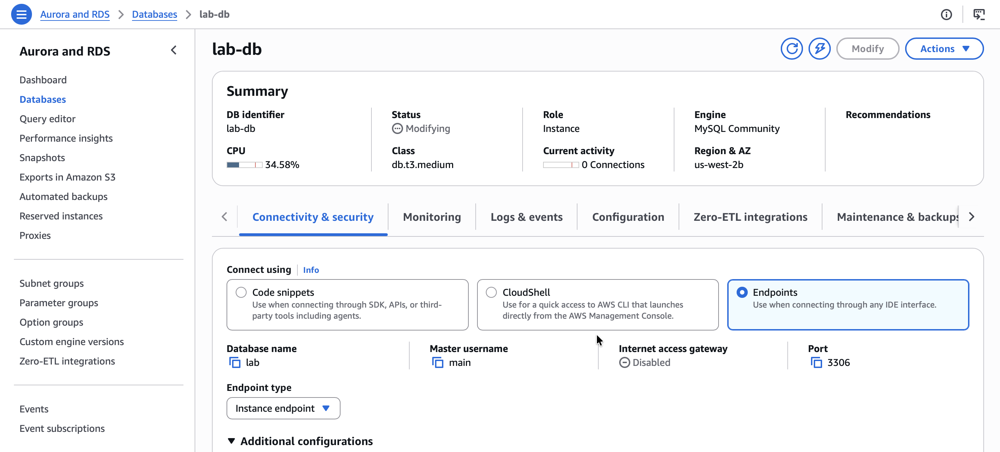

The MySQL database endpoint is `lab-db.cz3w3g3nuha3.us-west-2.rds.amazonaws.com`.

## Task 4: Interact with Your Database
In this task, I open a web application running on my web server and configure it to use the database.

1. I copy the WebServer IP address `35.90.254.5` provided in the lab instructions.
2. I open a new web browser tab, paste the WebServer IP address, and press Enter. The web application is displayed, showing information about the EC2 instance.
3. At the top of the web application page, I click the **RDS** link.

  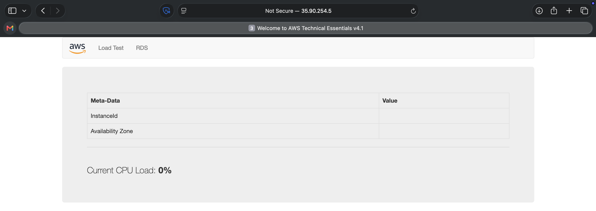

I now configure the application to connect to my database.

4. I configure the following settings:
   * **Endpoint:** (Paste the Endpoint I copied to a text editor earlier) - `lab-db.cz3w3g3nuha3.us-west-2.rds.amazonaws.com`
   * **Database:** `lab`
   * **Username:** `main`
   * **Password:** `lab-password`
   * I click **Submit**.

  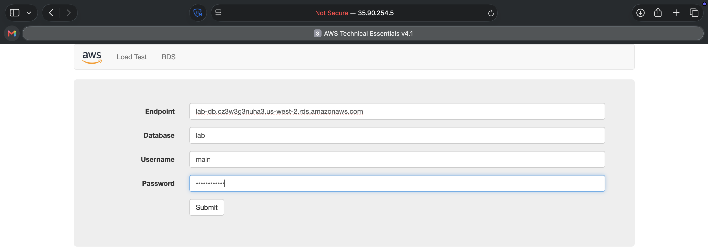

>[!Note]
> A message appears explaining that the application is running a command to copy information to the database. After a few seconds, the application displays an Address Book. The Address Book application uses the RDS database to store information.

  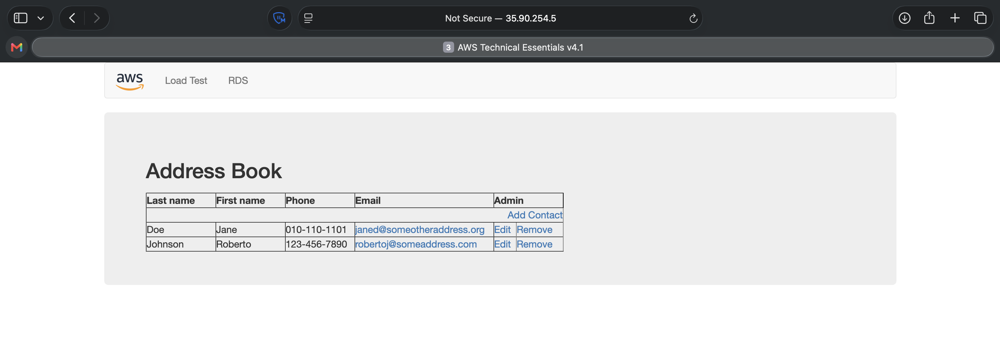

5. I test the web application by adding, editing, and removing contacts.

*Adding a contact to the Databases:* 

  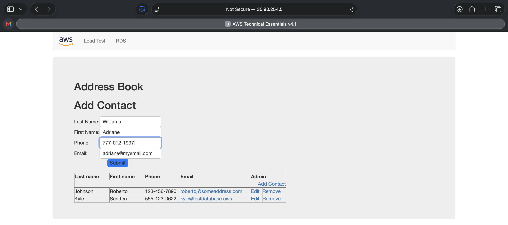

*Editing a contact in the Databases:* 
I notice that I made an error when adding the second record to the table, so I edit the record by swapping the first and last name so that they are captured correctly.

  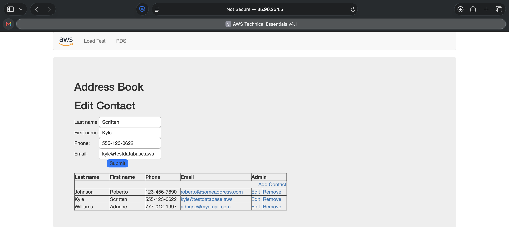

*Removing a contact from the Databases:* 

  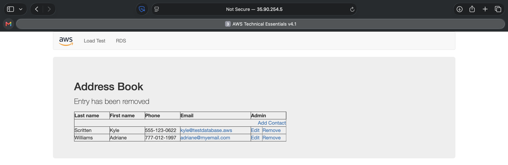

The data is being persisted to the database and is automatically replicating to the second Availability Zone.

## Conclusion

After completing this lab, I can:

* Launch an Amazon RDS DB instance with high availability.
* Configure the DB instance to permit connections from my web server.
* Open a web application and interact with my database.
