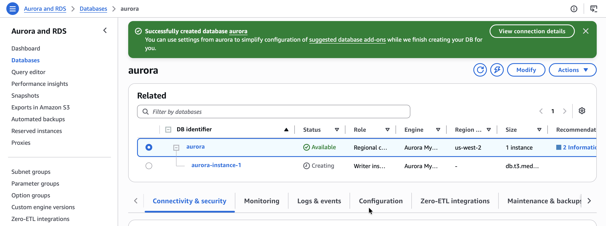

# Introduction to Amazon Aurora

This lab introduces me to Amazon Aurora and provides a basic understanding of how to use Aurora. I follow the steps to create an Aurora instance and then connect to it.

To successfully complete this lab, I should have some experience using the Linux operating system and have a basic understanding of structured query language (SQL).

## Introducing the technologies

**Amazon Aurora**

Aurora is a fully managed, MySQL-compatible, relational database engine that combines the performance and reliability of high-end commercial databases with the simplicity and cost-effectiveness of open-source databases. It delivers up to five times the performance of MySQL without requiring changes to most existing applications that use MySQL databases.

**Amazon Elastic Compute Cloud (Amazon EC2)**

Amazon EC2 is a web service that provides resizable compute capacity in the cloud. It is designed to make web-scale cloud computing easier for developers. Amazon EC2 reduces the time required to provision new server instances to minutes, giving me the ability to quickly scale capacity, both up and down, as my computing requirements change.

**Amazon Relational Database Service (Amazon RDS)**

Amazon RDS makes it easy to set up, operate, and scale a relational database in the cloud. It provides cost-efficient and resizable capacity while managing time-consuming database administration tasks, freeing me up to focus on my applications and business. Amazon RDS provides six database engines to choose from, including Aurora, Oracle, Microsoft SQL Server, PostgreSQL, MySQL, and MariaDB.

## Task 1: Create an Aurora instance

In this task, I create an Aurora database (DB) instance.

1. At the top of the AWS Management Console, in the search bar, I search for and choose `RDS`.
2. In the left navigation menu, I choose **Databases**.
3. I choose **Create database** and configure the following options:
   * **Choose a database creation method:** Standard create
   * **Engine type:** Aurora (MySQL Compatible)
   * **Engine version:** the version specified as the default for major version 8.0
   * **Templates:** Dev/Test
4. In the **Settings** section, I configure the following options:
   * **DB cluster identifier:** `aurora`
   * **Master username:** `admin`
   * **Master password:** `admin123`
   * **Confirm password:** `admin123`
5. In the **Instance configuration** section, for **DB instance class**, I choose **Burstable classes (includes t classes)**, and choose **db.t3.medium** from the dropdown list.
6. In the **Availability & durability** section, for **Multi-AZ deployment**, I choose **Don't create an Aurora Replica**.
>[!Note]
> Amazon RDS Multi-AZ deployments provide enhanced availability and durability for DB instances, making them a natural fit for production database workloads. When I provision a Multi-AZ DB instance, Amazon RDS automatically creates a primary DB instance and synchronously replicates the data to a standby instance in a different Availability Zone. Since this is a lab environment, I do not need to perform a multi-AZ deployment.
7. In the **Connectivity** section, I configure the following options and leave any not mentioned at their default value:
   * **Virtual private cloud (VPC):** LabVPC
   * **Subnet group:** dbsubnetgroup
   * **Public access:** No
   * **VPC security group:** Choose existing
   * **Existing VPC security groups:** Remove the **default** security group, then choose **DBSecurityGroup** from the dropdown list.
     
>[!Note]
> Subnets are segments of a virtual private cloud (VPC) IP address range that you designate to group your resources based on security and operational needs. A DB subnet group is a collection of subnets (typically private) that you create in a VPC and that you then designate for your DB instances. With a DB subnet group, you can specify a particular VPC when creating DB instances using the command line interface (CLI) or application programming interface (API); if you use the console, you can select the VPC and subnets that you want to use.

8. In the **Monitoring** section, I clear the check box for **Enable Enhanced monitoring**.
9. I expand the **Additional configuration** section, and for **Initial database name**, I enter `world`.
10. In the **Encryption** section, I clear the check box for **Enable encryption**.
11. In the **Maintenance** section, I clear the check box for **Enable auto minor version upgrade**.
12. I scroll to the bottom of the screen and choose **Create database**.

<p align="center">
  
</p>

I have successfully created an Aurora instance.

>[!Note]
> You can encrypt your Amazon RDS instances and snapshots at rest by enabling the encryption option for your RDS DB instance. Data that is encrypted at rest includes the underlying storage for a DB instance, its automated backups, read replicas, and snapshots.

## Task 2: Connect to an Amazon EC2 Linux instance

In this task, I log into my Amazon EC2 Linux instance. This instance was launched for me when I started my lab using CloudFormation.

1. In the AWS Management Console, I choose the **Services** menu, choose **Compute**, and then choose **EC2**.
2. In the left navigation menu, I choose **Instances**, select the check box next to the instance labelled **Command Host**, and choose **Connect**.
3. For **Connect to instance**, I choose the **Session Manager** tab and choose **Connect** to open a terminal window.

## Task 3: Configure the Amazon EC2 Linux instance to connect to Aurora

In this task, I use the yum package manager to install the MariaDB client and then configure the Amazon EC2 Linux instance to connect to the Aurora database.

1. To install the MariaDB client, I run the following command. The MariaDB client is what I use in later steps to connect to the Aurora instance I just created:
```sql
sh-4.2$ sudo yum install mariadb -y

Install  1 Package

Total download size: 8.8 M
Installed size: 49 M
Downloading packages:
mariadb-5.5.68-1.amzn2.0.1.x86_64.rpm                                                                                                  | 8.8 MB  00:00:00
Running transaction check
Running transaction test
Transaction test succeeded
Running transaction
  Installing : 1:mariadb-5.5.68-1.amzn2.0.1.x86_64                                                                                                        1/1
  Verifying  : 1:mariadb-5.5.68-1.amzn2.0.1.x86_64                                                                                                        1/1

Installed:
  mariadb.x86_64 1:5.5.68-1.amzn2.0.1

Complete!

```
2. Using a different browser tab, I go back to the AWS Management Console, search for and choose **RDS**, and in the left navigation menu, choose **Databases**. I wait for `aurora-instance-1` to display **Available**, then choose **aurora**.
3. I choose the **Connectivity & security** tab, and in the **Endpoints** section, I copy the Endpoint name for the **Writer** instance to my text editor:
`aurora.cluster-cl0denl5rvrv.us-west-2.rds.amazonaws.com`

>[!Note]
> An endpoint is represented as an Aurora specific URL that contains a host address and a port. The following types of endpoints are available from an Aurora DB cluster.
>   - **Cluster endpoint**
>     - A cluster endpoint for an Aurora DB cluster connects to the current primary DB instance for that DB cluster. This endpoint is the only one that can perform write operations such as DDL statements. Because of this, the cluster endpoint is the one that you connect to when you first set up a cluster or when your cluster contains only a single DB instance.
>    - **Reader endpoint**
>      - A reader endpoint for an Aurora DB cluster connects to one of the available Aurora replicas for that DB cluster. Each Aurora DB cluster has one reader endpoint. If there is more than one Aurora replica, the reader endpoint directs each connection request to one of the Aurora replicas.

4. I return to the Session Manager browser tab used to connect to the Command Host, and to connect to the Aurora instance, I run the command:
```sql
sh-4.2$ mysql -u admin --password='admin123' -h aurora.cluster-cl0denl5rvrv.us-west-2.rds.amazonaws.com
Welcome to the MariaDB monitor.  Commands end with ; or \g.
Your MySQL connection id is 56
Server version: 8.0.42 6252a59a

Copyright (c) 2000, 2018, Oracle, MariaDB Corporation Ab and others.

Type 'help;' or '\h' for help. Type '\c' to clear the current input statement.

MySQL [(none)]>
```

## Task 4: Create a table and insert and query records

In this task, I learn how to create a table in a database, load data, and run a query.

1. To list the available databases, I run the following command:
```sql
MySQL [(none)]> SHOW DATABASES;
+--------------------+
| Database           |
+--------------------+
| information_schema |
| mysql              |
| performance_schema |
| sys                |
| world              |
+--------------------+
5 rows in set (0.00 sec)

MySQL [(none)]>
```
2. To switch to the `world` database I created in Task 1 when I provisioned the Aurora instance, I run the following command:
```sql
MySQL [(none)]> USE world;
Database changed
MySQL [world]>
```
3. To create a new table in the `world` database, I run the following command:
```sql
MySQL [world]> CREATE TABLE `country` (
    -> `Code` CHAR(3) NOT NULL DEFAULT '',
    -> `Name` CHAR(52) NOT NULL DEFAULT '',
    -> `Continent` enum('Asia','Europe','North America','Africa','Oceania','Antarctica','South America') NOT NULL DEFAULT 'Asia',
    -> `Region` CHAR(26) NOT NULL DEFAULT '',
    -> `SurfaceArea` FLOAT(10,2) NOT NULL DEFAULT '0.00',
    -> `IndepYear` SMALLINT(6) DEFAULT NULL,
    -> `Population` INT(11) NOT NULL DEFAULT '0',
    -> `LifeExpectancy` FLOAT(3,1) DEFAULT NULL,
    -> `GNP` FLOAT(10,2) DEFAULT NULL,
    -> `GNPOld` FLOAT(10,2) DEFAULT NULL,
    -> `LocalName` CHAR(45) NOT NULL DEFAULT '',
    -> `GovernmentForm` CHAR(45) NOT NULL DEFAULT '',
    -> `Capital` INT(11) DEFAULT NULL,
    -> `Code2` CHAR(2) NOT NULL DEFAULT '',
    -> PRIMARY KEY (`Code`)
    -> );
Query OK, 0 rows affected, 7 warnings (0.03 sec)

MySQL [world]>
```
4. To insert new records into the `country` table I just created, I run the following commands:
```sql
INSERT INTO `country` VALUES ('GAB','Gabon','Africa','Central Africa',267668.00,1960,1226000,50.1,5493.00,5279.00,'Le Gabon','Republic',902,'GA');

INSERT INTO `country` VALUES ('IRL','Ireland','Europe','British Islands',70273.00,1921,3775100,76.8,75921.00,73132.00,'Ireland/Éire','Republic',1447,'IE');

INSERT INTO `country` VALUES ('THA','Thailand','Asia','Southeast Asia',513115.00,1350,61399000,68.6,116416.00,153907.00,'Prathet Thai','Constitutional Monarchy',3320,'TH');

INSERT INTO `country` VALUES ('CRI','Costa Rica','North America','Central America',51100.00,1821,4023000,75.8,10226.00,9757.00,'Costa Rica','Republic',584,'CR');

INSERT INTO `country` VALUES ('AUS','Australia','Oceania','Australia and New Zealand',7741220.00,1901,18886000,79.8,351182.00,392911.00,'Australia','Constitutional Monarchy, Federation',135,'AU');
```
5. To query the table, I run the following `SELECT` statement:
```sql
MySQL [world]> SELECT * FROM country WHERE GNP > 35000 and Population > 10000000;
+------+-----------+-----------+---------------------------+-------------+-----------+------------+----------------+-----------+-----------+--------------+-------------------------------------+---------+-------+
| Code | Name      | Continent | Region                    | SurfaceArea | IndepYear | Population | LifeExpectancy | GNP       | GNPOld    | LocalName    | GovernmentForm                      | Capital | Code2 |
+------+-----------+-----------+---------------------------+-------------+-----------+------------+----------------+-----------+-----------+--------------+-------------------------------------+---------+-------+
| AUS  | Australia | Oceania   | Australia and New Zealand |  7741220.00 |      1901 |   18886000 |           79.8 | 351182.00 | 392911.00 | Australia    | Constitutional Monarchy, Federation |     135 | AU    |
| THA  | Thailand  | Asia      | Southeast Asia            |   513115.00 |      1350 |   61399000 |           68.6 | 116416.00 | 153907.00 | Prathet Thai | Constitutional Monarchy             |    3320 | TH    |
+------+-----------+-----------+---------------------------+-------------+-----------+------------+----------------+-----------+-----------+--------------+-------------------------------------+---------+-------+
2 rows in set (0.00 sec)

MySQL [world]>
```
The query should return two records for Australia and Thailand.

I have successfully created a table named `country`, inserted data into the table, and queried records returning two results.

## Conclusion

Through this lab, I have now successfully:

* Created an Aurora instance.
* Connected to a pre-created Amazon EC2 instance.
* Configured the Amazon EC2 instance to connect to Aurora.
* Queried the Aurora instance.

## Additional resources
- [Amazon RDS Multi-AZ Deployments](https://aws.amazon.com/rds/details/multi-az/)
- [Working with an Amazon RDS DB Instance in a VPC](https://docs.aws.amazon.com/AmazonRDS/latest/UserGuide/USER_VPC.WorkingWithRDSInstanceinaVPC.html)
- [What Is Amazon VPC?](https://docs.aws.amazon.com/AmazonVPC/latest/UserGuide/VPC_Introduction.html)
- [Encrypting Amazon RDS Resources](https://docs.aws.amazon.com/AmazonRDS/latest/UserGuide/Overview.Encryption.html)
- [Enhanced Monitoring](https://docs.aws.amazon.com/AmazonRDS/latest/UserGuide/USER_Monitoring.OS.html)
- [Amazon EC2 Key Pairs](https://docs.aws.amazon.com/AWSEC2/latest/UserGuide/ec2-key-pairs.html)
  
