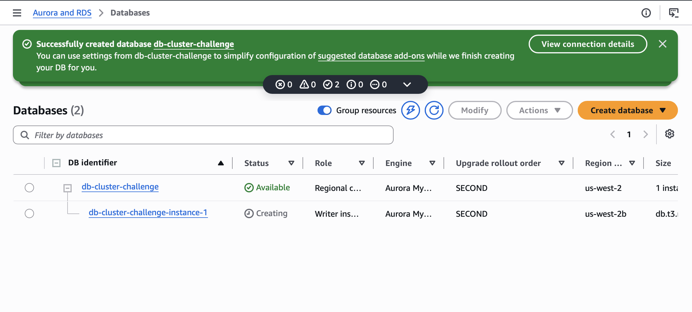

# Challenge Lab: Build Your DataBase Server and Interact With Your DataBase

This lab is designed to reinforce the concept of leveraging an AWS-managed database instance for solving relational database needs.

***Amazon Relational Database Service*** (Amazon RDS) makes it easy to set up, operate, and scale a relational database in the cloud. It provides cost-efficient and resizable capacity while managing time-consuming database administration tasks, which allows me to focus on my applications and business. Amazon RDS provides six familiar database engines to choose from: Amazon Aurora, Oracle, Microsoft SQL Server, PostgreSQL, MySQL, and MariaDB.

## Part 1: Create a Security Group for the RDS DB Instance
In this part, I create a security group to allow my web server to access my RDS DB instance. This security group will be used when I launch the database instance.

1. In the AWS Management Console, in the search bar, I type `VPC` and select **VPC**.
2. In the left navigation pane, I click **Security groups**.
3. I click **Create security group** and configure:
   * **Security group name:** `DB Security Group`
   * **Description:** `Permit access from Web Security Group`
   * **VPC:** Select **Lab VPC** from the dropdown
4. Since the security group currently has no rules, I add a rule to permit inbound database requests from the Web Security Group. In the **Inbound rules** section, I click **Add rule** and configure:
   * **Type:** MySQL/Aurora (3306)
   * **Source type:** Custom
   * **Source:** Type `sg` in the search field and select **Web Security Group**

   This configures the Database security group to permit inbound traffic on port 3306 from any EC2 instance associated with the Web Security Group.
5. I scroll to the bottom of the screen and click **Create security group**.

## Part 2: Create a DB Subnet Group
In this part, I create a DB subnet group that is used to tell RDS which subnets can be used for the database. Each DB subnet group requires subnets in at least two Availability Zones.

1. In the AWS Management Console, in the search bar, I type `RDS` and select **Aurora and RDS**.
2. In the left navigation pane, I click **Subnet groups**.
   * Note: If the navigation pane is not visible, I click the menu icon in the top-left corner.
3. I click **Create DB Subnet Group** and configure:
   * **Name:** `DB Subnet Group`
   * **Description:** `DB Subnet Group`
   * **VPC:** Lab VPC
4. In the **Add subnets** section, for **Availability Zones**, I choose the first and second Availability Zones from the dropdown.
5. For **Subnets**, I select the following subnets:
   * 10.0.1.0/24 (Private Subnet 1)
   * 10.0.3.0/24 (Private Subnet 2)
6. I click **Create**.

This adds Private Subnet 1 (10.0.1.0/24) and Private Subnet 2 (10.0.3.0/24). I will use this DB subnet group when creating the database in the next task.

## Part 3: Create an Amazon RDS DB Instance
In this part, I configure and launch a Multi-AZ Amazon RDS for MySQL database instance.

1. In the left navigation pane, I click **Databases**.
2. I click the dropdown arrow on **Create database** and select **Full configuration**.
3. Under **Engine options**, for **Engine type**, I choose **MySQL**.
4. For **Templates**, I choose **Dev/Test**.
5. For **Availability and durability**, I choose **Multi-AZ DB instance deployment (2 instances)**, and leave **Engine version** at default.
6. Under **Settings**, I configure the following:
   * **DB instance identifier:** `db-cluster-challenge`
   * **Master username:** `admin`
7. Under **Credential Settings**, for **Credentials management**, I select **Self managed**, then configure:
   * I clear the **Auto generate a password** checkbox
   * **Master password:** `lab-password123`
   * **Confirm master password:** `lab-password123`
8. For **Additional credential settings**, I ensure **Password authentication** is selected.
9. Under **Instance configuration**, I configure the following:
   * Select **Burstable classes (includes t classes)**.
   * Select **db.t3.medium**.
10. Under **Connectivity**, I configure:
    * **Compute resource:** Don't connect to an EC2 compute resource
    * **Virtual Private Cloud (VPC):** Lab VPC
    * **DB subnet group:** `DB Subnet Group`
    * **Public access:** No
    * **VPC security group (firewall):** Choose existing
    * **Existing VPC security groups:** Use X to remove default, then select **DB Security Group**
11. Under **Monitoring**, I uncheck **Enable Enhanced monitoring**, and under **Performance Insights**, I uncheck **Enable Performance Insights**.
12. I expand the **Additional configuration** section and configure:
    * **Initial database name:** `lab`
13. I scroll to the bottom of the screen and click **Create database**. My database now launches.

>[!Note]
> If prompted with the **Suggested add-ons for lab-db** window, I choose **Close**.

14. I wait until the **Status** changes to **Modifying** or **Available**.
15. I click on **lab-db** to view its details, scroll down to the **Connectivity & security** tab, and copy the **Endpoint** field.

The Aurora(MySQL compatible) database write endpoint is `db-cluster-challenge.cluster-cpct6rdtzlyu.us-west-2.rds.amazonaws.com`.

<p align="center">
  
</p>

## Part 4: Interacting with the database
1. I click the 'Details' tab in the lab environment, followed by the `Show` button:
    * I download the PEM file from lab details
    * Copy LinuxServer address: `35.91.200.114`
  
2. I connect (SSH) to the LinuxServer using my local terminal:
```bash
kylescritten@Kyles-MacBook-Air ~ % cd downloads
kylescritten@Kyles-MacBook-Air downloads % chmod 400 labsuser.pem
kylescritten@Kyles-MacBook-Air downloads % ssh -i labsuser.pem ec2-user@35.91.200.114
```

Output screen:
```bash
The authenticity of host '35.91.200.114 (35.91.200.114)' can't be established.
ED25519 key fingerprint is: SHA256:P+uCe78/TDNcizOKQHd2+beqDozxYcF8fIayKbF1jVo
This key is not known by any other names.
Are you sure you want to continue connecting (yes/no/[fingerprint])? yes
Warning: Permanently added '35.91.200.114' (ED25519) to the list of known hosts.
** WARNING: connection is not using a post-quantum key exchange algorithm.
** This session may be vulnerable to "store now, decrypt later" attacks.
** The server may need to be upgraded. See https://openssh.com/pq.html
   ,     #_
   ~\_  ####_        Amazon Linux 2
  ~~  \_#####\
  ~~     \###|       AL2 End of Life is 2026-06-30.
  ~~       \#/ ___
   ~~       V~' '->
    ~~~         /    A newer version of Amazon Linux is available!
      ~~._.   _/
         _/ _/       Amazon Linux 2023, GA and supported until 2029-06-30.
       _/m/'           https://aws.amazon.com/linux/amazon-linux-2023/

[ec2-user@ip-10-0-2-187 ~]$
```

3. I install a MySQL client, and use it to connect to the database with the commands:
```bash
sudo yum install mariadb -y
mysql -h db-cluster-challenge.cluster-cpct6rdtzlyu.us-west-2.rds.amazonaws.com -P 3306 -u admin --password='lab-challenge123'
```

Terminal screen:
```bash
[ec2-user@ip-10-0-2-187 ~]$ mysql -h db-cluster-challenge.cluster-cpct6rdtzlyu.us-west-2.rds.amazonaws.com -P 3306 -u admin --password='lab-challenge123'
Welcome to the MariaDB monitor.  Commands end with ; or \g.
Your MySQL connection id is 77
Server version: 8.0.42 6252a59a

Copyright (c) 2000, 2018, Oracle, MariaDB Corporation Ab and others.

Type 'help;' or '\h' for help. Type '\c' to clear the current input statement.

MySQL [(none)]> 
```

4. I list all of the databases and then set the `lab` as default by running the following commands:
```sql
MySQL [(none)]> SHOW DATABASES;
+--------------------+
| Database           |
+--------------------+
| information_schema |
| lab                |
| mysql              |
| performance_schema |
| sys                |
+--------------------+
5 rows in set (0.00 sec)

MySQL [(none)]> USE lab;
Database changed
MySQL [lab]> 
```

5. I create a table `RESTART` with the following columns — Student ID (Number), Student Name, Restart City, and Graduation Date (Date Time):
```sql
MySQL [lab]> CREATE TABLE `restart` (
    -> `Student_ID` INT(10) ZEROFILL,
    -> `Student_Name` CHAR(52) NOT NULL DEFAULT '',
    -> `Restart_City` CHAR(52) NOT NULL DEFAULT '',
    -> `Graduation_Date` DATE,
    -> PRIMARY KEY (`Student_ID`)
    -> );
Query OK, 0 rows affected, 2 warnings (0.03 sec)
```

6. I insert 10 sample rows into this table with the code:
```sql
INSERT INTO `restart` (`Student_ID`, `Student_Name`, `Restart_City`, `Graduation_Date`) VALUES
(101, 'Marcus Reid', 'Seattle', '2024-06-12'),
(102, 'Priya Nair', 'Denver', '2023-11-08'),
(103, 'Liam O''Connor', 'Austin', '2025-03-21'),
(104, 'Sofia Torres', 'Miami', '2024-10-04'),
(105, 'Noah Bennett', 'Portland', '2023-09-16'),
(106, 'Ava Mitchell', 'Boston', '2025-05-27'),
(107, 'Elijah Park', 'Atlanta', '2024-08-19'),
(108, 'Grace Kim', 'Nashville', '2023-12-11'),
(109, 'Oscar Delgado', 'Detroit', '2025-01-30'),
(110, 'Mia Foster', 'Minneapolis', '2024-04-23');
```

7. To select all rows from this table I use the sql command `SELECT * FROM restart;`:
```sql
MySQL [lab]> SELECT * FROM restart;
+------------+---------------+--------------+-----------------+
| Student_ID | Student_Name  | Restart_City | Graduation_Date |
+------------+---------------+--------------+-----------------+
| 0000000101 | Marcus Reid   | Seattle      | 2024-06-12      |
| 0000000102 | Priya Nair    | Denver       | 2023-11-08      |
| 0000000103 | Liam O'Connor | Austin       | 2025-03-21      |
| 0000000104 | Sofia Torres  | Miami        | 2024-10-04      |
| 0000000105 | Noah Bennett  | Portland     | 2023-09-16      |
| 0000000106 | Ava Mitchell  | Boston       | 2025-05-27      |
| 0000000107 | Elijah Park   | Atlanta      | 2024-08-19      |
| 0000000108 | Grace Kim     | Nashville    | 2023-12-11      |
| 0000000109 | Oscar Delgado | Detroit      | 2025-01-30      |
| 0000000110 | Mia Foster    | Minneapolis  | 2024-04-23      |
+------------+---------------+--------------+-----------------+
10 rows in set (0.00 sec)
```

8. I create a table `CLOUD_PRACTITIONER` with the following columns: Student ID (Number) and Certification Date (Date Time).
```sql
MySQL [lab]> CREATE TABLE cloud_practitioner (
    ->     `Student_ID` INT(10) ZEROFILL,
    ->     `Certification_Date` DATE NOT NULL,
    ->     PRIMARY KEY (`Student_ID`)
    -> );
Query OK, 0 rows affected, 2 warnings (0.03 sec)
```

9. I insert 5 sample rows into this table:
```sql
MySQL [lab]> INSERT INTO cloud_practitioner (`Student_ID`, `Certification_Date`) VALUES
    -> (104, '2026-04-05 08:50:00'),
    -> (106, '2026-04-18 13:25:00'),
    -> (107, '2026-05-02 10:10:00'),
    -> (109, '2026-05-19 15:40:00'),
    -> (110, '2026-06-01 12:05:00');
Query OK, 5 rows affected, 5 warnings (0.01 sec)
Records: 5  Duplicates: 0  Warnings: 5
```

10. I select all rows from this table using the command `SELECT * FROM cloud_practitioner;`:
```sql
MySQL [lab]> SELECT * FROM cloud_practitioner;
+------------+--------------------+
| Student_ID | Certification_Date |
+------------+--------------------+
| 0000000104 | 2026-04-05         |
| 0000000106 | 2026-04-18         |
| 0000000107 | 2026-05-02         |
| 0000000109 | 2026-05-19         |
| 0000000110 | 2026-06-01         |
+------------+--------------------+
5 rows in set (0.00 sec)
```

11. I perform an inner join between the 2 tables created above and display `student_ID`, `Student_Name`, `Certification_Date`:
```sql
MySQL [lab]> SELECT r.Student_ID, r.Student_Name, cp.Certification_Date
    -> FROM restart r
    -> INNER JOIN cloud_practitioner cp
    -> ON r.Student_ID = cp.Student_ID;
+------------+---------------+--------------------+
| Student_ID | Student_Name  | Certification_Date |
+------------+---------------+--------------------+
| 0000000104 | Sofia Torres  | 2026-04-05         |
| 0000000106 | Ava Mitchell  | 2026-04-18         |
| 0000000107 | Elijah Park   | 2026-05-02         |
| 0000000109 | Oscar Delgado | 2026-05-19         |
| 0000000110 | Mia Foster    | 2026-06-01         |
+------------+---------------+--------------------+
5 rows in set (0.00 sec)
```

## Conclusion
After completing this lab, I am able to:

* Create an RDS instance
* Use the Amazon RDS Query Editor to query data.
