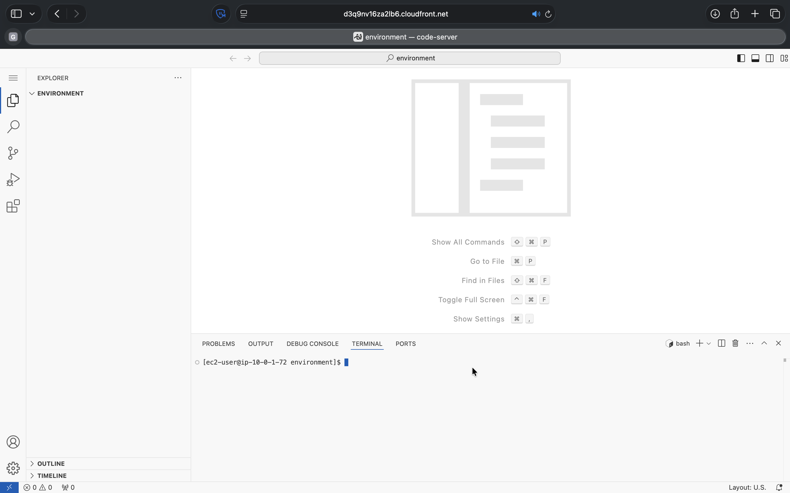
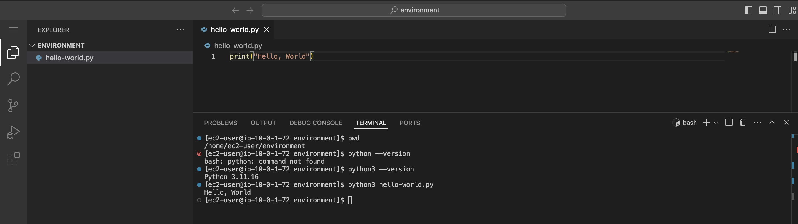
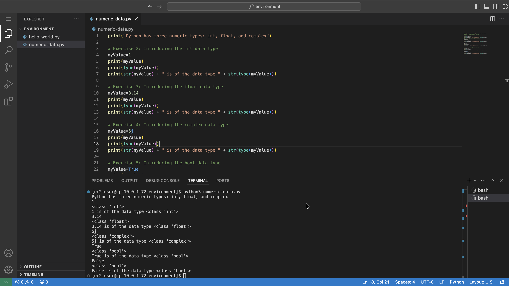
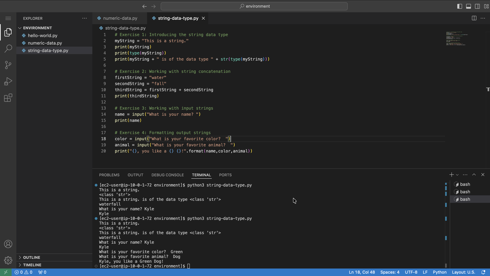

# Introduction to Python Programming

### Accessing the VS Code IDE

**Visual Studio Code (VS Code)** is a free, lightweight source code editor developed by Microsoft that allows users to write, run, and debug code directly on their local machine. It includes an integrated code editor, debugger, and terminal, and supports virtually all programming languages through a vast library of extensions.

VS Code can run on Windows, macOS, and Linux, and integrates seamlessly with source control systems like Git and GitHub. It can also connect to remote environments — such as EC2 instances, containers, or WSL — through extensions, and is highly customizable through settings, themes, and extensions tailored to individual workflows.

To open the VS Code IDE, I copy the `LabIDEURL` value from the panel to the left of the instructions and paste it into a new browser tab. When prompted, I enter the `LabIDEPassword` value as the password, and the VS Code IDE opens in a new browser tab.

<p align="center">
  
</p>

## Labs 01 : Creating a Hello, World Program
Welcome to Introduction to Programming. For the labs, I use the Python programming language. In this lab, I write my first Python program.

Python file name: `hello-world.py`
```python
# Exercise 2: Writing your first Python program
print("Hello, World")
```

<p align="center">
  
</p>

## Labs 02 : Working with Numeric Data Types
Python makes it easier to do math. In fact, Python is a popular language among data scientists, who must analyze large amounts of data. In this lab, I explore the basic data types used to store numeric values.

After completing this lab, I am able to:
* Use the Python shell
* Use the `int` data type
* Use the `float` data type
* Use the `complex` data type
* Use the `bool` data type

Python file name: `numeric-data.py`

#### Python shell
```bash
# Exercise 1: Using the Python shell
[ec2-user@ip-10-0-1-72 environment]$ pwd        # To display the present working directory
/home/ec2-user/environment
[ec2-user@ip-10-0-1-72 environment]$ python3    # Python shell can be started by entering the pwd command
Python 3.11.16 (main, Aug 24 2026, 00:00:00) [GCC 11.5.0 20240719 (Red Hat 11.5.0-5)] on linux
Type "help", "copyright", "credits" or "license" for more information.
>>> 2+2    # Adding
4
>>> 4-2    # Subtraction
2
>>> 2*2    # Multiplication
4
>>> 4/2    # Division
2.0
>>> quit()  # Exiting the Python shell
[ec2-user@ip-10-0-1-72 environment]$ 
```

#### Python code
```python
print("Python has three numeric types: int, float, and complex")

# Exercise 2: Introducing the int data type
myValue=1
print(myValue)
print(type(myValue))
print(str(myValue) + " is of the data type " + str(type(myValue)))

# Exercise 3: Introducing the float data type
myValue=3.14
print(myValue)
print(type(myValue))
print(str(myValue) + " is of the data type " + str(type(myValue)))

# Exercise 4: Introducing the complex data type
myValue=5j
print(myValue)
print(type(myValue))
print(str(myValue) + " is of the data type " + str(type(myValue)))

# Exercise 5: Introducing the bool data type
myValue=True
print(myValue)
print(type(myValue))
print(str(myValue) + " is of the data type " + str(type(myValue)))

myValue=False
print(myValue)
print(type(myValue))
print(str(myValue) + " is of the data type " + str(type(myValue)))
```

<p align="center">
  
</p>

## Labs 03 : Working with the String Data Type
In Python, a collection of letters and symbols is called a string. Strings are used often in Python for input and output.

After completing this lab, I am able to:
* Write Python code that uses the string data type
* Concatenate strings
* Use strings to get input
* Format strings for output

Python file name: `string-data-type.py`

#### Python code
```python
PLACEHOLDER_CODE
```

<p align="center">
  
</p>
