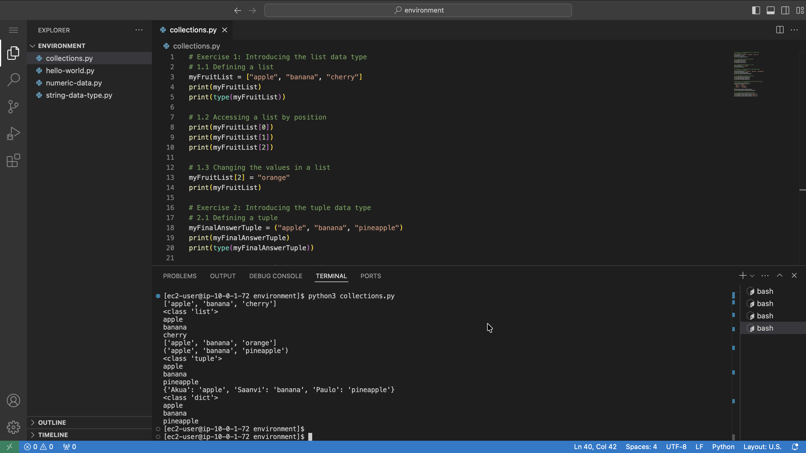
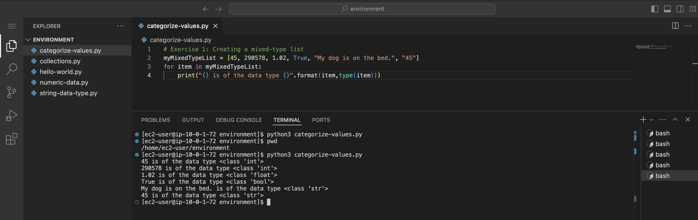
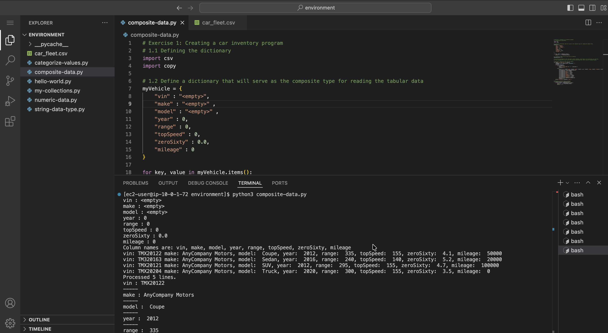

# Introduction to Python Programming

### Accessing the VS Code IDE

**Visual Studio Code (VS Code)** is a free, lightweight source code editor developed by Microsoft that allows users to write, run, and debug code directly on their local machine. It includes an integrated code editor, debugger, and terminal, and supports virtually all programming languages through a vast library of extensions.

VS Code can run on Windows, macOS, and Linux, and integrates seamlessly with source control systems like Git and GitHub. It can also connect to remote environments — such as EC2 instances, containers, or WSL — through extensions, and is highly customizable through settings, themes, and extensions tailored to individual workflows.

To open the VS Code IDE, I copy the `LabIDEURL` value from the panel to the left of the instructions and paste it into a new browser tab. When prompted, I enter the `LabIDEPassword` value as the password, and the VS Code IDE opens in a new browser tab.

<p align="center">
  
</p>

The `LabIDEURL` I run in the new browser tab for the labs is `https://d3q9nv16za2lb6.cloudfront.net/?folder=/home/ec2-user/environment`.

## Labs 01 : Creating a Hello, World Program
Welcome to Introduction to Programming. For the labs, I use the Python programming language. In this lab, I write my first Python program.

Python file name: `hello-world.py`
```python
# Exercise 2: Writing your first Python program
print("Hello, World")
```

<p align="center">
  
</p>

*I have written my first Python program called `hello-world.py`.*

## Labs 02 : Working with Numeric Data Types
Python makes it easier to do math. In fact, Python is a popular language among data scientists, who must analyze large amounts of data. In this lab, I explore the basic data types used to store numeric values.

After completing this lab, I am able to:
* Use the Python shell
* Use the `int` data type
* Use the `float` data type
* Use the `complex` data type
* Use the `bool` data type

Python file name: `numeric-data.py`

#### Python shell
```bash
# Exercise 1: Using the Python shell
[ec2-user@ip-10-0-1-72 environment]$ pwd        # To display the present working directory
/home/ec2-user/environment
[ec2-user@ip-10-0-1-72 environment]$ python3    # Python shell can be started by entering the pwd command
Python 3.11.16 (main, Aug 24 2026, 00:00:00) [GCC 11.5.0 20240719 (Red Hat 11.5.0-5)] on linux
Type "help", "copyright", "credits" or "license" for more information.
>>> 2+2    # Adding
4
>>> 4-2    # Subtraction
2
>>> 2*2    # Multiplication
4
>>> 4/2    # Division
2.0
>>> quit()  # Exiting the Python shell
[ec2-user@ip-10-0-1-72 environment]$ 
```

#### Python code
```python
print("Python has three numeric types: int, float, and complex")

# Exercise 2: Introducing the int data type
myValue=1
print(myValue)
print(type(myValue))
print(str(myValue) + " is of the data type " + str(type(myValue)))

# Exercise 3: Introducing the float data type
myValue=3.14
print(myValue)
print(type(myValue))
print(str(myValue) + " is of the data type " + str(type(myValue)))

# Exercise 4: Introducing the complex data type
myValue=5j
print(myValue)
print(type(myValue))
print(str(myValue) + " is of the data type " + str(type(myValue)))

# Exercise 5: Introducing the bool data type
myValue=True
print(myValue)
print(type(myValue))
print(str(myValue) + " is of the data type " + str(type(myValue)))

myValue=False
print(myValue)
print(type(myValue))
print(str(myValue) + " is of the data type " + str(type(myValue)))
```

<p align="center">
  
</p>

*I have learned about Python's three numeric data types: `int`, `float`, and `complex`. I was also introduced to Python's "fake" data type called `bool`. Note that `bool` is actually the numerals 0 and 1, which represent the values `True` and `False`.*

## Labs 03 : Working with the String Data Type
In Python, a collection of letters and symbols is called a string. Strings are used often in Python for input and output.

After completing this lab, I am able to:
* Write Python code that uses the string data type
* Concatenate strings
* Use strings to get input
* Format strings for output

Python file name: `string-data-type.py`

#### Python code
```python
# Exercise 1: Introducing the string data type
myString = "This is a string."
print(myString)
print(type(myString))
print(myString + " is of the data type " + str(type(myString)))

# Exercise 2: Working with string concatenation
firstString = "water"
secondString = "fall"
thirdString = firstString + secondString
print(thirdString)

# Exercise 3: Working with input strings
name = input("What is your name? ")
print(name)

# Exercise 4: Formatting output strings
color = input("What is your favorite color?  ")
animal = input("What is your favorite animal?  ")
print("{}, you like a {} {}!".format(name,color,animal))
```

<p align="center">
  
</p>

*I have used Python to concatenate strings, take input from the user, and output a formatted string.*

## Labs 04 : Working with Lists, Tuples, and Dictionaries
In Python, string and numeric data types are often used in groups called collections. Three such collections that Python supports are the list, the tuple, and the dictionary.

After completing this lab, I am able to:
* Use the `list` data type
* Use the `tuple` data type
* Use the `dictionary` data type

Python file name: `my-collections.py`

#### Python code
```python
# Exercise 1: Introducing the list data type
# 1.1 Defining a list
myFruitList = ["apple", "banana", "cherry"]
print(myFruitList)
print(type(myFruitList))

# 1.2 Accessing a list by position
print(myFruitList[0])
print(myFruitList[1])
print(myFruitList[2])

# 1.3 Changing the values in a list
myFruitList[2] = "orange"
print(myFruitList)

# Exercise 2: Introducing the tuple data type
# 2.1 Defining a tuple
myFinalAnswerTuple = ("apple", "banana", "pineapple")
print(myFinalAnswerTuple)
print(type(myFinalAnswerTuple))

# 2.2 Accessing a tuple by position
print(myFinalAnswerTuple[0])
print(myFinalAnswerTuple[1])
print(myFinalAnswerTuple[2])

# Exercise 3: Introducing the dictionary data type
# 3.1 Defining a dictionary
myFavoriteFruitDictionary = {
  "Akua" : "apple",
  "Saanvi" : "banana",
  "Paulo" : "pineapple"
}
print(myFavoriteFruitDictionary)
print(type(myFavoriteFruitDictionary))

# 3.2 Accessing a dictionary by name
print(myFavoriteFruitDictionary["Akua"])
print(myFavoriteFruitDictionary["Saanvi"])
print(myFavoriteFruitDictionary["Paulo"])
```

<p align="center">
  
</p>

*I have worked with the `list`, `tuple`, and `dictionary` data types in Python.*

## Labs 05 : Categorizing Values
With Python, I can mix types in a list. In this lab, I create a list with different types and print the values.

After completing this lab, I am able to:
* Use numeric data types
* Use string data types
* Use the `list` data type
* Use a `for` loop
* Use the `print()` function

Python file name: `categorize-values.py`

#### Python code
```python
# Exercise 1: Creating a mixed-type list
myMixedTypeList = [45, 290578, 1.02, True, "My dog is on the bed.", "45"]
for item in myMixedTypeList:
    print("{} is of the data type {}".format(item,type(item)))
```

<p align="center">
  
</p>

*This exercise reinforces the Python programming concepts covered in labs 1–4. In this exercise, I work with the `list` data type and learn about Python's support for mixing data types in a list declaration.*

## Labs 06 : Working with Composite Data Types
A composite data type is any data type comprising primitive data types. If I like food, I can visualize a composite data type as a turducken — a dish that consists of a chicken stuffed into a duck, which is stuffed into a turkey. In this lab, I create a data type that consists of a string in a dictionary, which is in a list.

After completing this lab, I am able to:
* Use numeric data types
* Use string data types
* Use the `dictionary` data type
* Use the `list` data type
* Use a `for` loop
* Use the `print()` function
* Use the `if` statement
* Use the `else` statement
* Use the `import` statement

Python file name: `composite-data.py`

Comma-separated values (CSV) file: `car_fleet.csv`

#### CSV file data
```csv
# Creating a car inventory data
vin,make,model,year,range,topSpeed,zeroSixty,mileage
TMX20122,AnyCompany Motors, Coupe, 2012, 335, 155, 4.1, 50000
TM320163,AnyCompany Motors, Sedan, 2016, 240, 140, 5.2, 20000
TMX20121,AnyCompany Motors, SUV, 2012, 295, 155, 4.7, 100000
TMX20204,AnyCompany Motors, Truck, 2020, 300, 155, 3.5, 0
```

#### Python code
```python
# Exercise 1: Creating a car inventory program
# 1.1 Defining the dictionary
import csv
import copy

# 1.2 Define a dictionary that will serve as the composite type for reading the tabular data
myVehicle = {
    "vin" : "<empty>",
    "make" : "<empty>" ,
    "model" : "<empty>" ,
    "year" : 0,
    "range" : 0,
    "topSpeed" : 0,
    "zeroSixty" : 0.0,
    "mileage" : 0
}

for key, value in myVehicle.items():
    print("{} : {}".format(key,value))

# 1.3 Define an empty list to hold the car inventory 
myInventoryList = []

# You will be introduced to the `with open` syntax statement, which keeps a file open while you read data. 
# It will automatically close the CSV file when the code inside the `with` block is finished running.

# Exercise 2: Copying the CSV file into memory
with open('car_fleet.csv') as csvFile:
    csvReader = csv.reader(csvFile, delimiter=',')  
    lineCount = 0  
    for row in csvReader:
        if lineCount == 0:
            print(f'Column names are: {", ".join(row)}')  
            lineCount += 1  
        else:  
            print(f'vin: {row[0]} make: {row[1]}, model: {row[2]}, year: {row[3]}, range: {row[4]}, topSpeed: {row[5]}, zeroSixty: {row[6]}, mileage: {row[7]}')  
            currentVehicle = copy.deepcopy(myVehicle)  
            currentVehicle["vin"] = row[0]  
            currentVehicle["make"] = row[1]  
            currentVehicle["model"] = row[2]  
            currentVehicle["year"] = row[3]  
            currentVehicle["range"] = row[4]  
            currentVehicle["topSpeed"] = row[5]  
            currentVehicle["zeroSixty"] = row[6]  
            currentVehicle["mileage"] = row[7]  
            myInventoryList.append(currentVehicle)  
            lineCount += 1  
    print(f'Processed {lineCount} lines.')

# Exercise 3: Printing the car inventory
for myCarProperties in myInventoryList:
    for key, value in myCarProperties.items():
        print("{} : {}".format(key,value))
        print("-----")
```

<p align="center">
  
</p>

*In this lab, I worked with composite data types in Python, including reading tabular data from a CSV file.*

> [!CAUTION]
> **The error:** When I ran `composite-data.py`, the terminal returned an error indicating the file would not run. I investigated the issue further.
>
> **The cause of the error:** A file named `collections.py` exists in the `/home/ec2-user/environment` directory. When Python tries to `import csv`, the `csv` module internally needs `re` → `enum` → `functools` → `collections` (the real standard library module). But because the working directory is on the Python path first, Python finds the local `collections.py` file instead of the real standard library `collections` module — and since that file doesn't have `namedtuple` defined in it, the import fails.
>
> **The fix:**
> 1. Look in the `environment` folder for a file called `collections.py`.
> 2. Rename it to something else (e.g., `my_collections.py`) or delete it if it's not needed.


