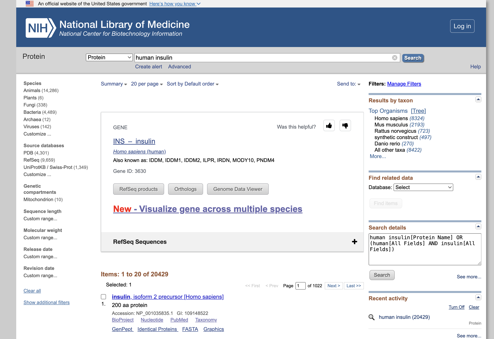
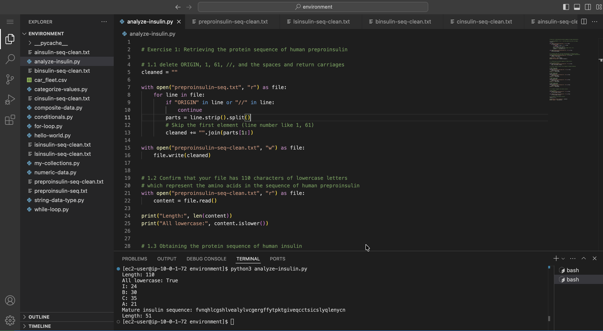

# Preparing to Analyze Insulin with Python

In information technology, Python works well as the programming language of choice for manipulating strings, sequences, and numbers. Python is especially preferred in scientific computing applications such as physics, chemistry, and biology.

In some of the labs for the Python modules, I perform simple sequence manipulations and calculations on human insulin, a well-known hormone in the human body responsible for regulating sugars.

In this lab, I retrieve the protein sequence of human insulin from human preproinsulin.

## Accessing the VS Code IDE

**Visual Studio Code (VS Code)** is a free, lightweight source code editor developed by Microsoft that allows users to write, run, and debug code directly on their local machine. It includes an integrated code editor, debugger, and terminal, and supports virtually all programming languages through a vast library of extensions.

VS Code can run on Windows, macOS, and Linux, and integrates seamlessly with source control systems like Git and GitHub. It can also connect to remote environments — such as EC2 instances, containers, or WSL — through extensions, and is highly customizable through settings, themes, and extensions tailored to individual workflows.

To open the VS Code IDE, I copy the `LabIDEURL` value from the panel to the left of the instructions and paste it into a new browser tab. When prompted, I enter the `LabIDEPassword` value as the password, and the VS Code IDE opens in a new browser tab.

## Exercise 1: Retrieving the protein sequence of human preproinsulin
The National Center for Biotechnology Information (NCBI) has information on many biological sequences.

From the NCBI Website [https://ncbi.nlm.nih.gov](https://ncbi.nlm.nih.gov), I select protein from the dropdown list and search the `human insulin` and then `insulin [Homo sapiens] Accession: AAA59172.1` from the search results.

<p align="center">
  
</p>

I copy and paste the insulin sequence, from the NCBI Website, into the new file [preproinsulin-seq.txt](./files/preproinsulin-seq.txt) created in VS Code IDE.

```txt
ORIGIN      
        1 malwmrllpl lallalwgpd paaafvnqhl cgshlvealy lvcgergffy tpktrreaed
       61 lqvgqvelgg gpgagslqpl alegslqkrg iveqcctsic slyqlenycn
//
```

## Exercise 2: Obtaining the protein sequence of human insulin

Insulin is obtained from preproinsulin through a series of cut-and-paste procedures.

**Insulin formation process:**
- Insulin is produced from preproinsulin through a series of cut-and-paste (processing) steps.
- Preproinsulin consists of:
  - A 24 amino acid (aa) signal sequence
  - An 86 amino acid proinsulin molecule
- During processing:
  - The signal sequence (aa 1–24) is removed
  - The remaining molecule becomes proinsulin
- Further processing of proinsulin produces the final insulin:
  - Amino acids 25–54 → form part of the insulin molecule
  - Amino acids 90–110 → form another part of the insulin molecule

I use the Python code [analyze-insulin.py](./python-scripts/analyze-insulin.py) to retrieve only the amino acids in the sequence that compose insulin.

<p align="center">
  
</p>

*Through the completion of this lab, I have prepared data for further processing. Manually preparing these files helps me appreciate the automation that Python can provide.*

## Conclusion

### Deciding when to automate and when to work manually: A discussion about scope versus time

Automating my work versus working manually is a dilemma for computer programmers. Too much automation wastes time on coding, whereas too little restricts the scope of the program. I try to balance automation with manual work in an effort to create a program with the most scope for the least time spent coding. In this case, it is probably not worth the extra coding time to programmatically clean `insulin-seq.txt` to `insulin-seq-clean.txt`. However, if I needed to download thousands or millions of files and perform the same task, automation would be worth exploring.

## Visualize full processing pathway
This is how preproinsulin becomes insulin.

```
Preproinsulin (110 aa total)
│
├── Signal peptide (1–24) → removed
│
└── Proinsulin (25–110)
    │
    ├── B chain (25–54)
    ├── C-peptide (55–89) → removed
    └── A chain (90–110)
           ↓
Final product:
B chain + A chain = Insulin
```
