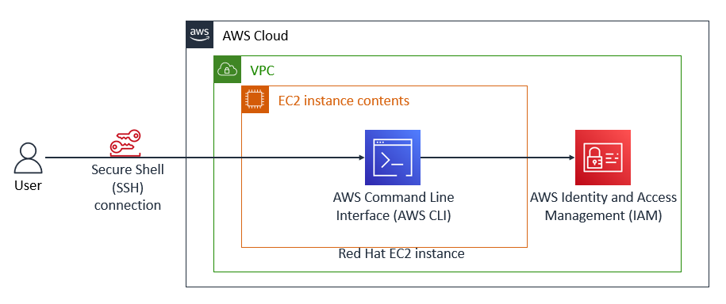

# Install and Configure the AWS CLI

## Lab overview
The AWS Command Line Interface (AWS CLI) is a command line tool that provides an interface for interacting with products and services from Amazon Web Services (AWS). I can install the AWS CLI on my local machine or a virtual machine such as an Amazon Elastic Compute Cloud (Amazon EC2) instance.

In this activity, I install and configure the AWS CLI on a Red Hat Linux instance, because this instance type does not have the AWS CLI pre-installed. Some instance types, such as Amazon Linux, do come pre-installed with the AWS CLI.

During this activity, I establish a Secure Shell (SSH) connection to the instance, then configure the installation with an access key that can connect to my AWS account. Finally, I practice using the AWS CLI to interact with AWS Identity and Access Management (IAM).

*When I finish the activity, it reflects the following diagram:*

<p align="center">
  
</p>

*In the preceding diagram, I access the AWS Cloud through an SSH connection. Within the AWS Cloud, a virtual private cloud (VPC) with a Red Hat EC2 instance is configured with the AWS CLI. IAM is configured, and I use the AWS CLI to interact with IAM.*

## Task 1: Connect to the Red Hat EC2 instance using SSH


## Task 2: Install the AWS CLI on a Red Hat Linux instance

**Terminal output:**
```bash
PLACEHOLDER
```

## Task 3: Observe IAM configuration details in the AWS Management Console


## Task 4: Configure the AWS CLI to connect to my AWS Account

1. In the SSH session terminal window, I run the `aws configure` command for the AWS CLI.
2. At the prompt, I configure the following:
   * **AWS Access Key ID:** `<AWS Access Key ID>`
   * **AWS Secret Access Key:** `<AWS Secret Access Key>`
   * **Default region name:** Enter `us-west-2`
   * **Default output format:** Enter `json`

**Terminal output:**
```bash
PLACEHOLDER
```

## Task 5: Observe IAM configuration details using the AWS CLI
In this task, I observe the IAM configuration details for the EC2 instance using the AWS CLI.

1. In the terminal window, I test the IAM configuration by running the `aws iam list-users` command:

**Terminal output:**
```bash
PLACEHOLDER
```

A successful test shows a JSON response that includes a list of IAM users in the account.

## Activity 1 challenge
I successfully install the AWS CLI on a Red Hat Linux instance and connect it to my AWS account. I use the AWS CLI to retrieve policy information by referencing AWS documentation.

1. In the IAM AWS CLI Command Reference [documentation page](https://docs.aws.amazon.com/cli/latest/reference/iam/index.html), the following command lists IAM policies and filters customer managed policies:

```bash
aws iam list-policies --scope Local
```

2. Next, I use the version number ARN information and `DefaultVersionId` found inside the `lab_policy` document to retrieve the JSON IAM policy, using the `>` command to save the file:

```bash
aws iam get-policy-version --policy-arn arn:aws:iam::038946776283:policy/lab_policy --version-id v1 > lab_policy.json
```

> [!NOTE]
> I can use the AWS CLI to manage and control multiple AWS services through the command line. I can also accomplish these tasks using the AWS Management Console.
>
> To connect to the same AWS account, the AWS CLI needs an access key ID and secret access key. To sign in to the AWS Management Console, I need a user name and password.

## Conclusion
After completing this lab, I am able to:

* Install and configure the AWS CLI
* Connect the AWS CLI to an AWS account
* Access IAM using the AWS CLI

## Additional resources
* [IAM AWS CLI Command Reference](https://docs.aws.amazon.com/cli/latest/reference/iam/index.html)
* [Installing or Updating the Latest Version of the AWS CLI](https://docs.aws.amazon.com/cli/latest/userguide/getting-started-install.html)
* [Troubleshooting AWS CLI Errors](https://docs.aws.amazon.com/cli/latest/userguide/cli-chap-troubleshooting.html)
