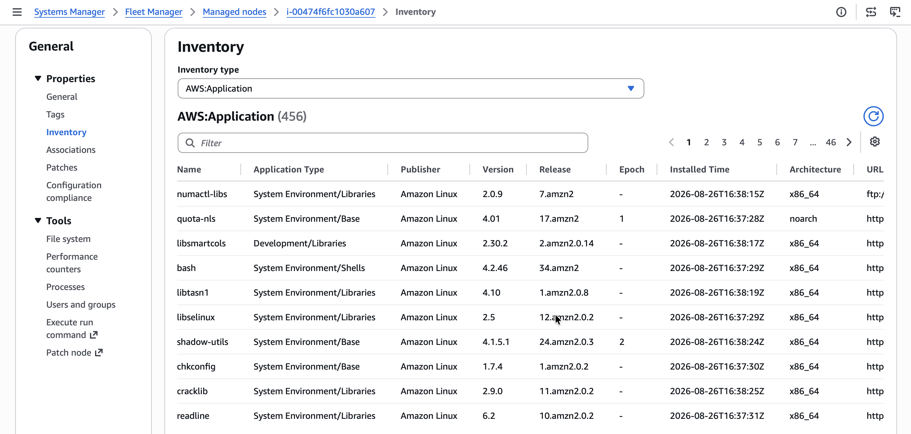
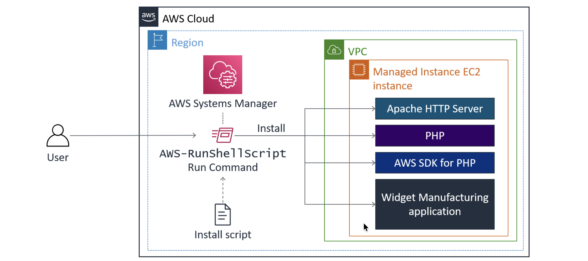
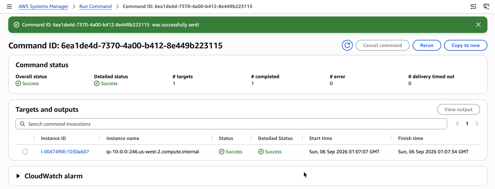
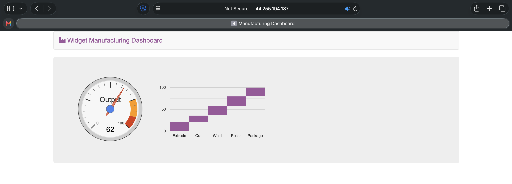
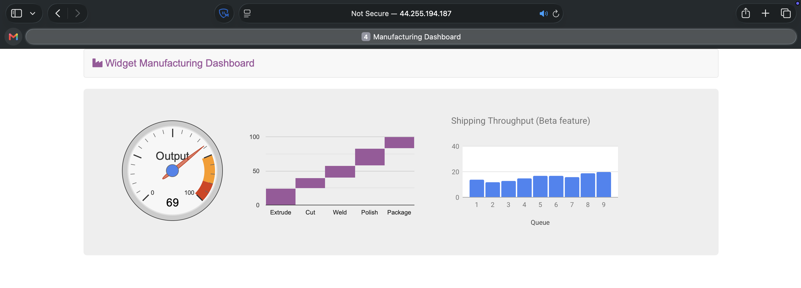
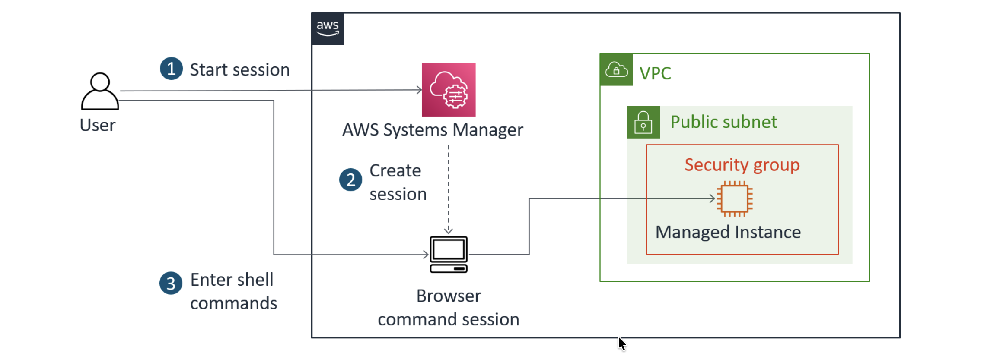
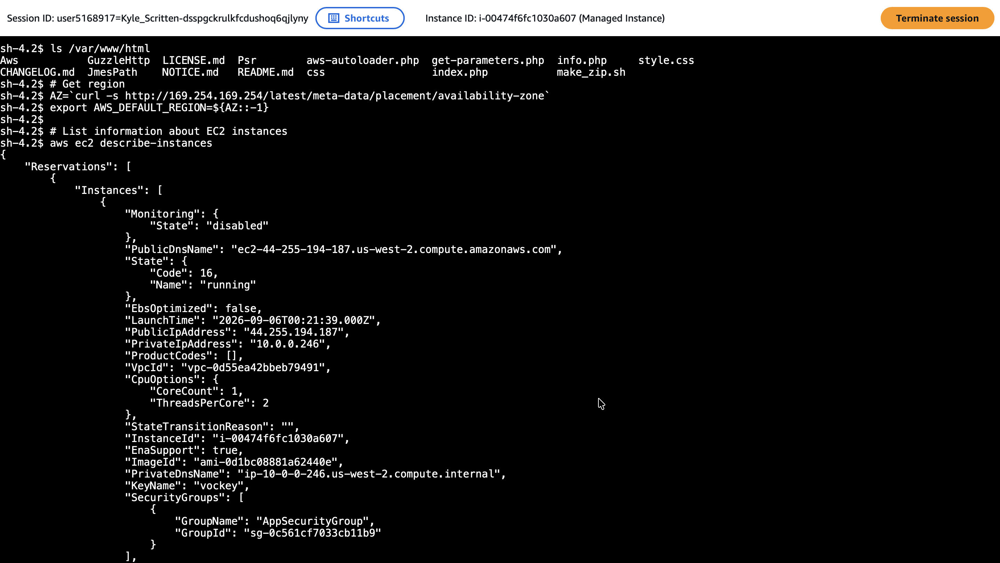

# Using AWS Systems Manager

## Lab overview
AWS Systems Manager is a collection of capabilities I can use to centralize operational data and automate tasks across my Amazon Web Services (AWS) resources. Systems Manager can configure and manage Amazon Elastic Compute Cloud (Amazon EC2) instances, on-premises servers, virtual machines, and other AWS resources at scale.

## Task 1: Generate inventory lists for managed instances
In this task, I will use Fleet Manager to gather inventory from an EC2 instance. I will create a Systems Manager inventory association for my instance, allowing me to review and validate software configurations on my instances without needing to connect to each instance using SSH.

> [!NOTE]
> I can use Fleet Manager, a capability of Systems Manager, to collect operating system information, application information, and metadata from EC2 instances, on-premises servers, or virtual machines in a hybrid environment. I can also use Fleet Manager to query metadata to quickly understand which instances are running the software and configurations my software policy requires, and which instances need updating.

1. In the Systems Manager Console, under **Node Tools**, I choose **Fleet Manager**.
2. I choose the **Account management** dropdown list, then choose `Set up inventory`.
3. To create an association that collects information about software and settings for my managed instance, I configure the following options:
   * In the **Provide inventory details** section, for **Name**, I enter `Inventory-Association`.
   * In the **Targets** section, I configure the following options:
     * I choose `Manually selecting instances`.
     * I select the row for `Managed Instance`.
   * I leave the other options at their default settings.
4. I choose **Setup Inventory**. Inventory, a capability of Systems Manager, now regularly inventories the instance for the selected properties.
5. I choose the **Node ID** link, which directs me to the Node overview.
6. I choose the **Inventory** tab.

<p align="center">
  
</p>

*This tab lists all of the applications on the instance. I take a moment to review the installed applications and other options in the **Inventory type** dropdown list.*

## Task 2: Install a Custom Application using Run Command
In this task, I install a custom web application (**Widget Manufacturing Dashboard**) using Run Command, a capability of Systems Manager.

<p align="center">
  
</p>

*In the preceding diagram, Systems Manager installs an application on an EC2 instance within a virtual private cloud (VPC) using Run Command. Run Command runs the "install script" and installs the following: Apache web server, PHP, AWS SDK, and the web application. Once everything is installed, it also starts the web server.*

1. Under **Node Management**, I choose **Run Command**.
2. I choose the **Run command** button, and a list appears of pre-configured documents for running common commands.
3. I choose the search icon in the box, and a dropdown box appears. I choose the following options:
   * `Owner`
   * `Owned by me`

> [!CAUTION]
> I do not enter "Owner" or "Owned by me" directly into the search box — entering this text does not return results.

4. A document appears. The following information appears for this document:
   * **Description:** Install Dashboard App
   * **Document version:** 1 (Default)

I leave the **Document version** option set to this default.
  
5. For **Target selection**, I select `Choose instances manually`.
6. In the **Instances** section, I select `Managed Instance`.

> [!NOTE]
> The Managed Instance has the Systems Manager agent installed. The agent has registered the instance to the service, which allows it to be selected for Run Command.

7. In the **Output options** section, I clear **Enable an S3 bucket**.
8. I expand the **AWS command line interface command** section. After review this and I then choose **Run**.

#### AWS command line interface command
```bash
aws ssm send-command \
  --document-name "c214215a5412420l16603547t1w688146162243-InstallDashboardApp-5rOe5xZda1zK" \
  --document-version "1" \
  --targets '[{"Key":"InstanceIds","Values":["i-00474f6fc1030a607"]}]' \
  --parameters '{}' \
  --timeout-seconds 600 \
  --max-concurrency "50" \
  --max-errors "0" \
  --region us-west-2
```

*This section displays the command line interface (CLI) command that initiates Run Command. I can copy this command and use it in the future within a script rather than having to use the AWS Management Console.*

<p align="center">
  
</p>

*A banner with the Command ID `6ea1de4d-7370-4a00-b412-8e449b223115` indicates that it was successfully sent on the Command ID page.*

9. After 1–2 minutes, the **Overall status** changes to ✅***Success***.

I now validate the custom application that was installed.

10. In the Vocareum console, I copy the `ServerIP` value (the public IP address).
11. I open a new web browser tab and paste the ServerIP address `44.255.194.187`.

<p align="center">
  
</p>

*The **Widget Manufacturing Dashboard** I installed appears. I have successfully used Run Command through Systems Manager to install a custom application onto my instance without needing to remotely access the instance using SSH.*

## Task 3: Use Parameter Store to manage application settings
In this task, I use Parameter Store to store a parameter that I use to activate a feature in an application.

> [!NOTE]
> Parameter Store, a capability of Systems Manager, provides secure, hierarchical storage for configuration data management and secrets management. I can store data such as passwords, database strings, and license codes as parameter values, either as plain text or encrypted data, and can then reference values using the unique name I specified when creating the parameter.

1. I keep the Widget Manufacturing Dashboard browser tab open and return to the AWS Systems Manager tab.
2. Under **Application Tools**, I choose **Parameter Store**.
3. I choose **Create parameter** and configure the following options:
   * **Name:** `/dashboard/show-beta-features`
   * **Description:** `Display beta features`
   * **Tier:** `<Leave the default option>`
   * **Type:** `<Leave the default option>`
   * **Value:** `True`
4. I choose **Create parameter**. A banner with the message ✅ ***"Create parameter request succeeded"*** appears at the top of the page.
5. I return to the web browser tab displaying the application and refresh the web page.

<p align="center">
  
</p>

*I notice that three charts are displayed. The application is now checking Parameter Store to determine whether the additional chart (which is still in beta) should be displayed. It is common to configure applications to display "dark features" that are installed but not yet activated.*

## Task 4: Use Session Manager to access instances
In this task, I access the EC2 instance through Session Manager. This demonstrates how I can use Session Manager to log in to an instance without using SSH. I also verify this capability by confirming that the SSH port is closed for the instance's security group.

> [!NOTE]
> With Session Manager, a capability of Systems Manager, I can manage my EC2 instances through an interactive one-step browser-based shell or through the AWS Command Line Interface (AWS CLI). Session Manager provides secure and auditable instance management without the need to open inbound ports, maintain bastion hosts, or manage SSH keys. I can also use Session Manager to help comply with corporate policies that require controlled access to instances, strict security practices, and fully auditable logs with instance access details, while still providing end users with one-step cross-platform access to EC2 instances.
>
> When using Session Manager with Microsoft Windows, Session Manager provides access to a PowerShell console on the instance.

<p align="center">
  
</p>

*In the preceding diagram, Systems Manager uses Session Manager to access the EC2 instance without having to connect to the instance using SSH. Session Manager is one of the secure ways to access the instance.*

Under **Node Tools**, I choose **Session Manager**, then choose **Start session**. I select `Managed Instance` and choose **Start session** again, which opens a new session tab in my browser. 

#### CLI commands I run
```bash
# The output lists the application files that were installed on the instance
ls /var/www/html

# Get region
AZ=`curl -s http://169.254.169.254/latest/meta-data/placement/availability-zone`
export AWS_DEFAULT_REGION=${AZ::-1}

# List information about EC2 instances
aws ec2 describe-instances
```

I click anywhere in the session window to activate the cursor, and I am now ready to run commands directly in the session window.

<p align="center">
  
</p>

#### Terminal output
```bash
sh-4.2$ ls /var/www/html
Aws           GuzzleHttp  LICENSE.md  Psr        aws-autoloader.php  get-parameters.php  info.php     style.css
CHANGELOG.md  JmesPath    NOTICE.md   README.md  css                 index.php           make_zip.sh
sh-4.2$ # Get region
sh-4.2$ AZ=`curl -s http://169.254.169.254/latest/meta-data/placement/availability-zone`
sh-4.2$ export AWS_DEFAULT_REGION=${AZ::-1}
sh-4.2$ 
sh-4.2$ # List information about EC2 instances
sh-4.2$ aws ec2 describe-instances
{
    "Reservations": [
        {
            "Instances": [
                {
                    "Monitoring": {
                        "State": "disabled"
                    }, 
                    "PublicDnsName": "ec2-44-255-194-187.us-west-2.compute.amazonaws.com", 
                    "State": {
                        "Code": 16, 
                        "Name": "running"
                    }, 
                    "EbsOptimized": false, 
                    "LaunchTime": "2026-09-06T00:21:39.000Z", 
                    "PublicIpAddress": "44.255.194.187", 
                    "PrivateIpAddress": "10.0.0.246", 
                    "ProductCodes": [], 
                    "VpcId": "vpc-0d55ea42bbeb79491", 
                    "CpuOptions": {
                        "CoreCount": 1, 
                        "ThreadsPerCore": 2
                    }, 
                    "StateTransitionReason": "", 
                    "InstanceId": "i-00474f6fc1030a607", 
                    "EnaSupport": true, 
                    "ImageId": "ami-0d1bc08881a62440e", 
                    "PrivateDnsName": "ip-10-0-0-246.us-west-2.compute.internal", 
                    "KeyName": "vockey", 
                    "SecurityGroups": [
                        {
                            "GroupName": "AppSecurityGroup", 
                            "GroupId": "sg-0c561cf7033cb11b9"
                        }
                    ], 
                    "ClientToken": "7a82b003-5077-d27f-765d-f2c4edc78bb3", 
                    "SubnetId": "subnet-070d24b363fd67d8f", 
                    "InstanceType": "t3.micro", 
                    "CapacityReservationSpecification": {
                        "CapacityReservationPreference": "open"
                    }, 
                    "NetworkInterfaces": [
                        {
                            "Status": "in-use", 
                            "MacAddress": "02:ff:e1:8b:bf:8d", 
                            "SourceDestCheck": true, 
                            "VpcId": "vpc-0d55ea42bbeb79491", 
                            "Description": "", 
                            "NetworkInterfaceId": "eni-041e1c1f229f1f81c", 
                            "PrivateIpAddresses": [
                                {
                                    "PrivateDnsName": "ip-10-0-0-246.us-west-2.compute.internal", 
                                    "PrivateIpAddress": "10.0.0.246", 
                                    "Primary": true, 
                                    "Association": {
                                        "PublicIp": "44.255.194.187", 
                                        "PublicDnsName": "ec2-44-255-194-187.us-west-2.compute.amazonaws.com", 
                                        "IpOwnerId": "amazon"
                                    }
                                }
                            ], 
                            "PrivateDnsName": "ip-10-0-0-246.us-west-2.compute.internal", 
                            "InterfaceType": "interface", 
                            "Attachment": {
                                "Status": "attached", 
                                "DeviceIndex": 0, 
                                "DeleteOnTermination": true, 
                                "AttachmentId": "eni-attach-09bb7e49e4e198039", 
                                "AttachTime": "2026-09-06T00:21:39.000Z"
                            }, 
                            "Groups": [
                                {
                                    "GroupName": "AppSecurityGroup", 
                                    "GroupId": "sg-0c561cf7033cb11b9"
                                }
                            ], 
                            "Ipv6Addresses": [], 
                            "OwnerId": "688146162243", 
                            "PrivateIpAddress": "10.0.0.246", 
                            "SubnetId": "subnet-070d24b363fd67d8f", 
                            "Association": {
                                "PublicIp": "44.255.194.187", 
                                "PublicDnsName": "ec2-44-255-194-187.us-west-2.compute.amazonaws.com", 
                                "IpOwnerId": "amazon"
                            }
                        }
                    ], 
                    "SourceDestCheck": true, 
                    "Placement": {
                        "Tenancy": "default", 
                        "GroupName": "", 
                        "AvailabilityZone": "us-west-2a"
                    }, 
                    "Hypervisor": "xen", 
                    "BlockDeviceMappings": [
                        {
                            "DeviceName": "/dev/xvda", 
                            "Ebs": {
                                "Status": "attached", 
                                "DeleteOnTermination": true, 
                                "VolumeId": "vol-0c980f1a2315d5de0", 
                                "AttachTime": "2026-09-06T00:21:40.000Z"
                            }
                        }
                    ], 
                    "Architecture": "x86_64", 
                    "RootDeviceType": "ebs", 
                    "IamInstanceProfile": {
                        "Id": "AIPA2AOFVEJB5HW4L6NNO", 
                        "Arn": "arn:aws:iam::688146162243:instance-profile/App-Role"
                    }, 
                    "RootDeviceName": "/dev/xvda", 
                    "VirtualizationType": "hvm", 
                    "Tags": [
                        {
                            "Value": "Managed Instance", 
                            "Key": "Name"
                        }, 
                        {
                            "Value": "c214215a5412420l16603547t1w688146162243", 
                            "Key": "aws:cloudformation:stack-name"
                        }, 
                        {
                            "Value": "arn:aws:cloudformation:us-west-2:688146162243:stack/c214215a5412420l16603547t1w688146162243/8f3493b0-a988-11f1-a0b1-0aae629db321", 
                            "Key": "aws:cloudformation:stack-id"
                        }, 
                        {
                            "Value": "SSMInstance", 
                            "Key": "aws:cloudformation:logical-id"
                        }, 
                        {
                            "Value": "c214215a5412420l16603547t1w688146162243", 
                            "Key": "cloudlab"
                        }
                    ], 
                    "HibernationOptions": {
                        "Configured": false
                    }, 
                    "MetadataOptions": {
                        "State": "applied", 
                        "HttpEndpoint": "enabled", 
                        "HttpTokens": "optional", 
                        "HttpPutResponseHopLimit": 1
                    }, 
                    "AmiLaunchIndex": 0
                }
            ], 
            "ReservationId": "r-0b9af8697d6412cb3", 
            "RequesterId": "658754138699", 
            "Groups": [], 
            "OwnerId": "688146162243"
        }
    ]
}
sh-4.2$ 
```

*The output lists the EC2 instance details for the **Managed Instance** in JSON format.*

>[!Note]
> You can restrict access to Session Manager through AWS Identity and Access Management (IAM) policies, and AWS CloudTrail logs Session Manager usage. These options provide better security and auditing than traditional SSH access.

## Conclusion
After completing this lab, I am able to use Systems Manager to:

* Verify configurations and permissions
* Run tasks on multiple servers
* Update application settings or configurations
* Access the command line on an instance

## Additional resources
* [What is AWS Systems Manager?](https://docs.aws.amazon.com/systems-manager/latest/userguide/what-is-systems-manager.html)
* [AWS Systems Manager Session Manager](https://docs.aws.amazon.com/systems-manager/latest/userguide/session-manager.html)
