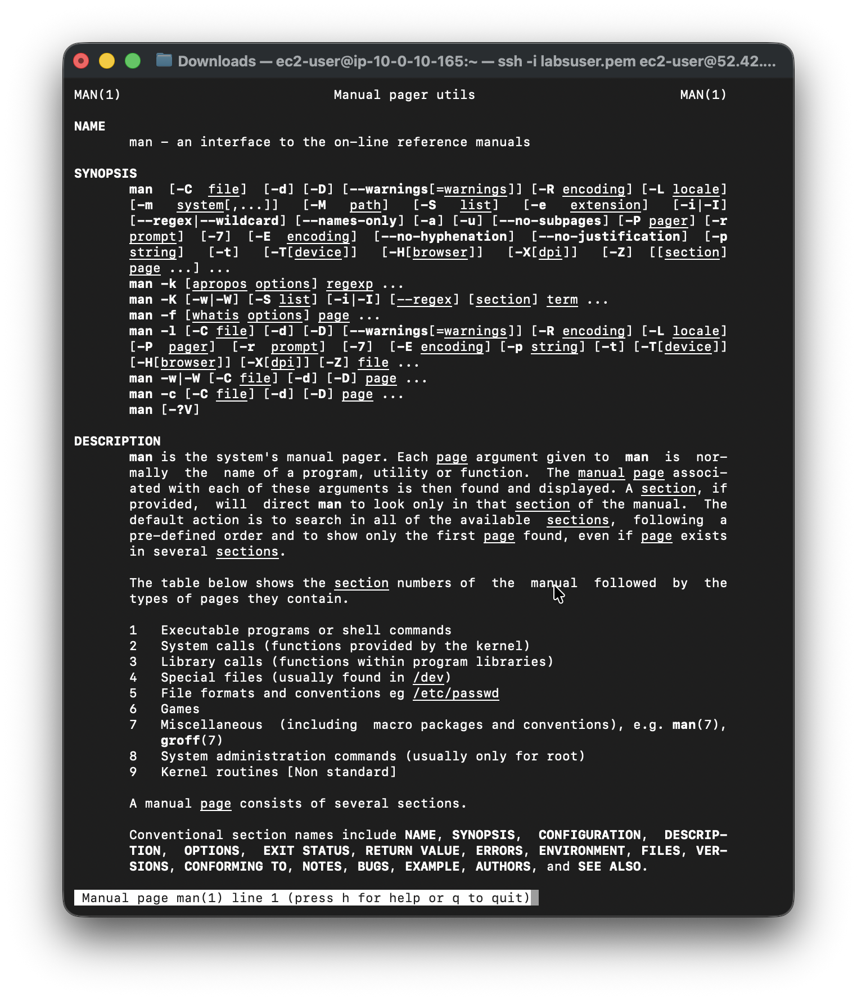

# Introduction to an Amazon Linux Amazon Machine Image (AMI)

In this lab, I learnt how to:
- Use Secure Shell (SSH) to access an Amazon Linux AMI within Vocareum labs
- Understand the purpose of the man command
- Demonstrate the search feature of the man pages
- Examine man page headers

## Task 1: Use SSH to connect to an Amazon Linux EC2 instance

In this task, I will connect to a Amazon Linux EC2 instance. I run macOS and will use an SSH utility to perform all of these operations. The Amazon EC2 instance is configured as part of this lab environment. 

I downloaded the file labsuser.pem from the lab environment and saved the PublicIP address, which for my lab is PublicIP 52.42.122.142. From my terminal, I changed the permissions on the key to be read-only using my PublicIP allowing the first connection to this remote SSH server. 

#### Connect to the EC2 Instance

```bash
kylescritten@Kyles-MacBook-Air ~ % cd ~/Downloads
kylescritten@Kyles-MacBook-Air Downloads % chmod 400 labsuser.pem
kylescritten@Kyles-MacBook-Air Downloads % ssh -i labsuser.pem ec2-user@52.42.122.142
The authenticity of host '52.42.122.142 (52.42.122.142)' can't be established.
ED25519 key fingerprint is: SHA256:iR8ngHw5JuO15w804j32BygrHWl2D3DPLbZ7yhCAoc8
This key is not known by any other names.
Are you sure you want to continue connecting (yes/no/[fingerprint])? yes
```
#### Terminal Output
```text
Warning: Permanently added '52.42.122.142' (ED25519) to the list of known hosts.
** WARNING: connection is not using a post-quantum key exchange algorithm.
** This session may be vulnerable to "store now, decrypt later" attacks.
** The server may need to be upgraded. See https://openssh.com/pq.html
   ,     #_
   ~\_  ####_        Amazon Linux 2
  ~~  \_#####\
  ~~     \###|       AL2 End of Life is 2026-06-30.
  ~~       \#/ ___
   ~~       V~' '->
    ~~~         /    A newer version of Amazon Linux is available!
      ~~._.   _/
         _/ _/       Amazon Linux 2023, GA and supported until 2028-03-15.
       _/m/'           https://aws.amazon.com/linux/amazon-linux-2023/

[ec2-user@ip-10-0-10-165 ~]$ 
```

## Task 2: Exercise - Explore the Linux man pages
In this exercise, I used my bash terminal to view the Linux standard help system. This system is generally referred to as the manual pages (or man pages).

To open the manual pages for the man program, enter the following command in the terminal window, and press Enter:
```text
man man
```

#### Terminal Input
```bash
[ec2-user@ip-10-0-10-165 ~]$ man man
```
#### Terminal Output

The terminal window then displays the man page utilities or man page with various help sections identifiable by the man page headers. 

> [!NOTE]
> You can move in the man pages by pressing the up and down arrow keys.

To exit the man pages, enter q.
