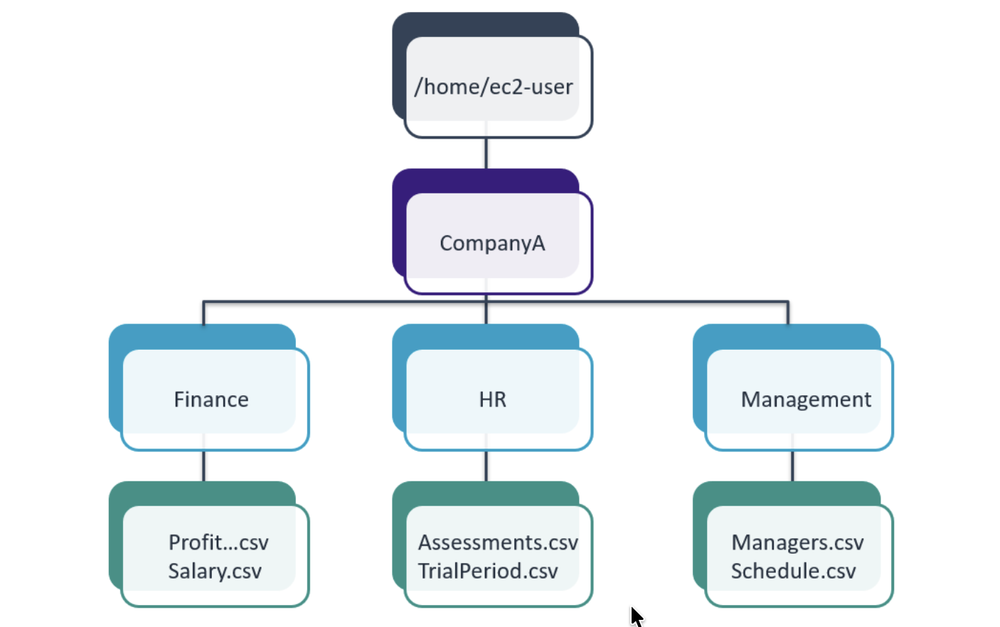

# Working with the Linux File System

<p align="center">
  
</p>

## Lab Objectives
In this lab, I learnt how to:
- Create a folder structure that this lab provides
- Create files
- Copy and move files and directories
- Delete files and directories

## Task 1: Use SSH to connect to an Amazon Linux EC2 instance

In this task, I will connect to a Amazon Linux EC2 instance. I run macOS and will use an SSH utility to perform all of these operations. The Amazon EC2 instance is configured as part of this lab environment. 

I downloaded the file labsuser.pem from the lab environment and saved the PublicIP address, which for my lab is PublicIP 52.89.133.8. From my terminal, I changed the permissions on the key to be read-only using my PublicIP allowing the first connection to this remote SSH server. 

#### Connect to the EC2 Instance

```bash
kylescritten@Kyles-MacBook-Air ~ % cd ~/Downloads
kylescritten@Kyles-MacBook-Air Downloads % chmod 400 labsuser.pem
kylescritten@Kyles-MacBook-Air Downloads % ssh -i labsuser.pem ec2-user@52.89.133.8
The authenticity of host '52.89.133.8 (52.89.133.8)' can't be established.
ED25519 key fingerprint is: SHA256:vaqLQag6pix7Lt/7LzlJHXYFmLhXni9oyHsmPb0T3QM
This key is not known by any other names.
Are you sure you want to continue connecting (yes/no/[fingerprint])? yes
```
#### Terminal Output
```text
Warning: Permanently added '52.89.133.8' (ED25519) to the list of known hosts.
** WARNING: connection is not using a post-quantum key exchange algorithm.
** This session may be vulnerable to "store now, decrypt later" attacks.
** The server may need to be upgraded. See https://openssh.com/pq.html
   ,     #_
   ~\_  ####_        Amazon Linux 2
  ~~  \_#####\
  ~~     \###|       AL2 End of Life is 2026-06-30.
  ~~       \#/ ___
   ~~       V~' '->
    ~~~         /    A newer version of Amazon Linux is available!
      ~~._.   _/
         _/ _/       Amazon Linux 2023, GA and supported until 2028-03-15.
       _/m/'           https://aws.amazon.com/linux/amazon-linux-2023/

[ec2-user@ip-10-0-10-94 ~]$
```

## Task 2: Create a Folder Structure
In this task, I created a specific folder structure on a Linux machine. A reference image of the required files and folders was provided, and my objective was to recreate the same structure accurately.

Using the Linux terminal, I created the directories and files needed to match the provided folder structure on the machine.

```bash
/home/ec2-user/CompanyA/
/home/ec2-user/CompanyA/Finance/
/home/ec2-user/CompanyA/Finance/ProfitAndLossStatements.csv
/home/ec2-user/CompanyA/Finance/Salary.csv
/home/ec2-user/CompanyA/HR/
/home/ec2-user/CompanyA/HR/Assessments.csvv
/home/ec2-user/CompanyA/HR/TrialPeriod.csv
/home/ec2-user/CompanyA/Management/
/home/ec2-user/CompanyA/Management/Managers.csv
/home/ec2-user/CompanyA/Management/Schedule.csv
```

1. I created the top-level ```CompanyA``` folder
2. I changed to the ```CompanyA``` directory and created the subfolders ```Finance HR Management```
3. To create the empty files inside the ```HR``` folder, I changed to the ```HR``` directory then entered the ```touch``` command
4. To create the empty files inside the ```Finance``` folder, I changed to the ```Finance``` directory then entered the ```touch``` command
5. Change directories back one level to the ```CompanyA``` folder and create the new empty files in the ```Management``` folder using the ```touch``` command
6. To validate that all the files and folders from the ```CompanyA``` folder down have been created, I entered ```ls -laR```


