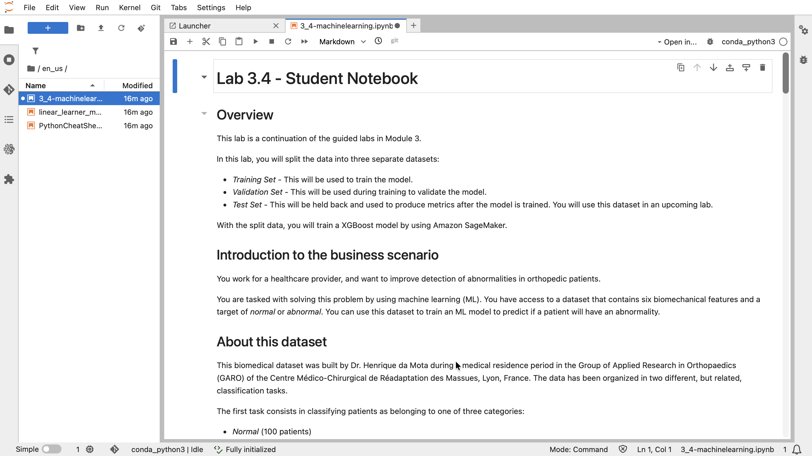

# Training a Machine Learning Model

## Lab overview

In this lab, I continue exploring the biomechanical vertebral column dataset. I split the dataset into three separate datasets:
* **Training Set** — used to train the model
* **Validation Set** — used during training to validate the model
* **Test Set** — held back and used to produce metrics after the model is trained; this dataset is used in an upcoming lab

With the split data, I train a machine learning (ML) model using the XGBoost algorithm in Amazon SageMaker.

## Introduction to the business scenario

I work for a healthcare provider and want to improve the detection of abnormalities in orthopedic patients. I am tasked with solving this problem using machine learning (ML). I have access to a dataset that contains six biomechanical features and a target of normal or abnormal, which I can use to train an ML model to predict whether a patient will have an abnormality.

### About this dataset

This biomedical dataset was built by Dr. Henrique da Mota during a medical residency period in the Group of Applied Research in Orthopaedics (GARO) of the Centre Médico-Chirurgical de Réadaptation des Massues, Lyon, France. The data has been organized into two different, but related, classification tasks.

The first task consists of classifying patients as belonging to one of three categories:

* Normal (100 patients)
* Disk Hernia (60 patients)
* Spondylolisthesis (150 patients)

For the second task, the categories Disk Hernia and Spondylolisthesis were merged into a single category labeled as abnormal. Thus, the second task consists of classifying patients as belonging to one of two categories: Normal (100 patients) or Abnormal (210 patients).

For more information about this dataset, see the [Vertebral Column dataset webpage](http://archive.ics.uci.edu/ml/datasets/Vertebral+Column).

## Task 1: Accessing a notebook instance in Amazon SageMaker

In this task, I open my JupyterLab environment and switch to the notebook to complete the lab.

To open JupyterLab:
1. At the top of the AWS Management Console, in the search bar, I search for and choose `Amazon SageMaker AI`.
2. From the navigation menu on the left, I expand the **Applications and IDEs** section, choose **Notebooks**, then choose the **Notebook instances** tab from the lower pane.
3. I look for the notebook instance named `MyNotebook`, and open the JupyterLab notebook instance by going to the end of the row and choosing **Open JupyterLab**.

<p align="center">
  
</p>

## Task 2: Opening a notebook in my notebook instance

In this task, I open the notebook for this lab:
1. In my JupyterLab environment, I go to the file browser in the left pane and locate the `3_4-machinelearning.ipynb` file.
2. I open the `en_us/3_4-machinelearning.ipynb` file by choosing it.
3. For the remainder of the lab, I follow the instructions in the notebook.

<p align="center">
  
</p>

## Task 3: Working in the Jupyter Notebook

### Data Import and Exploration

I loaded the dataset from an external source and converted it into a pandas DataFrame.

```python
import warnings, requests, zipfile, io
warnings.simplefilter('ignore')
import pandas as pd
from scipy.io import arff
import boto3

f_zip = 'http://archive.ics.uci.edu/ml/machine-learning-databases/00212/vertebral_column_data.zip'
r = requests.get(f_zip, stream=True)
Vertebral_zip = zipfile.ZipFile(io.BytesIO(r.content))
Vertebral_zip.extractall()

data = arff.loadarff('column_2C_weka.arff')
df = pd.DataFrame(data[0])

class_mapper = {b'Abnormal':1,b'Normal':0}
df['class']=df['class'].replace(class_mapper)
```

I verified the dataset structure. First, use `shape` to examine the number of rows and columns.

```python
df.shape
```

#### Output
```text
(310, 7)
```

Next, get a list of the columns.

```python
df.columns
```

#### Output
```text
Index(['pelvic_incidence', 'pelvic_tilt', 'lumbar_lordosis_angle',
       'sacral_slope', 'pelvic_radius', 'degree_spondylolisthesis', 'class'],
      dtype='object')
```

## Conclusion

After completing this lab, I am able to:
* Split the dataset into training, validation, and test sets
* Prepare and upload the data to Amazon S3
* Train an XGBoost model using Amazon SageMaker

## Additional resources

* [train_test_split function](https://scikit-learn.org/stable/modules/generated/sklearn.model_selection.train_test_split.html)
* [scikit-learn library](https://scikit-learn.org/stable/)
