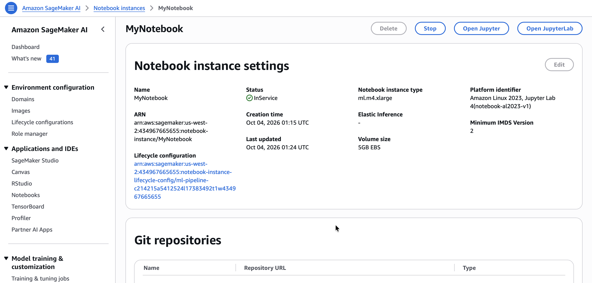
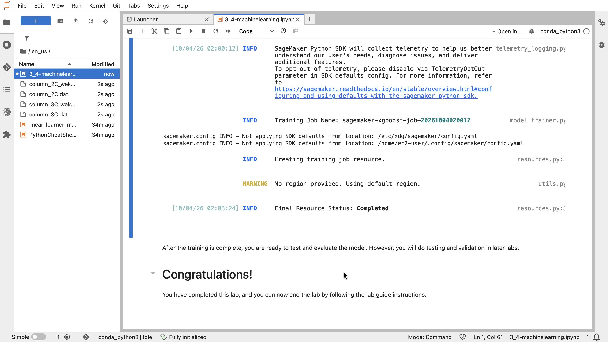

# Training a Machine Learning Model

In this lab, I continue exploring the biomechanical vertebral column dataset. I split the dataset into three separate datasets:
* **Training Set** — used to train the model
* **Validation Set** — used during training to validate the model
* **Test Set** — held back and used to produce metrics after the model is trained; this dataset is used in an upcoming lab

With the split data, I train a machine learning (ML) model using the XGBoost algorithm in Amazon SageMaker.

## Introduction to the business scenario

I work for a healthcare provider and want to improve the detection of abnormalities in orthopedic patients. I am tasked with solving this problem using machine learning (ML). I have access to a dataset that contains six biomechanical features and a target of normal or abnormal, which I can use to train an ML model to predict whether a patient will have an abnormality.

### About this dataset

This biomedical dataset was built by Dr. Henrique da Mota during a medical residency period in the Group of Applied Research in Orthopaedics (GARO) of the Centre Médico-Chirurgical de Réadaptation des Massues, Lyon, France. The data has been organized into two different, but related, classification tasks.

The first task consists of classifying patients as belonging to one of three categories:

* Normal (100 patients)
* Disk Hernia (60 patients)
* Spondylolisthesis (150 patients)

For the second task, the categories Disk Hernia and Spondylolisthesis were merged into a single category labeled as abnormal. Thus, the second task consists of classifying patients as belonging to one of two categories: Normal (100 patients) or Abnormal (210 patients).

For more information about this dataset, see the [Vertebral Column dataset webpage](http://archive.ics.uci.edu/ml/datasets/Vertebral+Column).

## Task 1: Accessing a notebook instance in Amazon SageMaker

In this task, I open my JupyterLab environment and switch to the notebook to complete the lab.

To open JupyterLab:
1. At the top of the AWS Management Console, in the search bar, I search for and choose `Amazon SageMaker AI`.
2. From the navigation menu on the left, I expand the **Applications and IDEs** section, choose **Notebooks**, then choose the **Notebook instances** tab from the lower pane.
3. I look for the notebook instance named `MyNotebook`, and open the JupyterLab notebook instance by going to the end of the row and choosing **Open JupyterLab**.

<p align="center">
  
</p>

## Task 2: Opening a notebook in my notebook instance

In this task, I open the notebook for this lab:
1. In my JupyterLab environment, I go to the file browser in the left pane and locate the `3_4-machinelearning.ipynb` file.
2. I open the `en_us/3_4-machinelearning.ipynb` file by choosing it.
3. For the remainder of the lab, I follow the instructions in the [notebook](./files/3_4-machinelearning.ipynb).

## Task 3: Working in the Jupyter Notebook

### Data Import and Exploration

I loaded the dataset from an external source and converted it into a pandas DataFrame.

```python
import warnings, requests, zipfile, io
warnings.simplefilter('ignore')
import pandas as pd
from scipy.io import arff
import boto3

f_zip = 'http://archive.ics.uci.edu/ml/machine-learning-databases/00212/vertebral_column_data.zip'
r = requests.get(f_zip, stream=True)
Vertebral_zip = zipfile.ZipFile(io.BytesIO(r.content))
Vertebral_zip.extractall()

data = arff.loadarff('column_2C_weka.arff')
df = pd.DataFrame(data[0])

class_mapper = {b'Abnormal':1,b'Normal':0}
df['class']=df['class'].replace(class_mapper)
```

I verified the dataset structure. First, use `shape` to examine the number of rows and columns.

```python
df.shape
```

#### Output
```text
(310, 7)
```

Next, get a list of the columns.

```python
df.columns
```

#### Output
```text
Index(['pelvic_incidence', 'pelvic_tilt', 'lumbar_lordosis_angle',
       'sacral_slope', 'pelvic_radius', 'degree_spondylolisthesis', 'class'],
      dtype='object')
```

### Moving the target column position

XGBoost requires the training data to be in a single file, with the target value as the first column. 

I get the target column and move it to the first position.

```python
cols = df.columns.tolist()
cols = cols[-1:] + cols[:-1]
df = df[cols]
```

I see that the `class` is now the first column.

```python
df.columns
```

#### Output
```text
Index(['class', 'pelvic_incidence', 'pelvic_tilt', 'lumbar_lordosis_angle',
       'sacral_slope', 'pelvic_radius', 'degree_spondylolisthesis'],
      dtype='object')
```

### Splitting the data

I start by splitting the dataset into two datasets. I use one dataset for training, and split the other dataset again for use with validation and testing.

Because I don't have a lot of data, I want to make sure the split datasets contain a representative amount of each class. Thus, I use the stratify switch. Finally, I use a random number so that I can repeat the splits.

```python
from sklearn.model_selection import train_test_split
train, test_and_validate = train_test_split(df, test_size=0.2, random_state=42, stratify=df['class'])
```

Next, split the `test_and_validate` dataset into two equal parts.

```python
test, validate = train_test_split(test_and_validate, test_size=0.5, random_state=42, stratify=test_and_validate['class'])
```

Examine the three datasets.

```python
print(train.shape)
print(test.shape)
print(validate.shape)
```

#### Output
```text
(248, 7)
(31, 7)
(31, 7)
```

Now, I check the distribution of the classes.

```python
print(train['class'].value_counts())
print(test['class'].value_counts())
print(validate['class'].value_counts())
```

#### Output
```text
class
1    168
0     80
Name: count, dtype: int64
class
1    21
0    10
Name: count, dtype: int64
class
1    21
0    10
Name: count, dtype: int64
```

### Uploading the data to Amazon S3

XGBoost loads the data for training from Amazon Simple Storage Service (Amazon S3). 

I start by setting up some variables for the S3 bucket, then create a function to upload the CSV file to Amazon S3, which I can reuse.

To write the `csv_buffer` to Amazon S3 as an object, I use the `put` operation on the `object`, which is a property of the `bucket`.

```python
bucket='c214215a5412524l17383492t1w434967665655-labbucket-too8epxnib7h'

prefix='lab3'

train_file='vertebral_train.csv'
test_file='vertebral_test.csv'
validate_file='vertebral_validate.csv'

import os

s3_resource = boto3.Session().resource('s3')
def upload_s3_csv(filename, folder, dataframe):
    csv_buffer = io.StringIO()
    dataframe.to_csv(csv_buffer, header=False, index=False)
    s3_resource.Bucket(bucket).Object(os.path.join(prefix, folder, filename)).put(Body=csv_buffer.getvalue())
```

I use the function I created to upload the three datasets.

```python
upload_s3_csv(train_file, 'train', train)
upload_s3_csv(test_file, 'test', test)
upload_s3_csv(validate_file, 'validate', validate)
```

### Training the model

Now that the data is in Amazon S3, I can train a model. The first step is to get the XGBoost container URI:

```python
import boto3
from sagemaker.core.image_uris import retrieve
container = retrieve(framework='xgboost', region=boto3.Session().region_name, version='1.0-1')
```

Next, I set some *hyperparameters* for the model. Because this is the first time I am training the model, I use some values to get started.

```python
hyperparams={"num_round":"42",
             "eval_metric": "auc",
             "objective": "binary:logistic"}
```

I use the **estimator** function to set up the model. 

>[!Note]
> A few parameters of interest:
>* **instance_count** — defines how many instances will be used for training; I use one instance
>* **instance_type** — defines the instance type for training; in this case, it's `ml.m4.xlarge`

```python
from sagemaker.train import ModelTrainer
from sagemaker.train.configs import Compute, OutputDataConfig, InputData
from sagemaker.core.helper.session_helper import Session, get_execution_role

s3_output_location="s3://{}/{}/output/".format(bucket,prefix)

xgb_model = ModelTrainer(
    training_image=container,
    role=get_execution_role(),
    compute=Compute(instance_type='ml.m5.4xlarge', instance_count=1),
    output_data_config=OutputDataConfig(s3_output_path=s3_output_location),
    hyperparameters=hyperparams,
    sagemaker_session=Session())
```

The estimator needs channels to feed data into the model. For training, I use the `train_channel` and `validate_channel`.

```python
train_channel = InputData(
    channel_name='train',
    data_source="s3://{}/{}/train/".format(bucket,prefix,train_file),
    content_type='text/csv')

validate_channel = InputData(
    channel_name='validation',
    data_source="s3://{}/{}/validate/".format(bucket,prefix,validate_file),
    content_type='text/csv')

data_channels = [train_channel, validate_channel]
```

Running **fit** will train the model. This process can take up to 5 minutes.

```python
xgb_model.train(input_data_config=data_channels, logs=False)
```

<p align="center">
  
</p>

After the training is complete, I am ready to test and evaluate the model.

## Conclusion

After completing this lab, I am able to:
* Split the dataset into training, validation, and test sets
* Prepare and upload the data to Amazon S3
* Train an XGBoost model using Amazon SageMaker

## Additional resources

* [train_test_split function](https://scikit-learn.org/stable/modules/generated/sklearn.model_selection.train_test_split.html)
* [scikit-learn library](https://scikit-learn.org/stable/)
