# Monitoring Infrastructure

The ability to monitor my applications and infrastructure is critical for delivering reliable, consistent IT services.

Monitoring requirements range from collecting statistics for long-term analysis to quickly reacting to changes and outages. Monitoring can also support compliance reporting by continuously checking that infrastructure is meeting organizational standards.

This lab shows me how to use Amazon CloudWatch Metrics, Amazon CloudWatch Logs, Amazon CloudWatch Events, and AWS Config to monitor my applications and infrastructure.

## Task 1: Installing the CloudWatch agent

In this task, I use Systems Manager to install the CloudWatch agent on an EC2 instance, and configure it to collect both application and system metrics.

<p align="center">
  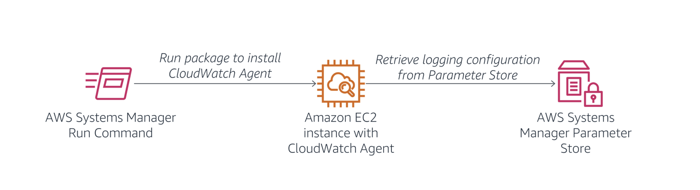
</p>

>[!Note]
> I can use the CloudWatch agent to collect metrics from EC2 instances and on-premises servers, including:
> * System-level metrics from EC2 instances, such as CPU allocation, free disk space, and memory utilization — these metrics are collected from the machine itself and complement the standard CloudWatch metrics that CloudWatch collects
>  * System-level metrics from on-premises servers, enabling the monitoring of hybrid environments and servers not managed by AWS
> * System and application logs from both Linux and Windows servers
> * Custom metrics from applications and services using the [StatsD](https://github.com/etsy/statsd) and [collectd](https://collectd.org/) protocols

In the AWS Management Console, I select **Systems Manager** from the **Services** menu, then choose **Run Command** in the left navigation pane. I use Run Command to deploy a pre-written command that installs the CloudWatch agent, choosing **Run a Command** and selecting the button next to **AWS-ConfigureAWSPackage**. In the **Command parameters** section, I set **Action** to Install, **Name** to `AmazonCloudWatchAgent`, and **Version** to `latest`. In the **Targets** section, I select **Choose instances manually** and select the check box next to **Web Server**, installing the CloudWatch agent on the web server.

I choose **Run** and wait for the **Overall status** to change to **Success**, occasionally refreshing the page to check progress. To confirm the job ran successfully, I choose the instance under **Targets and outputs**, click **View output**, and expand **Step 1 - Output**, where I see the message "Successfully installed arn:aws:ssm:::package/AmazonCloudWatchAgent." 

>[!Caution]
> Since the instance was created from a Linux AMI, if I instead see a precondition skip message referencing `createDownloadFolder`, I check **Step 2 - Output** instead — this is expected and can be safely ignored.

<p align="center">
  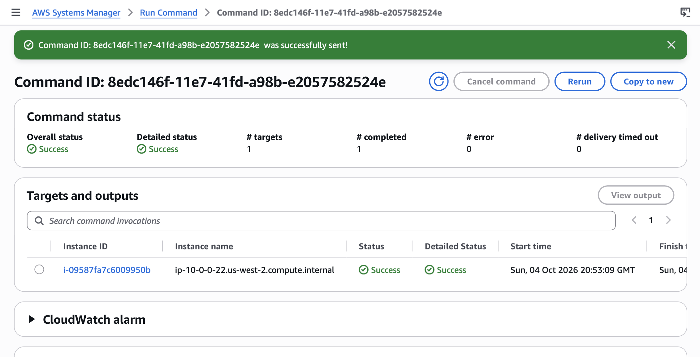
</p>

I now configure the CloudWatch agent to collect the desired log information. Since the instance has a web server installed, I configure the agent to collect the web server logs and general system metrics, storing the configuration file in AWS Systems Manager Parameter Store so the CloudWatch agent can retrieve it. 

In the left navigation pane, I choose **Parameter Store**, then **Create parameter**, and set **Name** to `Monitor-Web-Server`, **Description** to `Collect web logs and system metrics`, and paste the following configuration as the **Value**:

```json
{
  "logs": {
    "logs_collected": {
      "files": {
        "collect_list": [
          {
            "log_group_name": "HttpAccessLog",
            "file_path": "/var/log/httpd/access_log",
            "log_stream_name": "{instance_id}",
            "timestamp_format": "%b %d %H:%M:%S"
          },
          {
            "log_group_name": "HttpErrorLog",
            "file_path": "/var/log/httpd/error_log",
            "log_stream_name": "{instance_id}",
            "timestamp_format": "%b %d %H:%M:%S"
          }
        ]
      }
    }
  },
  "metrics": {
    "metrics_collected": {
      "cpu": {
        "measurement": [
          "cpu_usage_idle",
          "cpu_usage_iowait",
          "cpu_usage_user",
          "cpu_usage_system"
        ],
        "metrics_collection_interval": 10,
        "totalcpu": false
      },
      "disk": {
        "measurement": [
          "used_percent",
          "inodes_free"
        ],
        "metrics_collection_interval": 10,
        "resources": [
          "*"
        ]
      },
      "diskio": {
        "measurement": [
          "io_time"
        ],
        "metrics_collection_interval": 10,
        "resources": [
          "*"
        ]
      },
      "mem": {
        "measurement": [
          "mem_used_percent"
        ],
        "metrics_collection_interval": 10
      },
      "swap": {
        "measurement": [
          "swap_used_percent"
        ],
        "metrics_collection_interval": 10
      }
    }
  }
}
```

This configuration defines two web server log files to be collected and sent to CloudWatch Logs, along with CPU, disk, and memory metrics to be sent to CloudWatch Metrics. I choose **Create parameter**; this parameter is referenced when starting the CloudWatch agent.

<p align="center">
  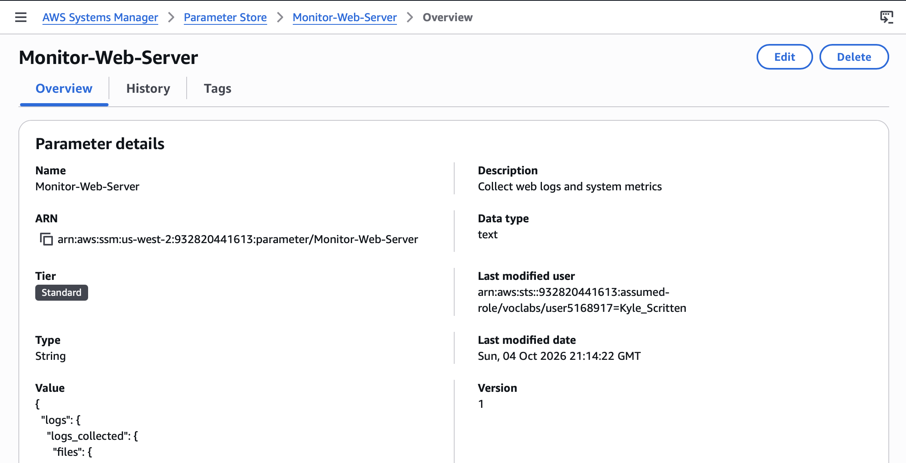
</p>

I now use another Run Command to start the CloudWatch agent on the web server. In the left navigation pane, I choose **Run Command**, then **Run command**, and filter by **Document name prefix : Equals : AmazonCloudWatch-ManageAgent**. Before running the command, I view its definition by choosing **AmazonCloudWatch-ManageAgent**, which opens a new tab showing the command's details. On the **Content** tab, I see the script that runs on the target instance, which references AWS Systems Manager Parameter Store to retrieve the CloudWatch agent configuration I defined earlier. I close this tab and return to the **Run a command** tab.

I select the button next to **AmazonCloudWatch-ManageAgent**, and in the **Command parameters** section, set **Action** to configure, **Mode** to ec2, **Optional Configuration Source** to ssm, **Optional Configuration Location** to `Monitor-Web-Server`, and **Optional Restart** to yes — configuring the agent to use the configuration I previously stored in Parameter Store. In the **Targets** section, I select **Choose instances manually**, select the check box next to **Web Server**, and choose **Run**.

<p align="center">
  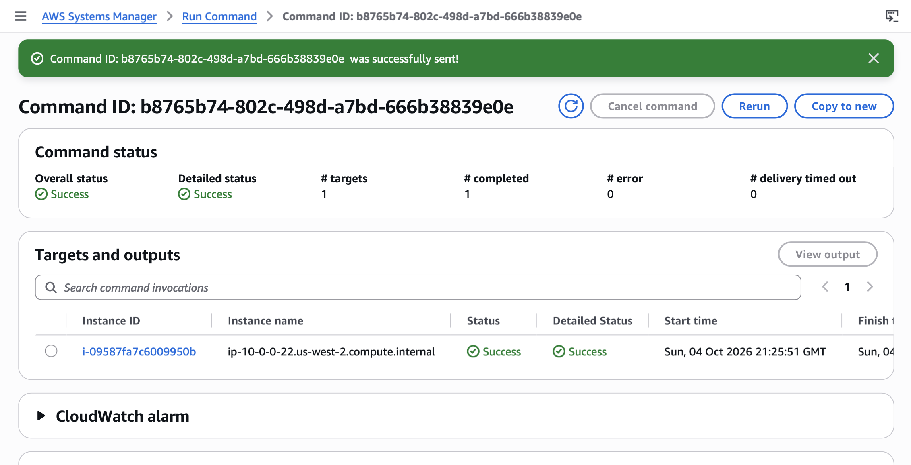
</p>

I wait for the **Overall status** to change to **Success**, occasionally refreshing to check progress. The CloudWatch agent is now running on the instance and sending log and metric data to CloudWatch.

## Task 2: Monitoring application logs using CloudWatch Logs

In this task, I generate log data on the Web Server and then monitor the logs using CloudWatch Logs.

<p align="center">
  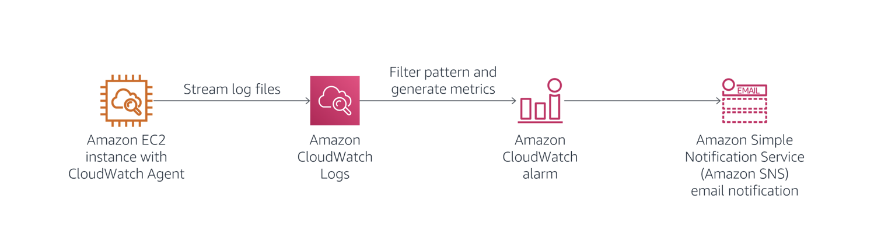
</p>

>[!Note]
> I can use CloudWatch Logs to monitor applications and systems using log data. CloudWatch Logs uses existing log data for monitoring, so no code changes are required. For example, I can monitor application logs for specific literal terms (such as `"NullReferenceException"`) or count the number of occurrences of a literal term at a particular position in log data (such as `404` status codes in a web server access log). When the term I'm searching for is found, CloudWatch Logs reports the data to a CloudWatch metric I specify. Log data is encrypted while in transit and while at rest. 
>
> The Web Server generates two types of log data:
> * Access logs
> * Error logs.

I begin by accessing the web server.

I choose the **Details** dropdown menu above these instructions, choose **Show**, and copy the `WebServerIP` value. I open a new web browser tab, paste `35.91.110.87`, confirming I see a web server Test Page.

<p align="center">
  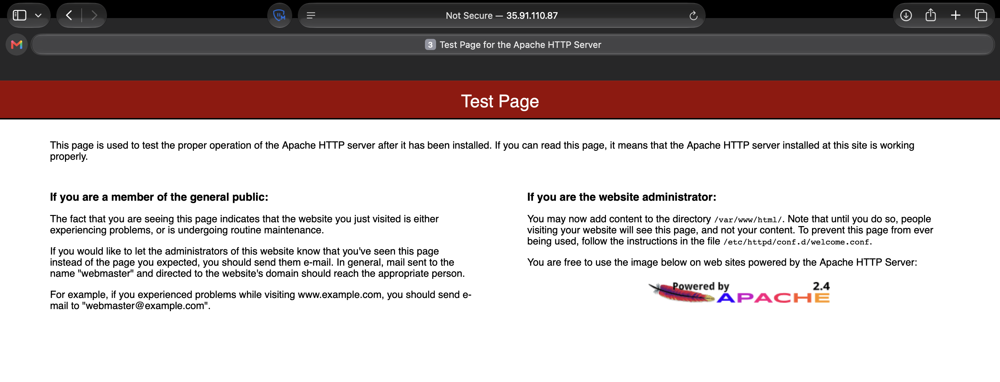
</p>

I now generate log data by attempting to access a page that does not exist. I append `/start` to the browser URL and press Enter, receiving an error message since the page is not found — this is expected, and it generates data in the access logs being sent to CloudWatch Logs.

<p align="center">
  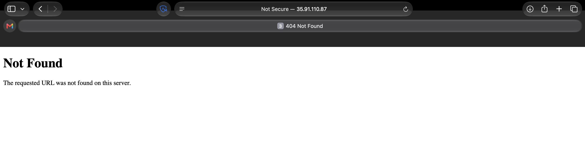
</p>

I keep this tab open, but return to the AWS Management Console tab. From the **Services** menu, I choose **CloudWatch**, then in the left navigation pane, choose **Log Management**, where I see two logs listed: `HttpAccessLog` and `HttpErrorLog`.

<p align="center">
  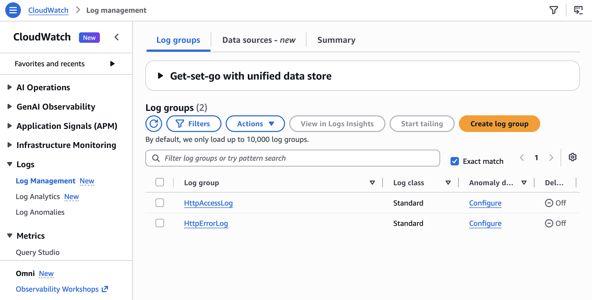
</p>

I choose **HttpAccessLog**, then in the **Log streams** section, choose the log stream in the table — it shares the same ID as the EC2 instance the log is attached to. Log data is displayed, consisting of GET requests sent to the web server, and I can view additional information by expanding each line to see details about the computer and browser that made the request. I find a line with my `/start` request showing a code of 404, confirming the page was not found.

<p align="center">
  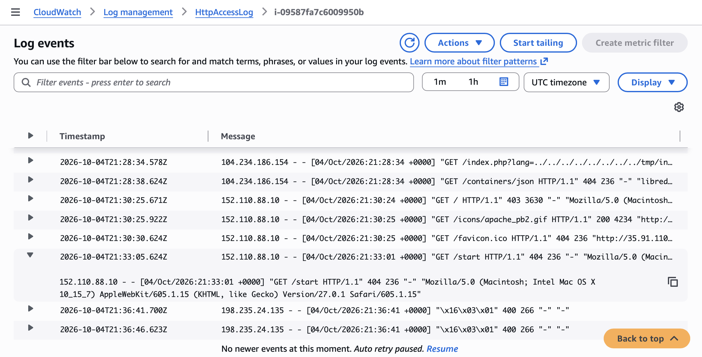
</p>

This demonstrates how log files can be automatically shipped from an EC2 instance or an on-premises server to CloudWatch Logs. The log data is accessible without having to log in to each individual server, and can also be collected from multiple servers, such as an Auto Scaling fleet of web servers.

### Create a metric filter in CloudWatch Logs

I now configure a filter to identify 404 errors in the log file. This error would normally indicate that the web server is generating invalid links that users are selecting.

In the left navigation pane, I choose **Log management**, select the check box next to **HttpAccessLog**, and from the **Actions** dropdown menu, select **Create metric filter**. A filter pattern defines the fields in the log file and filters the data for specific values, so I paste the following line into the **Filter pattern** box:

```bash
[ip, id, user, timestamp, request, status_code=404, size]
```

>[!Note]
> This line tells CloudWatch Logs how to interpret the fields in the log data and defines a filter to find lines only with `status_code=404`, indicating that a page was not found.

In the **Test pattern** section, I use the dropdown menu to select the EC2 instance ID (similar to `i-0f07ab62aae4xxxx9`), choose **Test pattern**, then in the **Results** section, choose **Show test results**. I confirm at least one result with a `$status_code` of 404, indicating a page was requested that was not found.

I choose **Next**, and in the **Create filter name** section, enter `404Errors` as the **Filter name**. In the **Metric details** section, I configure the following:
* **Metric namespace:** `LogMetrics`
* **Metric name:** `404Errors`
* **Metric value:** `1`

I choose **Next** (clicking an empty text field first if the button isn't enabled, to shift focus), then on the **Review and create** page, choose **Create metric filter**. 

<p align="center">
  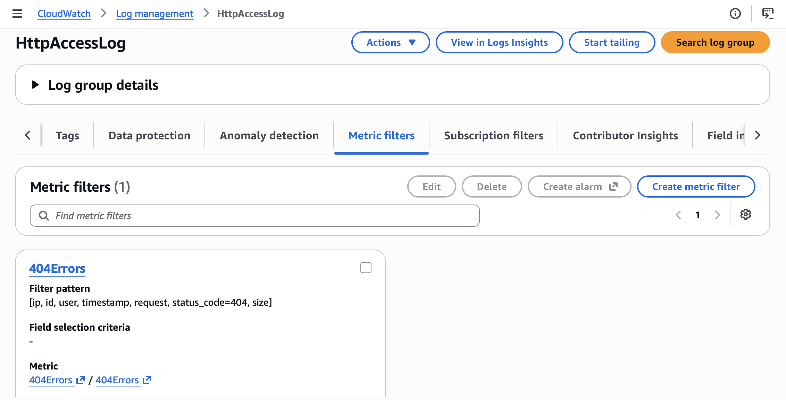
</p>

This metric filter can now be used in an alarm.

### Create an alarm using the filter

I now configure an alarm to send a notification when too many 404 Not Found errors are received.

In the `404Errors` panel, I select the check box in the top-right corner, then in the **Metric filters** section, choose **Create alarm**. In the **Metrics** section, I set **Period** to **1 minute**, and in the **Conditions** section, configure the alarm to trigger **Whenever 404Errors is Greater/Equal than** `5`. I choose **Next**.

In the **Notification** section, I select **Create new topic** for the SNS Topic, enter an email address I can access from the classroom as the endpoint, choose **Create topic**, then **Next**. For **Name and description**, I enter `404 Errors` as the **Alarm name** and `Alert when too many 404s detected on an instance` as the **Alarm description**, then choose **Next** and **Create alarm**.

<p align="center">
  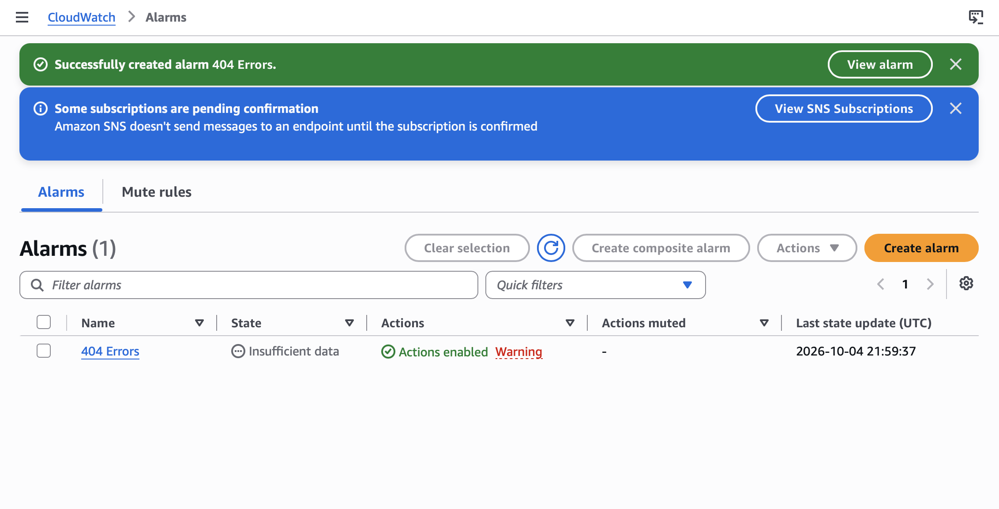
</p>

I go to my email, find the confirmation message, and select the **Confirm subscription** link. Returning to the AWS Management Console, I choose **CloudWatch** at the top of the left navigation pane, and notice my alarm appears in orange, indicating **Insufficient data** since no data has been received in the past minute.

I now access the web server to generate log data by returning to the web browser tab with the web server (or reopening it using the `35.91.110.87` from the **Details** dropdown if needed), and attempt to access pages that do not exist by appending a page name to the IP address — for example, `http://35.91.110.87/start2` — repeating this at least five times to generate separate log entries.

I wait 1–2 minutes for the alarm to trigger, occasionally refreshing the AWS Management Console to update the status. The graph on the CloudWatch page turns red, indicating it is now in the **Alarm** state.

<p align="center">
  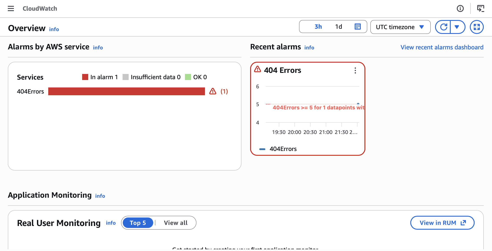
</p>

I check my email and confirm I received a message with the subject "ALARM: 404 Errors."

<p align="center">
  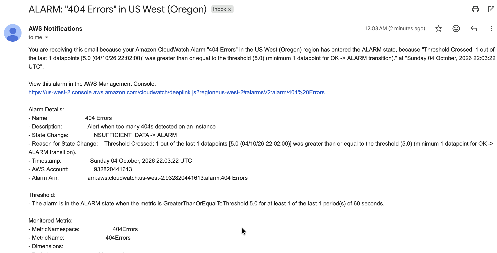
</p>

This task demonstrates how I can create an alarm from application log data and receive alerts when unusual behavior is detected in the log file. The log file remains accessible within CloudWatch Logs for further analysis to diagnose the activities that triggered the alarm.

## Task 3: Monitoring instance metrics using CloudWatch

In this task, I use metrics that CloudWatch provides.

<p align="center">
  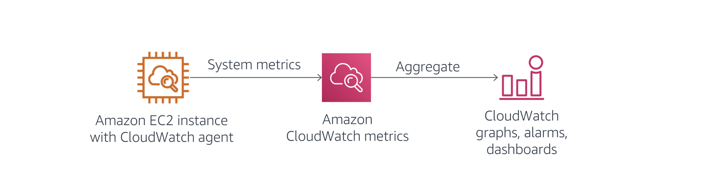
</p>

>[!Note]
> Metrics are data about the performance of my systems. CloudWatch stores metrics for the AWS services I use, and I can also publish my own application metrics either via the CloudWatch agent or directly from my application. CloudWatch can present these metrics for search, graphs, dashboards, and alarms.

On the EC2 Management Console, I select the **Web Server** instance and check the **Monitoring** tab, where CloudWatch captures metrics about CPU, disk, and network usage. These metrics view the instance from the outside as a virtual machine, but don't give insight into what's running inside it, such as free memory or free disk space. I can get that visibility instead through the CloudWatch agent, which runs inside the instance to collect these deeper metrics.

<p align="center">
  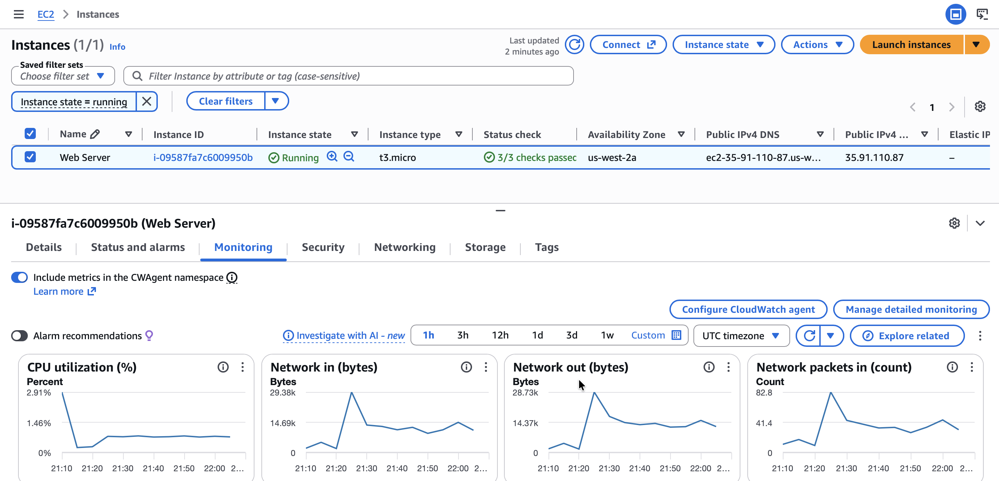
</p>

In CloudWatch, under **Metrics > All metrics**, I see the various metrics CloudWatch has collected — some automatically generated by AWS, and others collected by the CloudWatch agent. Selecting **CWAgent**, then **device, fstype, host, path**, shows the disk space metrics the agent is capturing.

<p align="center">
  
</p>

I explore the other metrics CloudWatch is capturing — these are automatically generated from the AWS services used in this account — and select the ones I want to appear on the graph.

<p align="center">
  
</p>

## Task 4: Creating real-time notifications

In this task, I create a real-time notification that informs me when an instance is stopped or terminated.

<p align="center">
  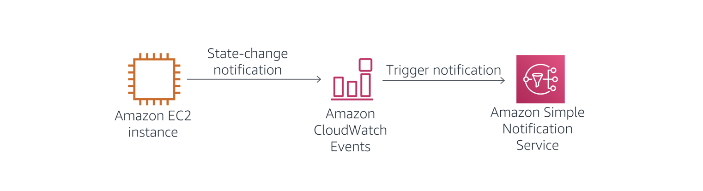
</p>

>[!Note]
> CloudWatch Events deliver a near-real-time stream of system events describing changes in AWS resources. Simple rules can match events and route them to one or more target functions or streams, allowing CloudWatch Events to become aware of operational changes as they occur.
>
> CloudWatch Events respond to these operational changes and take corrective action as necessary by sending messages to respond to the environment, activating functions, making changes, and capturing state information. I can also use CloudWatch Events to schedule automated actions that self-trigger at certain times using cron or rate expressions.

On the CloudWatch console, I expand **Events** in the left navigation pane, choose **Rules**, then **Create rule**.

In the **Rule definition**, I enter `Instance_Stopped_Terminated` as the **Name** and choose **Next**.

In the **Build event pattern** section, I confirm the **Event source** is **AWS Services**, choose **EC2** for the **AWS service**, and select **EC2 Instance State-change Notification** for **Event Type**. For **Event Type Specification 1**, I select **Specific state(s)**, then choose **stopped** and **terminated** from the dropdown menu, and choose **Next**.

<p align="center">
  
</p>

In the **Select target(s)** section, for **Target 1**, I set **Target types** to **AWS Service** and **Select a target** to **SNS topic**, then choose the **Default_CloudWatch_Alarms_Topic** for **Topic**. Under **Permissions**, I clear the **Use execution role (recommended)** checkbox, then choose **Next** twice.

On the **Review and create** page, I choose **Create rule**.

<p align="center">
  
</p>

### Configure a real-time notification

This task demonstrates how to receive real-time notifications when infrastructure changes.

>[!Note]
> You can configure Amazon Simple Notification Service (Amazon SNS) to send the real time notifications to your phone via SMS, or to your email address. Because configuring SMS messaging requires opening a ticket with AWS Support as well as time to configure the changes to your account, you will use the same email address you used earlier to complete this exercise.

On the **Services** menu, I choose **Simple Notification Service**, then **Topics** in the left navigation pane, and select the link in the **Name** column. I see a single subscription associated with my email address — the topic I configured in Task 2.

<p align="center">
  
</p>

On the **Services** menu, I choose **EC2**, then **Instances**, select the check box next to **Web Server**, and choose **Instance state > Stop instance > Stop**. The Web Server instance enters the **Stopping** state, and after a minute, enters the **Stopped** state.

<p align="center">
  
</p>

I then receive an email with details about the instance that was stopped. The message is formatted in JSON — to receive a more readable message, I could create an AWS Lambda function triggered by CloudWatch Events, which could format a more readable message and send it via Amazon SNS.

<p align="center">
  
</p>

## Task 5: Monitoring for infrastructure compliance

In this task, I activate AWS Config rules to ensure compliance of tagging and Amazon Elastic Block Store (Amazon EBS) volumes.

>[!Note]
> With AWS Config, you can assess, audit, and evaluate the configurations of your AWS resources. AWS Config continuously monitors and records your AWS resource configurations and allows you to automate the evaluation of recorded configurations against desired configurations.
>
> With AWS Config, you can review changes in configurations and relationships between AWS resources, dive into detailed resource configuration histories, and determine your overall compliance against the configurations specified in your internal guidelines. With AWS Config, you can simplify compliance auditing, security analysis, change management, and operational troubleshooting.

In the AWS Config console, I complete the initial setup wizard to activate the service for first use.

<p align="center">
  
</p>

I add the AWS managed rule `required-tags`, configuring it to require a `project` tag on each resource. This rule looks for resources missing a project tag, and takes a few minutes to complete evaluation.

<p align="center">
  
</p>

I also add the `ec2-volume-inuse-check` rule, which looks for EBS volumes that are not attached to EC2 instances.

<p align="center">
  
</p>

Once evaluation completes, I review the compliance results for each rule. Among the findings:
* **required-tags:** A compliant EC2 instance (since the Web Server has a project tag), and many non-compliant resources that do not have a project tag
* **ec2-volume-inuse-check:** One compliant volume (attached to an instance) and one non-compliant volume (not attached to an instance)

<p align="center">
  
</p>

AWS Config has a large library of pre-defined compliance checks, and I can create additional checks by writing my own AWS Config rule using Lambda.

## Conclusion

After completing this lab, I am able to successfully:

* Use the AWS Systems Manager Run Command to install the CloudWatch agent on Amazon Elastic Compute Cloud (Amazon EC2) instances
* Monitor application logs using the CloudWatch agent and CloudWatch Logs
* Monitor system metrics using the CloudWatch agent and CloudWatch Metrics
* Create real-time notifications using CloudWatch Events
* Track infrastructure compliance using AWS Config


## Additional resources

* [StatsD](https://github.com/statsd/statsd)
* [collectd](https://collectd.org)
* [Amazon SNS: Sending SMS Messages to Phone Numbers](https://docs.aws.amazon.com/sns/latest/dg/sns-mobile-phone-number-as-subscriber.html)
