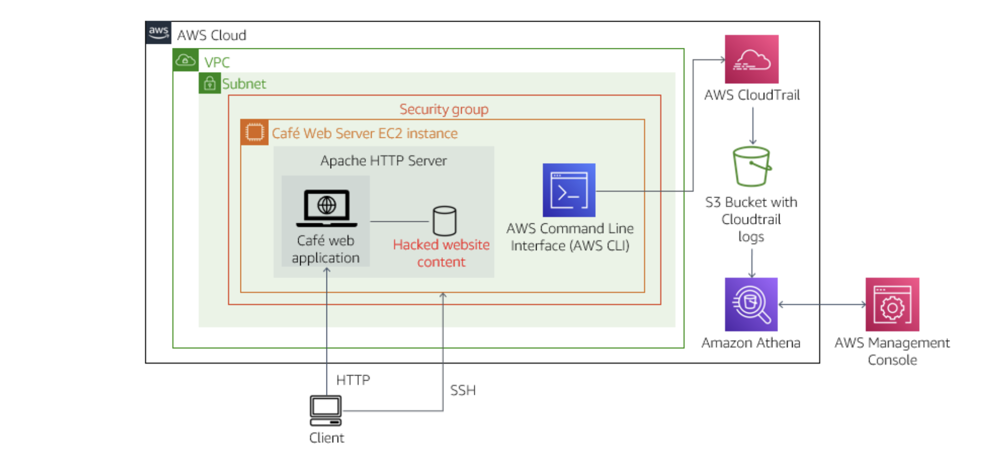
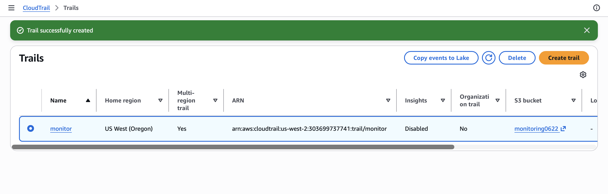
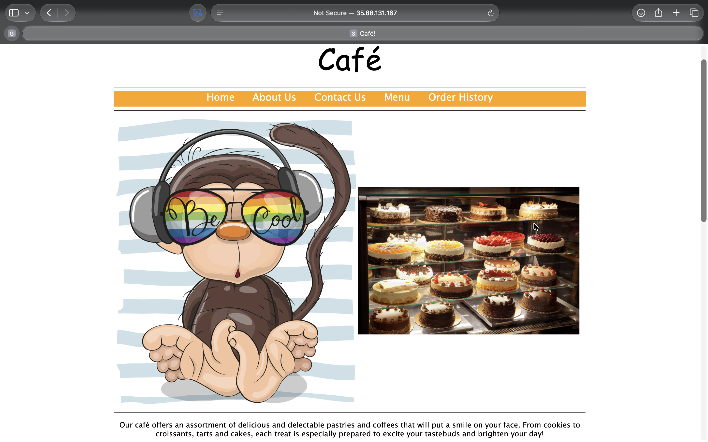
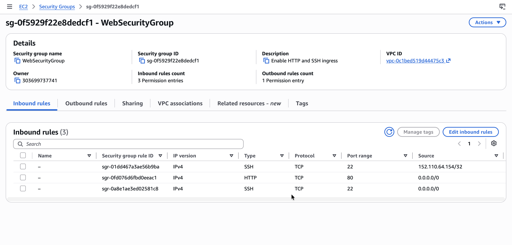

# Working with AWS CloudTrail

## Activity overview

In this activity, I create an AWS CloudTrail trail that audits actions taken in my account. I then investigate to determine who modified the Café website.

The activity starts with an Amazon Elastic Compute Cloud (Amazon EC2) instance named Café Web Server, which runs a web application that hosts the Café website.

I first observe that the website looks normal. Soon after creating a trail with CloudTrail, I notice that the website has been hacked, and that part of the hack involved an action during which someone modified the security group settings. I use a variety of methods to analyze the CloudTrail logs, including the Linux `grep` utility and the AWS Command Line Interface (AWS CLI), and then use Amazon Athena to search the CloudTrail logs further, working to identify the hacker. Once I discover the culprit, I remove that user's access and take steps to reduce the chances that the AWS account and the Café website will be hacked again.

<p align="center">
  
</p>

*The architectural diagram illustrates the setup that this activity uses.*

## Business case relevance

#### A new request from the Café leadership team

<p align="center">
  
</p>

Martha and Frank are concerned because the website was hacked. They are relying on me to discover who did it and to make sure it does not happen again.

Faythe, Frank, Martha, and others make frequent changes to the website, and sometimes those changes cause issues. This morning, it looks like the website was hacked, and Martha and Frank are asking me if there is a way to track what was changed and who made the changes.

I play the role of Sofîa, becoming a detective to discover the culprit.

## Task 1: Modifying a security group and observing the website

1. From the **Services** menu, I open the **EC2 Management Console**.
2. I choose **Instances**, locate and select the **Café Web Server (WebSecurityGroup)** instance, then in the **Security** tab, choose the `sg-xxxxxxxxxx` security group.
3. In the **Inbound rules** tab, I notice that only one inbound rule has been defined, for HTTP access over TCP port 80.
4. I choose **Edit inbound rules**, then **Add rule**, and configure it as follows:
   * **Type:** `SSH`
   * **Port Range:** `22`
   * **Source:** `My IP`

> [!NOTE]
> I confirm that the `TCP port 22` access is open only to my IP address. The entry should show a Classless Inter-Domain Routing (CIDR) block with a particular IP address followed by `/32`, not open to all IP addresses (which would be shown by `0.0.0.0/0`).

5. I observe the Café website: in **Instances**, I select the **Café Web Server** instance, click the **Details** tab, and copy the **Public IPv4 address** `35.88.131.167`. I open a new browser tab and navigate to `http://35.88.131.167/cafe/`.

<p align="center">
  
</p>

*I notice the website looks normal — for example, the photos are all appropriate for a bakery café.*


## Task 2: Creating a CloudTrail log and observing the hacked website

In this task, I create a CloudTrail trail in my AWS account, and soon after creating it, I notice that the Café website has been hacked.

### Task 2.1: Create a CloudTrail log

In the AWS Management Console, select **CloudTrail** and then in the left navigation pane, I choose **Trails**.

I choose **Create trail** and configure it as follows:

* **Trail name:** `monitor` (***important*** — I verify this is set exactly to `monitor`, or the activity will not work as intended)
* **Trail log bucket and folder:** I select **Create a new S3 bucket**, and enter `monitoring####` (where `####` is four random digits = 0622)
* **AWS KMS alias:** My initials followed by `-KMS` (for example, `kc-KMS`)

I choose **Next**, leave the **Choose log events** page at its defaults and choose **Next** again. Then on the **Review and create** page, choose **Create trail**. 

<p align="center">
  
</p>

*I verify that my new trail appears on the **Trails** page.*

### Task 2.2: Observe the hacked website

I return to the browser tab with the Café website open and refresh the page — it may take up to a minute for the hack to occur, and since the browser may be caching images, I hold Shift while clicking refresh to force the latest version to load.

I notice the website has been hacked — an incorrect image has appeared where it shouldn't be. It's now up to me to figure out who hacked the website, and it's fortunate I enabled CloudTrail just before this happened, since it can provide valuable information about what users have been doing in my account.

<p align="center">
  
</p>

I observe the `Café Web Server` instance details, checking for anything suspicious. In the **Security** tab, I choose the `sg-xxxxxxxxxx` security group again, then the **Inbound rules** tab, and notice an unexpected extra entry. While I still see the rule I created earlier — opening `port 22` to only my IP address — there's now an additional inbound rule allowing SSH access from anywhere (`0.0.0.0/0`).

<p align="center">
  
</p>

*Someone added this security hole, and I need to search the CloudTrail logs to find out who.*


## Task 3: Analyzing the CloudTrail logs using grep

In this task, I analyze the CloudTrail logs using the `grep` Linux utility to see if I can figure out who hacked the website.

### Task 3.1: Connect to the Café Web Server host EC2 instance using SSH

In this task, I connect to the Café Web Server EC2 instance using SSH. I run macOS and will use an SSH utility to perform all of these operations. The Amazon EC2 instance is configured as part of this lab environment. 

I downloaded the file labsuser.pem from the lab environment and saved the PublicIP from the Café Web Server EC2 instance, which for my lab is the Public IPv4 address `35.88.131.167`.

From my terminal, I changed the permissions on the key to be read-only using my PublicIP allowing the first connection to this remote SSH server. 

#### Connect to the Café Web Server Instance

```bash
kylescritten@MacBookAir ~ % cd ~/Downloads
kylescritten@MacBookAir Downloads % chmod 400 labsuser.pem
kylescritten@MacBookAir Downloads % ssh -i labsuser.pem ec2-user@35.88.131.167
The authenticity of host '35.88.131.167 (35.88.131.167)' can't be established.
ED25519 key fingerprint is: SHA256:s23CcMc65fYJSDybVxyJufwLnzaCN4tYJ9nCjIgCz2k
This key is not known by any other names.
Are you sure you want to continue connecting (yes/no/[fingerprint])? yes
```

#### Terminal Output
```text
Warning: Permanently added '35.88.131.167' (ED25519) to the list of known hosts.
** WARNING: connection is not using a post-quantum key exchange algorithm.
** This session may be vulnerable to "store now, decrypt later" attacks.
** The server may need to be upgraded. See https://openssh.com/pq.html
   ,     #_
   ~\_  ####_        Amazon Linux 2
  ~~  \_#####\
  ~~     \###|       AL2 End of Life is 2026-06-30.
  ~~       \#/ ___
   ~~       V~' '->
    ~~~         /    A newer version of Amazon Linux is available!
      ~~._.   _/
         _/ _/       Amazon Linux 2023, GA and supported until 2029-06-30.
       _/m/'           https://aws.amazon.com/linux/amazon-linux-2023/

[ec2-user@web-server ~]$
```

### Task 3.2: Download and extract the CloudTrail logs

I verify that my terminal is connected via SSH to the `Café Web Server` EC2 instance.

I run the following command to create a local directory on the web server to download the CloudTrail log files to, then change into that directory:
```bash
mkdir ctraillogs

cd ctraillogs
```

The following command is run to list the buckets and recall the bucket name:
```bash
aws s3 ls
```

Then I run the following command to download the CloudTrail logs, substituting my actual bucket name:
```bash
aws s3 cp s3://<monitoring0622>/ . --recursive
```

If successful, I see a few log files downloaded. I use `cd` and `ls` repeatedly as necessary to navigate to the subdirectory where the logs were downloaded, located at `AWSLogs/303699737741/CloudTrail/us-west-2/2026/10/06` which is `AWSLogs/<account-num>/CloudTrail/<Region>/<yyyy>/<mm>/<dd>`.

>[!Note]
> Notice that the log files end in `json.gz`, which indicates that they are compressed as GNU zip files.

I run the following command to extract the logs:
```bash
gunzip *.gz
```

I run `ls` again and notice that all files are now extracted.

#### Terminal output
```bash
[ec2-user@web-server ~]$ mkdir ctraillogs
[ec2-user@web-server ~]$ cd ctraillogs
[ec2-user@web-server ctraillogs]$ aws s3 ls
2026-10-06 03:04:31 cafeimagefiles59019
2026-10-06 03:42:37 monitoring0622
[ec2-user@web-server ctraillogs]$
[ec2-user@web-server ctraillogs]$ aws s3 cp s3://monitoring0622/ . --recursive
...
download: s3://monitoring0622/AWSLogs/303699737741/CloudTrail/us-west-2/2026/10/06/303699737741_CloudTrail_us-west-2_20261006T0425Z_FOxeSdQBJhzxQrbz.json.gz to AWSLogs/303699737741/CloudTrail/us-west-2/2026/10/06/303699737741_CloudTrail_us-west-2_20261006T0425Z_FOxeSdQBJhzxQrbz.json.gz
download: s3://monitoring0622/AWSLogs/303699737741/CloudTrail/us-west-2/2026/10/06/303699737741_CloudTrail_us-west-2_20261006T0355Z_wksdaafyWVr2FQsU.json.gz to AWSLogs/303699737741/CloudTrail/us-west-2/2026/10/06/303699737741_CloudTrail_us-west-2_20261006T0355Z_wksdaafyWVr2FQsU.json.gz
[ec2-user@web-server ctraillogs]$ 
[ec2-user@web-server ctraillogs]$ ls AWSLogs/303699737741/CloudTrail/us-west-2/2026/10/06
303699737741_CloudTrail_us-west-2_20261006T0345Z_QtWGk5sk4v1DR8Qa.json.gz  303699737741_CloudTrail_us-west-2_20261006T0400Z_TrZcYsVQdXg2BR0t.json.gz
303699737741_CloudTrail_us-west-2_20261006T0350Z_onS1VMGKDiTcsHlo.json.gz  303699737741_CloudTrail_us-west-2_20261006T0405Z_pwPmdEMVsxwNOMok.json.gz
303699737741_CloudTrail_us-west-2_20261006T0350Z_ZSIXLpTWR3OpXYG5.json.gz  303699737741_CloudTrail_us-west-2_20261006T0410Z_jmUvC4LZKdoKkPoh.json.gz
303699737741_CloudTrail_us-west-2_20261006T0355Z_48UkvbSdqdh4gdin.json.gz  303699737741_CloudTrail_us-west-2_20261006T0410Z_Wfqqzrdj7S1HvaCV.json.gz
303699737741_CloudTrail_us-west-2_20261006T0355Z_wksdaafyWVr2FQsU.json.gz  303699737741_CloudTrail_us-west-2_20261006T0420Z_9Izun3df7U2QhQQd.json.gz
303699737741_CloudTrail_us-west-2_20261006T0400Z_jUblzVyB1ixHwspZ.json.gz  303699737741_CloudTrail_us-west-2_20261006T0425Z_FOxeSdQBJhzxQrbz.json.gz
[ec2-user@web-server ctraillogs]$ 
[ec2-user@web-server ctraillogs]$ cd AWSLogs/303699737741/CloudTrail/us-west-2/2026/10/06
[ec2-user@web-server 06]$ gunzip *.gz
[ec2-user@web-server 06]$
[ec2-user@web-server 06]$ ls
303699737741_CloudTrail_us-west-2_20261006T0345Z_QtWGk5sk4v1DR8Qa.json  303699737741_CloudTrail_us-west-2_20261006T0400Z_TrZcYsVQdXg2BR0t.json
303699737741_CloudTrail_us-west-2_20261006T0350Z_onS1VMGKDiTcsHlo.json  303699737741_CloudTrail_us-west-2_20261006T0405Z_pwPmdEMVsxwNOMok.json
303699737741_CloudTrail_us-west-2_20261006T0350Z_ZSIXLpTWR3OpXYG5.json  303699737741_CloudTrail_us-west-2_20261006T0410Z_jmUvC4LZKdoKkPoh.json
303699737741_CloudTrail_us-west-2_20261006T0355Z_48UkvbSdqdh4gdin.json  303699737741_CloudTrail_us-west-2_20261006T0410Z_Wfqqzrdj7S1HvaCV.json
303699737741_CloudTrail_us-west-2_20261006T0355Z_wksdaafyWVr2FQsU.json  303699737741_CloudTrail_us-west-2_20261006T0420Z_9Izun3df7U2QhQQd.json
303699737741_CloudTrail_us-west-2_20261006T0400Z_jUblzVyB1ixHwspZ.json  303699737741_CloudTrail_us-west-2_20261006T0425Z_FOxeSdQBJhzxQrbz.json
[ec2-user@web-server 06]$
```


### Task 3.3: Analyze the logs using grep

In this section of the activity, I use the Linux `grep` utility to analyze the CloudTrail logs.


The log files are in `json` format. To improve readability, I used a Python utility to format the content:
```bash
cat 303699737741_CloudTrail_us-west-2_20261006T0400Z_jUblzVyB1ixHwspZ.json | python -m json.tool
````

This made it easier to understand the structure of the log entries. Each entry contains standard fields such as `awsRegion`, `eventName`, `eventSource`, 
`eventTime`, `requestParameters`, `sourceIPAddress`, and `userIdentity`.

However, even a single log file contains a large number of entries. Since multiple log files are generated over time, analyzing them manually 
becomes inefficient.

To search across multiple files and filter relevant information, I used Linux commands such as `grep`. I filtered log entries based on `sourceIPAddress` 
and `eventName` to identify suspicious activity. This approach helped narrow down actions related to the security group modifications.
```bash
[ec2-user@web-server 06]$ ip=35.88.131.167
[ec2-user@web-server 06]$ for i in $(ls); do echo $i && cat $i | python -m json.tool | grep sourceIPAddress ; done
303699737741_CloudTrail_us-west-2_20261006T0345Z_QtWGk5sk4v1DR8Qa.json
            "sourceIPAddress": "35.88.131.167",
            "sourceIPAddress": "35.88.131.167",
            "sourceIPAddress": "35.88.131.167",
            "sourceIPAddress": "34.214.221.197",
            ...
[ec2-user@web-server 06]$ for i in $(ls); do echo $i && cat $i | python -m json.tool | grep eventName ; done
303699737741_CloudTrail_us-west-2_20261006T0345Z_QtWGk5sk4v1DR8Qa.json
            "eventName": "CreateSecurityGroup",
            "eventName": "AuthorizeSecurityGroupIngress",
            "eventName": "DescribeInstances",
            "eventName": "DescribeSecurityGroups",
            ...
303699737741_CloudTrail_us-west-2_20261006T0420Z_9Izun3df7U2QhQQd.json
            "eventName": "GenerateDataKey",
            "eventName": "ListInstanceAssociations",
            "eventName": "UpdateInstanceInformation",
            "eventName": "GetParametersByPath",
           ...
[ec2-user@web-server 06]$ 
```

### Task 3.4: Analyze the logs using AWS CLI CloudTrail commands

Another approach I can use to analyze CloudTrail logs is to use AWS CLI CloudTrail commands.

A more effective approach was to use AWS CLI CloudTrail commands to analyze the logs. I used the `lookup-events` command to investigate EC2 
security group modifications and identify the user responsible for the changes.

First, I checked for console login activity:
```bash
[ec2-user@web-server 06]$ aws cloudtrail lookup-events --lookup-attributes AttributeKey=EventName,AttributeValue=ConsoleLogin
{
    "Events": []
}
```

The result returned no events, indicating that the actions were not performed through the AWS Management Console.

Next, I retrieved the AWS Region and the security group ID associated with the `Café Web Server` instance:
```bash
[ec2-user@web-server 06]$ region=$(curl http://169.254.169.254/latest/dynamic/instance-identity/document|grep region | cut -d '"' -f4)
  % Total    % Received % Xferd  Average Speed   Time    Time     Time  Current
                                 Dload  Upload   Total   Spent    Left  Speed
100   474  100   474    0     0   326k      0 --:--:-- --:--:-- --:--:--  462k
[ec2-user@web-server 06]$ sgId=$(aws ec2 describe-instances --filters "Name=tag:Name,Values='Cafe Web Server'" --query 'Reservations[*].Instances[*].SecurityGroups[*].[GroupId]' --region $region --output text)
[ec2-user@web-server 06]$ echo $sgId
sg-0f5929f22e8dedcf1
[ec2-user@web-server 06]$ echo $region
us-west-2
```

Using this information, I filtered CloudTrail events related to security group changes:
```bash
aws cloudtrail lookup-events \
--lookup-attributes AttributeKey=ResourceType,AttributeValue=AWS::EC2::SecurityGroup \
--region $region --output text | grep $sgId
```


## Conclusion

After completing this activity, I am able to:

* Configure a CloudTrail trail
* Analyze CloudTrail logs using various methods to discover relevant information
* Import CloudTrail log data into Athena
* Run queries in Athena to filter CloudTrail log entries
* Resolve security concerns within the AWS account and on an EC2 Linux instance


## Additional resources

* [AWS CLI Reference page for CloudTrail](https://docs.aws.amazon.com/cli/latest/reference/cloudtrail/)
* [Understanding CloudTrail events](https://docs.aws.amazon.com/awscloudtrail/latest/userguide/cloudtrail-events.html)
* [Query AWS CloudTrail logs](https://docs.aws.amazon.com/athena/latest/ug/cloudtrail-logs.html)

