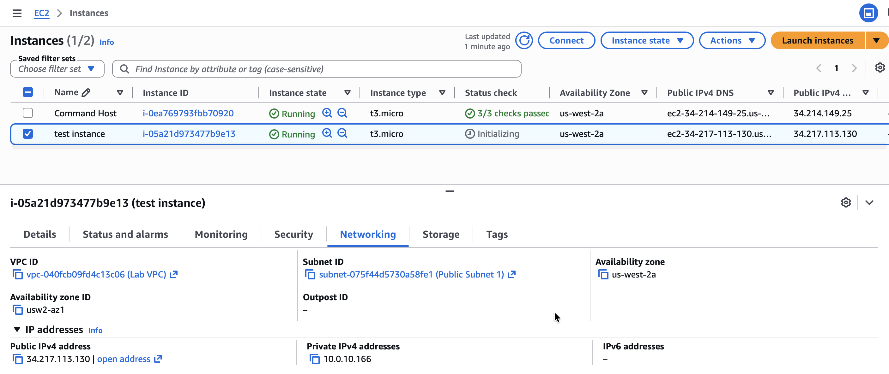

# Internet Protocols - Static and Dynamic Addresses

In this lab, I will act as a cloud support engineer at Amazon Web Services (AWS) and investigate a networking issue reported by Bob, a customer from a Fortune 500 company. I will discover that Bob's EC2 instance is assigned a dynamic IP address, which changes every time the instance is stopped and started, and that he cannot leave the instance running continuously due to the associated cost. I will recommend attaching an Elastic IP (EIP) to provide Bob's instance with a persistent, static IP address so that his other resources are not disrupted. I will verify this solution by stopping and starting the instance to confirm that the IP address remains unchanged after the Elastic IP is attached.

## Scenario
My role is a cloud support engineer at Amazon Web Services (AWS). During my shift, a customer from a Fortune 500 company requests assistance regarding a networking issue within their AWS infrastructure. The following is the email and an attachment regarding their architecture:

**Ticket from the customer**

> Hello Cloud Support!
>
> We are having issues with one of our EC2 instances. The IP changes every time we start and stop this instance called Public Instance. This causes everything to break since it needs a static IP address. We are not sure why the IP changes on this instance to a random IP every time. Can you please investigate? Attached is our architecture. Please let me know if you have any questions.
>
> Thanks!
> Bob, Cloud Admin

**Architecture diagram**

  

*Figure: Customer VPC architecture, which includes one public subnet and one EC2 instance*

## Task 1: Investigate the customer's environment
I think that Bob assigned a dynamic IP address to his EC2 instance because it constantly changes when the instance is stopped and started again. Here, I will test this theory by launching a new EC2 instance in the AWS lab environment and replicating his issue.

1. I launch a new instance with these configurations:
   - Name tag: `test instance`
   - Amazon Machine Image (AMI): `Amazon Linux 2 AMI (HVM)`
   - Instance Type: `t3.micro`
   - Network VPC: `Lab VPC`
   - Subnet: `Public Subnet 1`
   - Auto-assign Public IP: `enable`
   - Security Group: `Linux Instance SG` (existing SG)
   - Key pair: `vockey | RSA` (existing)
2. The Private and Public IPv4 addresses for the *test instance* are:
   - Private IPv4 address: `10.0.10.166`
   - Public IPv4 address: `34.217.113.130`
3. Once the instance is in *running* status, I stop the instance and then restart it again. Now the Private and Public IPv4 addresses for the *test instance* are:
   - Private IPv4 address: `10.0.10.166`
   - Public IPv4 address: `35.164.160.53`

I have recreated the customer's issue: the **PublicIP address** changes when the *test instance* stops and restarts.

## Task 2: Fix issue with Elastic IP (EIP) address
Bob needs a permanent Public IP address that doesn't change when he stops and restarts his instance. AWS does have a solution that allocates a persistent public IP address to an EC2 instance, called an Elastic IP (EIP).

1. Under **Network and Security**, I select **Elastic IPs** and click the **Allocate Elastic IP address** button. I create an Elastic IP with this configuration:
   - Network border group: `us-west-2`
   - Associate to instance: `test instance`
   - Associated Private IP: `10.0.10.166`

   The Elastic IP is `100.22.207.57`.
2. I go back to the *test instance* and confirm that the Public IP address is `100.22.207.57`. I check that it does not change when the instance is stopped and started again.

  

## Task 3: Send the Response to the customer
In this task, I drafted and sent an email response to the customer, summarising my findings and outlining solutions to resolve their connectivity issue.

> Hi Bob,
>
> Thank you for reaching out and providing your architecture details — it made it easier to investigate the issue.
>
> After reviewing your environment, I found that the reason your public instance's IP changes each time it is stopped and started is because it currently has a dynamic public IPv4 address assigned. Dynamic IPs in AWS are automatically allocated and released when an instance stops or starts, which explains why the IP keeps changing and causes disruptions for services that require a consistent address.
>
> To resolve this, I recommend creating an **Elastic IP (EIP)** and assigning it to your public instance. An EIP is a static public IP address that remains associated with your instance even when it is stopped and restarted, ensuring stable connectivity.
>
> To verify this solution, I tested a new instance called `test instance` and confirmed that after assigning an EIP, the public IP does not change when the instance is stopped and restarted.
>
> Please let me know if you would like guidance on creating and assigning an Elastic IP to your instance, or if you would like me to assist with implementing this solution.
>
> Best regards,
>
> Cloud Support Engineer
> 
> AWS Support Team

## Conclusion
After completing this lab, I have successfully:

* Summarized the customer scenario
* Analyzed the difference between statically and dynamically assigned IP addresses using EC2 instances
* Assigned a persistent (static) IP to an EC2 instance
* Developed a solution to the customer's issue found within this lab, and summarized and described my findings

## Additional resources
- [Amazon EC2 instance IP addressing](https://docs.aws.amazon.com/AWSEC2/latest/UserGuide/using-instance-addressing.html)
- [Elastic IP addresses](https://docs.aws.amazon.com/AWSEC2/latest/UserGuide/elastic-ip-addresses-eip.html)
