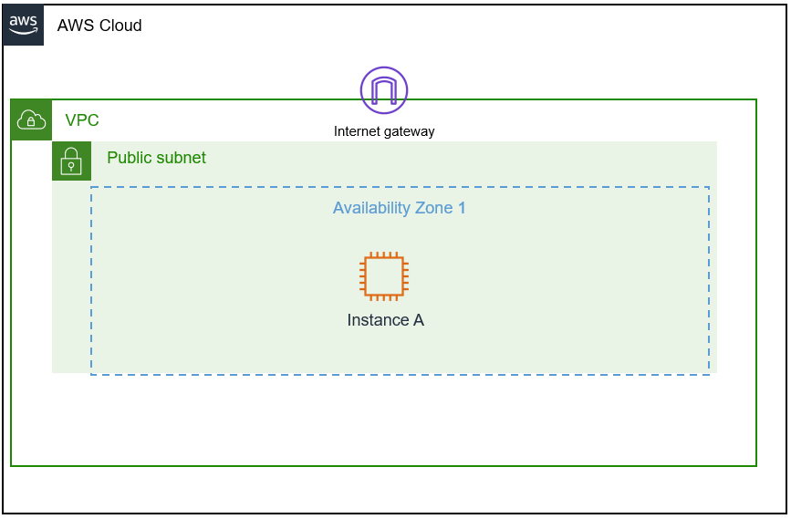
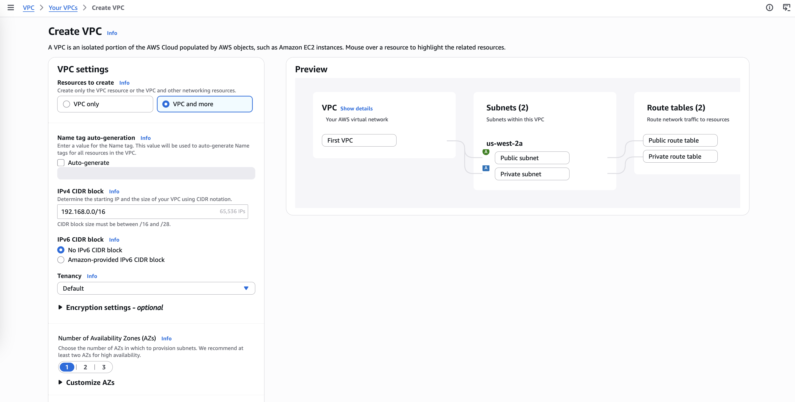
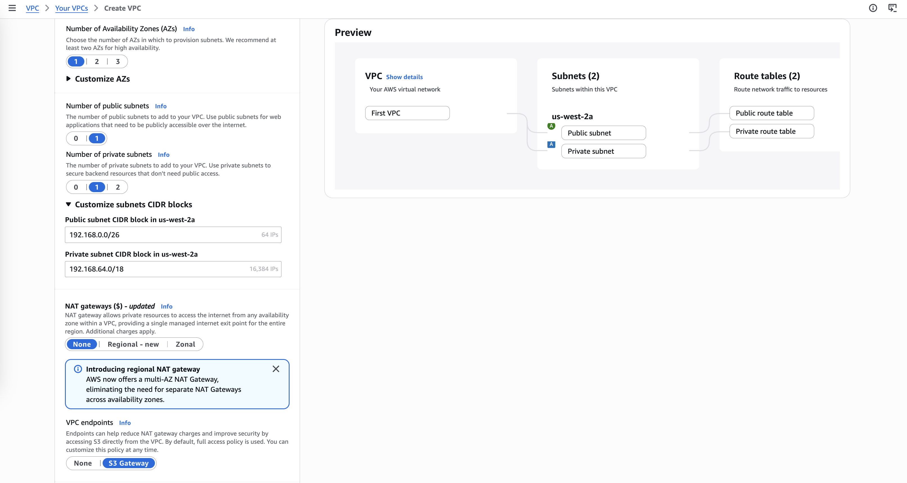

# Create Subnets and Allocate IP addresses in an Amazon Virtual Private Cloud (Amazon VPC)
In this lab, I investigated the customer's environment and analyzed the customer's request to build a successful walkthrough of their environment. Through this experience, I learned how to launch a VPC, which CIDR block and range to give the customer, and how to show the customer how to build a VPC.

## Scenario
My role is a cloud support engineer at Amazon Web Services (AWS). During my shift, a customer from a Fortune 500 company requests assistance regarding a networking issue within their AWS infrastructure. The following is the email and an attachment regarding their architecture:

**Ticket from the customer**

> Hello, Cloud Support!
>
> I'm new to AWS, and I need help setting up a VPC. Can you please help me through the setup process? I would like to build only the VPC part and would like to make it look something like the following picture. Can you help me ensure I have around 15,000 private IP addresses in this VPC available? I would also like the VPC IPv4 CIDR block to be a 192.x.x.x. I don't remember which is a private range though. Can you confirm that? I would also like to allocate at least 50 IP addresses for the public subnet.
>
> Thanks!
>
> Paulo Santos
> Startup Owner

**Customer diagram**

  

*Figure: In the customer's VPC architecture, the customer needs approximately 15,000 IP addresses for their Seattle office headquarters and 50 IP addresses for their operations department, which will be in the public subnet.*

## Task 1: Investigate the customer's needs
In the scenario, Paulo, who is the customer requesting assistance, has switched to using AWS and would like assistance launching his first VPC. He has some networking knowledge but is new to AWS. I know that he needs around 15,000 IP addresses in the private range within his VPC, and he would like a public subnet. He would like to allocate at least 50 IP addresses in the public subnet.

1. I open the AWS Management Console opens in a new tab in the AWS console, I type and search for `VPC` in the search bar in the top-left corner, and select **VPC** from the list.
2. I choose the **Launch VPC Wizard** button to launch my first VPC. This launches a step-by-step process to set up a VPC with its basic components.
3. I configure the following options:
   * For **IPv6 CIDR block**, I leave **No IPv6 CIDR Block** selected, since I will not be using IPv6 in this lab.
   * For the **VPC name**, I enter `First VPC`.
   * For **Public subnet's IPv4 CIDR**, I input the correct VPC CIDR I am using, keeping in mind that the public subnet's CIDR must be smaller than the VPC CIDR block, and must be able to include at least 50 IP addresses.
   * For **Availability Zone**, I choose **No Preference**.
   * For **Subnet name**, I leave this option set to **Public subnet**.
   * I leave the remaining options set to their default settings.
   * At the lower-right, I choose **Create VPC**.
4. I select a VPC configuration and configure the following options:
   * I choose **VPC with a Single Public Subnet**.
   * I choose **Select** to move to the next step.
5. For **VPC with a Single Public Subnet**, I configure the following information:
   * The **IPv4 CIDR block** box prefills with a CIDR notation and block. I delete this information and enter my own values.

>[!Summary]
>
>Configured the **VPC with a Single Public Subnet** with the following parameters:
>* IPv4 CIDR block: `192.168.0.0/18`
>* IPv6 CIDR block: set to default
>* VPC name: `First VPC`
>* Public subnet's IPv4 CIDR: `192.168.1.0/26`
>* Availability Zone: **No Preference**
>* Subnet name: `Public subnet`
>* Remaining options: left at their default settings

  

  

## Task 2: Send the response to the customer

> Subject: Assistance with Your VPC Setup
>
> Hi Paulo,
>
> Thank you for reaching out! I'd be happy to help you set up your VPC. Let's address each of your points.
>
> **Private IPv4 Range:**
> The private IPv4 ranges you can use are:
> - 10.0.0.0 – 10.255.255.255
> - 172.16.0.0 – 172.31.255.255
> - 192.168.0.0 – 192.168.255.255
>
> So yes, the `192.x.x.x` range you mentioned can be used as a private range.
>
> **VPC and Subnet Sizing:**
> To meet your requirements:
> - **VPC IPv4 CIDR block:** `192.168.0.0/18` → provides 16,384 IP addresses, which comfortably covers your need for ~15,000 private IPs.
> - **Public subnet:** `192.168.1.0/26` → provides 64 IP addresses (enough for your minimum requirement of 50 IPs).
>
> **Architecture:**
> With this setup, you'll have one Availability Zone (AZ) containing a single public subnet within your VPC. This is a common starting configuration for startups, and it leaves plenty of headroom in your CIDR block to add private subnets or additional resources later as your infrastructure grows.
>
> If you'd like, I can provide step-by-step instructions on how to create this VPC and subnet in the AWS Management Console or via the AWS CLI.
>
> Let me know how you'd like to proceed!
>
> Best regards,
> 
> Cloud Support Engineer
> 
> AWS Support Team

## Conclusion
In this lab, I have successfully:

* Summarized the customer scenario
* Created an Amazon Virtual Private Cloud (Amazon VPC) and learned how to create subnets and allocate IP addresses
* Familiarized myself with the Amazon Web Services (AWS) Management Console
* Developed a solution to the customer's issue in this lab
* Summarized and described my findings (group activity)

## Additional resources
- [What is Amazon VPC?](https://docs.aws.amazon.com/vpc/latest/userguide/what-is-amazon-vpc.html)
- [IP Addressing in your VPC](https://docs.aws.amazon.com/vpc/latest/userguide/vpc-ip-addressing.html)
- [RFC 1918](https://datatracker.ietf.org/doc/html/rfc1918)
- [VPC CIDR](https://docs.aws.amazon.com/vpc/latest/userguide/VPC_Subnets.html#add-cidr-block-restrictions)
- [Subnet calculator](https://www.subnet-calculator.com/)
