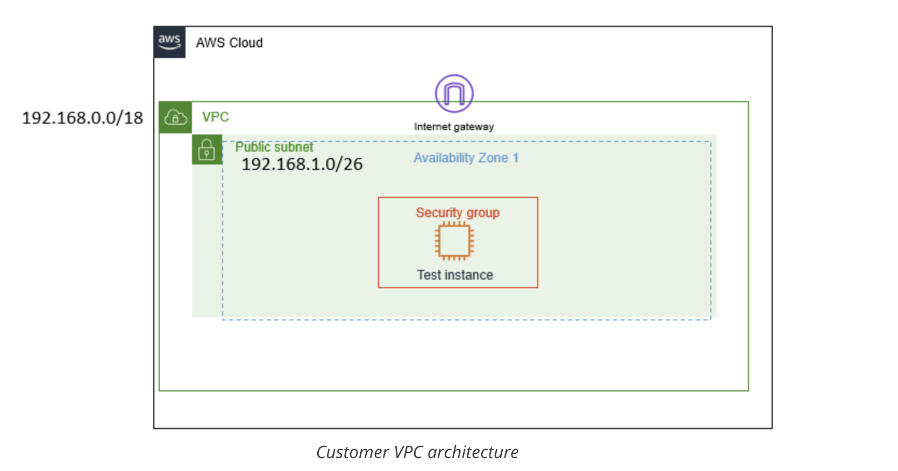
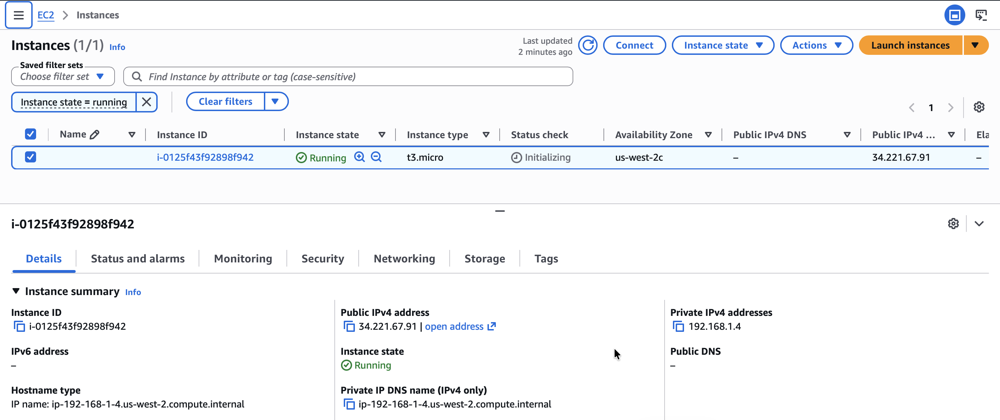

# Creating Networking Resources in an Amazon Virtual Private Cloud (VPC)
My role is a Cloud Support Engineer at Amazon Web Services (AWS). During my shift, a customer from a startup company requests assistance regarding a networking issue within their AWS infrastructure. The email and an attachment of their architecture are below.

## Scenario
In this lab, I will investigate the customer's environment and analyze the customer's request to build a fully functional VPC. Through this experience, I will apply a blended approach of the OSI model and how AWS cloud fits into that model. I will create resources starting with a VPC, and work my way down the left-hand navigation pane to assist the customer in having their EC2 instance successfully achieve network connectivity.

**Email from the customer**

> Hello Cloud Support!
>
> I previously reached out to you regarding help setting up my VPC. I thought I knew how to attach all the resources to make an internet connection, but I cannot even ping outside the VPC. All I need to do is ping! Can you please help me set up my VPC to where it has network connectivity and can ping? The architecture is below. Thanks!
>
> Brock, startup owner

<p align="center">
  
</p>

## Task 1: Investigate the customer's needs
In the scenario, Brock, the customer requesting assistance, has requested help creating resources for his VPC to be routable to the internet. I keep the VPC CIDR at `192.168.0.0/18` and the public subnet CIDR at `192.168.1.0/26`.

>[!Note]
> Protocols which can be directly used with AWS's Security Group (SG) and Network Access Control Lists (NACLs). A VPC needs an Internet Gateway (IGW) in order for the VPC to reach the internet, which has the route as 0.0.0.0/0. These routes go on what is called a Route Table, which are associated to subnets so they know where they belong. 

1. I create the VPC:
   - Name tag: `Test VPC`
   - IPv4 CIDR block: `192.168.0.0/18`

>[!Note]
> VPC is like a data center, but located in the cloud. It's logically isolated from other virtual networks. Now you will build a VPC.
     
2. I create the subnet:
   - VPC ID: `Test VPC`
   - Subnet name: `Public subnet`
   - IPv4 subnet CIDR block: `192.168.1.0/28` (16 IPs)

>[!Note]
> A subnet is a range of IP addresses within your VPC. In your VPC, you can create a public and a private subnet. You can separate subnets according to specific architectural needs. For example, if you have servers that shouldn't be directly accessed by the internet, you would put them in the private subnet. For test servers or instances that require internet connectivity can be placed in the public subnet.
     
3. I create the route table:
   - Name: `Public route table`
   - VPC: `Test VPC`
  
>[!Note]
> A route table contains the rules or routes that determine where network traffic within your subnet and VPC will go. It controls the network traffic like a router, and, just like a router, it stores IP addresses within the VPC. You associate a route table to each subnet and put the routes that you need your subnet to be able to reach. 
     
4. I create the Internet Gateway and attach it to the VPC:
   - Name: `IGW test VPC`
   - Attach to VPC: `Test VPC`
  
>[!Note]
> An Internet Gateway (IGW) is what allows the VPC to have internet connectivity and allows communication between resources in your VPC and the internet. The IGW is used as a target in the route table to route internet-routable traffic and to perform network address translation (NAT) for EC2 instances.
     
5. I add a route to the *Public route table* and associate the subnet to the route table:
   - Destination: `0.0.0.0/0`
   - Target: `igw-0b909d43620de4617 (IGW test VPC)` (Internet Gateway)
   - Associate to `Public subnet`
     
6. I create a Network ACL:
   - Name: `Public Subnet NACL`
   - VPC: `Test VPC`
   - Add new Inbound rule:
     - Rule number: `100`
     - Type: `All traffic`
   - Add new Outbound rule:
     - Rule number: `100`
     - Type: `All traffic`
    
>[!Note]
> An Network ACL (NACL) is a layer of security that acts like a firewall at the subnet level. The rules to set up a NACL are similar to security groups in the way that 
they control traffic. The following rules apply: NACLs must be associated to a subnet, NACLs are stateless, and they have the following parts:
>* Rule number: The lowest number rule gets evaluated first. As soon as a rule matches traffic, its applied; for example: 10 or 100. Rule 10 would get evaluated first.
>* Type of traffic; for example: HTTP or SSH
>* Protocol: You can specify all or certain types here
>* Port range: All or specific ones
>* Destination: Only applies to outbound rules
>* Allow or Deny specified traffic.
       
7. I create a Security Group:
   - Security group name: `public security group`
   - Description: `allows public access`
   - VPC: `Test VPC`
   - Inbound rules:
     - `SSH` (port 22) from `0.0.0.0/0` (Anywhere-IPv4)
     - `HTTP` (port 80) from `0.0.0.0/0` (Anywhere-IPv4)
     - `HTTPS` (port 443) from `0.0.0.0/0` (Anywhere-IPv4)
   - Outbound rule:
     - `All traffic` from `0.0.0.0/0` (custom)

For **Inbound rules** you are allowing SSH, HTTP, and HTTPS types of traffic, each of which has its own protocols and port range. The source from which this traffic reaches your instance can be originating from anywhere. For **Outbound rules**, you are allowing all traffic from outside your instance.

>[!Note]
> A security group is a virtual firewall at the instance level that controls inbound and outbound traffic. Just like a NACL, security groups control traffic; however, security groups cannot deny traffic. Security groups are stateful; you must allow traffic through the security group as it blocks everything by default, and it must be associated to an instance.

I now have a functional VPC. In the next task, I launch an EC2 instance to ensure that everything works.

## Task 2: Launch EC2 instance and SSH into instance
In this task, I launch an EC2 instance within my public subnet and test connectivity by running the `ping` command. This validates that my infrastructure — including security groups and network ACLs — is correctly configured and not blocking any traffic between the instance and the internet, and confirms that I have a route to the Internet Gateway via the route table, and that the Internet Gateway is attached.

1. I choose `EC2` to go to the EC2 Management Console on the AWS Management Console, then choose **Instances** in the left navigation pane.
2. I choose **Launch instances** and configure the following options:
   * In the **Name and tags** section, I leave the Name blank.
   * In the **Application and OS Images (Amazon Machine Image)** section, I configure the following options:
     * Quick Start: Choose **Amazon Linux**.
     * Amazon Machine Image (AMI): Choose **Amazon Linux 2023 AMI**.
   * In the **Instance type** section, I choose **t3.micro**.
   * In the **Key pair (login)** section, I choose **vockey**.
3. In the **Network settings** section, I choose **Edit** and configure the following options:
   * **VPC - required:** Choose **Test VPC**.
   * **Subnet:** Choose **Public Subnet**.
   * **Auto-assign public IP:** Choose **Enable**.
   * **Firewall (security groups):** Choose **Select existing security group**, then choose **public security group**.
4. I choose **Launch instance**.
5. To display the launched instance, I choose **View all instances**. The EC2 instance is initially in a **Pending** state, then the instance state changes to **Running** to indicate that the instance has finished booting.

<p align="center">
  
</p>

I downloaded the file labsuser.pem from the lab environment and saved the PublicIP address from the instance I have just created, which is Public IPv4 address `34.221.67.91`. From my terminal, I changed the permissions on the key to be read-only using my Public IPv4 address allowing the first connection to this remote SSH server. 

#### Connect to the Bastion Server via SSH
```bash
kylescritten@MacBookAir ~ % cd ~/Downloads
kylescritten@MacBookAir Downloads % chmod 400 labsuser.pem
kylescritten@MacBookAir Downloads % ssh -i labsuser.pem ec2-user@34.221.67.91
The authenticity of host '34.221.67.91 (34.221.67.91)' can't be established.
ED25519 key fingerprint is: SHA256:tmB/6P+kfIeqsOL86dMWoMf786xuo3I8cREFFXezT/c
This key is not known by any other names.
Are you sure you want to continue connecting (yes/no/[fingerprint])? yes
```
#### Terminal Output
```text
Warning: Permanently added '34.221.67.91' (ED25519) to the list of known hosts.
** WARNING: connection is not using a post-quantum key exchange algorithm.
** This session may be vulnerable to "store now, decrypt later" attacks.
** The server may need to be upgraded. See https://openssh.com/pq.html
   ,     #_
   ~\_  ####_        Amazon Linux 2023
  ~~  \_#####\
  ~~     \###|
  ~~       \#/ ___   https://aws.amazon.com/linux/amazon-linux-2023
   ~~       V~' '->
    ~~~         /
      ~~._.   _/
         _/ _/
       _/m/'
[ec2-user@ip-192-168-1-4 ~]$ 
```

## Task 3: Use ping to test internet connectivity
I test the connectivity with a `ping` to the Google website.

I run the following command:
```
ping google.com
```

#### Terminal Output
```bash
[ec2-user@ip-192-168-1-4 ~]$ ping google.com
PING google.com (142.250.73.142) 56(84) bytes of data.
64 bytes from pnseaa-ao-in-f14.1e100.net (142.250.73.142): icmp_seq=1 ttl=117 time=6.69 ms
64 bytes from pnseaa-ao-in-f14.1e100.net (142.250.73.142): icmp_seq=2 ttl=117 time=6.70 ms
64 bytes from pnseaa-ao-in-f14.1e100.net (142.250.73.142): icmp_seq=3 ttl=117 time=6.72 ms
64 bytes from pnseaa-ao-in-f14.1e100.net (142.250.73.142): icmp_seq=4 ttl=117 time=6.72 ms
64 bytes from pnseaa-ao-in-f14.1e100.net (142.250.73.142): icmp_seq=5 ttl=117 time=6.72 ms
^C
--- google.com ping statistics ---
5 packets transmitted, 5 received, 0% packet loss, time 4005ms
rtt min/avg/max/mdev = 6.693/6.709/6.720/0.010 ms
[ec2-user@ip-192-168-1-4 ~]$ 
```

The terminal output confirms that all 5 packets sent to Google.com (`142.250.73.142`) were successfully received, with 0% packet loss and an average round-trip time of `6.71 ms`.

## Conclusion
By completing this lab, I have successfully:

* Summarized the customer scenario
* Created a VPC, Internet Gateway, Route Table, Security Group, Network ACL, and EC2 instance to establish a routable network within the VPC
* Familiarized myself with the console
* Developed a solution to the customer's issue found within this lab

The lab is complete now that I have successfully used the `ping` command outside the VPC.

## Additional Resources
- [What is Amazon VPC?](https://docs.aws.amazon.com/vpc/latest/userguide/what-is-amazon-vpc.html)
- [IP Addressing in your VPC](https://docs.aws.amazon.com/vpc/latest/userguide/vpc-ip-addressing.html)
- [Route tables for your VPC](https://docs.aws.amazon.com/vpc/latest/userguide/VPC_Route_Tables.html)
- [Internet Gateways](https://docs.aws.amazon.com/vpc/latest/userguide/VPC_Internet_Gateway.html)
- [Network ACLs](https://docs.aws.amazon.com/vpc/latest/userguide/vpc-network-acls.html#nacl-rules)
- [Security Groups](https://docs.aws.amazon.com/vpc/latest/userguide/VPC_SecurityGroups.html#VPCSecurityGroups)
