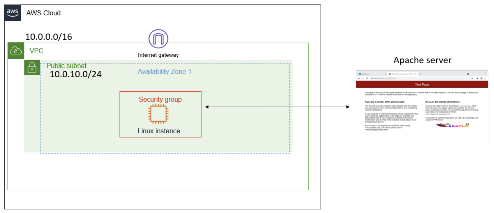

# Troubleshooting a Network Issue
In this lab, I will troubleshoot the customer's networking issue. I will investigate the customer's security group to identify the source of the problem, and once I have fixed the issue, I will confirm that the Apache server loads successfully.

## Scenario
My role is a cloud support engineer at Amazon Web Services (AWS). During my shift, a consulting company has a networking issue within their AWS infrastructure. The following is the email and an attachment of their architecture.

**Email from the customer**

> Hello, Cloud Support!
>
> When I create an Apache server through the command line, I cannot ping it. I also get an error when I enter the IP address in the browser. Can you please help figure out what is blocking my connection?
>
> Thanks!
>
> Ana
> 
> Contractor

**Customer Diagram**

<p align="center">
  
</p>

*Figure: The customer's virtual private cloud (VPC) architecture.*

## Task 1: Use SSH to connect to an Amazon Linux EC2 instance

In this task, I will connect to an Amazon Linux EC2 instance. I run macOS and will use an SSH utility to perform all of these operations. The Amazon EC2 instance is configured as part of this lab environment. 

I downloaded the file labsuser.pem from the lab environment and saved the PublicIP address, which for my lab is PublicIP `54.188.245.182`. From my terminal, I changed the permissions on the key to be read-only using my PublicIP allowing the first connection to this remote SSH server. 

#### Connect to the EC2 Instance
```bash
kylescritten@MacBookAir ~ % cd ~/Downloads
kylescritten@MacBookAir Downloads % chmod 400 labsuser.pem
kylescritten@MacBookAir Downloads % ssh -i labsuser.pem ec2-user@54.188.245.182
The authenticity of host '54.188.245.182 (54.188.245.182)' can't be established.
ED25519 key fingerprint is: SHA256:y5uOc/2RYp3Lya9rjJzFgBMrKovZejgY8yWPM4Yg+iE
This key is not known by any other names.
Are you sure you want to continue connecting (yes/no/[fingerprint])? yes
```
#### Terminal Output
```text
Warning: Permanently added '54.188.245.182' (ED25519) to the list of known hosts.
** WARNING: connection is not using a post-quantum key exchange algorithm.
** This session may be vulnerable to "store now, decrypt later" attacks.
** The server may need to be upgraded. See https://openssh.com/pq.html
   ,     #_
   ~\_  ####_        Amazon Linux 2
  ~~  \_#####\
  ~~     \###|       AL2 End of Life is 2026-06-30.
  ~~       \#/ ___
   ~~       V~' '->
    ~~~         /    A newer version of Amazon Linux is available!
      ~~._.   _/
         _/ _/       Amazon Linux 2023, GA and supported until 2029-06-30.
       _/m/'           https://aws.amazon.com/linux/amazon-linux-2023/

[ec2-user@ip-10-0-10-24 ~]$  
```


## Conclusion
After completing this lab, I am able to:

* Analyze the customer scenario
* Troubleshoot the issue

## Additional resources
- [What is Amazon VPC?](https://docs.aws.amazon.com/vpc/latest/userguide/what-is-amazon-vpc.html)
