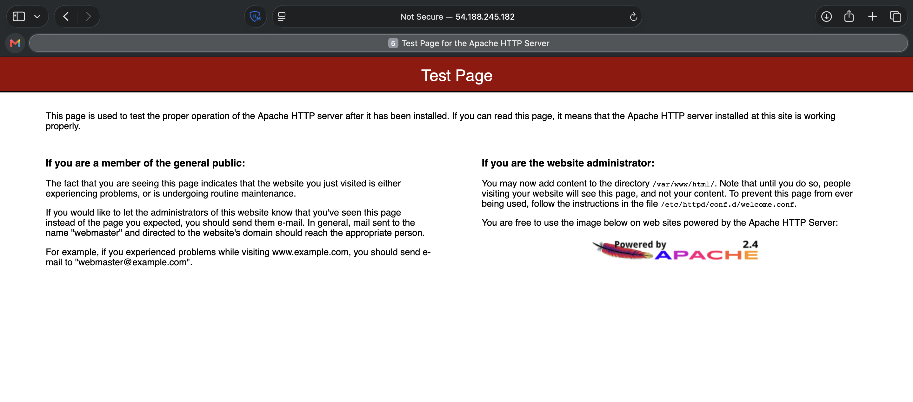

# Troubleshooting a Network Issue
In this lab, I will troubleshoot the customer's networking issue. I will investigate the customer's security group to identify the source of the problem, and once I have fixed the issue, I will confirm that the Apache server loads successfully.

## Scenario
My role is a cloud support engineer at Amazon Web Services (AWS). During my shift, a consulting company has a networking issue within their AWS infrastructure. The following is the email and an attachment of their architecture.

**Email from the customer**

> Hello, Cloud Support!
>
> When I create an Apache server through the command line, I cannot ping it. I also get an error when I enter the IP address in the browser. Can you please help figure out what is blocking my connection?
>
> Thanks!
>
> Ana
> 
> Contractor

**Customer Diagram**

<p align="center">
  
</p>

*Figure: The customer's virtual private cloud (VPC) architecture.*

## Task 1: Use SSH to connect to an Amazon Linux EC2 instance

In this task, I will connect to an Amazon Linux EC2 instance. I run macOS and will use an SSH utility to perform all of these operations. The Amazon EC2 instance is configured as part of this lab environment. 

I downloaded the file labsuser.pem from the lab environment and saved the PublicIP address, which for my lab is PublicIP `54.188.245.182`. From my terminal, I changed the permissions on the key to be read-only using my PublicIP allowing the first connection to this remote SSH server. 

#### Connect to the EC2 Instance
```bash
kylescritten@MacBookAir ~ % cd ~/Downloads
kylescritten@MacBookAir Downloads % chmod 400 labsuser.pem
kylescritten@MacBookAir Downloads % ssh -i labsuser.pem ec2-user@54.188.245.182
The authenticity of host '54.188.245.182 (54.188.245.182)' can't be established.
ED25519 key fingerprint is: SHA256:y5uOc/2RYp3Lya9rjJzFgBMrKovZejgY8yWPM4Yg+iE
This key is not known by any other names.
Are you sure you want to continue connecting (yes/no/[fingerprint])? yes
```
#### Terminal Output
```text
Warning: Permanently added '54.188.245.182' (ED25519) to the list of known hosts.
** WARNING: connection is not using a post-quantum key exchange algorithm.
** This session may be vulnerable to "store now, decrypt later" attacks.
** The server may need to be upgraded. See https://openssh.com/pq.html
   ,     #_
   ~\_  ####_        Amazon Linux 2
  ~~  \_#####\
  ~~     \###|       AL2 End of Life is 2026-06-30.
  ~~       \#/ ___
   ~~       V~' '->
    ~~~         /    A newer version of Amazon Linux is available!
      ~~._.   _/
         _/ _/       Amazon Linux 2023, GA and supported until 2029-06-30.
       _/m/'           https://aws.amazon.com/linux/amazon-linux-2023/

[ec2-user@ip-10-0-10-24 ~]$  
```

## Task 2: Install httpd
In the scenario, Ana, the customer requesting assistance, cannot reach her Apache server or get it to successfully load on a webpage from her virtual private cloud (VPC).

1. To check the status of the httpd service, I enter the following `systemctl` command in the terminal window and press Enter:
```bash
sudo systemctl status httpd.service
```

**Terminal output:**
```bash
[ec2-user@ip-10-0-10-24 ~]$ sudo systemctl status httpd.service
● httpd.service - The Apache HTTP Server
   Loaded: loaded (/usr/lib/systemd/system/httpd.service; disabled; vendor preset: disabled)
   Active: inactive (dead)
     Docs: man:httpd.service(8)
[ec2-user@ip-10-0-10-24 ~]$ 
```

>[!Note]
> The status shows that the httpd service is inactive because it has not been started yet. This output indicates that the httpd service is loaded (already installed) but is currently inactive.

2. To start the httpd service, I enter the following command:
```bash
sudo systemctl start httpd.service
```

3. To check the status of the httpd service again, I enter the following `systemctl` command:
```bash
sudo systemctl status httpd.service
```

**Terminal output:**
```bash
[ec2-user@ip-10-0-10-24 ~]$ sudo systemctl status httpd.service
● httpd.service - The Apache HTTP Server
   Loaded: loaded (/usr/lib/systemd/system/httpd.service; disabled; vendor preset: disabled)
   Active: active (running) since Sun 2026-08-09 21:29:27 UTC; 12s ago
     Docs: man:httpd.service(8)
 Main PID: 2553 (httpd)
   Status: "Total requests: 0; Idle/Busy workers 100/0;Requests/sec: 0; Bytes served/sec:   0 B/sec"
   CGroup: /system.slice/httpd.service
           ├─2553 /usr/sbin/httpd -DFOREGROUND
           ├─2554 /usr/sbin/httpd -DFOREGROUND
           ├─2555 /usr/sbin/httpd -DFOREGROUND
           ├─2556 /usr/sbin/httpd -DFOREGROUND
           ├─2557 /usr/sbin/httpd -DFOREGROUND
           └─2558 /usr/sbin/httpd -DFOREGROUND

Aug 09 21:29:27 ip-10-0-10-24.us-west-2.compute.internal systemd[1]: Starting The Apache HTTP Server...
Aug 09 21:29:27 ip-10-0-10-24.us-west-2.compute.internal systemd[1]: Started The Apache HTTP Server.
[ec2-user@ip-10-0-10-24 ~]$ 
```

>[!Note]
> The Apache HTTP Server is now in the **Active (running)** status.

The httpd service is now running, but it does not load on the public IP of the instance `http://54.188.245.182`.

## Task 3: Investigate the customer's VPC configuration
In the scenario, Ana, the customer requesting assistance, cannot reach her Apache server even though it is active. I have an exact replica of the customer's VPC and its resources. I keep the error I received when trying to load Apache in the web browser in mind while troubleshooting this issue.

1. I open the AWS Management Console in a new browser tab, choose the **Services** dropdown menu, and under **Networking & Content Delivery**, choose **VPC**.
2. I check each service within the VPC to confirm that each resource is configured correctly. I consider the following:
   * **Subnets** - Are the route tables associated with the correct subnets?
   * **Route Tables** - Do the route tables have the correct routes?
   * **Internet Gateway** - Is there an Internet Gateway, and is it attached?
   * **Security Groups and network ACLs** - Are the correct rules configured?
   * Can I ping websites such as `www.amazon.com`? If so, I can reach the internet (the Internet Gateway and route table should be working).
   * Apache is a server that commonly uses HTTP/S ports.
     
3. I then run the command to ping `amazon.com`:
```bash
ping -c 4 www.amazon.com
```

**Terminal output:**
```bash
[ec2-user@ip-10-0-10-24 ~]$ ping -c 4 www.amazon.com
PING cf.47cf2c8c9-frontier.amazon.com (3.163.26.68) 56(84) bytes of data.
64 bytes from server-3-163-26-68.hio52.r.cloudfront.net (3.163.26.68): icmp_seq=1 ttl=249 time=5.30 ms
64 bytes from server-3-163-26-68.hio52.r.cloudfront.net (3.163.26.68): icmp_seq=2 ttl=249 time=5.33 ms
64 bytes from server-3-163-26-68.hio52.r.cloudfront.net (3.163.26.68): icmp_seq=3 ttl=249 time=5.31 ms
64 bytes from server-3-163-26-68.hio52.r.cloudfront.net (3.163.26.68): icmp_seq=4 ttl=249 time=5.32 ms

--- cf.47cf2c8c9-frontier.amazon.com ping statistics ---
4 packets transmitted, 4 received, 0% packet loss, time 3004ms
rtt min/avg/max/mdev = 5.301/5.318/5.332/0.052 ms
[ec2-user@ip-10-0-10-24 ~]$ 
```
4. I find that instead, the security group lacks an inbound rule allowing HTTP traffic (port 80) from the internet (`0.0.0.0/0`). I add this rule to the `Linux instance SG` security group.

5. Once I have gone through each option in the previous step — I confirm that the Apache HTTP server is working by testing the URL `http://54.188.245.182` in a browser for my instance.

If Apache is successfully installed, the following is the expected output:

<p align="center">
  
</p>

## Conclusion
After completing this lab, I am able to:

* Analyze the customer scenario
* Troubleshoot the issue

## Additional resources
- [What is Amazon VPC?](https://docs.aws.amazon.com/vpc/latest/userguide/what-is-amazon-vpc.html)
