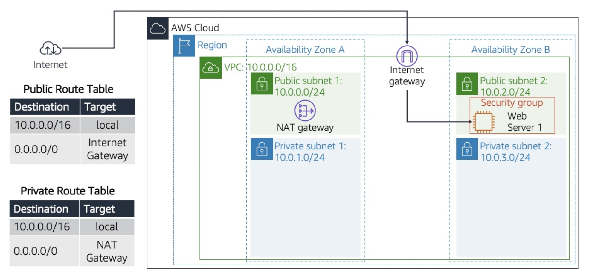
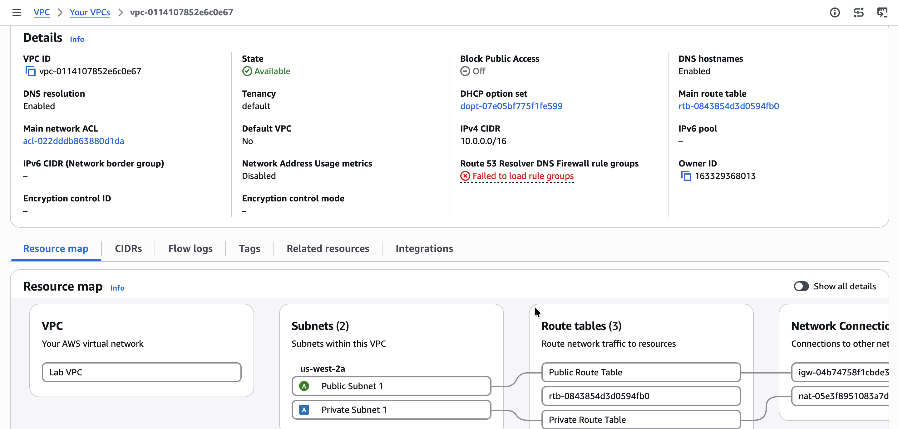
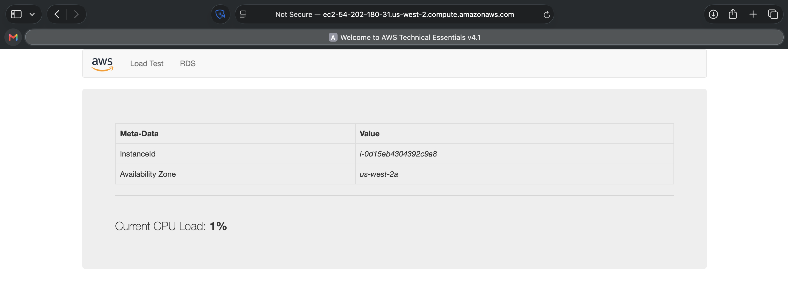

# Build Your VPC and Launch a Web Server

## Scenario
In this lab, I use Amazon Virtual Private Cloud (VPC) to create my own VPC and add additional components to produce a customized network for a Fortune 100 customer. I also create security groups for my EC2 instance. I then configure and customize an EC2 instance to run a web server and launch it into the VPC that looks like the following customer diagram.

**Customer diagram**

<p align="center">
  
</p>

*Figure: The customer is requesting the build of this architecture to launch their web server successfully.*

## Task 1: Create my VPC
In this task, I use the VPC Wizard to create a VPC, an Internet Gateway, and two subnets in a single Availability Zone. An Internet Gateway is a VPC component that allows communication between instances in my VPC and the internet.

> [!NOTE]
> After creating a VPC, I can add subnets. Each subnet resides entirely within one Availability Zone and cannot span zones. If a subnet's traffic is routed to an Internet Gateway, the subnet is known as a public subnet. If a subnet does not have a route to the Internet Gateway, the subnet is known as a private subnet.

1. I choose **Create VPC** and configure the following options:
   * **Resources to create:** Choose **VPC and more**
   * **Name tag auto-generation:** Uncheck the **Auto-generate** box
   * **IPv4 CIDR:** Enter `10.0.0.0/16`
   * **IPv6 CIDR block:** Choose **No IPv6 CIDR block**
   * **Tenancy:** Choose **Default**
   * **Number of Availability Zones (AZs):** `1`
   * **Number of public subnets:** `1`
   * **Number of private subnets:** `1`
   * I expand **Customize subnets CIDR blocks**:
     - Public subnet CIDR block in us-west-2a: `10.0.0.0/24`
     - Private subnet CIDR block in us-west-2a: `10.0.1.0/24`
   * **NAT gateways:** Choose **In 1 AZ**
   * **VPC endpoints:** Choose **None**
2. On the **Preview** pane, I name the resources as follows:
   * **VPC:** `Lab VPC`
   * **Subnets (2):**
     - First box, Public subnet without name tag: `Public Subnet 1`
     - Second box, Private subnet without name tag: `Private Subnet 1`
   * **Route tables (2):**
     - First box, Public route table without name tag: `Public Route Table`
     - Second box, Private route table without name tag: `Private Route Table`

<p align="center">
  
</p>

*Lab VPC details are displayed as per configuration.*

## Task 2: Create additional subnets
In this task, I create two additional subnets in a second Availability Zone. This is useful for creating resources across multiple Availability Zones to provide high availability.

1. To configure the second public subnet, I choose **Create subnet** and configure the following options:
   * **VPC ID:** From the dropdown list, choose **Lab VPC**
   * **Subnet name:** Enter `Public Subnet 2`
   * **Availability Zone:** No preference
   * **IPv4 CIDR block:** Enter `10.0.2.0/24`

   The subnet has all IP addresses starting with `10.0.2.x`.

2. To configure the second private subnet, I choose **Create subnet** and configure the following options:
   * **VPC ID:** From the dropdown list, choose **Lab VPC**
   * **Subnet name:** Enter `Private Subnet 2`
   * **Availability Zone:** No preference
   * **IPv4 CIDR block:** Enter `10.0.3.0/24`

   The subnet has all IP addresses starting with `10.0.3.x`.

## Task 3: Associate the subnets and add routes
In the left navigation pane, I choose **Route Tables**.

1. I choose **Public Route Table**, select the **Subnet associations** tab in the lower pane, and under **Subnets without explicit associations**, I choose **Edit subnet associations**, select the check box for **Public Subnet 2**, and choose **Save associations**.
2. I then configure the route table used by the private subnets: I choose **Private Route Table**, select the **Subnet associations** tab in the lower pane, and under **Subnets without explicit associations**, I choose **Edit subnet associations**, select the check box for **Private Subnet 2**, and choose **Save associations**.

## Task 4: Create a VPC security group
In this task, I create a VPC security group, which acts as a virtual firewall for my instance. When I launch an instance, I associate one or more security groups with it, adding rules to each security group that allow traffic to or from its associated instances.

1. I choose **Create security group** and configure it with the following options:
   * **Security group name:** `Web Security Group`
   * **Description:** `Enable HTTP access`
   * **VPC:** Choose **Lab VPC**
2. Under **Inbound rules**, I choose **Add rule** and configure the following options:
   * **Type:** Choose **HTTP**
   * **Source:** Choose **Anywhere IPv4**
   * **Description:** `Permit web requests`

## Task 5: Launch a web server instance
In this task, I launch an EC2 instance into the new VPC. I configure the instance to act as a web server.

1. On the AWS Management Console, I go to the EC2 Management Console and select **Instances**.
2. I choose **Launch instances** and configure the following options:
   * In the **Name and tags** section, **Name:** `Web Server 1`
   * In the **Application and OS Images (Amazon Machine Image)** section, I configure the following options:
     * **Quick Start:**  `Amazon Linux`
     * **Amazon Machine Image (AMI):** `Amazon Linux 2 AMI (HVM)`
   * In the **Instance type** section, I choose `t3.micro`
   * In the **Key pair (login)** section, I choose `vockey`
3. In the **Network settings** section, I choose **Edit** and configure the following options:
   * **VPC - required:** `Lab VPC`
   * **Subnet:** `Public Subnet 2`
   * **Auto-assign public IP:** `Enable`
   * **Firewall (security groups):** Choose **Select existing security group**, then choose **Web Security Group**
4. Under **User data**, I copy and paste the following code:
```bash
#!/bin/bash
# Install Apache, MySQL, PHP
dnf install -y httpd mariadb105 php

# Download lab files
wget https://aws-tc-largeobjects.s3.us-west-2.amazonaws.com/CUR-TF-100-RESTRT-1/267-lab-NF-build-vpc-web-server/s3/lab-app.zip

unzip lab-app.zip -d /var/www/html/

# Enable and start Apache (systemd)
systemctl enable httpd
systemctl start httpd
```

After it passes the status checks, I copy the Public IPv4 DNS `184.32.246.154` and open it in a browser to verify that the web server is running successfully.

<p align="center">
  
</p>

## Conclusion
After completing this lab, I am able to:

* Create a virtual private cloud (VPC)
* Create subnets
* Configure a security group
* Launch an Amazon Elastic Compute Cloud (Amazon EC2) instance into a VPC

## Additional resources
- [What is Amazon VPC?](https://docs.aws.amazon.com/vpc/latest/userguide/what-is-amazon-vpc.html)
