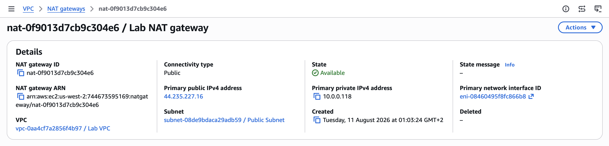
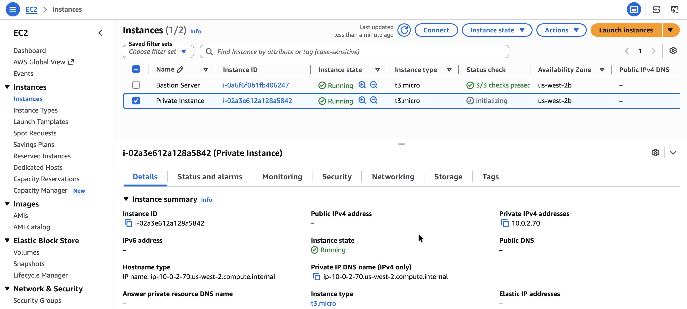

# Configuring a VPC

## Lab overview
Amazon Virtual Private Cloud (Amazon VPC) gives me the ability to provision a logically isolated section of the Amazon Web Services (AWS) Cloud where I can launch AWS resources in a virtual network that I define. I have complete control over my virtual networking environment, including selecting my IP address ranges, creating subnets, and configuring route tables and network gateways.

In this lab, I build a virtual private cloud (VPC) and other network components required to deploy resources, such as an Amazon Elastic Compute Cloud (Amazon EC2) instance.

<p align="center">
  
</p>

## Task 1: Creating a VPC
In this task, I create a new VPC.

1. On the AWS Management Console, in the search bar, I enter and choose `VPC` to go to the VPC Management Console.
2. In the left navigation pane, for **Virtual private cloud**, I choose **Your VPCs**.
   
> [!NOTE]
> In every Region, a default VPC with a Classless Inter-Domain Routing (CIDR) block of `172.31.0.0/16` has already been created for me. Even if I haven't created anything in my account yet, I see some pre-existing VPC resources already there.

3. I choose **Create VPC** and configure the following options:
   * **Resources to create:** Choose **VPC only**
   * **Name tag:** Enter `Lab VPC`
   * **IPv4 CIDR block:** Choose **IPv4 CIDR manual input**
   * **IPv4 CIDR:** Enter `10.0.0.0/16`
   * **IPv6 CIDR block:** Choose **No IPv6 CIDR block**
   * **Tenancy:** Choose **Default**
   * **Tags:** Leave the suggested tags as is
4. I choose **Create VPC**. At the top of the page, a message displays: `"You successfully created vpc-Oaa4cf7a2856f4b97 / Lab VPC"`
5. I choose **Actions**, then choose **Edit VPC settings**.
6. In the **DNS settings** section, I select **Enable DNS hostnames**, then choose **Save**.

<p align="center">
  
</p>

*EC2 instances launched into the VPC now automatically receive a public IPv4 Domain Name System (DNS) hostname.*

## Task 2: Creating subnets
In this task, I create a public subnet and a private subnet.

1. In the left navigation pane, for **Virtual private cloud**, I choose **Subnets**.
2. I choose **Create subnet** and configure the following options:
   * **VPC ID:** Choose **Lab VPC**
   * **Subnet name:** Enter `Public Subnet`
   * **Availability Zone:** Choose the first Availability Zone in the list (not **No preference**)
   * **IPv4 CIDR block:** Enter `10.0.0.0/24`
3. I choose **Create subnet**.
4. I now configure the public subnet to automatically assign a public IP address for all EC2 instances launched within it. I select **Public Subnet**, choose **Actions**, then choose **Edit subnet settings**.
5. In the **Auto-assign IP settings** section, I select **Enable auto-assign public IPv4 address**, then choose **Save**.

> [!NOTE]
> Even though this subnet has been named Public Subnet, it is not yet public. A public subnet must have an Internet Gateway, which I attach in a later task in the lab.

6. To create the private subnet, which is used for resources that remain isolated from the internet, I repeat the steps from the previous task and choose the following options:
   * **VPC ID:** Choose **Lab VPC**
   * **Subnet name:** Enter `Private Subnet`
   * **Availability Zone:** Choose the first Availability Zone in the list (not **No preference**)
   * **IPv4 CIDR block:** Enter `10.0.2.0/23`
7. I choose **Create subnet**.

> [!NOTE]
> The CIDR block `10.0.2.0/23` includes all IP addresses that start with `10.0.2.x` and `10.0.3.x`. This range is twice as large as the public subnet, since most resources should be kept in private subnets unless they specifically need to be accessible from the internet.

<p align="center">
  
</p>

*My VPC now has two subnets. However, the VPC is totally isolated and cannot communicate with resources outside the VPC.*

## Task 3: Creating an internet gateway
In this task, I create an Internet Gateway for my VPC. I need an Internet Gateway to establish outside connectivity to EC2 instances in my VPC.

1. In the left navigation pane, for **Virtual private cloud**, I choose **Internet gateways**.
2. I choose **Create internet gateway**, and for **Name tag**, I enter `Lab IGW`.
3. I choose **Create internet gateway**.
4. I choose **Actions**, then choose **Attach to a VPC**.

<p align="center">
  
</p>

*My public subnet now has a connection to the internet. However, to route traffic to the internet, I must also configure the public subnet's route table so that it uses the Internet Gateway.*

## Task 4: Configuring route tables
In this task, I do the following:

* Create a public route table for internet-bound traffic.
* Add a route to the route table to direct internet-bound traffic to the Internet Gateway.
* Associate the public subnet with the new route table.

1. In the left navigation pane, for **Virtual private cloud**, I choose **Route tables**. Several route tables are listed.
2. I select the route table that includes **Lab VPC** in the **VPC** column.
3. In the **Name** column, I choose the edit icon, enter `Private Route Table` for **Edit Name**, then choose **Save**.
4. I choose the **Routes** tab.

> [!NOTE]
> There is currently only one route. It shows that all traffic destined for `10.0.0.0/16` (the range of the Lab VPC) is routed locally. This allows all subnets within a VPC to communicate with each other.

5. I now create a new public route table to send public traffic to the Internet Gateway. I choose **Create route table** and configure the following options:
   * **Name - optional:** Enter `Public Route Table`
   * **VPC:** Choose **Lab VPC**
6. I choose **Create route table**.
7. After the route table is created, in the **Routes** tab, I choose **Edit routes**.

> [!NOTE]
> I now add a route to direct internet-bound traffic (`0.0.0.0/0`) to the Internet Gateway.

8. I choose **Add route** and configure the following options:
   * **Destination:** Enter `0.0.0.0/0`
   * **Target:** Choose **Internet Gateway**, then choose **Lab IGW** from the list
9. I choose **Save changes**.
10. The final step is to associate this new route table with the public subnet. I choose the **Subnet associations** tab, choose **Edit subnet associations**, select **Public Subnet**, and choose **Save associations**.

<p align="center">
  
</p>

*The public subnet is now public because it has a route table entry that sends traffic to the internet through the Internet Gateway.*

## Task 5: Launching a bastion server in the public subnet
In this task, I launch an EC2 instance bastion server in the public subnet I created earlier.

> [!NOTE]
> A bastion server (also known as a jump box) is an EC2 instance in a public subnet that is securely configured to provide access to resources in a private subnet. Systems operators can connect to the bastion server and then jump into resources in the private subnet.

1. On the AWS Management Console, in the search bar, I enter and choose `EC2` to go to the EC2 Management Console, then choose **Instances**.
2. I choose **Launch instances** and configure the following options:
   * In the **Name and tags** section, I enter `Bastion Server`.
   * In the **Application and OS Images (Amazon Machine Image)** section, I configure the following options:
     * **Quick Start:** Choose **Amazon Linux**
     * **Amazon Machine Image (AMI):** Choose **Amazon Linux 2023 AMI**
   * In the **Instance type** section, I choose **t3.micro**.
   * In the **Key pair (login)** section, I choose **Proceed without a key pair (Not recommended)**.

> [!NOTE]
> I use EC2 Instance Connect to access the shell running on the EC2 instance, so a key pair is not needed in this lab.

3. In the **Network settings** section, I choose **Edit** and configure the following options:
   * **VPC - required:** Choose **Lab VPC**
   * **Subnet:** Choose **Public Subnet**
   * **Auto-assign public IP:** Choose **Enable**
   * **Firewall (security groups):** Choose **Create security group**
     * **Security group name - required:** Enter `Bastion Security Group`
     * **Description - required:** Enter `Allow SSH`
   * **Inbound security group rules:**
     * **Type:** Choose **SSH**
     * **Source type:** Choose **Anywhere**
4. I choose **Launch instance**.

<p align="center">
  
</p>

*The EC2 instance named **Bastion Server** is initially in a **Pending** state. The instance state then changes to **Running** to indicate that the instance has finished booting. The bastion server is launched in the public subnet.*

## Task 6: Creating a NAT gateway
In this task, I launch a NAT gateway in the public subnet and configure the private route table to facilitate communication between resources in the private subnet and the internet.

1. On the AWS Management Console, in the search bar, I enter `NAT gateways`, choose the **Features** list, and choose **NAT gateways**.
2. I choose **Create NAT gateway** and configure the following options:
   * **Name:** Enter `Lab NAT gateway`
   * **Subnet:** From the dropdown list, choose **Public Subnet**
3. I choose **Allocate Elastic IP**.
4. I choose **Create a NAT gateway**.
5. I now configure the private subnet to send internet-bound traffic to the NAT gateway. In the left navigation pane, I choose **Route tables**, then select **Private Route Table**.
6. I choose the **Routes** tab. The route table currently shows only a single entry, which routes traffic locally within the VPC. I add an additional route to send internet-bound traffic through the NAT gateway.
7. I choose **Edit routes**, then choose **Add route** and configure the following options:
   * **Destination:** Enter `0.0.0.0/0`
   * **Target:** Choose **NAT Gateway**, then choose `nat-` from the list
8. I choose **Save changes**.

<p align="center">
  
</p>

*Resources in the private subnet that wish to communicate with the internet now have their network traffic directed to the NAT gateway, which forwards the request to the internet. Responses flow through the NAT gateway back to the private subnet.*

# Optional challenge: Testing the private subnet
In this optional challenge, I launch an EC2 instance in the private subnet and confirm that it can communicate with the internet.

### Launching an instance in the private subnet
In this optional task, I launch an EC2 instance in the private subnet.

1. I follow the instructions I used to launch the bastion server, and configure the following options:
   * In the **Name and tags** section, I enter `Private Instance`.
   * In the **Application and OS Images (Amazon Machine Image)** section, I configure the following options:
     * **Quick Start:** Choose **Amazon Linux**
     * **Amazon Machine Image (AMI):** Choose **Amazon Linux 2023 AMI**
   * In the **Instance type** section, I choose **t3.micro**.
   * In the **Key pair (login)** section, I choose **Proceed without a key pair (Not recommended)**.
   * In the **Network settings** section, I choose **Edit** and configure the following options:
     * **VPC - required:** Choose **Lab VPC**
     * **Subnet:** Choose **Private Subnet** (not the public subnet)
     * **Firewall (security groups):** Choose **Create security group**
       * **Security group name - required:** Enter `Private Instance SG`
       * **Description - required:** Enter `Allow SSH from Bastion`
     * **Inbound security group rules:**
       * **Type:** Choose **SSH**
       * **Source type:** Choose **Custom**
       * **Source:** Choose `10.0.0.0/16`

2. I expand the **Advanced Details** section, and for **User data - optional**, I paste the following script:
```bash
#!/bin/bash
# Turn on password authentication for lab challenge
echo 'lab-password' | passwd ec2-user --stdin
sed -i 's|[#]*PasswordAuthentication no|PasswordAuthentication yes|g' /etc/ssh/sshd_config
systemctl restart sshd.service
```
*This script permits login using a password. It is included to help make the lab steps shorter, but is not recommended for normal instance deployments.*

3. I choose **Launch instance**.

<p align="center">
  
</p>

### Logging in to the bastion server
The instance I just launched is in the private subnet, so it is not possible to log in to it directly. Instead, I first log in to the bastion server in the public subnet, then log in to the private instance from the bastion server.

1. On the AWS Management Console, in the search bar, I enter and choose `EC2` to open the EC2 Management Console.
2. In the navigation pane, I choose **Instances**.
3. From the list of instances, I select the **Bastion Server** instance.
4. I choose **Connect**.
5. On the **EC2 Instance Connect** tab, I choose **Connect**.

### Logging in to the private instance
I should now be logged in to the bastion server, which is located in the public subnet. I now connect to the private instance, which is placed in the private subnet.

1. In the Amazon EC2 console, I choose **Instances** and select **Private Instance**.
2. I copy the **Private IPv4 address**.

> [!NOTE]
> This IP address is a private IP address starting with `10.0.2.x` or `10.0.3.x`. This address is not reachable directly from the internet, which is why I first logged in to the bastion server. I now log in to the private instance.

3. I return to the terminal window and run the following command:
```bash
ssh 10.0.2.70
```

**Terminal output:**
```bash
[ec2-user@ip-10-0-2-70 ~]$ ssh 10.0.2.70
The authenticity of host '10.0.2.70 (10.0.2.70)' can't be established.
ED25519 key fingerprint is SHA256:qWy3yyOTSGnLbJu14rwOxfvGvTIM03YGtMdTW4EfZmE.
This key is not known by any other names.
Are you sure you want to continue connecting (yes/no/[fingerprint])? yes
Warning: Permanently added '10.0.2.70' (ED25519) to the list of known hosts.
ec2-user@10.0.2.70's password: lab-password
   ,     #_
   ~\_  ####_        Amazon Linux 2023
  ~~  \_#####\
  ~~     \###|
  ~~       \#/ ___   https://aws.amazon.com/linux/amazon-linux-2023
   ~~       V~' '->
    ~~~         /
      ~~._.   _/
         _/ _/
       _/m/'
Last login: Mon Aug 10 23:55:54 2026 from 10.0.0.174
[ec2-user@ip-10-0-2-70 ~]$
```

*I am now connected to the private instance. I accomplished this by first connecting to the bastion server (in the public subnet), then connecting to the private instance (in the private subnet).*

### Testing the NAT gateway
The final part of this challenge is to confirm that the private instance can access the internet. I do this by running the `ping` command.

1. I run the following command:

```bash
ping -c 3 amazon.com
```

**Terminal output:**
```bash
[ec2-user@ip-10-0-2-70 ~]$ ping -c 3 amazon.com
PING cf.47cf2c8c9-frontier.amazon.com (3.163.26.68) 56(84) bytes of data.
64 bytes from server-3-163-26-68.hio52.r.cloudfront.net (3.163.26.68): icmp_seq=1 ttl=248 time=6.46 ms
64 bytes from server-3-163-26-68.hio52.r.cloudfront.net (3.163.26.68): icmp_seq=2 ttl=248 time=7.49 ms
64 bytes from server-3-163-26-68.hio52.r.cloudfront.net (3.163.26.68): icmp_seq=3 ttl=248 time=5.48 ms

--- cf.47cf2c8c9-frontier.amazon.com ping statistics ---
3 packets transmitted, 3 received, 0% packet loss, time 2023ms
rtt min/avg/max/mdev = 5.476/6.476/7.494/0.823 ms
```

This output indicates that the private instance successfully communicated with `amazon.com` on the internet. The private instance is in the private subnet, and the only way this is possible in the current scenario is by going through the NAT gateway.

## Conclusion
By the end of this lab, I am able to:

* Create a VPC with a private and public subnet, an Internet Gateway, and a NAT Gateway
* Configure route tables associated with subnets to local and internet-bound traffic by using an Internet Gateway and a NAT Gateway
* Launch a bastion server in a public subnet
* Use a bastion server to log in to an instance in a private subnet
* Completed the optional challenge section in which I created an Amazon EC2 instance in a private subnet and connected to it through the bastion server

## Additional resources
- [What is Amazon VPC?](https://docs.aws.amazon.com/vpc/latest/userguide/what-is-amazon-vpc.html)
- [VPC CIDR blocks](https://docs.aws.amazon.com/vpc/latest/userguide/vpc-cidr-blocks.html)
