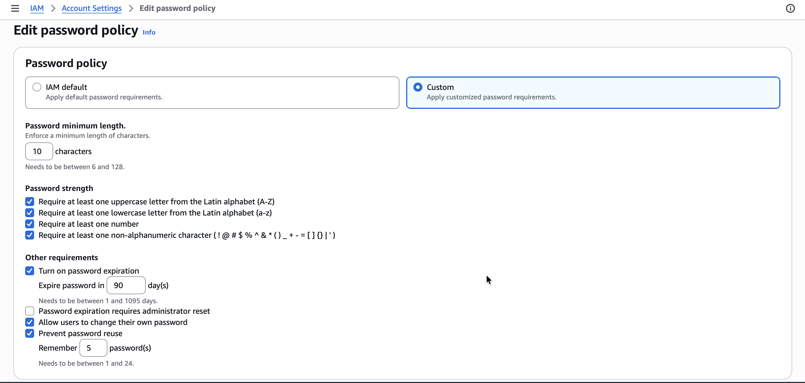
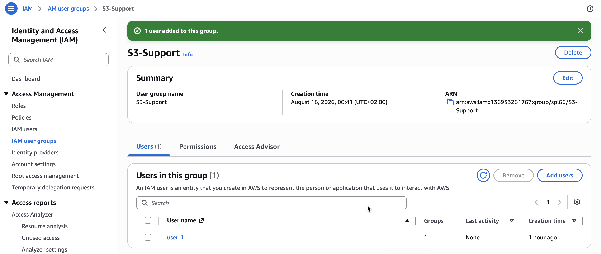
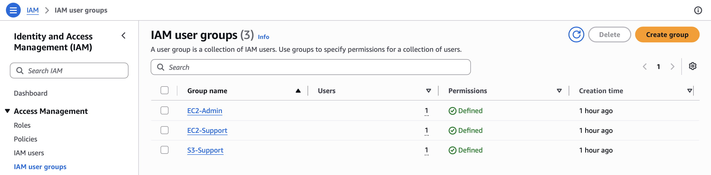
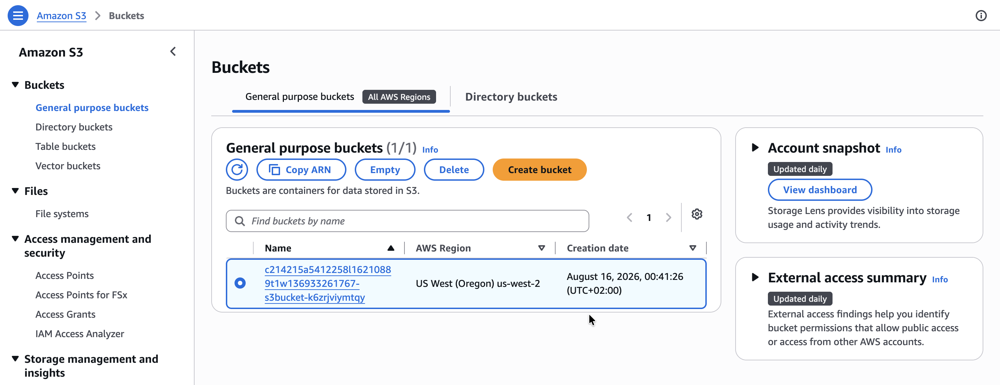
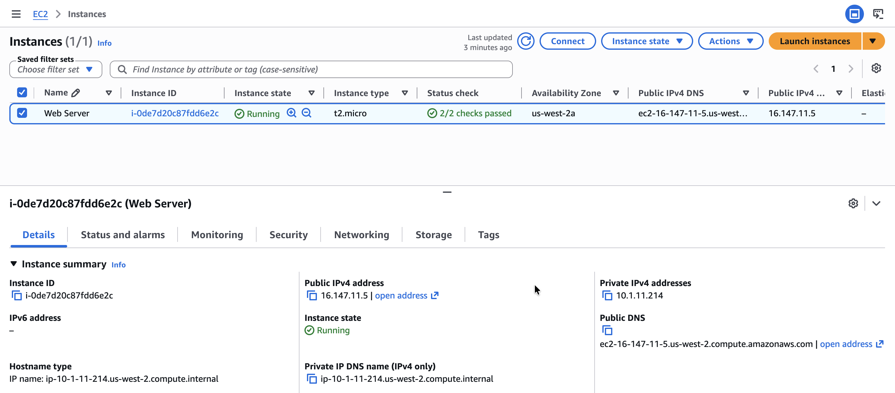
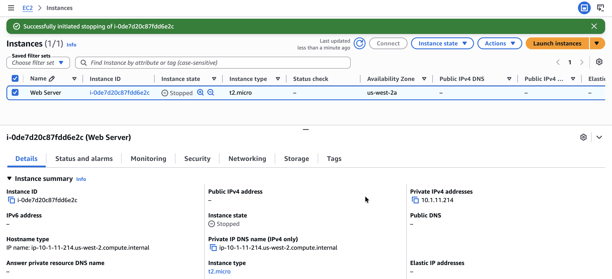

# Introduction to AWS Identity and Access Management (IAM)
In many business environments, access involves a single login to a computer or a network of computer systems that provides the user with access to all resources on the network. This access includes rights to personal and shared folders on a network server, company intranets, printers, and other network resources and devices, and unauthorized users can quickly exploit these same resources if the access control and associated authentication procedures are not set up properly. In this lab, I will explore users, user groups, and policies in the AWS Identity and Access Management (IAM) service.

  

*Here is diagram of the current environment with the listed IAM users and IAM groups.*

>[!Note]
> **IAM**
>
>IAM can be used for the following:
>
>- **Manage IAM users and their access:** You can create users and assign them individual security credentials (access keys, passwords, and multi-factor authentication devices). You can manage permissions to control which operations a user can perform.
>
>- **Manage IAM roles and their permissions:** An IAM role is similar to a user in that a role is an AWS identity with permission policies that determine what the identity can and cannot do in Amazon Web Services (AWS). However, instead of being uniquely associated with one person, a role is intended to be assumable by anyone who needs it.
>
>- **Manage federated users and their permissions:** You can activate identity federation to allow existing users in your enterprise to access the AWS Management Console, to call AWS application programming interfaces (APIs), and to access resources without the need to create an IAM user for each identity.

## Task 1: Create an account password policy
In this task, I strengthen the password requirements by creating a custom password policy. The various password options I select make the passwords users create much more difficult to crack.

1. In the AWS Management Console, I search for and select **IAM**.
2. In the left navigation pane, I choose **Account settings**.

Here I can see the default password policy currently in effect. The company I am working for has much stricter requirements, so I need to update this policy.

3. I choose **Change password policy**.
4. Under **Select your account password policy requirements**, I configure the following options:
   * For **Enforce minimum password length**, I change `8` to `10` characters.
   * I select every check box except **Password expiration requires administrator reset**.
   * For **Enable password expiration**, I leave the default option of **90 days**.
   * For **Prevent password reuse**, I leave the default option of **5 passwords**.
5. I choose **Save changes**.

  

*These changes take effect at the AWS account level and apply to every user associated with the account.*

## Task 2: Explore users and user groups
In this task, I view pre-created users along with the pre-created user groups. I learn about the policies attached to the user groups and what the differences are between the user groups and their permissions.

1. In the left navigation pane, I choose **Users**. The following IAM users have been created for me: `user-1`, `user-2`, `user-3`.
2. I choose `user-1` and notice that they do not have any permissions.
3. I choose the **Groups** tab and see that `user-1` is also not a member of any user groups.

> [!NOTE]
> A user group consists of several users who need access to the same data. Privileges can be distributed to the entire group of users rather than to each individual. This is much more efficient when applying permissions and provides greater overall control of access to resources than applying permissions to individuals.

4. I choose the **Security credentials** tab and see that `user-1` is assigned a **Console password**.
5. I choose **User groups**. The following user groups have already been created for me: `EC2-Admin`, `EC2-Support`, `S3-Support`.
6. I choose the **EC2-Support** group, then choose the **Permissions** tab. This group has a managed policy associated with it called `AmazonEC2ReadOnlyAccess`. 
7. Next to the `AmazonEC2ReadOnlyAccess` policy, I select the plus sign to show the policy.

> [!NOTE]
> A policy defines what actions are allowed or denied for specific AWS resources. This policy grants permission to list and describe information about Amazon Elastic Compute Cloud (EC2), Elastic Load Balancing (ELB), Amazon CloudWatch, and Amazon EC2 Auto Scaling. The ability to view resources without modifying them is ideal for assigning to a support role.
   >
   > The following is the basic structure of the statements in an IAM policy:
   > * *Effect* indicates whether to *Allow* or *Deny* the permissions.
   > * *Action* specifies the API calls that can be made against an AWS service.
   > * *Resource* defines the scope of entities covered by the policy rule.

8. I choose **User groups**, then choose the **S3-Support** group, and choose the **Permissions** tab. The `S3-Support` group has the `AmazonS3ReadOnlyAccess` policy attached.
9. Next to the `AmazonS3ReadOnlyAccess` policy, I select the plus sign to show the policy. This policy has permissions to get and list resources in Amazon S3.
10. I choose **User groups**, then choose the **EC2-Admin** group, and choose the **Permissions** tab. This group is slightly different from the other two — instead of a managed policy, it has a **Customer inline policy**, which is a policy assigned to only one user or group. 
11. Next to the `EC2-Admin-Policy` policy, I select the plus sign to show the policy. This policy grants permission to view (`Describe`) information about Amazon EC2, as well as the ability to start and stop instances.

## Business scenario
For the remainder of this lab, I work with these users and user groups to activate permissions supporting the following business scenario.

My company is growing its use of AWS and is using many EC2 instances and a great deal of Amazon S3 storage. I want to give access to new staff members depending upon their job function:

| User | In Group | Permissions |
|---|---|---|
| user-1 | S3-Support | Read-only access to Amazon S3 |
| user-2 | EC2-Support | Read-only access to Amazon EC2 |
| user-3 | EC2-Admin | View, start, and stop EC2 instances |

## Task 3: Add users to user groups
I have recently hired `user-1` into a role where they provide support for Amazon S3. I add them to the `S3-Support` group so that they inherit the necessary permissions via the attached `AmazonS3ReadOnlyAccess` policy.

In this task, I add all the associated users to their user groups.

### Add user-1 to the S3-Support group
1. I choose **User groups**.
2. I choose the **S3-Support** group, then choose the **Users** tab.
3. In the **Users** tab, I choose **Add users**.
4. In the **Add users to S3-Support** window, I select the check box for `user-1` and choose **Add Users**.

  

*In the **Users** tab, I see that `user-1` has been added to the group.*

### Add user-2 to the EC2-Support group
I have hired `user-2` into a role where they provide support for Amazon EC2.

5. Using the previous steps in this task, I add `user-2` to the **EC2-Support** group.

`user-2` is now part of the `EC2-Support` group.

### Add user-3 to the EC2-Admin group
I have hired `user-3` as my Amazon EC2 administrator to manage my EC2 instances.

6. Using the previous steps in this task, I add `user-3` to the **EC2-Admin** group.

`user-3` is now part of the `EC2-Admin` group.

  

*Each group now shows a `1` in the **Users** column for the number of users in each group.*

## Task 4: Sign in and test user permissions
In this task, I test the permissions of each IAM user. I sign in as all three users. I verify that `user-1` is able to view S3 buckets but unable to view EC2 instances. I then sign in as `user-2` and verify that they are able to view EC2 instances but unable to perform the stop instance action; `user-2` is also unable to view S3 buckets. After signing in as `user-3`, I verify that I am able to view EC2 instances and perform the stop instance action.

1. From the IAM Dashboard, I note the **AWS Account** section includes a **Sign-in URL for IAM users in this account**, which I can use to sign in to the AWS account I am currently using: `https://136933261767.signin.aws.amazon.com/console`
2. I open a private window using the following instructions for my web browser (Google Chrome):
   * I choose the ellipsis at the upper-right of the screen.
   * I choose **New Incognito window**.

### Testing user-1 (S3-Support)
I now sign in as `user-1`, who has been hired as my Amazon S3 storage support staff.

1. I paste the **Sign-in URL for IAM users in this account** into my private browser window.
2. I sign in using the following credentials:
   * **IAM user name:** `user-1`
   * **Password:** `Lab-Password1`
3. I choose **Sign in**.
4. From the **Services** menu, I choose **S3**.
5. I choose the name of one of my buckets and browse the contents. Because my user is part of the `S3-Support` group in IAM, they have permission to view a list of S3 buckets and their contents.

  

6. Now, test whether they have access to Amazon EC2. From the **Services** menu, I choose **EC2**, then in the left navigation pane, I choose **Instances**.

>[!Caution]
>I cannot see any instances. Instead, I see a message that says **"You are not authorized to perform this operation."** This message appears because my user has not been assigned any permissions to use Amazon EC2.*

### Testing user-2 (EC2-Support)
I now sign in as `user-2`, who has been hired as my Amazon EC2 support person.

1. I sign in using the following credentials:
   * **IAM user name:** `user-2`
   * **Password:** `Lab-Password2`
2. I choose **Sign in**.
3. From the **Services** menu, I choose **EC2**, then choose **Instances**.

  

*I am now able to see an EC2 instance because I have read-only permissions. However, I am not able to make any changes to Amazon EC2 resources.*

4. From the **Instance state** dropdown list, I choose **Stop instance**.
5. In the **Stop instance?** window, I choose **Stop**.

>[!Caution]
>I receive an error that says **"Failed to stop the instance. You are not authorized to perform this operation."** This demonstrates that the policy gives me permission to only view information and does not give me permission to make changes.

6. At the **Stop Instances** window, I choose **Cancel**.
7. Next, I check whether `user-2` can access Amazon S3. From the **Services** menu, I choose **S3**.

>[!Caution]
> I receive a **"You don't have permissions to list buckets"** message because `user-2` does not have permission to use Amazon S3.

### Testing user-3 (EC2-Admin)
I now sign in as `user-3`, who has been hired as my Amazon EC2 administrator.

1. I sign in using the following credentials:
   * **IAM user name:** `user-3`
   * **Password:** `Lab-Password3`
2. I choose **Sign in**.
3. From the **Services** menu, I choose **EC2**, then choose **Instances**.

As an EC2 administrator, I now have permissions to stop the EC2 instance.

> [!NOTE]
> If I cannot see an EC2 instance, my Region may be incorrect. In the upper-right of the screen, I choose the Region menu and select the Region I noted at the start of the lab.

4. From the **Instance state** dropdown list, I choose **Stop instance**.
5. In the **Stop instance?** window, I choose **Stop**.

  

*The instance enters the **Stopping** state and shuts down.*

## Conclusion
By completing this lab, I have successfully:

* Created and applied an IAM password policy
* Explored pre-created IAM users and user groups
* Inspected IAM policies as applied to the pre-created user groups
* Added users to user groups with specific capabilities active
* Located and used the IAM sign-in URL
* Experimented with the effects of policies on service access
