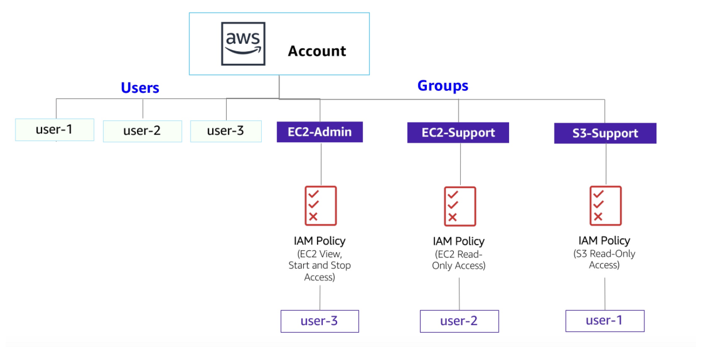

# Introduction to AWS Identity and Access Management (IAM)
In many business environments, access involves a single login to a computer or a network of computer systems that provides the user with access to all resources on the network. This access includes rights to personal and shared folders on a network server, company intranets, printers, and other network resources and devices, and unauthorized users can quickly exploit these same resources if the access control and associated authentication procedures are not set up properly. In this lab, I will explore users, user groups, and policies in the AWS Identity and Access Management (IAM) service.

  

*Here is diagram of the current environment with the listed IAM users and IAM groups.*

>[!Note]
> **IAM**
>IAM can be used for the following:
>
>Manage IAM users and their access: You can create users and assign them individual security credentials (access keys, passwords, and multi-factor authentication devices). You can manage permissions to control which operations a user can perform.
>Manage IAM roles and their permissions: An IAM role is similar to a user in that a role is an AWS identity with permission policies that determine what the identity can and cannot do in Amazon Web Services (AWS). However, instead of being uniquely associated with one person, a role is intended to be assumable by anyone who needs it.
>Manage federated users and their permissions: You can activate identity federation to allow existing users in your enterprise to access the AWS Management Console, to call AWS application programming interfaces (APIs), and to access resources without the need to create an IAM user for each identity.

## Task 1: Create an account password policy
In this task, I strengthen the password requirements by creating a custom password policy. The various password options I select make the passwords users create much more difficult to crack.

1. In the AWS Management Console, I search for and select **IAM**.
2. In the left navigation pane, I choose **Account settings**.
   > [!NOTE]
   > Here I can see the default password policy currently in effect. The company I am working for has much stricter requirements, so I need to update this policy.
3. I choose **Change password policy**.
4. Under **Select your account password policy requirements**, I configure the following options:
   * For **Enforce minimum password length**, I change `8` to `10` characters.
   * I select every check box except **Password expiration requires administrator reset**.
   * For **Enable password expiration**, I leave the default option of **90 days**.
   * For **Prevent password reuse**, I leave the default option of **5 passwords**.
5. I choose **Save changes**.

These changes take effect at the AWS account level and apply to every user associated with the account.

## Conclusion
By completing this lab, I have successfully:

* Created and applied an IAM password policy
* Explored pre-created IAM users and user groups
* Inspected IAM policies as applied to the pre-created user groups
* Added users to user groups with specific capabilities active
* Located and used the IAM sign-in URL
* Experimented with the effects of policies on service access
