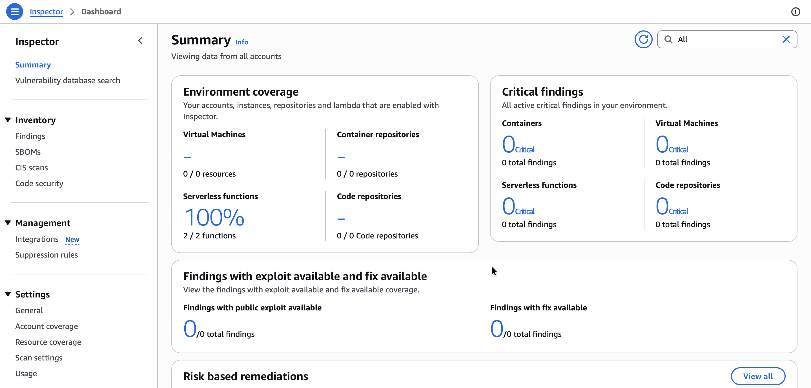
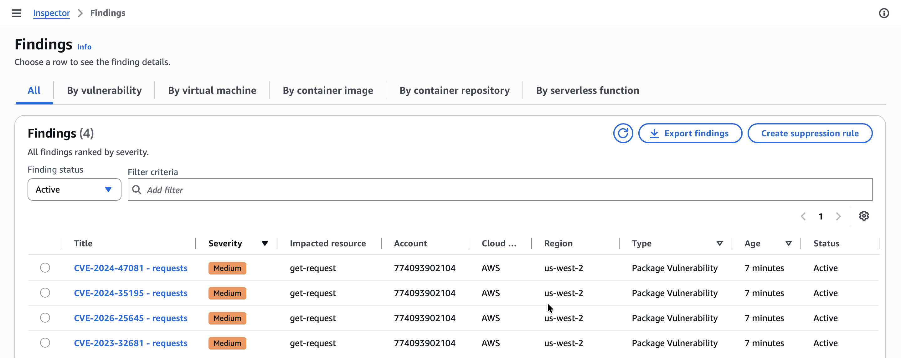
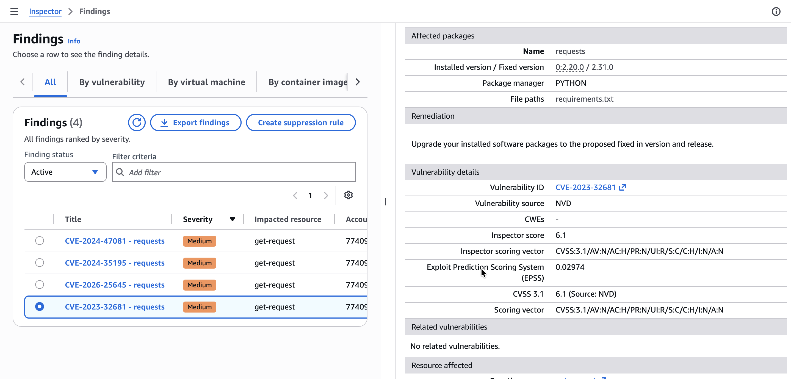
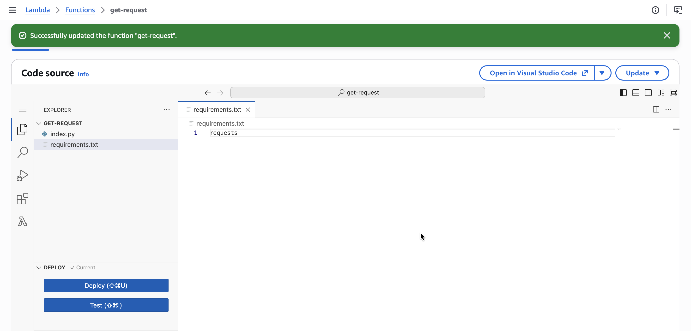
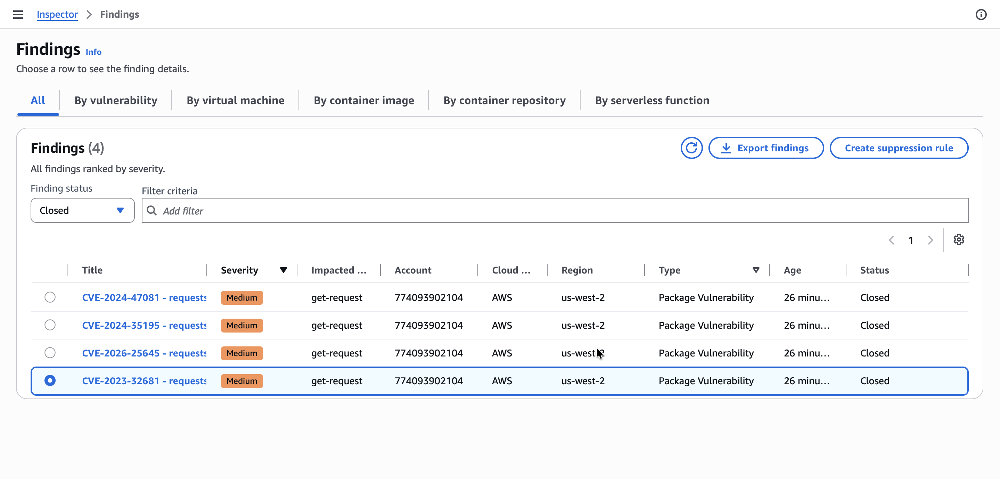
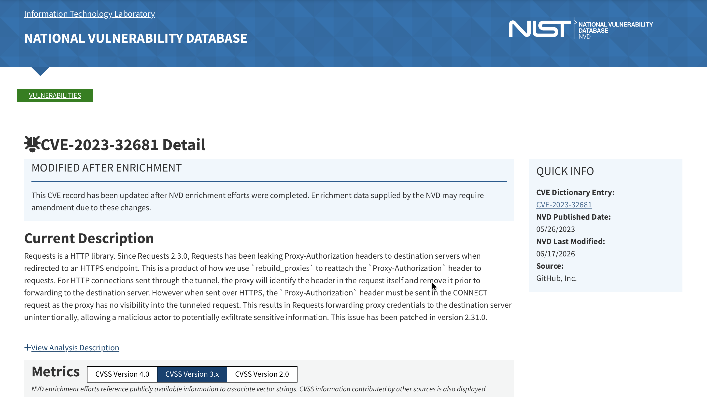

# Networking Hardening: Using Amazon Inspector for Vulnerability Assessment and Remediation

## Lab overview
In this lab, I utilize Amazon Inspector to scan for vulnerabilities in my AWS resources, specifically AWS Lambda functions. I learn how to activate Amazon Inspector, interpret the vulnerability reports, and remediate the findings.

## Scenario
The developers at AnyCompany are in the initial phases of building an application primarily using AWS Lambda. Throughout the development process, they need an automated security tool that not only scans for vulnerable software packages, but also scans within the code itself. I decide to utilize Amazon Inspector to fill this need.

**Amazon Inspector** meets the requirement of being able to scan AWS Lambda functions by quickly responding to new deployments. It also automatically scans additional resources, such as EC2 instances and Amazon ECRs, within AnyCompany's AWS account.

## Task 1: Activate the Amazon Inspector
I began by navigating to the AWS Management Console, searching for and choosing `Inspector`, then choosing **Activate Inspector** to activate the service for my account and continuously scan my Lambda functions.

After activation, the dashboard indicated that scanning was in progress. I monitored the **Environment coverage** section, refreshing the page periodically until **Lambda functions** coverage reached 100%, confirming that all functions were being scanned.

The dashboard now shows my account number and activation status for AWS Lambda, with **Lambda coverage at 100%**. By default, scanning is activated for Amazon EC2, Amazon ECR, and AWS Lambda standard scanning.

  

## Task 2: Reviewing the inspected resources
In this task, while I wait for the scan to finish, I explore the detected vulnerabilities under the **Findings** section. Amazon Inspector reports multiple findings related to Lambda functions, each with details such as severity, affected resource, and vulnerability description.

  

Three rows are displayed, one for each vulnerability within the Lambda function. I see the following key details:
- Severity: `Medium`
- Impacted resource shows the affected Lambda function, here: `get-request`
- Title shows the reason for the finding, here: `CVE-20XX-XXXXX - requests`

One key finding is **CVE-2023-32681 - requests**, which identifies a vulnerability in the Python `requests` package. By opening the finding details, I access the External reference to the National Vulnerability Database (NVD), which contains the recommended remediation.

  

The issue is that the `requests` package is vulnerable and outdated, and the recommendation is to upgrade the package.

## Task 3: Remediating the vulnerabilities findings
In this task, I analyze the findings reported by Amazon Inspector and interpret the vulnerability details. I update my Lambda functions to remediate the vulnerabilities, then review the Amazon Inspector findings to confirm the vulnerability has been fixed.

### Remediating my Lambda function's package vulnerabilities

1. On the AWS Management Console, I search for and choose **Lambda**.
2. From the list of Lambda functions, I choose the **get-request** function.
3. Within the Lambda function code editor's file browser, I choose **requirements.txt**.
4. I remove the version number and equal signs from `requests==2.20.0` so that the line becomes only `requests`.

> [!NOTE]
> The `requirements.txt` file tells AWS Lambda which Python packages are required to run the function. When no version number is specified, the latest version of the package is installed by default, ensuring that the Lambda function uses the latest version of the package.

5. I choose the **Deploy** button to deploy the function.

  

*A banner displays the message "Successfully updated the function **get-request**." This latest deployment of my Lambda function triggers Amazon Inspector to initiate a new scan of the function.*

### Verifying remediation

1. On the AWS Management Console, I search for and choose **Amazon Inspector**.
2. Under **Findings**, I choose **All findings**.
3. In the findings dashboard, under finding status, I change the selection from `Active` to `Closed`.
4. In the list of closed findings, I see **CVE-2023-32681 - requests**. This confirms the successful remediation of the vulnerability.
5. Under **Resource coverage**, I choose **Lambda functions**.
6. If needed, I expand the width of the **Last scanned** column to display the full timestamp.

Below the closed findings list showing resolved vulnerability.

  

I observe that the most recently scanned Lambda function has an updated timestamp.

  

## Conclusion
After completing this lab, I am able to:

* Activate Amazon Inspector
* Analyze and interpret vulnerability findings
* Remediate the vulnerabilities found by Amazon Inspector
