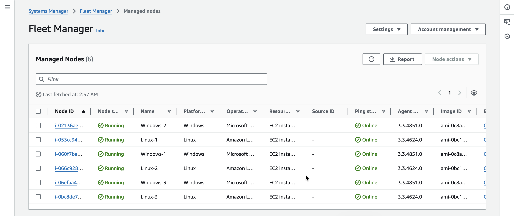
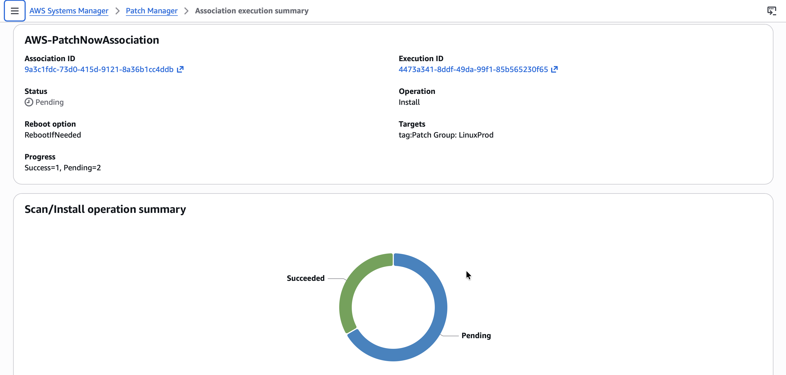

# Systems Hardening with Patch Manager via AWS Systems Manager

## Lab overview
In organizations with hundreds and often thousands of workstations, it can be logistically challenging to keep all the operating system (OS) and application software up to date. In most cases, OS updates on workstations can be automatically applied via the network. However, administrators must have a clear security policy and baseline plan to ensure that all workstations are running a certain minimum version of software.

In this lab, I use Patch Manager, a capability of AWS Systems Manager, to create a patch baseline. I then use the patch baseline I created to scan the Amazon Elastic Compute Cloud (Amazon EC2) instances for Windows that were pre-created for this lab. I also use the default patch baseline to patch EC2 Linux instances.

## Task 1: Patch Linux instances using default baselines
In this task, I patch Linux EC2 instances using default baselines available for the OS.

> [!NOTE]
> Patch Manager provides predefined patch baselines for each of the operating systems it supports. I can use custom patch baselines for greater control over which patches are approved or rejected for my environment.

1. In the AWS Management Console, I enter `Systems Manager` and select it.
2. In the Systems Manager console page, under **Node Management**, I choose **Fleet Manager**.

  

*Here are the pre-configured EC2 instances — three Linux instances and three Windows instances. These EC2 instances have a specific IAM role associated with them that allows me to manage them using Systems Manager.*

3. Under **Node Tools**, I choose **Patch Manager**.
4. I choose **Start with an overview**.
5. I choose **Patch now** to patch the Linux instances with **AWS-AmazonLinux2DefaultPatchBaseline**.
6. Under **Basic configuration**, I configure as follows:
   * **Patching operation:** Scan and install
   * **Reboot option:** Reboot if needed
   * **Instances to patch:** Patch only the target instances I specify
   * **Target selection:** Specify instance tags
     * **Tag key:** `Patch Group`
     * **Tag value:** `LinuxProd`
   * I choose **Add**.
7. I choose **Patch now**.

A new page displays. In the **AWS-PatchNowAssociation** panel, a **Status** field shows that three instances will be affected, along with the progress made.

  

*A Scan/Install operation summary panel also displays the status of the affected EC2 instances visually. I monitor this page until the patch operation on all three instances completes.*

## Task 2: Create a custom patch baseline for Windows instances
In this task, I create a custom patch baseline for the Windows instances. Although Windows has default patch baselines available, for this use case, I set up a baseline for Windows security updates.

1. In the Systems Manager console, under **Node Tools**, I choose **Patch Manager**.
2. I choose **Start with an overview**, choose the **Patch baselines** tab, then choose the **Create patch baseline** button.
3. For **Patch baseline details**, I configure the following options:
   * **Name:** `WindowsServerSecurityUpdates`
   * **Description - optional:** `Windows security baseline patch`
   * **Operating system:** Windows
   * I leave the **Default patch baseline** check box unselected.
4. In the **Approval rules for operating systems** section, I configure the following options:
   * **Products:** I choose **WindowsServer2019**, and deselect **All** so that it no longer appears under Products.
   * **Severity:** This option indicates the severity value of the patches that the rule applies to. To ensure that all service packs are included by the rule, I choose **Critical**.
   * **Classification:** I choose **SecurityUpdates**.
   * **Auto-approval:** `3` days.
   * **Compliance reporting - optional:** I choose **Critical**.
5. I choose **Add rule** to add a second rule to this patch baseline, and configure the following options:
   * **Products:** I choose **WindowsServer2019**, and deselect **All** so that it no longer appears under Products.
   * **Severity:** I choose **Important**.
   * **Classification:** I choose **SecurityUpdates**.
   * **Auto-approval:** `3` days.
   * **Compliance reporting - optional:** I choose **High**.
6. I choose **Create patch baseline**.

Next, I modify a patch group for the Windows patch baseline I just created, to associate it with a patch group.

7. In the **Patch baselines** section, I select the button for the **WindowsServerSecurityUpdates** patch baseline I just created.
8. I choose the **Actions** dropdown list, then choose **Modify patch groups**.
9. In the **Modify patch groups** section, under **Patch groups**, I enter `WindowsProd`.
10. I choose the **Add** button, then choose **Close**.

## Conclusion
After completing this lab, I am able to:

* Patch Linux instances using default baseline
* Create a custom patch baseline
* Use patch groups to patch Windows instances using a custom patch baseline
* Verify patch compliance
