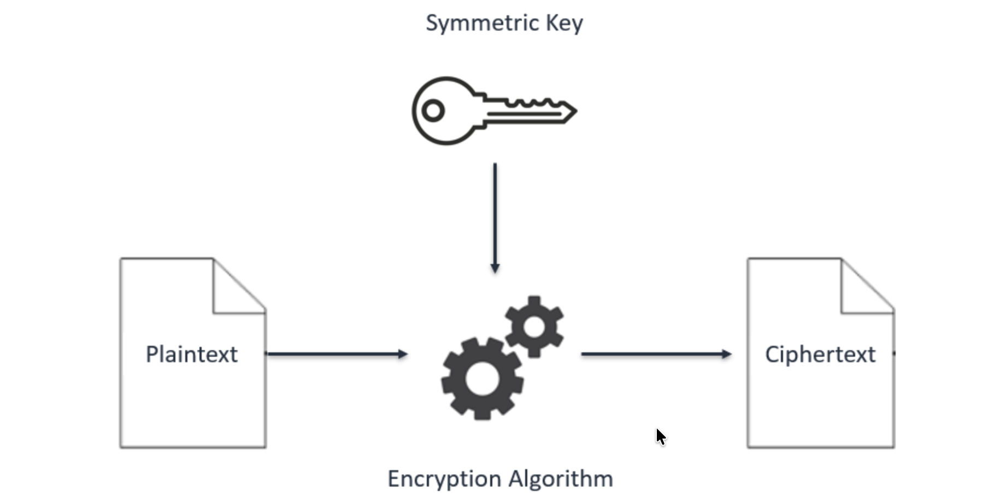
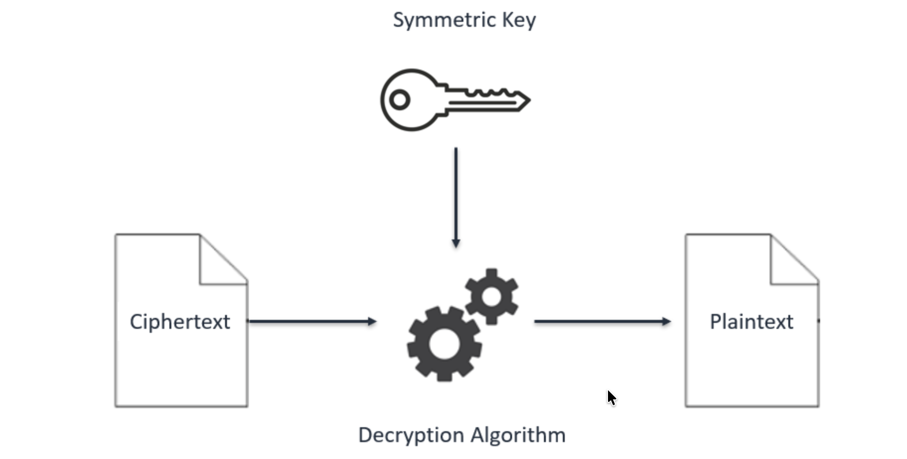

# Data Protection Using Encryption
Cryptography is the conversion of communicated information into secret code that keeps the information confidential and private. Functions include authentication, data integrity, and nonrepudiation. The central function of cryptography is encryption, which transforms data into an unreadable form.

Encryption ensures privacy by keeping information hidden from people it is not intended for. Decryption, the opposite of encryption, transforms encrypted data back into readable data; it won't make any sense until it has been properly decrypted.

## Lab overview
In this lab, I connect to a file server hosted on an Amazon Elastic Compute Cloud (Amazon EC2) instance. I configure the AWS Encryption command line interface (CLI) on the instance, and create an encryption key using the AWS Key Management Service (AWS KMS). I use this key to encrypt and decrypt data. Next, I create multiple text files that are unencrypted by default, then use the AWS KMS key to encrypt the files and view them while they are encrypted. I finish the lab by decrypting the same files and viewing their contents.

## Task 1: Create an AWS KMS key
In this task, I create an AWS KMS key that I later use to encrypt and decrypt data.

> [!NOTE]
> With AWS KMS, I can create and manage cryptographic keys and control their use across a wide range of AWS services and in my applications. AWS KMS is a secure and resilient service that uses hardware security modules (HSMs) that have been validated under the Federal Information Processing Standard (FIPS) Publication 140-2, or are in the process of being validated, to protect my keys.

1. In the AWS Management Console, I choose **Key Management Service**.
2. I choose **Create a key**.
3. For **Key type**, I choose **Symmetric**, then choose **Next**.

> [!NOTE]
> *Symmetric* encryption uses the same key to encrypt and decrypt data, which makes it fast and efficient to use. *Asymmetric* encryption uses a public key to encrypt data and a private key to decrypt information.

4. On the **Add labels** page, I configure the following:
   * **Alias:** `MyKMSKey`
   * **Description:** `Key used to encrypt and decrypt data files.`
5. I choose **Next**.
6. On the **Define key administrative permissions** page, in the **Key administrators** section, I search for and select the check box for `voclabs`, then choose **Next**.
7. On the **Define key usage permissions** page, in the **This account** section, I search for and select the check box for `voclabs`, then choose **Next**. I review the settings, then choose **Finish**.
8. I choose the link for **MyKMSKey**, which I just created, and copy the **ARN (Amazon Resource Name)** value: 
```
arn:aws:kms:us-west-2:705225511426:key/d844d02d-733d-4dfd-8c2f-f29e78a1f163
```

## Task 2: Configure the File Server instance
In this task, I configure the AWS credentials file, which provides the ability to use the AWS KMS key I created earlier. I then install the AWS Encryption CLI, so that I can run encryption commands.

1. In the AWS Management Console, I choose **EC2**.
2. In the **Instances** list, I select the check box next to the **File Server** instance, then choose **Connect**.
3. I choose the **Session Manager** tab, then choose **Connect**.
4. To change to the home directory and create the AWS credentials file, I run the following commands:

```bash
cd ~
aws configure
```

5. When prompted, I configure the following:
   * **AWS Access Key ID:** Enter `1`, then press Enter.
   * **AWS Secret Access Key:** Enter `1`, then press Enter.
   * **Default region name:** Copy and paste the Region provided from the Vocareum AWS Details page.
   * **Default output format:** Press Enter.

*The AWS configuration file is created, however the entries of `1` are temporary placeholders that will be updated.*

6. I use the details provided from the Vocareum Lab console page.
7. To open the AWS credentials file in the `vi` editor, I run the following command:

```bash
vi ~/.aws/credentials
```

8. In the `~/.aws/credentials` file, I type `dd` multiple times to delete the contents of the file.
9. I paste in the code block I copied from the Vocareum Lab into the `vi` editor.

*The AWS credentials file now includes the following: `aws_access_key_id`, `aws_secret_access_key`, and `aws_session_token`. The credentials used are from the AWS Details section.*

10. To save and close the file, I press **Escape**, type `:wq`, and press Enter.
11. To view the updated contents of the file, I run the following command:

```bash
cat ~/.aws/credentials
```

Now I install the AWS Encryption CLI and export my path, so that I can run the commands to encrypt and decrypt data.

12. To install the AWS Encryption CLI and set my path, I run the following commands:

```bash
pip3 install aws-encryption-sdk-cli
export PATH=$PATH:/home/ssm-user/.local/bin
```

**Terminal Output:**
```bash
sh-4.2$ cd ~
sh-4.2$ aws configure
AWS Access Key ID [None]: 1
AWS Secret Access Key [None]: 1
Default region name [None]: us-west-2
Default output format [None]:
sh-4.2$ vi ~/.aws/credentials
...

sh-4.2$ pip3 install aws-encryption-sdk-cli
Defaulting to user installation because normal site-packages is not writeable
Collecting aws-encryption-sdk-cli
  Downloading aws_encryption_sdk_cli-4.3.0-py2.py3-none-any.whl (44 kB)
     |████████████████████████████████| 44 kB 3.0 MB/s
Collecting aws-encryption-sdk~=3.1
  Downloading aws_encryption_sdk-3.3.1-py2.py3-none-any.whl (90 kB)
     |████████████████████████████████| 90 kB 9.6 MB/s
Collecting attrs>=17.1.0
  Downloading attrs-24.2.0-py3-none-any.whl (63 kB)
     |████████████████████████████████| 63 kB 3.3 MB/s
Requirement already satisfied: setuptools in /usr/lib/python3.7/site-packages (from aws-encryption-sdk-cli) (49.1.3)
Collecting base64io>=1.0.1
  Downloading base64io-1.0.3-py2.py3-none-any.whl (17 kB)
Collecting wrapt>=1.10.11
  Downloading wrapt-1.16.0-cp37-cp37m-manylinux_2_5_x86_64.manylinux1_x86_64.manylinux_2_17_x86_64.manylinux2014_x86_64.whl (77 kB)
     |████████████████████████████████| 77 kB 11.1 MB/s
Collecting cryptography>=3.4.6
  Downloading cryptography-45.0.7-cp37-abi3-manylinux2014_x86_64.manylinux_2_17_x86_64.whl (4.4 MB)
     |████████████████████████████████| 4.4 MB 56.5 MB/s
Collecting boto3>=1.10.0
  Downloading boto3-1.33.13-py3-none-any.whl (139 kB)
     |████████████████████████████████| 139 kB 75.9 MB/s
Collecting importlib-metadata; python_version < "3.8"
  Downloading importlib_metadata-6.7.0-py3-none-any.whl (22 kB)
Collecting cffi>=1.14; platform_python_implementation != "PyPy"
  Downloading cffi-1.15.1-cp37-cp37m-manylinux_2_17_x86_64.manylinux2014_x86_64.whl (427 kB)
     |████████████████████████████████| 427 kB 75.7 MB/s
Collecting s3transfer<0.9.0,>=0.8.2
  Downloading s3transfer-0.8.2-py3-none-any.whl (82 kB)
     |████████████████████████████████| 82 kB 398 kB/s
Collecting jmespath<2.0.0,>=0.7.1
  Downloading jmespath-1.0.1-py3-none-any.whl (20 kB)
Collecting botocore<1.34.0,>=1.33.13
  Downloading botocore-1.33.13-py3-none-any.whl (11.8 MB)
     |████████████████████████████████| 11.8 MB 50.6 MB/s
Collecting zipp>=0.5
  Downloading zipp-3.15.0-py3-none-any.whl (6.8 kB)
Collecting typing-extensions>=3.6.4; python_version < "3.8"
  Downloading typing_extensions-4.7.1-py3-none-any.whl (33 kB)
Collecting pycparser
  Downloading pycparser-2.21-py2.py3-none-any.whl (118 kB)
     |████████████████████████████████| 118 kB 78.2 MB/s
Collecting python-dateutil<3.0.0,>=2.1
  Downloading python_dateutil-2.9.0.post0-py2.py3-none-any.whl (229 kB)
     |████████████████████████████████| 229 kB 76.8 MB/s
Collecting urllib3<1.27,>=1.25.4; python_version < "3.10"
  Downloading urllib3-1.26.20-py2.py3-none-any.whl (144 kB)
     |████████████████████████████████| 144 kB 81.9 MB/s
Collecting six>=1.5
  Downloading six-1.17.0-py2.py3-none-any.whl (11 kB)
Installing collected packages: wrapt, pycparser, cffi, cryptography, six, python-dateutil, jmespath, urllib3, botocore, s3transfer, boto3, zipp, typing-extensions, importlib-metadata, attrs, aws-encryption-sdk, base64io, aws-encryption-sdk-cli
  WARNING: The script aws-encryption-cli is installed in '/home/ssm-user/.local/bin' which is not on PATH.
  Consider adding this directory to PATH or, if you prefer to suppress this warning, use --no-warn-script-location.
Successfully installed attrs-24.2.0 aws-encryption-sdk-3.3.1 aws-encryption-sdk-cli-4.3.0 base64io-1.0.3 boto3-1.33.13 botocore-1.33.13 cffi-1.15.1 cryptography-45.0.7 importlib-metadata-6.7.0 jmespath-1.0.1 pycparser-2.21 python-dateutil-2.9.0.post0 s3transfer-0.8.2 six-1.17.0 typing-extensions-4.7.1 urllib3-1.26.20 wrapt-1.16.0 zipp-3.15.0
sh-4.2$ export PATH=$PATH:/home/ssm-user/.local/bin
sh-4.2$
```

## Task 3: Encrypt and decrypt data
In this task, I learn how to encrypt plaintext data into ciphertext by running the `--encrypt` command. I then successfully decrypt the ciphertext back into the original, readable plaintext data.


<p align="center">
  
</p>

*This diagram shows how encryption works with symmetric keys and algorithms. A symmetric key and algorithm are used to convert a plaintext message into ciphertext.*

<p align="center">
  
</p>

*This diagram shows how the same secret key and symmetric algorithm from the encryption process are used to decrypt the ciphertext back into plaintext.*

## Conclusion
After completing this lab, I am able to:

* Create an AWS KMS encryption key
* Install the AWS Encryption CLI
* Encrypt plaintext
* Decrypt ciphertext
