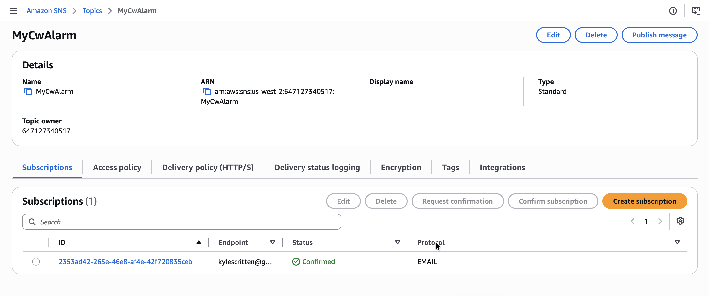
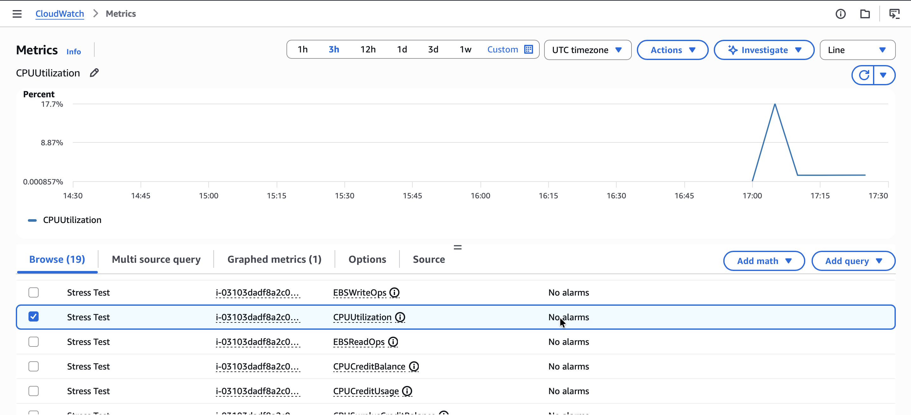
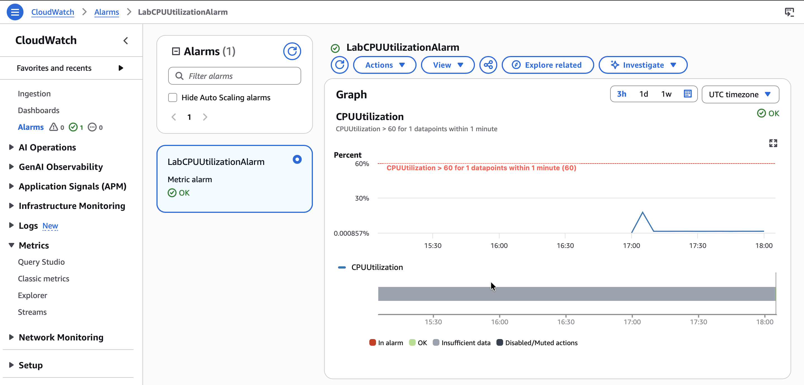
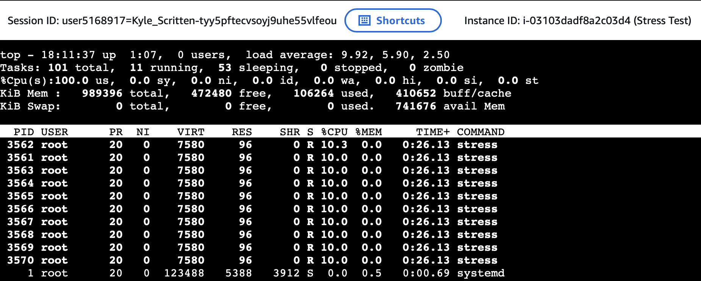
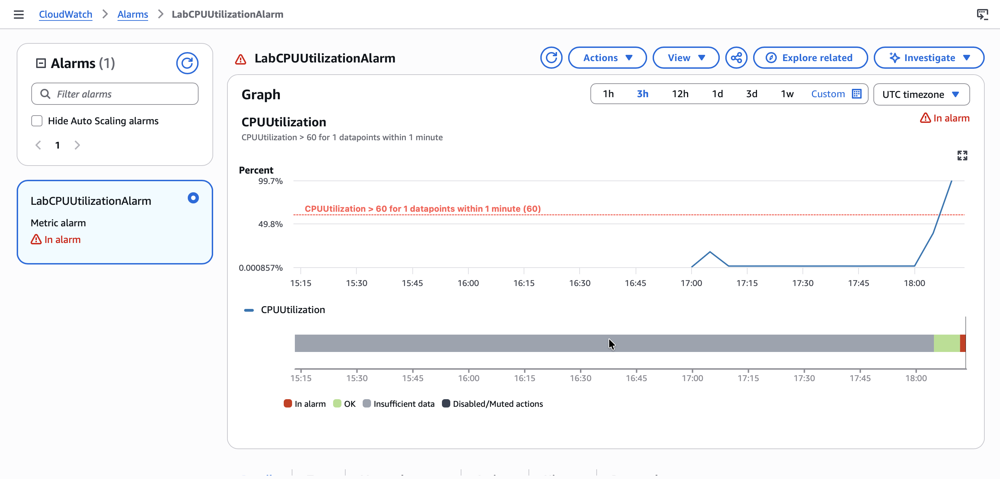
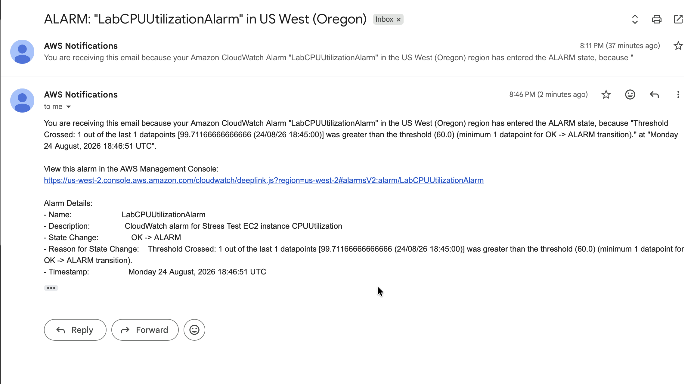
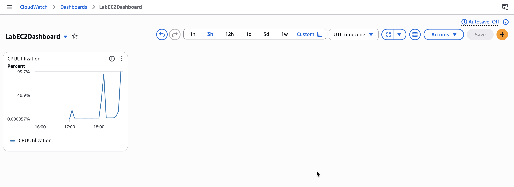

# Monitor an EC2 Instance with Amazon CloudWatch

## Lab overview
In this lab, I create an Amazon CloudWatch alarm that triggers when the Amazon Elastic Compute Cloud (Amazon EC2) instance exceeds a specific central processing unit (CPU) utilization threshold. I create a subscription using Amazon Simple Notification Service (Amazon SNS) that sends me an email if this alarm goes off. I then log in to the EC2 instance and run a stress test command that causes the CPU utilization of the EC2 instance to reach 100 percent.

This test simulates a malicious actor gaining control of the EC2 instance and spiking the CPU. CPU spiking has various possible causes, one of which is malware.

> [!NOTE]
> **Logging** refers to recording and storing data events as log files. Logs contain low-level details that can provide visibility into how an application or system performs under certain circumstances. From a security standpoint, logging helps security administrators identify red flags that are easily overlooked in their system.
>
> **Monitoring** is the process of analyzing and collecting data to help ensure optimal performance. Monitoring helps detect unauthorized access and helps align service usage with organizational security.

## Task 1: Configure Amazon SNS
In this task, I create an SNS topic and then create a subscription for the topic using an email address. This topic will now be able to send alerts to the email address I associate with the Amazon SNS subscription.

> [!NOTE]
> Amazon SNS is a fully managed messaging service for both application-to-application (A2A) and application-to-person (A2P) communication.

1. In the AWS Management Console, I enter and choose **Simple Notification Service**.
2. On the left, I choose **Topics**, then choose **Create topic**.
3. On the **Create topic** page, in the **Details** section, I configure the following options, then choose **Create topic**:
   * **Type:** Choose **Standard**
   * **Name:** Enter `MyCwAlarm`
4. On the **MyCwAlarm** details page, I choose the **Subscriptions** tab, then choose **Create subscription**.
5. On the **Create subscription** page, in the **Details** section, I configure the following options, then choose **Create subscription**:
   * **Topic ARN:** Leave the default option selected
   * **Protocol:** `Email`
   * **Endpoint:** `My Email Address`

In the **Details** section, the **Status** shows **Pending confirmation**. I receive an *"AWS Notification - Subscription Confirmation"* email message at the address I provided in the previous step.

6. I open the email I received with the Amazon SNS subscription notification and choose **Confirm subscription**.
7. I go back to the AWS Management Console and choose **Subscriptions**.

<p align="center">
  
</p>

*The status now shows **Confirmed**.*

## Task 2: Create a CloudWatch alarm
In this task, I view some Amazon EC2 metrics within CloudWatch, then create a CloudWatch alarm that enters an **In alarm** state when the CPU utilization threshold exceeds 60 percent.

> [!NOTE]
> CloudWatch is a monitoring and observability service built for DevOps engineers, developers, site reliability engineers (SREs), IT managers, and product owners. CloudWatch provides data and actionable insights to monitor applications, respond to system-wide performance changes, and optimize resource utilization. CloudWatch collects monitoring and operational data in the form of logs, metrics, and events, giving a unified view of operational health and visibility into AWS resources, applications, and services running on AWS and on premises.

1. In the AWS Management Console, I enter `CloudWatch` in the search bar and choose it.
2. I choose the **Metrics** dropdown list, then choose **Classic metrics**.

CloudWatch usually takes 5-10 minutes after the creation of an EC2 instance to start fetching metric details.

3. On the **Metrics** page, I choose **EC2**, then choose **Per-Instance Metrics**.
4. I select the check box with **CPUUtilization** as the Metric name for the **Stress Test** EC2 instance.

<p align="center">
  
</p>

*This displays the graph for the CPU utilization metric, which is approximately 0% because nothing has been done yet.*

5. I choose the **Alarms** dropdown list, then choose **All alarms**.

I now create a metric alarm. A metric alarm watches a single CloudWatch metric or the result of a math expression based on CloudWatch metrics. The alarm performs one or more actions based on the value of the metric or expression relative to a threshold over a number of time periods. The action then sends a notification to the SNS topic I created earlier.

6. I choose **Create alarm**.
7. I choose **Select metric**, choose **EC2**, then choose **Per-Instance Metrics**.
8. I select the check box with **CPUUtilization** as the Metric name for the Stress Test instance, then choose **Select metric**.
9. On the **Specify metric and conditions** page, I configure the following options:

   **Metric**
   * **Metric name:** `CPUUtilization`
   * **InstanceId:** Leave the default option selected
   * **Statistic:** `Average`
   * **Period:** Choose `1 minute`

   **Conditions**
   * **Threshold type:** Choose `Static`
   * **Whenever CPUUtilization is...:** Choose `Greater > threshold`
   * **than... Define the threshold value:** Enter `60`

10. I choose **Next**.
11. On the **Configure actions** page, I configure the following options:

    **Notification**
    * **Alarm state trigger:** Choose `In alarm`
    * **Select an SNS topic:** Choose `Select an existing SNS topic`
    * **Send a notification to...:** Choose the text box, then choose `MyCwAlarm`

12. I choose **Next**, then configure the following options:

    **Name and description**
    * **Alarm name:** Enter `LabCPUUtilizationAlarm`
    * **Alarm description - optional:** Enter `CloudWatch alarm for Stress Test EC2 instance CPUUtilization`

13. I choose **Next**, review the **Preview and create** page, then choose **Create alarm**.

<p align="center">
  
</p>

*The figure shows the CloudWatch alarm for the Stress Test EC2 instance CPUUtilization page.*

## Task 3: Test the CloudWatch alarm
In this task, I run a command to load the EC2 instance to 100 percent for 400 seconds. This increase in CPU utilization activates the alarm into the **In alarm** state, and I confirm the spike in CPU utilization by viewing the CloudWatch graph. I also receive an email notification alerting me of the In alarm state.

1. I navigate to the Vocareum Lab console page and copy the `EC2InstanceURL` link. I paste this link into a new browser tab, connecting me to the Stress Test EC2 instance.
``` 
https://us-west-2.console.aws.amazon.com/systems-manager/session-manager/i-03103dadf8a2c03d4?region=us-west-2
```
2. To manually increase the CPU load of the EC2 instance, I run the following command:
```bash
sudo stress --cpu 10 -v --timeout 400s
```

**Terminal output:**
```bash
sh-4.2$ sudo stress --cpu 10 -v --timeout 400s
stress: info: [3560] dispatching hogs: 10 cpu, 0 io, 0 vm, 0 hdd
stress: dbug: [3560] using backoff sleep of 30000us
stress: dbug: [3560] setting timeout to 400s
stress: dbug: [3560] --> hogcpu worker 10 [3561] forked
stress: dbug: [3560] using backoff sleep of 27000us
stress: dbug: [3560] setting timeout to 400s
stress: dbug: [3560] --> hogcpu worker 9 [3562] forked
stress: dbug: [3560] using backoff sleep of 24000us
stress: dbug: [3560] setting timeout to 400s
stress: dbug: [3560] --> hogcpu worker 8 [3563] forked
stress: dbug: [3560] using backoff sleep of 21000us
stress: dbug: [3560] setting timeout to 400s
stress: dbug: [3560] --> hogcpu worker 7 [3564] forked
stress: dbug: [3560] using backoff sleep of 18000us
stress: dbug: [3560] setting timeout to 400s
stress: dbug: [3560] --> hogcpu worker 6 [3565] forked
stress: dbug: [3560] using backoff sleep of 15000us
stress: dbug: [3560] setting timeout to 400s
stress: dbug: [3560] --> hogcpu worker 5 [3566] forked
stress: dbug: [3560] using backoff sleep of 12000us
stress: dbug: [3560] setting timeout to 400s
stress: dbug: [3560] --> hogcpu worker 4 [3567] forked
stress: dbug: [3560] using backoff sleep of 9000us
stress: dbug: [3560] setting timeout to 400s
stress: dbug: [3560] --> hogcpu worker 3 [3568] forked
stress: dbug: [3560] using backoff sleep of 6000us
stress: dbug: [3560] setting timeout to 400s
stress: dbug: [3560] --> hogcpu worker 2 [3569] forked
stress: dbug: [3560] using backoff sleep of 3000us
stress: dbug: [3560] setting timeout to 400s
stress: dbug: [3560] --> hogcpu worker 1 [3570] forked
```

*This command runs for 400 seconds, loads the CPU to 100 percent, and then decreases the CPU to 0 percent after the allotted time.*

3. I copy and paste the URL next to `EC2InstanceURL` into another new browser tab to open a second terminal for the Stress Test instance.
4. In the new terminal, I run the `top` command:

<p align="center">
  
</p>

5. I navigate back to the AWS console, where I have the CloudWatch Alarms page open and choose `LabCPUUtilizationAlarm`.
6. I monitor the graph, selecting the refresh button every 1 minute, until the alarm status shows **In alarm**.

<p align="center">
  
</p>

*On the graph, I can see where CPUUtilization has increased above the 60 percent threshold.*

7. I navigate to the email inbox for the address I used to configure the Amazon SNS subscription, and see a new email notification from AWS Notifications.

<p align="center">
  
</p>

*The CloudWatch alarm successfully detects the CPU spike and triggers an SNS email notification.*

## Task 4: Create a CloudWatch dashboard
In this task, I create a CloudWatch dashboard using the same CPUUtilization metrics I have used throughout this lab.

> [!NOTE]
> CloudWatch dashboards are customizable home pages in the CloudWatch console used to monitor resources in a single view. With CloudWatch dashboards, I can even monitor resources spread across different Regions, creating customized views of the metrics and alarms for my AWS resources.

1. I go to the CloudWatch section in the AWS console and choose **Dashboards**.
2. I choose **Create dashboard**.
3. For **Dashboard name**, I enter `LabEC2Dashboard`, then choose **Create dashboard**.
4. I choose **Line**, then choose `Metrics`.
5. I choose **EC2**, then choose `Per-Instance Metrics`.
6. I select the check box with **Stress Test** for the Instance name and **CPUUtilization** for the Metric name.
7. I choose **Create widget**, then choose **Save dashboard**.

<p align="center">
  
</p>

*I now have a quick access shortcut to view the CPUUtilization metric for the Stress Test instance.*

## Conclusion
After completing this lab, I am able to:

* Create an Amazon SNS notification
* Configure a CloudWatch alarm
* Stress test an EC2 instance
* Confirm that an Amazon SNS email was sent
* Create a CloudWatch dashboard
