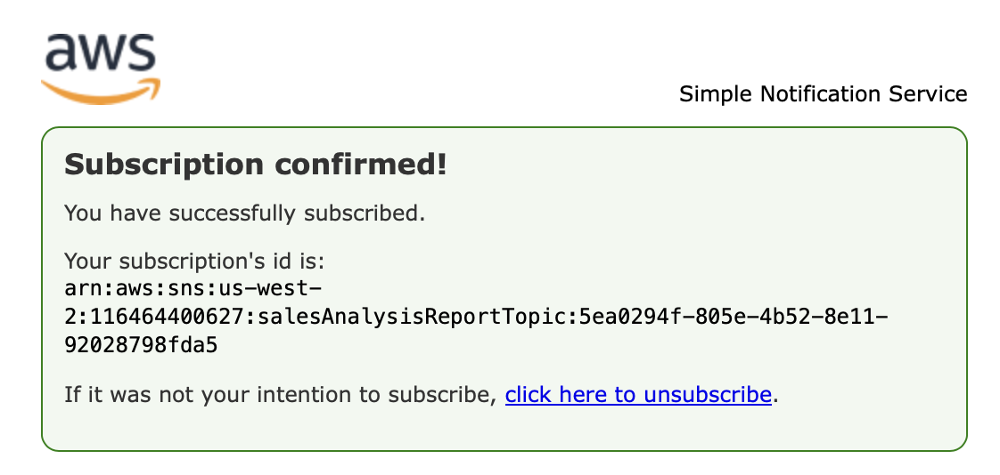
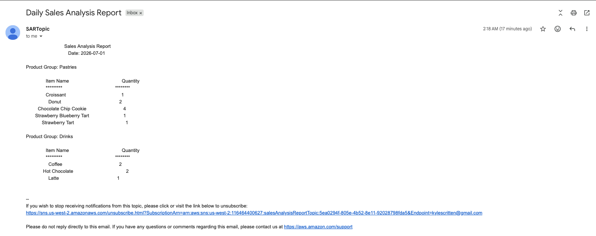
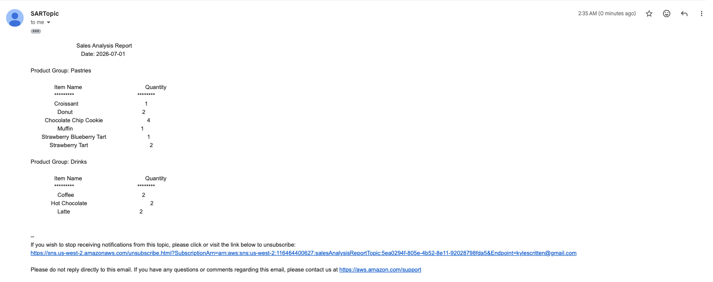

# Activity - Working with AWS Lambda

In this lab, I will deploy and configure an AWS Lambda based serverless computing solution. The Lambda function generates a sales analysis report by pulling data from a database and emailing the results daily. The database connection information is stored in Parameter Store, a capability of AWS Systems Manager. The database itself runs on an Amazon Elastic Compute Cloud (Amazon EC2) Linux, Apache, MySQL, and PHP (LAMP) instance.

The following diagram shows the architecture of the sales analysis report solution and illustrates the order in which actions occur.

<p align="center">
  
</p>

The diagram includes the following function steps:
| Step | Details |
|------|---------|
| 1 | An Amazon CloudWatch Events event calls the `salesAnalysisReport` Lambda function at 8 PM every day Monday through Saturday. |
| 2 | The `salesAnalysisReport` Lambda function invokes another Lambda function, `salesAnalysisReportDataExtractor`, to retrieve the report data. |
| 3 | The `salesAnalysisReportDataExtractor` function runs an analytical query against the café database (`cafe_db`). |
| 4 | The query result is returned to the `salesAnalysisReport` function. |
| 5 | The `salesAnalysisReport` function formats the report into a message and publishes it to the `salesAnalysisReportTopic` Amazon SNS topic. |
| 6 | The `salesAnalysisReportTopic` SNS topic sends the message by email to the administrator. |

## Lab Objectives
In this lab, I learnt how to:
- Recognize necessary AWS Identity and Access Management (IAM) policy permissions to facilitate a Lambda function to other Amazon Web Services (AWS) resources.
- Create a Lambda layer to satisfy an external library dependency.
- Create Lambda functions that extract data from database, and send reports to user.
- Deploy and test a Lambda function that is initiated based on a schedule and that invokes another function.
- Use CloudWatch logs to troubleshoot any issues running a Lambda function.

## Task 1: Observing the IAM role settings
The **salesAnalysisReportRole** IAM role has 4 policies:
- **AmazonSNSFullAccess** provides full access to Amazon SNS resources.
- **AmazonSSMReadOnlyAccess** provides read-only access to Systems Manager resources.
- **AWSLambdaBasicRunRole** provides write permissions to CloudWatch logs (which are required by every Lambda function).
- **AWSLambdaRole** gives a Lambda function the ability to invoke another Lambda function.  
Besides, *lambda.amazonaws.com* is listed as a trusted entity, which means that the Lambda service can use this role.

The **salesAnalysisReportDERole** IAM role has 2 policies:
- **AWSLambdaBasicRunRole** provides write permissions to CloudWatch logs.
- **AWSLambdaVPCAccessRunRole** provides permissions to manage elastic network interfaces to connect a function to a virtual private cloud (VPC).
Besides, *lambda.amazonaws.com* is listed as a trusted entity.

## Task 2: Creating a Lambda layer and a data extractor Lambda function

1. In the AWS Lambda console, I create a **Lambda Layer** with these configurations:
- Name: `pymysqlLibrary`
- Description: `PyMySQL library modules`
- Upload a .zip file: `pymysql-v3.zip` (previously downloaded)
- Compatible runtimes: `Python 3.10`

2. In the AWS Lambda fuctions overview, I create a data extractor **Lambda Function** with these configuration settings:
- Select `Author from scratch`
- Name: `salesAnalysisReportDataExtractor`
- Runtime: `Python 3.10`
- Execution role: `salesAnalysisReportDERole` (existing role)

3. At the bottom of the page of the new function, in the Layers panel, I selected edit and then added a layer with these options:
- Layer: `Custom layers`
- Custom layers: `pymysqlLibrary`
- Version: `1`

4. In the Runtime settings panel, I updated the **Handler** with `salesAnalysisReportDataExtractor.lambda_handler`. Then imported the code `salesAnalysisReportDataExtractor.py` file (previously downloaded) for the data extractor Lambda function.

>[!Note]
>The AWS Lambda function connects to a MySQL database and retrieves aggregated sales data. It uses **pymysql** to establish a connection using credentials passed in the event. If the connection fails, it prints an error and exits. Once connected, it executes an SQL query that joins three tables (order_item, product, product_group) to calculate total quantities sold per product group and product. The results are fetched as a list of dictionaries. The database connection is then closed, and the function returns the query results in a JSON-like response with a status code.

5. The function expects these input parameters (from event):
- **dbUrl**: Database host (endpoint)
- **dbName**: Database name
- **dbUser**: Username
- **dbPassword**: Password

These inputs allow the Lambda function to securely connect to the database dynamically.

6. In the Configuring tab, I edit the VPC network settings for the function:
- VPC: option with `Cafe VPC` as the Name
- Subnets: option with `Cafe Public Subnet 1` as the Name
- Security groups: option with `CafeSecurityGroup` as the Name

## Task 3: Testing the data extractor Lambda function

To invoke the salesAnalysisReportDataExtractor function, I need to supply values for the café database connection parameters. Note that these values are stored in Parameter Store.

1. Launching a test of the Lambda function. I found the values for the parameters in **Parameter Store** under AWS Systems Manager.

<p align="center">
  
</p>

2. In the Event JSON plane, I replaced the JSON object with a JSON object in the following format before running a test on the function:
```bash
{
  "dbUrl": "<value of /cafe/dbUrl parameter>",
  "dbName": "<value of /cafe/dbName parameter>",
  "dbUser": "<value of /cafe/dbUser parameter>",
  "dbPassword": "<value of /cafe/dbPassword parameter>"
}
```
After a few seconds, the page shows the message "Execution result: failed". 

3. Troubleshooting the data extractor Lambda function.
This error message indicates that the function timed out after 3 seconds.
```
{
  "errorType": "Sandbox.Timedout",
  "errorMessage": "RequestId: 1f60b20c-8ed7-41ed-9945-08dcafcc74ee Error: Task timed out after 3.00 seconds"
}
```
While the **Log output** section outputs:
```
START RequestId: 1f60b20c-8ed7-41ed-9945-08dcafcc74ee Version: $LATEST
END RequestId: 1f60b20c-8ed7-41ed-9945-08dcafcc74ee
REPORT RequestId: 1f60b20c-8ed7-41ed-9945-08dcafcc74ee	Duration: 3000.00 ms	Billed Duration: 3403 ms	Memory Size: 128 MB	Max Memory Used: 73 MB	Init Duration: 402.04 ms	Status: timeout
```
4. To fix the Lambda function I added a new custom inboud rule `port 3306` for the security group **CafeSecurityGroup** that is used by the EC2 instance running the database and then test the function again. This time, the execution succedded with `statusCode 200`.

5. I open the café website in a new tabe with the url `http://35.93.34.171/cafe/` and placed an order. 
I tested the Lambda function again. Now the result is code 200 and the product quantity information in the body:
```
{
  "statusCode": 200,
  "body": [
    {
      "product_group_number": 1,
      "product_group_name": "Pastries",
      "product_id": 1,
      "product_name": "Croissant",
      "quantity": 1
    },
    {
      "product_group_number": 2,
      "product_group_name": "Drinks",
      "product_id": 8,
      "product_name": "Hot Chocolate",
      "quantity": 2
     }
    ]
}
```
## Task 4: Configuring notifications

1. I created an SNS topic in **Simple Notification Service**:
- **Type**: Standard
- **Name**: `salesAnalysisReportTopic`
- **Display name**: `SARTopic`
This is the **ARN** value for this topic: `arn:aws:sns:us-west-2:116464400627:salesAnalysisReportTopic`.

2. I subscribed to the SNS topic in the **Subscription** tab:
- **Protocol**: `Email`
- **Endpoint**: `<my email>`
The subscription is created and has a Status of *Pending confirmation*.
After confirming the subscription using the link in the email with the subsject line *AWS Notification - Subscription Confirmation*, the status changes to *Confirmed*.

<p align="center">
  
</p>

## Task 5: Creating the salesAnalysisReport Lambda function
Here I create and configure the salesAnalysisReport Lambda function. This function is the main driver of the sales analysis report flow. 
It does the following:
- Retrieves the database connection information from Parameter Store
- Invokes the salesAnalysisReportDataExtractor Lambda function, which retrieves the report data from the database
- Formats and publishes a message containing the report data to the SNS topic

1. I connect to the CLI Host instance using the EC2 Management Console.
2. Configured the AWS CLI with the command `asw confugure` and the parameters provided in the lab.
3. I create the salesAnalysisReport Lambda function using the AWS CLI:
```bash
[ec2-user@ip-10-200-0-20 ~]$ cd activity-files
[ec2-user@ip-10-200-0-20 activity-files]$ ls
salesAnalysisReport-v2.zip
[ec2-user@ip-10-200-0-20 activity-files]$ aws lambda create-function \
> --function-name salesAnalysisReport \
> --runtime python3.9 \
> --zip-file fileb://salesAnalysisReport-v2.zip \
> --handler salesAnalysisReport.lambda_handler \
> --region us-west-2 \
> --role arn:aws:iam::116464400627:role/salesAnalysisReportRole
{
    "FunctionName": "salesAnalysisReport", 
    "LastModified": "2026-07-01T00:12:16.082+0000", 
    "RevisionId": "1f60b20c-8ed7-41ed-9945-08dcafcc74ee", 
    "MemorySize": 128, 
    "State": "Pending", 
    "Version": "$LATEST", 
    "Role": "arn:aws:iam::116464400627:role/salesAnalysisReportRole", 
    "Timeout": 3, 
    "StateReason": "The function is being created.", 
    "Runtime": "python3.9", 
    "StateReasonCode": "Creating", 
    "TracingConfig": {
        "Mode": "PassThrough"
    }, 
    "CodeSha256": "FOQaNphpQr/canEnzctygYFVreHKiABxYNh8X8lOpnE=", 
    "Description": "", 
    "CodeSize": 1643, 
    "FunctionArn": "arn:aws:lambda:us-west-2:116464400627:function:salesAnalysisReport", 
    "Handler": "salesAnalysisReport.lambda_handler"
}
[ec2-user@ip-10-200-0-20 activity-files]$ 

```
4. I configure the salesAnalysisReport Lambda function by adding the enviromental variale:
- **Key**: `topicARN`
- **Value**: `arn:aws:iam::116464400627:role/salesAnalysisReportRole`

5. I created a test for the salesAnalysisReport Lambda function:
- **Test event action**: `Create new event`
- **Event name**:, `SARTestEvent`
- **Template**: `hello-world`
The function does not require any input parameters, the JSON file requires no changes.
I received a timeout error the first time, but ran the test the second time and it was successful.
The **Log output** section outputs:
```
{
  "statusCode": 200,
  "body": "\"Sale Analysis Report sent.\""
}
```
6. I checked my email inbox and I've received an email from AWS Notifications with the subject "Daily Sales Analysis Report."
I then tested it with another order from the cafe website.

<p align="center">
  
</p>

7. Adding a trigger to the salesAnalysisReport Lambda function.
To complete the implementation of the salesAnalysisReport function, I configure the report to be initiated Monday
through Saturday at 8 PM each day. To do so, I use a CloudWatch Events event as the trigger mechanism:
- **Rule**: Create a new rule
- **Rule name**: `salesAnalysisReportDailyTrigger`
- **Rule description**: `Initiates report generation on a daily basis`
- **Rule type**: `Schedule expression`
- **Schedule expression**: cron(00 35 ? * MON-SAT *)

I scheduled the function to run 5 minutes from the current time to ensure that the scheduling works. 

>[!Note]
>All times in a cron expression are based on the `UTC` time zone, and the format is:
```
cron(Minutes Hours Day-of-month Month Day-of-week Year)
```
In a cron expression, `*` means “every possible value,” while `?` means “no specific value” and is used to ignore either the day-of-month or day-of-week field.

I checked my email inbox and I've received an email from AWS Notifications with the subject "Daily Sales Analysis Report."

<p align="center">
  
</p>

## Conclusions
In this lab I learnt the followings:
- Recognize necessary AWS Identity and Access Management (IAM) policy permissions to facilitate a Lambda function to other Amazon Web Services (AWS) resources.
- Create a Lambda layer to satisfy an external library dependency.
- Create Lambda functions that extracts data from database, and sends reports to user.
- Deploy and test a Lambda function that is initiated based on a schedule and that invokes another function.
- Use CloudWatch logs to troubleshoot any issues running a Lambda function.
