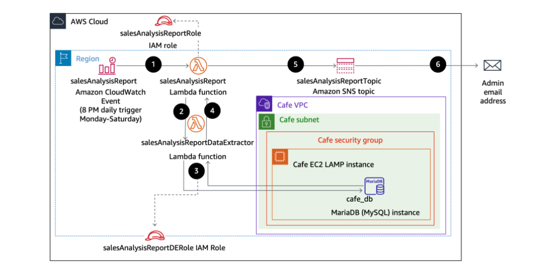
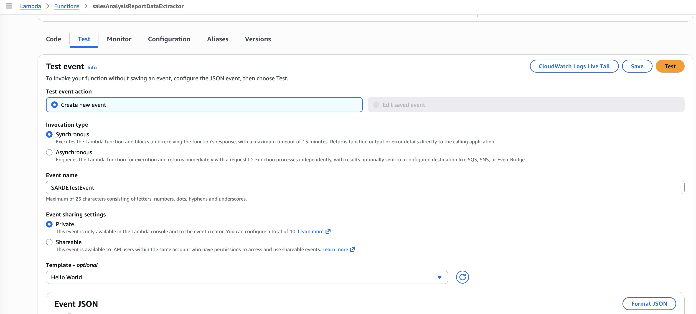

# Activity - Working with AWS Lambda

In this lab, I will deploy and configure an AWS Lambda based serverless computing solution. The Lambda function generates a sales analysis report by pulling data from a database and emailing the results daily. The database connection information is stored in Parameter Store, a capability of AWS Systems Manager. The database itself runs on an Amazon Elastic Compute Cloud (Amazon EC2) Linux, Apache, MySQL, and PHP (LAMP) instance.

The following diagram shows the architecture of the sales analysis report solution and illustrates the order in which actions occur.

<p align="center">
  
</p>

The diagram includes the following function steps:
| Step | Details |
|------|---------|
| 1 | An Amazon CloudWatch Events event calls the `salesAnalysisReport` Lambda function at 8 PM every day Monday through Saturday. |
| 2 | The `salesAnalysisReport` Lambda function invokes another Lambda function, `salesAnalysisReportDataExtractor`, to retrieve the report data. |
| 3 | The `salesAnalysisReportDataExtractor` function runs an analytical query against the café database (`cafe_db`). |
| 4 | The query result is returned to the `salesAnalysisReport` function. |
| 5 | The `salesAnalysisReport` function formats the report into a message and publishes it to the `salesAnalysisReportTopic` Amazon SNS topic. |
| 6 | The `salesAnalysisReportTopic` SNS topic sends the message by email to the administrator. |

## Lab Objectives
In this lab, I learnt how to:
- Recognize necessary AWS Identity and Access Management (IAM) policy permissions to facilitate a Lambda function to other Amazon Web Services (AWS) resources.
- Create a Lambda layer to satisfy an external library dependency.
- Create Lambda functions that extract data from database, and send reports to user.
- Deploy and test a Lambda function that is initiated based on a schedule and that invokes another function.
- Use CloudWatch logs to troubleshoot any issues running a Lambda function.

## Task 1: Observing the IAM role settings
The **salesAnalysisReportRole** IAM role has 4 policies:
- **AmazonSNSFullAccess** provides full access to Amazon SNS resources.
- **AmazonSSMReadOnlyAccess** provides read-only access to Systems Manager resources.
- **AWSLambdaBasicRunRole** provides write permissions to CloudWatch logs (which are required by every Lambda function).
- **AWSLambdaRole** gives a Lambda function the ability to invoke another Lambda function.  
Besides, *lambda.amazonaws.com* is listed as a trusted entity, which means that the Lambda service can use this role.

The **salesAnalysisReportDERole** IAM role has 2 policies:
- **AWSLambdaBasicRunRole** provides write permissions to CloudWatch logs.
- **AWSLambdaVPCAccessRunRole** provides permissions to manage elastic network interfaces to connect a function to a virtual private cloud (VPC).
Besides, *lambda.amazonaws.com* is listed as a trusted entity.

## Task 2: Creating a Lambda layer and a data extractor Lambda function

1. In the AWS Lambda console, I create a **Lambda Layer** with these configurations:
- Name: `pymysqlLibrary`
- Description: `PyMySQL library modules`
- Upload a .zip file: `pymysql-v3.zip` (previously downloaded)
- Compatible runtimes: `Python 3.10`

2. In the AWS Lambda fuctions overview, I create a data extractor **Lambda Function** with these configuration settings:
- Select `Author from scratch`
- Name: `salesAnalysisReportDataExtractor`
- Runtime: `Python 3.10`
- Execution role: `salesAnalysisReportDERole` (existing role)

3. At the bottom of the page of the new function, in the Layers panel, I selected edit and then added a layer with these options:
- Layer: `Custom layers`
- Custom layers: `pymysqlLibrary`
- Version: `1`

4. In the Runtime settings panel, I updated the **Handler** with `salesAnalysisReportDataExtractor.lambda_handler`. Then imported the code `salesAnalysisReportDataExtractor.py` file (previously downloaded) for the data extractor Lambda function.

>[!Note]
>The AWS Lambda function connects to a MySQL database and retrieves aggregated sales data. It uses **pymysql** to establish a connection using credentials passed in the event. If the connection fails, it prints an error and exits. Once connected, it executes an SQL query that joins three tables (order_item, product, product_group) to calculate total quantities sold per product group and product. The results are fetched as a list of dictionaries. The database connection is then closed, and the function returns the query results in a JSON-like response with a status code.

5. The function expects these input parameters (from event):
- **dbUrl**: Database host (endpoint)
- **dbName**: Database name
- **dbUser**: Username
- **dbPassword**: Password

These inputs allow the Lambda function to securely connect to the database dynamically.

6. In the Configuring tab, I edit the VPC network settings for the function:
- VPC: option with `Cafe VPC` as the Name
- Subnets: option with `Cafe Public Subnet 1` as the Name
- Security groups: option with `CafeSecurityGroup` as the Name

## Task 3: Testing the data extractor Lambda function

To invoke the salesAnalysisReportDataExtractor function, I need to supply values for the café database connection parameters. Note that these values are stored in Parameter Store.

1. Launching a test of the Lambda function. I found the values for the parameters in **Parameter Store** under AWS Systems Manager.

<p align="center">
  
</p>

2. In the Event JSON plane, I replaced the JSON object with a JSON object in the following format:
```bash
{
  "dbUrl": "<value of /cafe/dbUrl parameter>",
  "dbName": "<value of /cafe/dbName parameter>",
  "dbUser": "<value of /cafe/dbUser parameter>",
  "dbPassword": "<value of /cafe/dbPassword parameter>"
}
```
