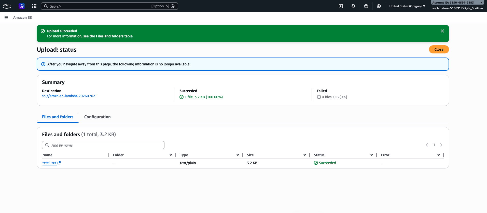
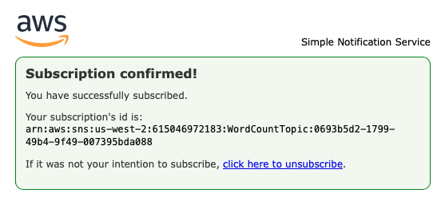
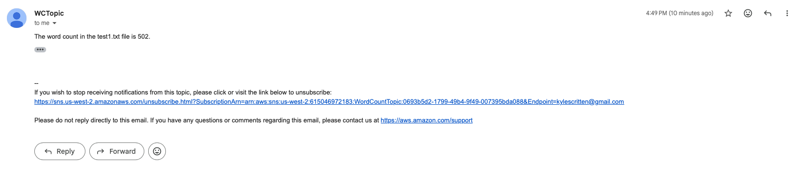

# AWS Lambda Challenge

## Objectives
After completing this lab, you will be able to do the following:
- Create a Lambda function to count the number of words in a text file.
- Configure an Amazon Simple Storage Service (Amazon S3) bucket to invoke a Lambda function when a text file is uploaded to the S3 bucket.
- Create an Amazon Simple Notification Service (Amazon SNS) topic to report the word count in an email.

I will use the following AWS services:
<p align="center">
  
</p>

## Service Implementation & Unit Test
1. I create an Amazon S3 bucket:
- Bucket type: `General purpose`
- Bucket Name: `amzn-s3-lambda-20260702`
All other options set to their default values and choose **Create bucket**.
<p align="center">
  
</p>

2. I generated lorem ipsum text files with `225` words and upload it to my S3 bucket as test object.

>[!Note]
> I need an AWS Identity and Access Management (IAM) role for the Lambda function to access other AWS services. Because the lab policy does not permit the creation of an IAM role, I used the LambdaAccessRole role. The LambdaAccessRole role provides the following permissions:
> - AWSLambdaBasicExecutionRole - This is an AWS managed policy that provides write permissions to Amazon CloudWatch Logs.
> - AmazonSNSFullAccess - This is an AWS managed policy that provides full access to Amazon SNS via the AWS Management Console.
> - AmazonS3FullAccess - This is an AWS managed policy that provides full access to all buckets via the AWS Management Console.
> - CloudWatchFullAccess - This is an AWS managed policy that provides full access to Amazon CloudWatch.

3. I then create the Lambda Function:
- Function Name: `s3-trigger-wordcount`
- Runtime: Python 3.14
- Execution role: LambdaAccessRole (existing role)

4. I deploy the Python code in the Lambda Function to count the number of words in a text file.
```python
# --- countwords.py ---
# Author: Claude Code
# Date: 2026/07/02

import boto3
import json

s3 = boto3.client('s3')

def lambda_handler(event, context):
    try:
        # Get bucket and file from event
        bucket = event['bucket']
        key = event['key']

        # Read file from S3
        response = s3.get_object(Bucket=bucket, Key=key)
        text = response['Body'].read().decode('utf-8')

        # Count words
        word_count = len(text.split())

        # Return response in standard JSON format
        return {
            "statusCode": 200,
            "body": json.dumps({
                "file": key,
                "word_count": word_count
            })
        }

    except Exception as e:
        return {
            "statusCode": 500,
            "body": json.dumps({
                "error": str(e)
            })
        }

```

5. I created the Amazon S3 trigger for the Lambda function `s3-trigger-wordcount`:
- Trigger configuration: `S3`
- Bucket: `amzn-s3-lambda-20260702`
- Event types: `All object create events` (Pre-selected)
- Recursive invocation: Check the box to acknowledge the warning that using the same Amazon S3 bucket for input and output is not recommended.

6. I tested my Lambda function with the file I uploaded in step 2:
- Test event action: `Create New Event`
- Invocation type: `Synchronous`
- Event name: `MyTestEvent01`
- Event sharing settings: `Private`
- Event JSON
```json
{
  "bucket": "amzn-s3-lambda-20260702",
  "key": "test1.txt"
}
```
- Select `Save` and the ```The test event "MyTestEvent01" was successfully saved.``` notification is displayed.

The test passed with the details:
```json
{
  "statusCode": 200,
  "body": "{\"file\": \"test1.txt\", \"word_count\": 502}"
}
```
Output log
```
START RequestId: cb22f829-b8d2-405a-a7f1-3d487ea98804 Version: $LATEST
END RequestId: cb22f829-b8d2-405a-a7f1-3d487ea98804
REPORT RequestId: cb22f829-b8d2-405a-a7f1-3d487ea98804	Duration: 305.79 ms	Billed Duration: 716 ms	Memory Size: 128 MB	Max Memory Used: 96 MB	Init Duration: 409.68 ms	
```
7. I configured the Amazon SNS Topic with the details:
- Type: `Standard`
- Name: `WordCountTopic`
- Display name: `WCTopic`
- Select `Create`
The SNS Topic ARN for use later is `arn:aws:sns:us-west-2:615046972183:WordCountTopic`.

8. Created subscription to the SNS Topic
- Chose Create subscription, and configured the following options:
    * Protocol: Choose `Email`.
    * Endpoint: <My Email Address>
- Chose `Create subscription`.
 The subscription is created and has a Status of *Pending confirmation*.
- Checked my inbox for the email address that I provided.
 I received an email from WCTopic with the subject "AWS Notification - Subscription Confirmation."
- I opened the email, and chose the Confirm subscription hyperlink. 
A new browser tab opens and displays a page with the message "Subscription confirmed!" 
<p align="center">
  
</p>

9. I changed the Lambda function to include the details:
- Email Subject: ` Word Count Result`
- Email Message: `The word count in the <textFileName> file is <N>`.
```python
subject = "Word Count Result"

sns.publish(
    TopicArn=SNS_TOPIC_ARN,
    Message=message,
    Subject=subject  # <-- This sets the email subject
)
```

10. Additionally, I edited the Lambda function input to automatically invoke the function when a text file is uploaded to my S3 bucket.
Since S3 sends the event in a nested Records list containing bucket and object info, I used:
```python
bucket = event['Records'][0]['s3']['bucket']['name']
key = event['Records'][0]['s3']['object']['key']
```

11. I tested the final version of the Lambda function and it initial failed due to insufficient runtime and the Lambda code was modified to read the SNS topic ARN from an environment variable `(os.environ['SNS_TOPIC_ARN'])` instead of hardcoding it — but that environment variable was never set, so it fails at import time before the handler even runs.

First, I configured the runtime variable:
- Go to Lambda console → Select Function from the left navigation plane
- Selected the function `s3-trigger-wordcount`
- Edit Basic Settings
- Changed the timeout to 60 seconds


Second, I configured the environment variable:
- Go to Lambda console → my function → Configuration tab → Environment variables
- Click Edit → Add environment variable
- Key: SNS_TOPIC_ARN
- Value: `arn:aws:sns:us-west-2:615046972183:WordCountTopic`
- Click Save

12. I re-tested by uploading a the text file to my S3 Bucket again. I received an Email notification as the test passed with the details:
```json
{
  "statusCode": 200,
  "body": "{\"file\": \"test1.txt\", \"word_count\": 502, \"message\": \"The word count in the test1.txt file is 502.\"}"
}
```
<p align="center">
  
</p>


