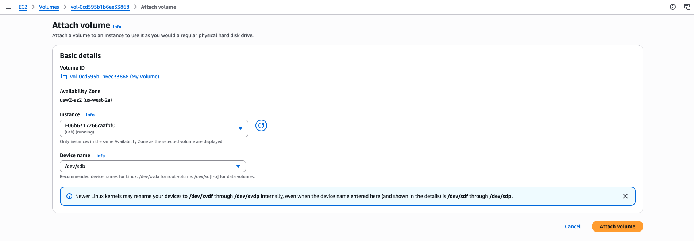
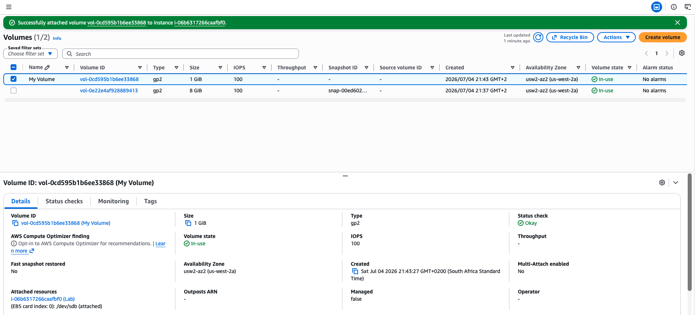
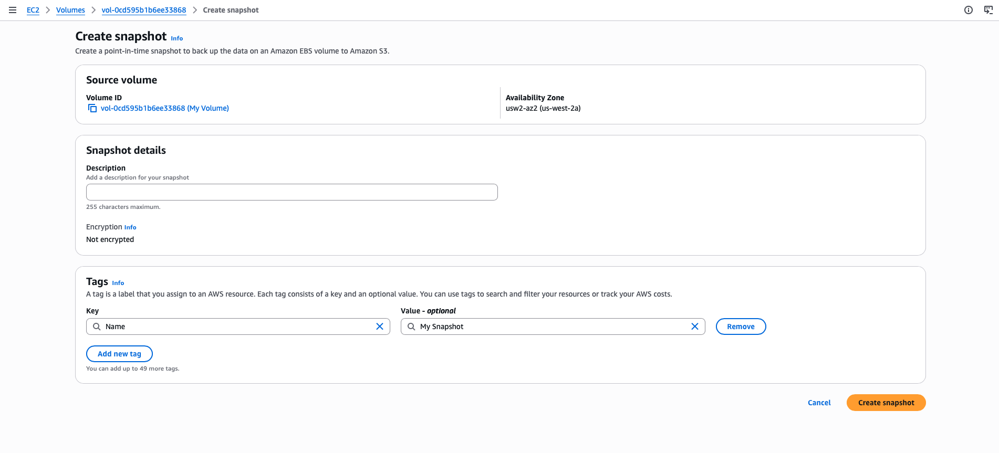
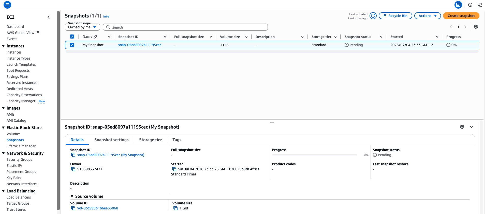
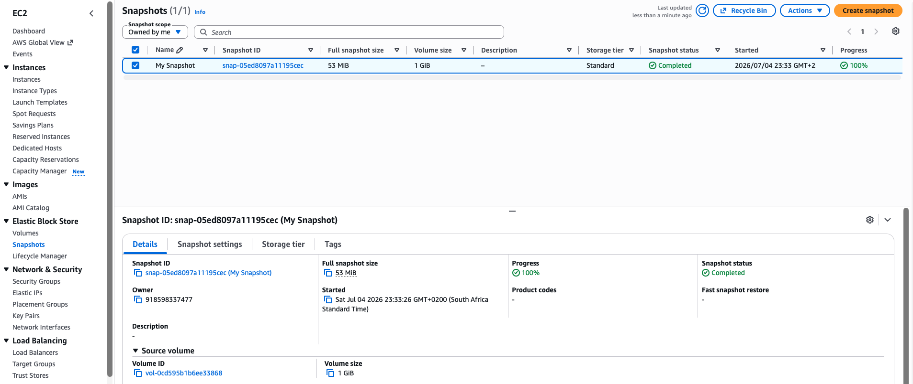
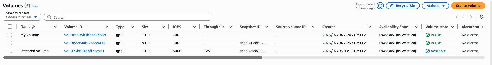
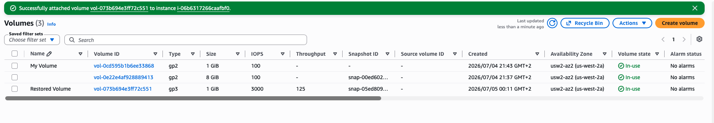

# Working with Amazon EBS

Amazon Elastic Block Store (Amazon EBS) is a scalable, high-performance block-storage service that is designed for Amazon Elastic Compute Cloud (Amazon EC2). In this lab, I will create an EBS volume and perform operations on it, such as attaching it to an instance, creating a file system, and taking a snapshot backup.

<p align="center">
  
</p>

## Objectives
- Create an EBS volume.
- Attach and mount an EBS volume to an EC2 instance.
- Create a snapshot of an EBS volume.
- Create an EBS volume from a snapshot.

## Task 1: Creating a new EBS volume
An EC2 instance named **Lab** has already been launched for this lab in the **Availability Zone** `us-west-2a`.
In the left navigation pane, for **Elastic Block Store**, I choose **Volumes**. I see an existing (8 GiB) volume that the EC2 instance is using.
I click **Create Volune** to add a new volume to the instance. I use the following options:
- **Volume type**: `General Purpose SSD (gp2)`.
- **Size (GiB)**: `1`. 
- **Availability Zone**: `us-west-2a`
- **Tag - optional**:
    - **Key**: `Name`
    - **Value**: `My Volume`

<p align="center">
  
</p>

I wait for the **Volume state** to became *Available*.

<p align="center">
  
</p>

## Task 2: Attaching the volume to an EC2 instance
Now I attach my new volume to the EC2 instance. Using the following configurations:
- **Instance**: `Lab`
- **Device name**: `/dev/sdb`

<p align="center">
  
</p>

I wait for the **Volume state** to became *In Use*.

<p align="center">
  
</p>

## Task 3: Connecting to the Lab EC2 instance
I connect to the instance **Lab** using the **EC2 Instance Connect**.
```bash
   ,     #_
   ~\_  ####_        Amazon Linux 2
  ~~  \_#####\
  ~~     \###|       AL2 End of Life is 2026-06-30.
  ~~       \#/ ___
   ~~       V~' '->
    ~~~         /    A newer version of Amazon Linux is available!
      ~~._.   _/
         _/ _/       Amazon Linux 2023, GA and supported until 2028-03-15.
       _/m/'           https://aws.amazon.com/linux/amazon-linux-2023/

[ec2-user@ip-10-1-11-9 ~]$
```
## Task 4: Creating and configuring the file system
Here I will add the ume to a Linux instance as an ext3 file system under the /mnt/data-store mount point.

1. I view the storage that is available on my instance using the command `df -h`.
```bash
[ec2-user@ip-10-1-11-9 ~]$ df -h
Filesystem      Size  Used Avail Use% Mounted on
devtmpfs        460M     0  460M   0% /dev
tmpfs           471M     0  471M   0% /dev/shm
tmpfs           471M  472K  470M   1% /run
tmpfs           471M     0  471M   0% /sys/fs/cgroup
/dev/nvme0n1p1  8.0G  1.8G  6.3G  22% /
tmpfs            95M     0   95M   0% /run/user/0
tmpfs            95M     0   95M   0% /run/user/1000
```

2. I create an ext3 file system on the new volume.
```bash
[ec2-user@ip-10-1-11-9 ~]$ sudo mkfs -t ext3 /dev/sdb
mke2fs 1.42.9 (28-Dec-2013)
Filesystem label=
OS type: Linux
Block size=4096 (log=2)
Fragment size=4096 (log=2)
Stride=0 blocks, Stripe width=0 blocks
65536 inodes, 262144 blocks
13107 blocks (5.00%) reserved for the super user
First data block=0
Maximum filesystem blocks=268435456
8 block groups
32768 blocks per group, 32768 fragments per group
8192 inodes per group
Superblock backups stored on blocks: 
        32768, 98304, 163840, 229376

Allocating group tables: done                            
Writing inode tables: done                            
Creating journal (8192 blocks): done
Writing superblocks and filesystem accounting information: done
```

3. I create directory to mount the new storage volume, running the following command
```bash
[ec2-user@ip-10-1-11-9 ~]$ sudo mkdir /mnt/data-store
```

4. To mount the new volume, run the following commands:
```bash
[ec2-user@ip-10-1-11-9 ~]$ sudo mount /dev/sdb /mnt/data-store
[ec2-user@ip-10-1-11-9 ~]$ echo "/dev/sdb   /mnt/data-store ext3 defaults,noatime 1 2" | sudo tee -a /etc/fstab
/dev/sdb   /mnt/data-store ext3 defaults,noatime 1 2
```

>[!Note]
>The second command ensures that the volume is mounted even after the instance is restarted.

5. Here is the configuration file.
```bash
[ec2-user@ip-10-1-11-9 ~]$ echo "/dev/sdb   /mnt/data-store ext3 defaults,noatime 1 2" | sudo tee -a /etc/fstab
/dev/sdb   /mnt/data-store ext3 defaults,noatime 1 2
[ec2-user@ip-10-1-11-9 ~]$ cat /etc/fstab
#
UUID=0ff5ac59-da1a-4403-8b6e-1c09a7e65c22     /           xfs    defaults,noatime  1   1
/dev/sdb   /mnt/data-store ext3 defaults,noatime 1 2
```

6. I view the storage that is available on my instance using the command `df -h` again.
```bash
[ec2-user@ip-10-1-11-9 ~]$ df -h
Filesystem      Size  Used Avail Use% Mounted on
devtmpfs        460M     0  460M   0% /dev
tmpfs           471M     0  471M   0% /dev/shm
tmpfs           471M  472K  470M   1% /run
tmpfs           471M     0  471M   0% /sys/fs/cgroup
/dev/nvme0n1p1  8.0G  1.8G  6.3G  22% /
tmpfs            95M     0   95M   0% /run/user/0
/dev/nvme1n1    975M   60K  924M   1% /mnt/data-store
tmpfs            95M     0   95M   0% /run/user/1000
```

7. I create a file and add some text on the mounted volume.
```bash
[ec2-user@ip-10-1-11-9 ~]$ sudo sh -c "echo some text has been written > /mnt/data-store/file.txt"
```

8. To verify that the text has been written to my volume, I ran the following command:
```bash
[ec2-user@ip-10-1-11-9 ~]$ cat /mnt/data-store/file.txt
some text has been written
```
The output displays the text that this command copies to the file. 

## Task 5: Creating an Amazon EBS snapshot
Amazon EBS snapshots are stored in Amazon Simple Storage Service (Amazon S3) for durability. New EBS volumes can be created out of snapshots for cloning or restoring backups. Amazon EBS snapshots can also be shared among Amazon Web Services (AWS) accounts or copied over AWS Regions.

1. I create a snapshot for my volume with options:
- **Key**: `Name`
- **Value**: `My Snapshot`

<p align="center">
  
</p>

2. The Snapshot status of my snapshot is *Pending*. 

<p align="center">
  
</p>

3. After completion, the status changes to *Completed*. Only used storage blocks are copied to snapshots, so empty blocks do not use any snapshot storage space.

<p align="center">
  
</p>

4. In my EC2 Instance Connect terminal window, I delete the file on my volume. I used the `ls` command for the text file path to validate it has been deleted. 
```bash
[ec2-user@ip-10-1-11-9 ~]$ sudo rm /mnt/data-store/file.txt
[ec2-user@ip-10-1-11-9 ~]$ ls /mnt/data-store/file.txt
ls: cannot access /mnt/data-store/file.txt: No such file or directory
```
## Task 6: Restoring the Amazon EBS snapshot
When I need to retrieve data stored in a snapshot, I can restore the snapshot to a new EBS volume.

1. I create a volume by using the snapshot with options:
- **Availability Zone**: `us-west-2a`
- **Tag (optional)**:
    - **Key**: `Name`
    - **Value**: `Restored Volume`

The Volume status of my volume is *Available*.

<p align="center">
  
</p>

>![Note]
> When restoring a snapshot to a volume, I can also modify the configuration, such as changing the volume type, size, or Availability Zone.

2. Attached the restored volume to the EC2 instance

Now I attach my restored volume to the EC2 instance. I use these options:
- **Instance**: `Lab`
- **Device name**: `/dev/sdc`

<p align="center">
  
</p>

The **Volume state** is new *In Use*.

<p align="center">
  
</p>

3. Mounting the restored volume in the EC2 Instance Connect terminal, I create a directory for mounting the new storage volume, then mount the new volume. I also verify that the volume that I mounted has the file.
```bash
[ec2-user@ip-10-1-11-9 ~]$ sudo mkdir /mnt/data-store2
[ec2-user@ip-10-1-11-9 ~]$ sudo mount /dev/sdc /mnt/data-store2
[ec2-user@ip-10-1-11-9 ~]$ ls /mnt/data-store2/file.txt
/mnt/data-store2/file.txt
[ec2-user@ip-10-1-11-9 ~]$ cat /mnt/data-store2/file.txt
some text has been written
```

## Conclusion
Through this lab, I learnt how to:
- Create an EBS volume
- Mount an EBS volume to an EC2 instance
- Create a snapshot of an EBS volume
- Create an EBS volume from a snapshot

## Bash Script to Mount an EBS Volume to an EC2 instance
```bash
#!/bin/bash

# Verify the available storage
df -h

# Create an ext3 file system on the new volume
sudo mkfs -t ext3 /dev/sdb

# Create the directory for mounting the new storage volume
sudo mkdir /mnt/data-store

# Mount the new volume
sudo mount /dev/sdb /mnt/data-store

# Ensures that the volume is mounted even after the instance is restarted.
echo "/dev/sdb   /mnt/data-store ext3 defaults,noatime 1 2" | sudo tee -a /etc/fstab

# View the configuration file
cat /etc/fstab

# Verify again the available storage
df -h

# Add some text
sudo sh -c "echo some text has been written > /mnt/data-store/file.txt"

# View the text
cat /mnt/data-store/file.txt
```
