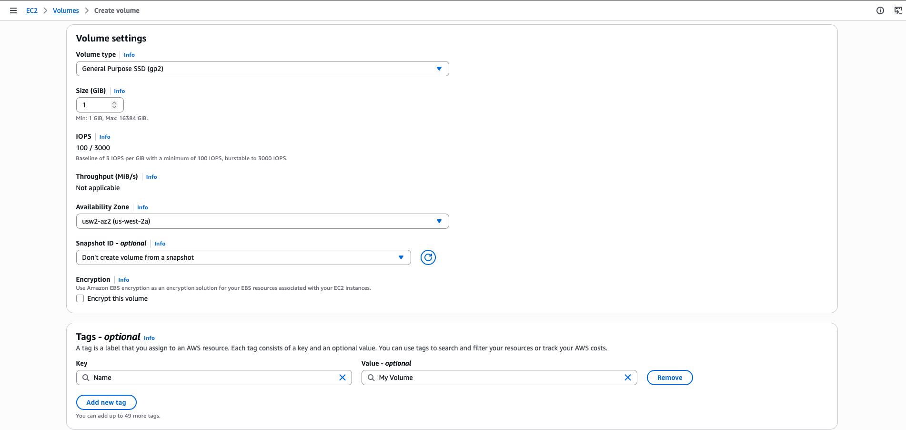
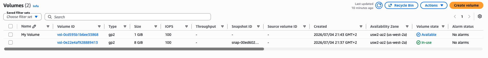

# Working with Amazon EBS

Amazon Elastic Block Store (Amazon EBS) is a scalable, high-performance block-storage service that is designed for Amazon Elastic Compute Cloud (Amazon EC2). In this lab, I will create an EBS volume and perform operations on it, such as attaching it to an instance, creating a file system, and taking a snapshot backup.

  

## Objectives
- Create an EBS volume.
- Attach and mount an EBS volume to an EC2 instance.
- Create a snapshot of an EBS volume.
- Create an EBS volume from a snapshot.

## Task 1: Creating a new EBS volume
An EC2 instance named **Lab** has already been launched for this lab in the **Availability Zone** `us-west-2a`.
In the left navigation pane, for **Elastic Block Store**, I choose **Volumes**. I see an existing (8 GiB) volume that the EC2 instance is using.
I click **Create Volune** to add a new volume to the instance. I use the following options:
- **Volume type**: `General Purpose SSD (gp2)`.
- **Size (GiB)**: `1`. 
- **Availability Zone**: `us-west-2a`
- **Tag - optional**:
    - **Key**: `Name`
    - **Value**: `My Volume`

  

I wait for the **Volume state** to became *Available*.

  

## Task 2: Attaching the volume to an EC2 instance
Now I attach my new volume to the EC2 instance. I use these options:
- **Instance**: `Lab`
- **Device name**: `/dev/sdb`

  

I wait for the **Volume state** to became *In Use*.

  

