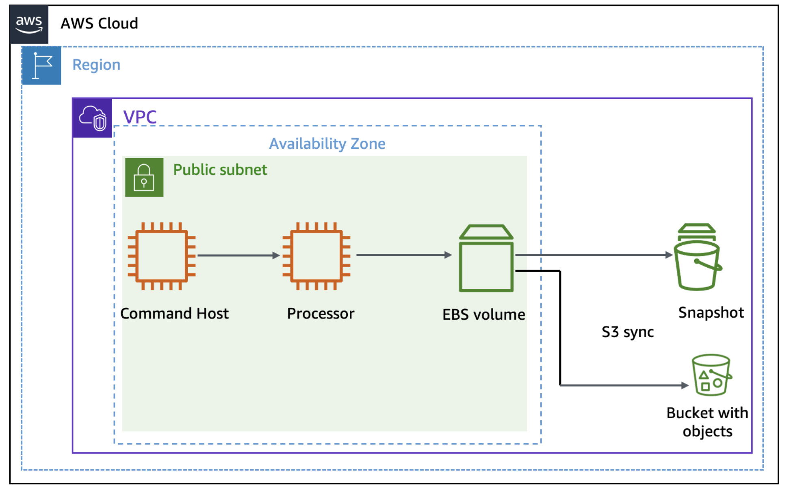
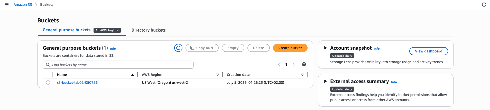
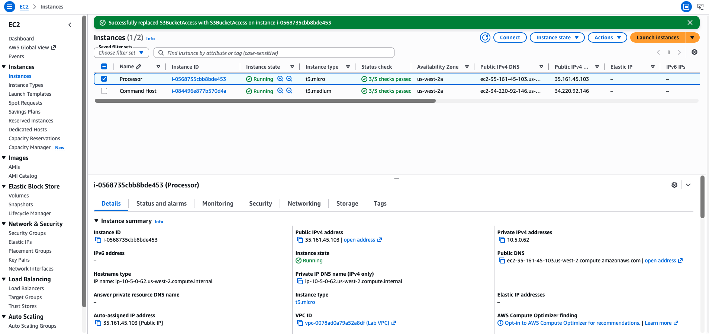

# Managing Storage

AWS provides multiple ways to manage data on Amazon Elastic Block Store (Amazon EBS) volumes. 
In this lab, I will use AWS Command Line Interface (AWS CLI) to create snapshots of an EBS volume 
and configure a scheduler to run Python scripts to delete older snapshots.

In the challenge section, I will sync the contents of a directory on an EBS volume to an Amazon Simple 
Storage Service (Amazon S3) bucket using an Amazon S3 sync command.

<p align="center">
  
</p>

This lab environment consists of a virtual private cloud (VPC) with a public subnet. Amazon Elastic Compute 
Cloud (Amazon EC2) instances named "Command Host" and "Processor" have already been created in this VPC.

The "Command Host" instance will be used to administer AWS resources including the "Processor" instance.

## Objectives
- Create and maintain snapshots for Amazon EC2 instances.
- Use Amazon S3 sync to copy files from an EBS volume to an S3 bucket.
- Use Amazon S3 versioning to retrieve deleted files.

## Task 1: Creating and configuring resources
I create an Amazon S3 bucket and configure the "Command Host" EC2 instance to have secure access to other AWS resources.

1. I create an S3 bucket named `s3-bucket-lab02-050726`.

<p align="center">
  
</p>

2. I attach a pre-created IAM role `S3BucketAccessRole` as an instance profile to the EC2 instance **Processor**, 
giving it the permissions to interact with other AWS services such as EBS volumes and S3 buckets.

<p align="center">
  
</p>

## Task 2: Taking snapshots of your instance
Here I use the AWS Command Line Interface (AWS CLI) to manage the processing of snapshots of an instance.

1. I connect to the Command Host EC2 instance.
```bash
   ,     #_
   ~\_  ####_        Amazon Linux 2
  ~~  \_#####\
  ~~     \###|       AL2 End of Life is 2026-06-30.
  ~~       \#/ ___
   ~~       V~' '->
    ~~~         /    A newer version of Amazon Linux is available!
      ~~._.   _/
         _/ _/       Amazon Linux 2023, GA and supported until 2028-03-15.
       _/m/'           https://aws.amazon.com/linux/amazon-linux-2023/

[ec2-user@ip-10-5-0-111 ~]$ 
```

2. To display the EBS volume-id, run the following command: 
```bash
[ec2-user@ip-10-5-0-111 ~]$ aws ec2 describe-instances --filter 'Name=tag:Name,Values=Processor' --query 'Reservations[0].Instances[0].BlockDeviceMappings[0].Ebs.{VolumeId:VolumeId}'
{
    "VolumeId": "vol-06d5a9aed9be79243"
}
```
You use this value for VolumeId throughout the lab steps when prompted.

3. The aim in the next few steps is to take a snapshot of this EBS volume. First, I shut down the "Processor" instance, which requires its instance ID to do so.
```bash
[ec2-user@ip-10-5-0-111 ~]$ aws ec2 describe-instances --filters 'Name=tag:Name,Values=Processor' --query 'Reservations[0].Instances[0].InstanceId'
"i-0568735cbb8bde453"
```
The instance ID is identified as `i-0568735cbb8bde453`.

4. To shut down the "Processor" instance, I run the command `aws ec2 stop-instances --instance-ids INSTANCE-ID` and replace "INSTANCE-ID" with the instance-id that I retrieved earlier:
```bash
[ec2-user@ip-10-5-0-111 ~]$ aws ec2 stop-instances --instance-ids i-0568735cbb8bde453
{
    "StoppingInstances": [
        {
            "InstanceId": "i-0568735cbb8bde453",
            "CurrentState": {
                "Code": 64,
                "Name": "stopping"
            },
            "PreviousState": {
                "Code": 16,
                "Name": "running"
            }
        }
    ]
}
```

5. To verify that the "Processor" instance stopped, I run the command `aws ec2 wait instance-stopped --instance-id INSTANCE-ID` and replace "INSTANCE-ID" with my instance id. 
```bash
[ec2-user@ip-10-5-0-111 ~]$ aws ec2 wait instance-stopped --instance-id i-0568735cbb8bde453
```
When the instance stops, the command returns to a prompt.

6. I create the first snapshot of the volume of the "Processor" instance.
```bash
[ec2-user@ip-10-5-0-111 ~]$ aws ec2 create-snapshot --volume-id vol-06d5a9aed9be79243
{
    "Tags": [],
    "SnapshotId": "snap-00aefacff7f7f65fc",
    "VolumeId": "vol-06d5a9aed9be79243",
    "State": "pending",
    "StartTime": "2026-07-05T00:20:19.076Z",
    "Progress": "",
    "OwnerId": "114718016891",
    "Description": "",
    "VolumeSize": 8,
    "Encrypted": false
}
```

7. To check the status of your snapshot, run:
```bash
[ec2-user@ip-10-5-0-111 ~]$ aws ec2 wait snapshot-completed --snapshot-id snap-00aefacff7f7f65fc
```

8. I restart the "Processor" instance, run the following command with the instance-id that I retrieved earlier:
```bash
[ec2-user@ip-10-5-0-111 ~]$ aws ec2 start-instances --instance-ids i-0568735cbb8bde453
{
    "StartingInstances": [
        {
            "InstanceId": "i-0568735cbb8bde453",
            "CurrentState": {
                "Code": 0,
                "Name": "pending"
            },
            "PreviousState": {
                "Code": 80,
                "Name": "stopped"
            }
        }
    ]
}
```

9. I schedule the creation of subsequent snapshots using the command `cron`.
```bash
[ec2-user@ip-10-5-0-111 ~]$ echo "* * * * *  aws ec2 create-snapshot --volume-id vol-06d5a9aed9be79243 2>&1 >> /tmp/cronlog" > cronjob crontab cronjob
```

 10. I verified that subsequent snapshots are being created:
```bash
[ec2-user@ip-10-5-0-111 ~]$ aws ec2 describe-snapshots --filters "Name=volume-id,Values=vol-06d5a9aed9be79243"
{
    "Snapshots": [
        {
            "StorageTier": "standard",
            "TransferType": "standard",
            "CompletionTime": "2026-07-05T00:24:43.507Z",
            "FullSnapshotSizeInBytes": 2058878976,
            "SnapshotId": "snap-034d03d15c92c253c",
            "VolumeId": "vol-06d5a9aed9be79243",
            "State": "completed",
            "StartTime": "2026-07-05T00:24:03.886Z",
            "Progress": "100%",
            "OwnerId": "114718016891",
            "Description": "",
            "VolumeSize": 8,
            "Encrypted": false
        },
        {
            "StorageTier": "standard",
            "TransferType": "standard",
            "CompletionTime": "2026-07-05T00:25:38.811Z",
            "FullSnapshotSizeInBytes": 2058878976,
            "SnapshotId": "snap-04d3e486fdfcd0abe",
            "VolumeId": "vol-06d5a9aed9be79243",
            "State": "completed",
            "StartTime": "2026-07-05T00:25:02.441Z",
            "Progress": "100%",
            "OwnerId": "114718016891",
            "Description": "",
            "VolumeSize": 8,
            "Encrypted": false
        },
        {
            "StorageTier": "standard",
            "TransferType": "standard",
            "CompletionTime": "2026-07-05T00:21:02.996Z",
            "FullSnapshotSizeInBytes": 2056781824,
            "SnapshotId": "snap-00aefacff7f7f65fc",
            "VolumeId": "vol-06d5a9aed9be79243",
            "State": "completed",
            "StartTime": "2026-07-05T00:20:19.076Z",
            "Progress": "100%",
            "OwnerId": "114718016891",
            "Description": "",
            "VolumeSize": 8,
            "Encrypted": false
        }
    ]
}
```

 11. I stop the cron job with the command `crontab -r`.
```bash
[ec2-user@ip-10-5-0-111 ~]$ crontab -r
```

12. I examine the contents of the Python script **snapshotter_v2.py** with the command `more /home/ec2-user/snapshotter_v2.py`.
```bash
[ec2-user@ip-10-5-0-111 ~]$ more /home/ec2-user/snapshotter_v2.py
#!/usr/bin/env python

import boto3 

MAX_SNAPSHOTS = 2   # Number of snapshots to keep

# Create the EC2 resource
ec2 = boto3.resource('ec2')

# Get a list of all volumes
volume_iterator = ec2.volumes.all()

# Create a snapshot of each volume
for v in volume_iterator:
  v.create_snapshot()

  # Too many snapshots?
  snapshots = list(v.snapshots.all())
  if len(snapshots) > MAX_SNAPSHOTS:

    # Delete oldest snapshots, but keep MAX_SNAPSHOTS available
    snap_sorted = sorted([(s.id, s.start_time, s) for s in snapshots], key=lambda k: k[1])
    for s in snap_sorted[:-MAX_SNAPSHOTS]:
      print("Deleting snapshot", s[0])
      s[2].delete()
```
>[!Note]
>The script finds all EBS volumes that are associated with the current user’s account and takes snapshots.
>It then examines the number of snapshots that are associated with the volume, sorts the snapshots by date, and removes all but the two most recent snapshots.

13. The following command returns the multiple snapshot IDs that were returned for the volume. These are the snapshots that were created by my `cron` job before I stopped it.
```bash
[ec2-user@ip-10-5-0-111 ~]$ aws ec2 describe-snapshots --filters "Name=volume-id, Values=vol-06d5a9aed9be79243" --query 'Snapshots[*].SnapshotId'
[
    "snap-0acad13b71251e2dd",
    "snap-034d03d15c92c253c",
    "snap-04d3e486fdfcd0abe",
    "snap-00aefacff7f7f65fc"
]
```

14. Run the "snapshotter_v2.py" script using the command below. The script runs for a few seconds, and then it returns a list of all of the snapshots that it deleted:
```bash
[ec2-user@ip-10-5-0-111 ~]$ python3.8 snapshotter_v2.py
Deleting snapshot snap-00aefacff7f7f65fc
Deleting snapshot snap-034d03d15c92c253c
Deleting snapshot snap-04d3e486fdfcd0abe
```

15. To examine the new number of snapshots for the current volume, re-run the command:
```bash
[ec2-user@ip-10-5-0-111 ~]$ aws ec2 describe-snapshots --filters "Name=volume-id, Values=vol-06d5a9aed9be79243" --query 'Snapshots[*].SnapshotId'
[
    "snap-0dba79f40bb217e3d",
    "snap-0acad13b71251e2dd"
]
```
The command returns only **two** snapshot IDs.

## Task 3: Challenge: Synchronize files with Amazon S3
Here I've been challenged to sync the contents of a directory with the Amazon S3 bucket that I created earlier.

1. I start by downloading and unzipping the sample files:
```bash
[ec2-user@ip-10-5-0-111 ~]$ wget https://aws-tc-largeobjects.s3.us-west-2.amazonaws.com/CUR-TF-100-RSJAWS-3-124627/183-lab-JAWS-managing-storage/s3/files.zip
--2026-07-05 00:29:50--  https://aws-tc-largeobjects.s3.us-west-2.amazonaws.com/CUR-TF-100-RSJAWS-3-124627/183-lab-JAWS-managing-storage/s3/files.zip
Resolving aws-tc-largeobjects.s3.us-west-2.amazonaws.com (aws-tc-largeobjects.s3.us-west-2.amazonaws.com)... 16.12.102.26, 52.92.205.42, 52.218.176.201, ...
Connecting to aws-tc-largeobjects.s3.us-west-2.amazonaws.com (aws-tc-largeobjects.s3.us-west-2.amazonaws.com)|16.12.102.26|:443... connected.
HTTP request sent, awaiting response... 200 OK
Length: 72110 (70K) [application/zip]
Saving to: ‘files.zip’

100%[=========================================================================================================================================================================>] 72,110      --.-K/s   in 0.006s  

2026-07-05 00:29:50 (11.0 MB/s) - ‘files.zip’ saved [72110/72110]

[ec2-user@ip-10-5-0-111 ~]$ unzip files.zip
Archive:  files.zip
  inflating: files/file1.txt         
  inflating: files/file2.txt         
  inflating: files/file3.txt 
```

2. Syncing files with my Amazon S3 bucket
```bash
#!/bin/bash

# Set bucket name
BUCKET_NAME="s3-bucket-lab02-ct"
echo $BUCKET_NAME

# Activate versioning for the bucket
aws s3api put-bucket-versioning --bucket $BUCKET_NAME --versioning-configuration Status=Enabled

# Synch the local files with Amazon S3
aws s3 sync files s3://$BUCKET_NAME/files/

# Verify the status of the files
aws s3 ls s3://$BUCKET_NAME/files/

# Delete a local file.
rm files/file1.txt

# Force Amazon S3 to delete any files that aren't present on the local drive but present in Amazon S3
aws s3 sync files s3://$BUCKET_NAME/files/ --delete
```

Here is the output on screen.
```bash
[ec2-user@ip-10-5-0-111 ~]$ aws s3api put-bucket-versioning --bucket s3-bucket-lab02-050726 --versioning-configuration Status=Enabled
[ec2-user@ip-10-5-0-111 ~]$ aws s3 sync files s3://s3-bucket-lab02-050726/files/
upload: files/file2.txt to s3://s3-bucket-lab02-050726/files/file2.txt
upload: files/file3.txt to s3://s3-bucket-lab02-050726/files/file3.txt
upload: files/file1.txt to s3://s3-bucket-lab02-050726/files/file1.txt
[ec2-user@ip-10-5-0-111 ~]$ aws s3 ls s3://s3-bucket-lab02-050726/files/
2026-07-05 00:34:16      30318 file1.txt
2026-07-05 00:34:16      43784 file2.txt
2026-07-05 00:34:16      96675 file3.txt
[ec2-user@ip-10-5-0-111 ~]$ aws s3 ls s3://s3-bucket-lab02-050726/files/
2026-07-05 00:34:16      30318 file1.txt
2026-07-05 00:34:16      43784 file2.txt
2026-07-05 00:34:16      96675 file3.txt
[ec2-user@ip-10-5-0-111 ~]$ rm files/file1.txt
[ec2-user@ip-10-5-0-111 ~]$ aws s3 sync files s3://s3-bucket-lab02-050726/files/ --delete
delete: s3://s3-bucket-lab02-050726/files/file1.txt
[ec2-user@ip-10-5-0-111 ~]$ aws s3 ls s3://s3-bucket-lab02-050726/files/
2026-07-05 00:34:16      43784 file2.txt
2026-07-05 00:34:16      96675 file3.txt
```

3. There's no direct command in Amazon S3 to restore a previous version of a file. I downloaded a previous version of the deleted file from Amazon S3, with the `aws s3api list-object-versions`.
```bash
[ec2-user@ip-10-5-0-111 ~]$ aws s3api list-object-versions --bucket s3-bucket-lab02-050726 --prefix files/file1.txt
{
    "Versions": [
        {
            "ETag": "\"b76b2b775023e60be16bc332496f8409\"",
            "ChecksumAlgorithm": [
                "CRC32"
            ],
            "ChecksumType": "FULL_OBJECT",
            "Size": 30318,
            "StorageClass": "STANDARD",
            "Key": "files/file1.txt",
            "VersionId": "IHFoZHY_m4fo_lEAFXx0EifgrbwDBJsT",
            "IsLatest": false,
            "LastModified": "2026-07-05T00:34:16.000Z",
            "Owner": {
                "ID": "37bea78c09008f973b33e8b4908d28a6d7f1e32675200245bb19676b65e7975a"
            }
        }
    ],
    "DeleteMarkers": [
        {
            "Owner": {
                "ID": "37bea78c09008f973b33e8b4908d28a6d7f1e32675200245bb19676b65e7975a"
            },
            "Key": "files/file1.txt",
            "VersionId": "51PcsxxODy1rGdSVdxNUS5dwcwb0rHU1",
            "IsLatest": true,
            "LastModified": "2026-07-05T00:36:32.000Z"
        }
    ],
    "RequestCharged": null,
    "Prefix": "files/file1.txt"
}
```

The **Versions** block contains a list of all available versions. I save the value for VersionId.
```bash
[ec2-user@ip-10-5-0-111 ~]$ aws s3api get-object --bucket s3-bucket-lab02-050726 --key files/file1.txt --version-id IHFoZHY_m4fo_lEAFXx0EifgrbwDBJsT files/file1.txt
{
    "AcceptRanges": "bytes",
    "LastModified": "Sun, 05 Jul 2026 00:34:16 GMT",
    "ContentLength": 30318,
    "ETag": "\"b76b2b775023e60be16bc332496f8409\"",
    "ChecksumCRC32": "qqrPtQ==",
    "ChecksumType": "FULL_OBJECT",
    "VersionId": "IHFoZHY_m4fo_lEAFXx0EifgrbwDBJsT",
    "ContentType": "text/plain",
    "ServerSideEncryption": "AES256",
    "Metadata": {}
}
```

Then I re-download the old version and sync again to Amazon S3.
```bash
#!/bin/bash
# Download the previous version of file1.txt.
aws s3api get-object --bucket $BUCKET_NAME --key files/file1.txt --version-id $VERSION_ID files/file1.txt

# Verify that the file was restored locally.
ls files

# Re-sync the contents of the files/ folder to Amazon S3.
aws s3 sync files s3://$BUCKET_NAME/files/

# Verify that a new version of file1.txt was pushed to the S3 bucket.
aws s3 ls s3://$BUCKET_NAME/files/
```
Here is the output screen.
```bash
[ec2-user@ip-10-5-0-111 ~]$ aws s3api get-object --bucket s3-bucket-lab02-050726 --key files/file1.txt --version-id IHFoZHY_m4fo_lEAFXx0EifgrbwDBJsT files/file1.txt
{
    "AcceptRanges": "bytes",
    "LastModified": "Sun, 05 Jul 2026 00:34:16 GMT",
    "ContentLength": 30318,
    "ETag": "\"b76b2b775023e60be16bc332496f8409\"",
    "ChecksumCRC32": "qqrPtQ==",
    "ChecksumType": "FULL_OBJECT",
    "VersionId": "IHFoZHY_m4fo_lEAFXx0EifgrbwDBJsT",
    "ContentType": "text/plain",
    "ServerSideEncryption": "AES256",
    "Metadata": {}
}
[ec2-user@ip-10-5-0-111 ~]$ ls files
file1.txt  file2.txt  file3.txt
[ec2-user@ip-10-5-0-111 ~]$ aws s3 sync files s3://s3-bucket-lab02-050726/files/
upload: files/file1.txt to s3://s3-bucket-lab02-050726/files/file1.txt
[ec2-user@ip-10-5-0-111 ~]$ aws s3 ls s3://s3-bucket-lab02-050726/files/
2026-07-05 00:43:38      30318 file1.txt
2026-07-05 00:34:16      43784 file2.txt
2026-07-05 00:34:16      96675 file3.txt
```

## Conclusion
In this lab I learnt how to:

- create and maintain snapshots for Amazon EC2 instances.
- use Amazon S3 sync to copy files from an EBS volume to an S3 bucket.
- use Amazon S3 versioning to retrieve deleted files.
