# Working with Amazon S3

In this lab, I will create and configure an Amazon Simple Storage Service (Amazon S3) bucket to share images with an external 
user at a media company (mediacouser) who has been hired to provide pictures of the products that the café sells. I will also 
configure the S3 bucket to automatically send an email notification to the administrator when the bucket contents are modified.

The following diagram shows the component architecture of the Amazon S3 file-sharing solution and illustrates its usage flow.

<p align="center">
  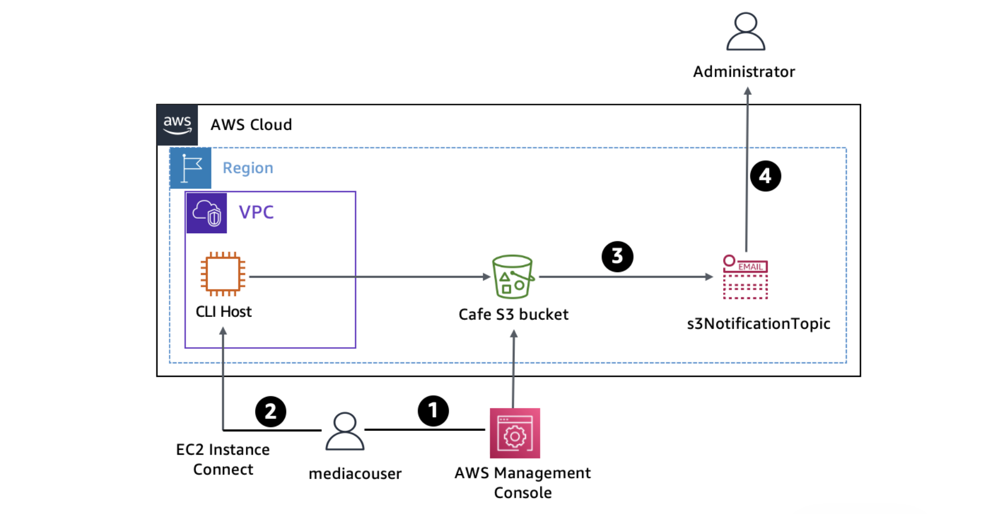
</p>

An AWS Identity and Access Management (IAM) user named mediacouser, which represents an external user at a media company, 
has been pre-created with the appropriate Amazon S3 permissions to allow the user to add, change, or delete images from the bucket. 
The necessary Amazon S3 permissions are reviewed for each user to make sure that access to the bucket is secure and appropriate for each role.  

The following steps describe the usage flow in the diagram:

1. When new product pictures are available or when existing pictures must be updated, a representative from the media company 
signs in to the AWS Management Console as **mediacouser** to upload, change, or delete the bucket contents.
2. As an alternative, **mediacouser** can use the AWS Command Line Interface (AWS CLI) to change the contents of the S3 bucket.
3. When Amazon S3 detects a change in the contents of the bucket, it publishes an email notification to the **s3NotificationTopic**
Amazon Simple Notification Service (Amazon SNS) topic.
4. The administrator who is subscribed to the **s3NotificationTopic** SNS topic receives an email message that contains the details 
of the changes to the contents of the bucket.

>[!Note]
> In real-world implementations, external users might not receive direct access to CLI Host as depicted in the diagram.

## Objectives
- Use the `s3api` and `s3 AWS CLI commands to create and configure an S3 bucket.
- Verify write permissions to a user on an S3 bucket.
- Configure event notification on an S3 bucket.

## Task 1: Connecting to the CLI Host EC2 instance and configuring the AWS CLI
Here I connect to the CLI Host EC2 instance by using EC2 Instance Connect and configure the AWS CLI.

In the SSH session terminal window, run the `configure` command to update the AWS CLI software with credentials.
```bash
   ,     #_
   ~\_  ####_        Amazon Linux 2
  ~~  \_#####\
  ~~     \###|       AL2 End of Life is 2026-06-30.
  ~~       \#/ ___
   ~~       V~' '->
    ~~~         /    A newer version of Amazon Linux is available!
      ~~._.   _/
         _/ _/       Amazon Linux 2023, GA and supported until 2029-06-30.
       _/m/'           https://aws.amazon.com/linux/amazon-linux-2023/
[ec2-user@ip-10-200-0-23 ~]$ aws configure
AWS Access Key ID [None]: <Enter the value for AccessKey from Lab Details>
AWS Secret Access Key [None]: <Enter the value for SecretKey from Lab Details>
Default region name [None]: us-west-2
Default output format [None]: json
```

## Task 2: Creating and initializing the S3 share bucket
Here I use the AWS CLI to create the S3 share bucket and upload a few images.

1. First I create the S3 bucket by running the command:
```bash
[ec2-user@ip-10-200-0-29 ~]$ aws s3 mb s3://cafe-kylescrit-0622 --region 'us-west-2'
make_bucket: cafe-kylescrit-0622
```
>[!Note]
> Bucket names cannot contain uppercase letters. If you receive an error when you try to create your S3 bucket, make sure your bucket name doesn't include uppercase letters.

2. I load images into the newly created bucket by referencing the bucket in the following command:
```bash
[ec2-user@ip-10-200-0-29 ~]$ aws s3 sync ~/initial-images/ s3://cafe-kylescrit-0622/images
upload: initial-images/Donuts.jpg to s3://cafe-kylescrit-0622/images/Donuts.jpg
upload: initial-images/Strawberry-Tarts.jpg to s3://cafe-kylescrit-0622/images/Strawberry-Tarts.jpg
upload: initial-images/Cup-of-Hot-Chocolate.jpg to s3://cafe-kylescrit-0622/images/Cup-of-Hot-Chocolate.jpg
```
3. I run the following in the terminal to verify that the files were synced to the S3 bucket
```bash
[ec2-user@ip-10-200-0-29 ~]$ aws s3 ls s3://cafe-kylescrit-0622/images/ --human-readable --summarize
2026-07-15 23:46:15  308.7 KiB Cup-of-Hot-Chocolate.jpg
2026-07-15 23:46:15  371.8 KiB Donuts.jpg
2026-07-15 23:46:15  468.0 KiB Strawberry-Tarts.jpg

Total Objects: 3
   Total Size: 1.1 MiB
```

## Task 3: Reviewing the IAM group and user permissions
Here I review the permissions assigned to the mediaco IAM user group. This group was created to provide a way for the users of the media company to use the AWS Management Console or the AWS CLI to upload and modify images in the S3 share bucket. Creating the group makes it convenient to manage individual user permissions.

1. I reviewed the permissions inherited by the *mediacouser* user that is part of the group.
The mediaco IAM group has 2 permissions:
- **IAMUserChangePassword**:
   - AWS managed policy that permits users to change their own password
- **mediaCoPolicy**:
   - The first statement, identified by the Sid key name **AllowGroupToSeeBucketListInTheConsole**, 
      defines permissions that allow the user to use the Amazon S3 console to view the list of S3 buckets in the account.
   - The second statement, identified by the Sid key name **AllowRootLevelListingOfTheBucket**, defines permissions that allow 
      the user to use the Amazon S3 console to view the list of first-level objects in the cafe bucket and other objects in the bucket.
   - The third statement, identified by the Sid key name **AllowUserSpecificActionsOnlyInTheSpecificPrefix**, defines permissions that specify 
   the actions that the user can perform on the objects in the cafe-*/images/* folder. The main operations are GetObject, PutObject, 
   and DeleteObject, which correspond to the read, write, and delete permissions that you want to grant to the mediacouser user. 
   Two additional operations are included for eventual version-related actions.

<p align="center">
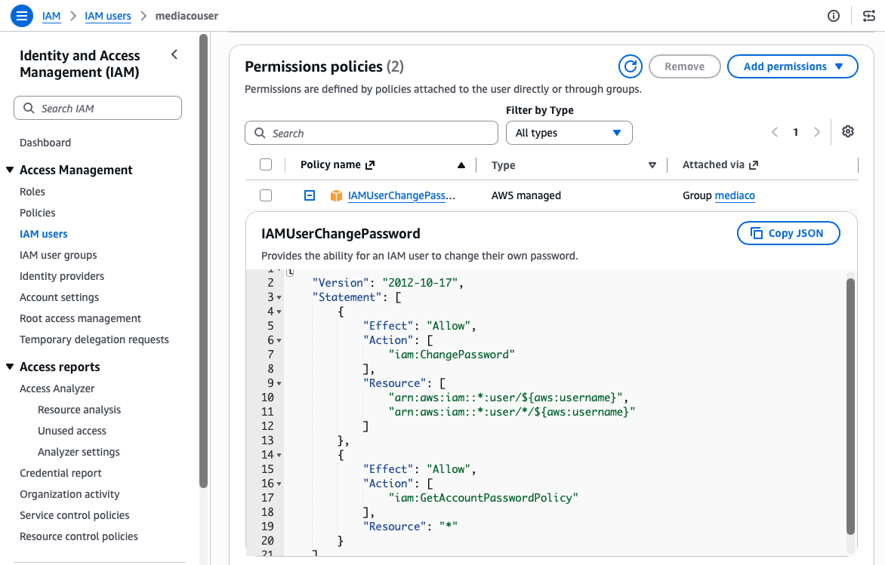
</p>

2. The mediacouser IAM user has 2 policies:
- **IAMUserChangePassword**
- **mediaCoPolicy**

I create an **Access Key** wwith the following options:
- Choose Command Line Interface (CLI).
- Select the check box for I understand the above recommendation and want to proceed to create an access key.

<p align="center">
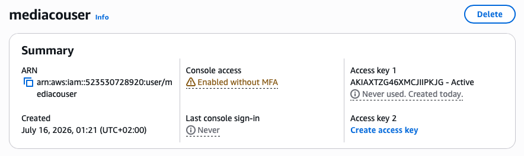
</p>

3. Testing the mediacouser permissions

In an incognito window, I copy the **Console sign-in link** `https://523530728920.signin.aws.amazon.com/console` and sign in to the AWS Management Console as the mediacouser user.

The external user is authorize to perform the view, upload, and delete operations on the contents of the images folder in the S3 share bucket.
<p align="center">
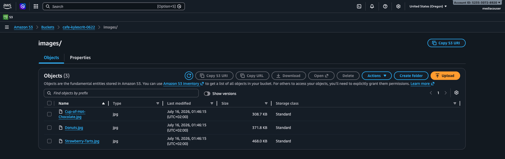
</p>

While, the external user is not authorized to change the bucket permissions.
<p align="center">
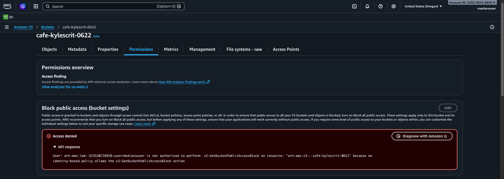
</p>

## Task 4: Configuring event notifications on the S3 share bucket
Here I will configure the S3 share bucket to generate an event notification to an SNS topic whenever the contents of the bucket change. The SNS topic then sends an email message to its subscribed users with the notification message. Specifically, I will perform the following steps:

1. I created the **s3NotificationTopic** SNS topic.
<p align="center">
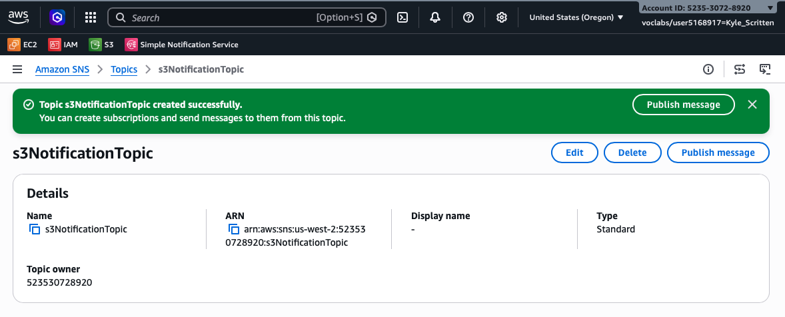
</p>

2. I then granted Amazon S3 permission to publish to the topic. In the **Access policy (optional)**, I replicate the contents of the JSON editor with the following policy:
   
```json
{
  "Version": "2008-10-17",
  "Id": "S3PublishPolicy",
  "Statement": [
    {
      "Sid": "AllowPublishFromS3",
      "Effect": "Allow",
      "Principal": {
        "Service": "s3.amazonaws.com"
      },
      "Action": "SNS:Publish",
      "Resource": "arn:aws:sns:us-west-2:523530728920:s3NotificationTopic",
      "Condition": {
        "ArnLike": {
          "aws:SourceArn": "arn:aws:s3:*:*:cafe-kylescrit-0622"
        }
      }
    }
  ]
}
```

It grants the cafe S3 share bucket permission to publish messages to the s3NotificationTopic SNS topic.

3. I subscribed to the SNS topic I created
<p align="center">
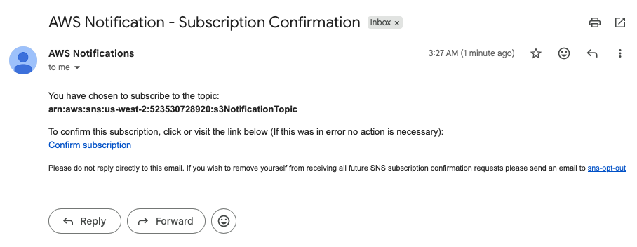
</p>
<p align="center">
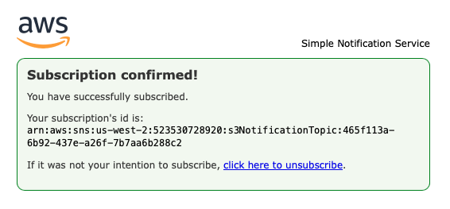
</p>

4. I added an event notification configuration to the S3 bucket.

A) I copy the following json code into the newly created file `s3EventNotification.json`, through the CLI using the `vi` editor

```
{
    "TopicConfigurations": [
      {
        "TopicArn": "<SNS Topic ARN>",
        "Events": ["s3:ObjectCreated:*","s3:ObjectRemoved:*"],
        "Filter": {
          "Key": {
            "FilterRules": [
              {
                "Name": "prefix",
                "Value": "images/"
              }
            ]
          }
        }
      }
    ]
  }
```
>[!Note]
>The code requests that Amazon S3 publish an event notification to the s3NotificationTopic SNS topic whenever an ObjectCreated or ObjectRemoved event is performed on objects inside an Amazon S3 resource with a prefix of images/.

B) Then I associate the event configuration file with the S3 share bucket:
```bash
aws s3api put-bucket-notification-configuration --bucket $BUCKET_NAME --notification-configuration file://s3EventNotification.json
```
C) I checked my email and received the following 
<p align="center">
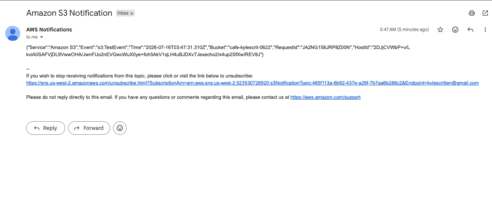
</p>

>[!Note]
>Notice that the value of the **”Event”** key is **”s3:TestEvent”**. Amazon S3 sent this notification as a test of the event notifications configuration that you set up.

## Task 5: Testing the S3 share bucket event notifications
Here I will test the configuration of the S3 share bucket's event notifications by performing the use cases that mediacouser is expected to perform on the bucket. These actions include putting objects into and deleting objects from the bucket, both of which should trigger email notifications. I will also test an unauthorized operation to verify that it is rejected. I will use the AWS S3 API CLI commands to perform these operations on the S3 share bucket.

1. AWS CLI CONFIG
```bash
[ec2-user@ip-10-200-0-29 ~]$ aws configure
AWS Access Key ID [****************PV57]: <mediacouser_AccessKey>
AWS Secret Access Key [****************lN8p]: <mediacouser_SecretKey>
Default region name [us-west-2]: 
Default output format [json]: json
```

2. PUT
```bash
[ec2-user@ip-10-200-0-29 ~]$ aws s3api put-object --bucket cafe-kylescrit-0622 --key images/Caramel-Delight.jpg --body ~/new-images/Caramel-Delight.jpg
{
    "ETag": "\"31ac30da619244b0ce786f106e4f3df7\"", 
    "ServerSideEncryption": "AES256"
}
```

>[!Note]
>I receive an email message with the subject *Amazon S3 Notification*. I noted the following from the message:
> - The value of the **eventName** key is **ObjectCreated:Put.**
> - The value of the **key** object is **images/Caramel-Delight.jpg**, which is the image file key that you specified in the command.
> This notification indicates that a new object with a key of **images/Caramel-Delight.jpg** was added (put) into the S3 share bucket.

<p align="center">
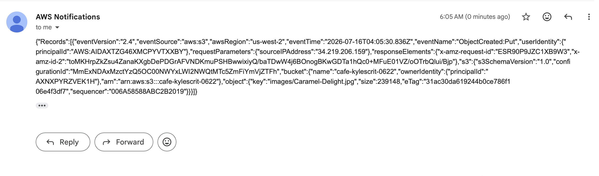
</p>


3. GET
```bash
[ec2-user@ip-10-200-0-29 ~]$ aws s3api get-object --bucket cafe-kylescrit-0622 --key images/Donuts.jpg Donuts.jpg
{
    "AcceptRanges": "bytes", 
    "ContentType": "image/jpeg", 
    "LastModified": "Wed, 15 Jul 2026 23:46:15 GMT", 
    "ContentLength": 380753, 
    "ETag": "\"405b0bcc53cb5ab713c967dc1422b4f4\"", 
    "ServerSideEncryption": "AES256", 
    "Metadata": {}
}
```
This operation does not generate an email notification because the share bucket is configured to send notifications only when objects are created or deleted.

4. DELETE
```bash
aws s3api delete-object --bucket $BUCKET_NAME --key images/Strawberry-Tarts.jpg
```
I receive an email with the subject *Amazon S3 Notification*. The **eventName** is "ObjectRemoved:Delete" and **key** is "images/Strawberry-Tarts.jpg".
In other words, the object with a key of images/Strawberry-Tarts.jpg was deleted from the S3 share bucket.

<p align="center">
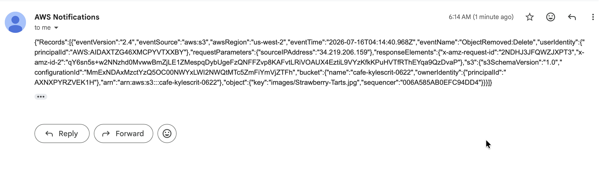
</p>

5. I try to change the permission of the Donuts.jpg object so that it can be read publicly as an an example of an unauthorised use case.
```bash
[ec2-user@ip-10-200-0-29 ~]$ aws s3api put-object-acl --bucket cafe-kylescrit-0622 --key images/Donuts.jpg --acl public-read

An error occurred (AccessDenied) when calling the PutObjectAcl operation: User: arn:aws:iam::523530728920:user/mediacouser is not authorized to perform: s3:PutObjectAcl on resource: "arn:aws:s3:::cafe-kylescrit-0622/images/Donuts.jpg" because public ACLs are prevented by the BlockPublicAcls setting in S3 Block Public Access.
```
The command fails and displays the following error message as expected: "An error occurred (AccessDenied) when calling the PutObjectAcl operation: Access Denied" because the mediacouser cannot change the bucket permissions.

## Conclusion
I now have successfully done the following:
* Used the s3api and s3 AWS CLI commands to create and configure an S3 bucket
* Verified write permissions to a user on an S3 bucket
* Configured event notification on an S3 bucket
