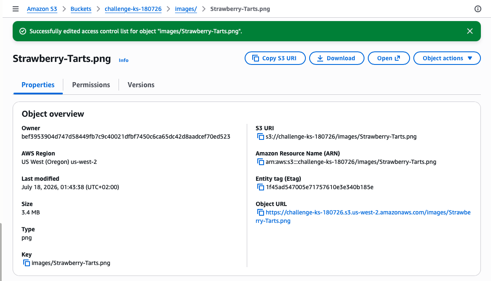
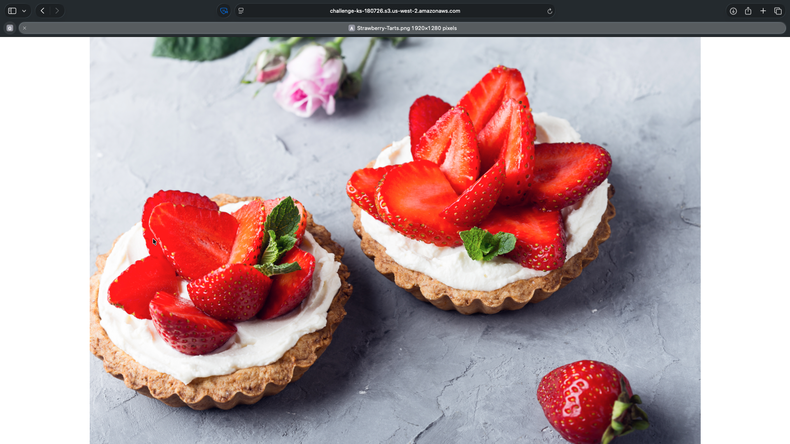

# Challenge Lab: Amazon S3
In this challenge lab, I create an Amazon Simple Storage Service (Amazon S3) bucket and perform some routine tasks, such as uploading objects and configuring permissions to make those objects publicly accessible through a browser.

## Objectives
By the end of this challenge, I should be able to:
- Create an S3 bucket. 
- Upload an object into this bucket. 
- Access the object by using a web browser. 
- List the contents of the S3 bucket by using the AWS Command Line Interface (AWS CLI).

## Task 1: Connecting to the CLI Host instance

To start the challenge, I connect to the CLI Host instance that is already provisioned for me.

1. On the AWS Management Console, in the Search bar, I enter and choose `EC2` to open the EC2 Management Console.
2. In the navigation pane, I choose **Instances**.
3. From the list of instances, I select the **CLI Host instance** and choose **Connect**.
4. On the **EC2 Instance Connect** tab, I choose **Connect**.

## Task 2: Configuring the AWS CLI

1. To set up the AWS CLI profile with credentials, I run the following command in the EC2 Instance Connect terminal:
```bash
aws configure
```
2. At the prompts, I copy the values predefined from the lab, and paste them into the terminal window as directed:
   * **AWS Access Key ID:** Enter the value for AccessKey.
   * **AWS Secret Access Key:** Enter the value for SecretKey.
   * **Default region name:** Enter `us-west-2`.
   * **Default output format:** Enter `json`.
```bash
   ,     #_
   ~\_  ####_        Amazon Linux 2
  ~~  \_#####\
  ~~     \###|       AL2 End of Life is 2026-06-30.
  ~~       \#/ ___
   ~~       V~' '->
    ~~~         /    A newer version of Amazon Linux is available!
      ~~._.   _/
         _/ _/       Amazon Linux 2023, GA and supported until 2029-06-30.
       _/m/'           https://aws.amazon.com/linux/amazon-linux-2023/

[ec2-user@ip-10-200-0-140 ~]$ aws configure
AWS Access Key ID [None]: <AccessKey>
AWS Secret Access Key [None]: <SecretKey>
Default region name [None]: us-west-2
Default output format [None]: json
```

## Task 3: Finishing the challenge
To finish the challenge, I do the following:

1. I create an S3 bucket using the AWS CLI by running the command `aws s3 mb s3://<my-unique-bucket-name> --region us-west-2`, replacing `<my-unique-bucket-name>` with a globally unique name:
```bash
[ec2-user@ip-10-200-0-140 ~]$ aws s3 mb s3://challenge-ks-180726 --region us-west-2
make_bucket: challenge-ks-180726
```

2. I upload the content of the folder **sysops-activity-files/images** as an object into this bucket:
```bash
[ec2-user@ip-10-200-0-140 ~]$ aws s3 sync ~/sysops-activity-files/images/ s3://challenge-ks-180726/images
upload: sysops-activity-files/images/Cookies.png to s3://challenge-ks-180726/images/Cookies.png
upload: sysops-activity-files/images/Mom-&-Pop-Coffee-Shop.png to s3://challenge-ks-180726/images/Mom-&-Pop-Coffee-Shop.png
upload: sysops-activity-files/images/Coffee-and-Pastries.png to s3://challenge-ks-180726/images/Coffee-and-Pastries.png
upload: sysops-activity-files/images/Strawberry-&-Blueberry-Tarts.png to s3://challenge-ks-180726/images/Strawberry-&-Blueberry-Tarts.png
upload: sysops-activity-files/images/Cup-of-Hot-Chocolate.png to s3://challenge-ks-180726/images/Cup-of-Hot-Chocolate.png
upload: sysops-activity-files/images/Strawberry-Tarts.png to s3://challenge-ks-180726/images/Strawberry-Tarts.png
upload: sysops-activity-files/images/Cake-Vitrine.png to s3://challenge-ks-180726/images/Cake-Vitrine.png
upload: sysops-activity-files/images/Mom-&-Pop.png to s3://challenge-ks-180726/images/Mom-&-Pop.png
```

3. I try to access the object by using a web browser, using the URL `https://challenge-ks-180726.s3.us-west-2.amazonaws.com/images/Strawberry-Tarts.png`, and confirm that access is denied:
```html
<Error>
<Code>AccessDenied</Code>
<Message>Access Denied</Message>
<RequestId>VP32TQ70M65863C0</RequestId>
<HostId>AIJ44xVh+ho/hmmVyKH9IMbxFEuCY4VdI07acJdU48msvx3ove5Lq5ZxR/JKViXAUdQSGqEdqaFd2S3mqH3iKQf0zHWAqSP4</HostId>
</Error>
```

4. I make the object `Strawberry-Tarts.png` (not the bucket) publicly accessible.

>[!Note]
> In the AWS Management console I performed the following to make the object publicly visible:
> - I **enable Access control list (ACL)** and **disable Block all public access** on the bucket permissions tab.
> - On the object permission tab, I edit the ACL and in the **Everyone (public access)** section.
> - I chose **Objects Read** and saved the changes by typing *confirm*.

<p align="center">
  
</p>

5. I access the object again by using a web browser and confirm that it now loads successfully:
<p align="center">
  
</p>

6. I list the contents of the S3 bucket by using the AWS CLI:
```bash
[ec2-user@ip-10-200-0-140 ~]$ aws s3 ls s3://challenge-ks-180726/images/ --human-readable --summarize
2026-07-17 23:43:38    3.8 MiB Cake-Vitrine.png
2026-07-17 23:43:38    3.1 MiB Coffee-and-Pastries.png
2026-07-17 23:43:38    1.4 MiB Cookies.png
2026-07-17 23:43:38    3.6 MiB Cup-of-Hot-Chocolate.png
2026-07-17 23:43:38  726.8 KiB Mom-&-Pop-Coffee-Shop.png
2026-07-17 23:43:38    2.7 MiB Mom-&-Pop.png
2026-07-17 23:43:38    2.9 MiB Strawberry-&-Blueberry-Tarts.png
2026-07-17 23:43:38    3.4 MiB Strawberry-Tarts.png

Total Objects: 8
   Total Size: 21.7 MiB
```

## Bash script
```bash
#!/bin/bash

# Create buckect
aws s3 mb s3://challenge-ks-180726 --region us-west-2

# Load images into the bucket
aws s3 sync ~/sysops-activity-files/images/ s3://challenge-ks-180726/images

# Verify that the files were synced to the S3 bucket
aws s3 ls s3://challenge-ks-180726/images/ --human-readable --summarize
```

## Conclusion
In this lab I have learnt how to:
- Create an S3 bucket
- Upload an object into a S3 bucket
- Accessed the object by using a web browser
- Listed the contents of the S3 bucket by using AWS CLI

## Additional resources
- [S3 CLI Command Reference](https://docs.aws.amazon.com/cli/latest/reference/s3/)
- [Getting Started with Amazon S3](https://aws.amazon.com/s3/getting-started/)
- [How Can I Grant Public Read Access to Some Objects in My Amazon S3 Bucket?](https://repost.aws/knowledge-center/read-access-objects-s3-bucket)
- [Connect to Your Linux Instance](https://docs.aws.amazon.com/AWSEC2/latest/UserGuide/connect-to-linux-instance.html)
